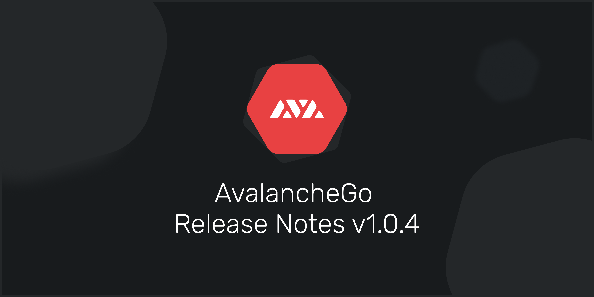

# AvalancheGo Release Notes



## **v1.2.4 AvalancheGo Release Notes \(**[**View on GitHub**](https://github.com/ava-labs/avalanchego/releases/tag/v1.2.4)**\)**


This update is backwards compatible. It is optional, but encouraged. The patch includes stability and monitoring improvements.


* Updated readme to correct storage requirements.
* Added additional error handling to Avalanche Tx verification during bootstrapping.
* Updated numerous metrics, including adding numerous new metrics relating to node health and database usage, removing unused and invalid metrics, and fixing some metric names.
* Added additional logging to CI.
* Added the C-chain to the list of critical chains.

## **v1.2.3 AvalancheGo Release Notes \(**[**View on GitHub**](https://github.com/ava-labs/avalanchego/releases/tag/v1.2.3-signed)**\)**


This update is backwards compatible. It is optional, but encouraged. The patch includes stability and monitoring improvements.


* Adjusted `[network, router, consensus]` health check parameters to remove flaky health checks.
* Simplified C-chain block handling.

## **v1.2.2 AvalancheGo Release Notes \(**[**View on GitHub**](https://github.com/ava-labs/avalanchego/releases/tag/v1.2.2)**\)**


This update is backwards compatible. It is optional, but encouraged. The patch includes stability, performance, and monitoring improvements.


* Added IP aliases in the network library to avoid repeated `SYN` calls.
* Fixed bootstrap message handling when bootstrapping from yourself.
* Simplified `AdvanceTimeTx` issuance.
* Added new consensus health checks.
* Adding node health logging.
* Added health responses to health `GET` requests.
* Consolidated incoming message logs.
* Added error logging to the `LevelDB` wrapper.
* Added error codes to the `rpcdb` to avoid string parsing.
* Improved C-chain handling of canonical chain to reduce the number of reorgs.
* Improved C-chain handling of mock calls performed on the `pending` block.

## **v1.2.1 AvalancheGo Release Notes \(**[**View on GitHub**](https://github.com/ava-labs/avalanchego/tree/v1.2.1)**\)**


This update is backwards compatible. It is optional, but encouraged. The patch includes stability, performance, and monitoring improvements. 

Please note that this update removes \`network-timeout-increase\` and ‘network-timeout-reduction\` as command line arguments.


Change Summary:

* Added \`UTXO\`s to the \`platformvm.getStake\` response.
* Added benchlist reporting to the \`info.peers\` response.
* Added additional health checks into the networking layer.
* Added \`percent of stake connected\` as a reported metric.
* Added bootstrapping restart logic to ensure the node has caught up to the current tip, even during times of high throughput.
* Added subnet-wide bootstrapping to ensure that a chain won't fall behind due to another chain bootstrapping.
* Prevented verification of rejected blocks to avoid unnecessary computation.
* Removed gossiping of non-preferred blocks to the network.
* Switched the network timeout calculator to use an EWMA of the observed network latency.
* Removed \`Get\` requests from the network latency calculations.
* Cleaned up the benchlisting algorithm.
* Cleaned up handling of dropped messages on send.
* Cleaned up outstanding request and timeout logic.
* Generalized performance tracking to allow for prefixing of profile names.
* Added additional caching to the Avalanche bootstrapping traversal.
* Fixed ansible linting.
* The added command line arguments mainly consist of configurations of health checks. Additionally, the modified network latency calculations changed the name of some command line args.

Added command line arguments:

* \`network-timeout-halflife\`
* \`network-timeout-coefficient\`
* \`network-health-min-conn-peers\`
* \`network-health-max-time-since-msg-received\`
* \`network-health-max-time-since-msg-sent\`
* \`network-health-max-portion-send-queue-full\`
* \`network-health-max-send-fail-rate\`
* \`network-health-max-time-since-no-requests\`
* \`router-health-max-drop-rate\`
* \`router-health-max-outstanding-requests\`
* \`health-check-frequency\`
* \`health-check-averager-halflife\`
* \`bootstrap-retry-enabled\`
* \`bootstrap-retry-max-attempts\`

Removed command line arguments:

* \`network-timeout-increase\`
* \`network-timeout-reduction\`

## v1.2.0 AvalancheGo Release Notes \([View on GitHub](https://github.com/ava-labs/avalanchego/tree/v1.2.0)\)


**Please note that this patch is not backwards compatible with previous releases. This upgrade fixes performance issues related to interchange transfers between X, C, and P chains. We urge everyone in the community to upgrade as soon as possible in order to ensure that their nodes are not affected. Also, note that nodes may take several extra minutes to connect after the upgrade and the process should be allowed to complete uninterrupted.**


The primary components to this upgrade include:

* Fixed atomic import validation on C-Chain
* Added rule exception logic to allow atomic bonus blocks
* Added fail-fast logic into Shared Memory if duplicated deletes are issued
* Fixed issue where polls could stall in snowman because of a failure to clear requests
* Fixed BAD BLOCK issue in coreth due to unknown ancestors
* Fixed a race condition in the repair canonical chain script in coreth
* Limited number of processing blocks in Snowman and processing txs in Avalanche
* Updated networking timeout default values and benchlist settings
* Verified there was no safety violation after the initial network instability

## v1.1.5 AvalancheGo Release Notes \([View on GitHub](https://github.com/ava-labs/avalanchego/tree/v1.1.5)\)


This update is backwards compatible. It is optional but encouraged. The patch includes stability improvements.


* Fixed a potential deadlock when registering new chains that could cause the P-chain and http\(s\) endpoint to block.
* Repairs TxID -&gt; Block Height indexing in the C-chain.
* Added graceful handling of empty contract deployments in the debug\_traceTransaction API in the C-chain.
* Improved error handling in the C-chain.

## v1.1.4 AvalancheGo Release Notes \([View on GitHub](https://github.com/ava-labs/avalanchego/tree/v1.1.4)\)


This update is backwards compatible. It is optional but encouraged. The patch includes CLI upgrades, API bug fixes, stability improvements, and performance improvements.


* Fixed an issue where C-chain block indexes could map to unaccepted blocks at a given height.
* Fixed VM crash when the RPCChainVM experienced high API loads.
* Fixed optimistic vote bubbling in the Avalanche Engine to correctly pass votes through processing vertices.
* Added field IncludePartial to the AVM's GetBalance and GetAllBalances API methods. This changes the default behavior to only return the balances of spendable and uniquely owned assets.
* Added the ability to specify custom genesis configs for custom network IDs.
* Added additional IPC API functionality.
* Added additional caching to the RPCChainVM.
* Improved plugin directory lookup to always work with the binary releases.

## v1.1.3 AvalancheGo Release Notes \([View on GitHub](https://github.com/ava-labs/avalanchego/tree/v1.1.3)\)


This update is optional but encouraged. The patch includes minor bug fixes relating to APIs.


* Fixed hanging call when attempting to filter C-chain logs.
* Fixed C-chain client to call the proper multi-coin API.
* Added `getAtomicUTXOs` to `avm` and `platformvm` API clients.

## v1.1.2 AvalancheGo Release Notes \([View on GitHub](https://github.com/ava-labs/avalanchego/releases/tag/v1.1.2)\)


This update is optional but encouraged. The patch includes bug fixes and performance improvements.


* Fixed bootstrapping processing cache to reduce duplicated traversals when bootstrapping Avalanche.
* Optimized P-chain verification during bootstrapping.
* Fixed maximum bench list calculation to use the proper input values.
* Removed extra linter runs from CI.
* Added `Height` to the `snowman.Block` interface.

## v1.1.1 AvalancheGo Release Notes \([View on GitHub](https://github.com/ava-labs/avalanchego/releases/tag/v1.1.1)\) 


This update is optional but encouraged. The patch includes bug fixes and performance improvements.


* Fixed a node crash bug when users disabled the `Health` API.
* Fixed a bug in uptime tracking that could over report a node's uptime.
* Refactored vertex parsing to use a `Codec`.
* Separated stateful and stateless vertex management.
* Added per-field slice length checking to the Codec.
* Introduced a new codec type that groups `TypeID`s together.
* Introduced message limit flags to the CLI.
* Introduced a semanticdb package to be used during a future database migration.
* Added Epoch tracking to the chain context.
* Improved some of the error messages returned during transaction validation.
* Reduced GC pressure in the version DB.

## v1.1.0 AvalancheGo Release Notes \([View on GitHub](https://github.com/ava-labs/avalanchego/releases/tag/v1.1.0)\)


**Please note that this upgrade is not backwards compatible with previous releases. Upgrades must be performed no later than Monday, December 7th at 11 p.m. UTC \(6 p.m. EST\). The upgrade, which was originally scheduled around mid December, is now being expedited to fix an important token unlocking bug. We urge everyone in the community to upgrade as soon as possible in order to ensure that their nodes are not affected.**


There are two primary components to this upgrade:

* General preparations for our upcoming Apricot network upgrade called the Apricot Phase Zero Upgrade
* Fixing an issue that prevented stake-able locked outputs from being unlocked after their lock ****time had passed

## v1.0.6 AvalancheGo Release Notes \([View on GitHub](https://github.com/ava-labs/avalanchego/releases/tag/v1.0.6)\)


Please note that this release contains breaking changes described [here](https://docs.avax.network/build/apis/deprecated-api-calls). It changes the default response format of platform.getTxStatus and platform.getCurrentValidators. The update is optional but encouraged. The patch includes performance improvements and some quality of life improvements.


* Removed deprecated formats of  platform.getTxStatus and platform.getCurrentValidators.
* Added support for hex encodings of imported and exported users from the keystore API.
* Set golang requirement to v1.15.5 to avoid a DoS vulnerability found in the golang standard lib.
* Added API clients to act as helpers interacting with the node software.
* Enabled falling back to bootstrapping if a node becomes disconnected from the rest of the network.
* Fixed the GetUTXOs APIs when UTXOs referenced multiple addresses.
* Refactored binary encoding to better generalize RPC options.
* Fixed IP block filtering to correctly set the window length.
* Generalized the codec package to be able to manage multiple codecs with different versions.
* Added Epoch to the Vertex interface in preparation of a future release.
* Deferred transaction hashing to reduce CPU/Memory utilization past fast checks.
* For those using [https://explorerapi.avax-dev.network/](https://explorerapi.avax-dev.network/), the URL is going to be shut down in a future release. Please switch over to [https://explorerapi.avax.network/](https://explorerapi.avax.network/). 

For assistance with this update, follow our [Developer FAQ](https://support.avalabs.org/en/collections/2618154-developer-faq), if you are still running into issues you can join our [Discord](https://chat.avax.network/) for help.

## v1.0.5 AvalancheGo Release Notes  \([View on GitHub](https://github.com/ava-labs/avalanchego/releases/tag/v1.0.5)\)


Please note that the release after this one, v1.0.6, will contain the breaking changes described [here](https://docs.avax.network/build/apis/deprecated-api-calls). Namely, the response format of `platform.getTxStatus` and `platform.getCurrentValidators` will change.


The changes in this release, v1.0.5, are backwards compatible with previous releases. The update is optional but encouraged. The patch includes performance improvements and some quality of life improvements.

* Added `IssueTx` and `GetUTXOs` to the C-chain API to enable issuing atomic swaps without revealing private keys to a node.
* Fixed memory leak in the snowman request manager with oracle block processing.
* Fix UTXO pagination bug that under-reported available funds.
* Moved chain http logs to live in the human-readable chain logs folder.
* Restructure how IDs are managed to avoid heap allocations.
* Optimized the `UniformSampler`s to avoid creating multiple maps.
* Reduced usage of `ids.Set` in favor of `[]ids.ID` to better utilize continuous memory.
* Introduced `[]byte` reuse in `PrefixDB`.
* Implemented type-specific sorting functions to avoid frequent interface conversion allocations.
* Optimized AVM load user to avoid reading unnecessary information from disk.
* Removed a memory allocation + copy in socket sending for the full length of the message.

For assistance with this update, follow our [Developer FAQ](https://support.avalabs.org/en/collections/2618154-developer-faq), if you are still running into issues you can join our [Discord](https://chat.avax.network) for help.

## v1.0.4 AvalancheGo Release Notes  \([View on GitHub](https://github.com/ava-labs/avalanchego/releases/tag/v1.0.4)\)




This update is optional but encouraged. The patch includes quality of life improvements and various performance enhancements. Note that this update requires the CLI parameters to be specified with -- rather than allowing for either - or --. For example, `-public-ip=127.0.0.1` is no longer allowed and must be specified as `--public-ip=127.0.0.1`. Otherwise, this update is backwards compatible.


```
• Added subnet whitelisting to allow a node owner to choose which subnets to validate.
```

```text
• Added config file parsing for node settings.
• Added more options for specifying a node's IP address and added getNodeIP to the info *endpoint.
• Added a TxID to the result of get.Validators in the platformvm.
• Updated Coreth version.
• Cleaned up the snowball trie implementation and added additional tests to align with mutation tests.
• Implemented and optimized continuous time averages for tracking CPU and network latency.
• Significantly optimized memory allocations in various locations.
• Increased the signature verification cache size.
• Reduced DB reads during vertex management.
```

```text
• Added an optional argument includeReason to platform.getTxStatus.
If not provided, or if false, the output from getTxStatus is the same as before.

For example:
{
    "jsonrpc": "2.0",
    "result": "Dropped",
    "id": 1
}

If includeReason is true, the output from getTxStatus has a new format. It's an object that looks like this:

{
    "jsonrpc": "2.0",
    "result": {
        "status":"[Status]",
        "reason":"[Reason tx was dropped, if applicable]"
    },
    "id": 1
}

In this new format, reason will not be present unless the status is Dropped.
Anything that depends on platform.getTxStatus should switch to using the includeReason argument and use the new response format. After a few releases, we'll only support the new response format.
```

For assistance with this update, follow our [Developer FAQ](https://support.avalabs.org/en/collections/2618154-developer-faq), if you are still running into issues you can join our [Discord](https://chat.avax.network) for help.

