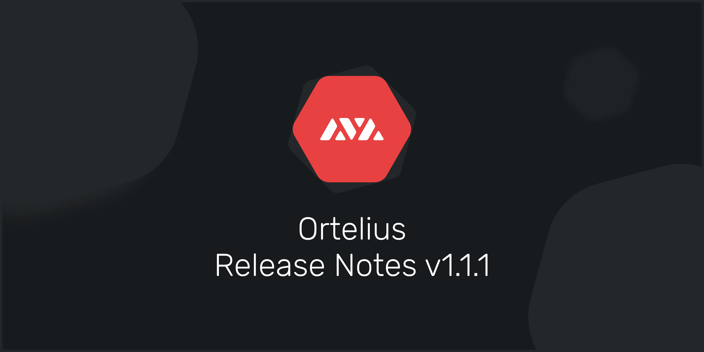

# Ortelius Yayınlama Notları

## Ortelius Release Notes [v1.1\(GitHub\ Görünüm](https://github.com/ava-labs/ortelius/releases/tag/v1.1.1)

Kırma değişikliği:

* Hiç yok

Davranış değişikliği:

* İkinci bir saniyeye kadar yuvarlak

Diğer değişiklikler:

* Genesis verilerini geri getirmemek için opt desteği ekle
* API'ye sabit / değişken kapak bilgilerini ekle
* API'ye işlem ücreti verilerini ekle

Bu güncellemede yardım için, [Geliştirici](https://support.avalabs.org/en/collections/2618154-developer-faq) our takip edin, eğer hala sorunlarla uğraşıyorsanız [Discord](https://chat.avax.network) ile yardım için bize katılabilirsiniz.

