# Running a Chainlink Node: Fulfilling Requests

Now that we have a node [running on Fuji test network](chainlink-node-deployment.md), let's do something useful with it!

With your own Oracle contract, you can use your own node to fulfill requests. This guide will show you how to deploy your own Oracle contract and add jobs to your node so that it can provide data to smart contracts.

## Prerequisites

Once your node is deployed, You will have to fund it with Link token. To do this, we must visit the [Fuji Chainlink Faucet](https://linkfaucet.protofire.io/fuji). Make sure you have FUJI selected as your network, enter your wallet address, and click on the **Send me 10 Test Link** button. You should receive test Link in a few seconds.

We are also going to need testnet AVAX. Use the [AVAX Fuji Testnet Faucet](https://faucet.avax-test.network/) to fund the same address with testnet AVAX.

### Funding your node

Now that our wallet is funded, we are going to send some LINK and AVAX to our node address. You can find your Node address during deployment or in the **Keys** tab of the node operator GUI:

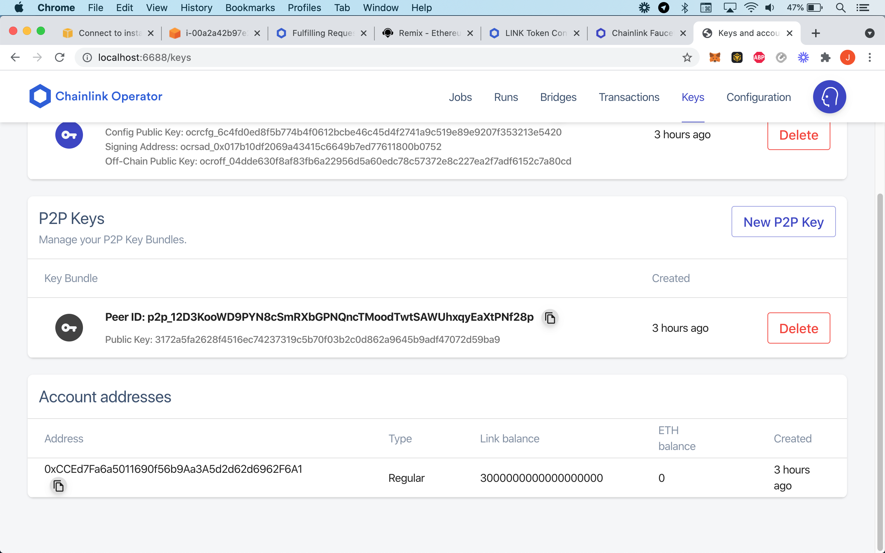

Copy your node address and send your node LINK **and** AVAX. Using Metamask, it will look like this:

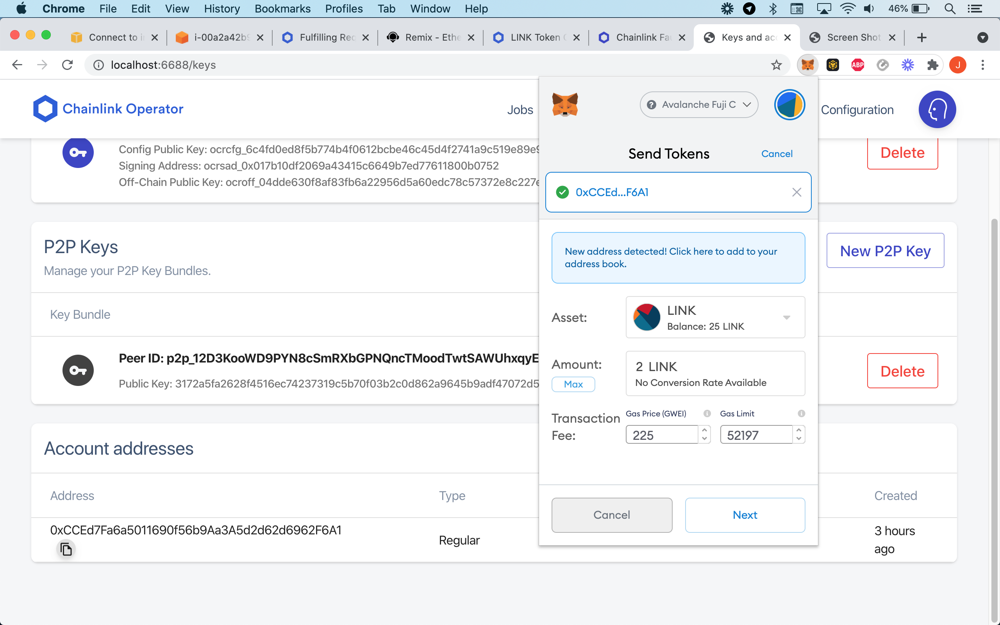

The total cost to send LINK will be LINK+gas so make sure you have both enough LINK and AVAX. Refresh the page and view your updated balances. Balances are shown in wei.

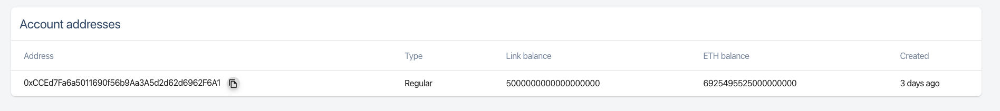

Although UI will show `ETH balance`, the balance is actually in AVAX. Your node is funded! Now it can start fulfilling requests!

## Oracle deployment

For this tutorial we will harmonize Chainlink contracts with the Avalanche Fuji network. First, We will need to create an Oracle to forward requests from on chain to off chain. Open [Remix](https://remix.ethereum.org/), select **Load from Gist** and paste in code from [here](https://gist.github.com/Julian-dev28/acca3b2a449f02225defc92bc2909f2f).

OR

Create a new file named `OracleAndConsumer.sol`:

```bash
pragma solidity ^0.6.6;

import "https://github.com/smartcontractkit/chainlink/blob/develop/contracts/src/v0.6/Oracle.sol";
import "https://github.com/smartcontractkit/chainlink/blob/develop/contracts/src/v0.6/tests/MockOracle.sol";
import "https://github.com/smartcontractkit/chainlink/blob/develop/contracts/src/v0.6/tests/Consumer.sol";
import "https://github.com/smartcontractkit/chainlink/blob/develop/contracts/src/v0.6/tests/BasicConsumer.sol";
```

Compile the contract and you should see your repository populate

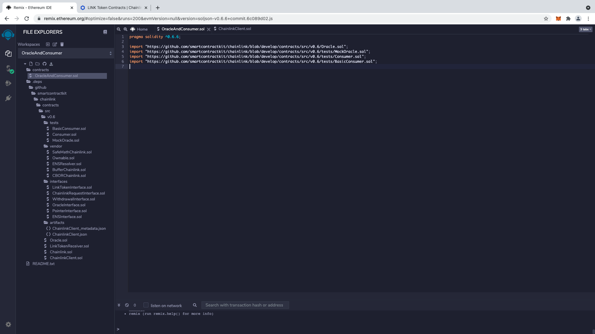

Select the **ChainlinkClient.sol** file, go to line 25 and input the LINK token address:

```jsx
address constant private LINK_TOKEN_POINTER = 0x0b9d5D9136855f6FEc3c0993feE6E9CE8a297846;
```

Select and compile the **Oracle.sol** file

Define the LINK token contract address, 0x0b9d5D9136855f6FEc3c0993feE6E9CE8a297846

and deploy!

Now that we have our Oracle deployed, we will grant our node the ability to fulfill requests to our Oracle. By clicking the **transact** button, call the **setFulfillmentPermission** function with the address of your node, a comma, and the value true:

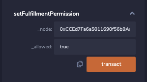

Confirm the transaction in Metamask and record the address of your Oracle as we will need it to create a job for our node.

## Creating jobs

Note: Your node must be actively running. You can re-establish a connection to your active node by running the command:

```bash
ssh -i $KEY $USER@$REMOTE-IP -L 6688:localhost:6688 -N
```

If you still can't connect, please refer to the [node deployment article](chainlink-node-deployment.md).

For this tutorial we will use the [EthUnit256 job specification](https://docs.chain.link/docs/fulfilling-requests/). Other Job specifications can be found [here!](https://docs.chain.link/docs/job-specifications/)

Open the Chainlink GUI, which should be at [http://localhost:6688/](http://localhost:6688/) in your web browser and navigate to the **Jobs** tab. There, paste the following into the JSON section with your oracle's contract address:

```json
{
  "name": "Get > Uint256",
  "initiators": [
    {
      "type": "runlog",
      "params": {
        "address": "YOUR_ORACLE_CONTRACT_ADDRESS"
      }
    }
  ],
  "tasks": [
    {
      "type": "httpget"
    },
    {
      "type": "jsonparse"
    },
    {
      "type": "multiply"
    },
    {
      "type": "ethuint256"
    },
    {
      "type": "ethtx"
    }
  ]
}
```
You can also name your job. Click the **Create Job** button, and you should see a confirmation at the top of your screen!

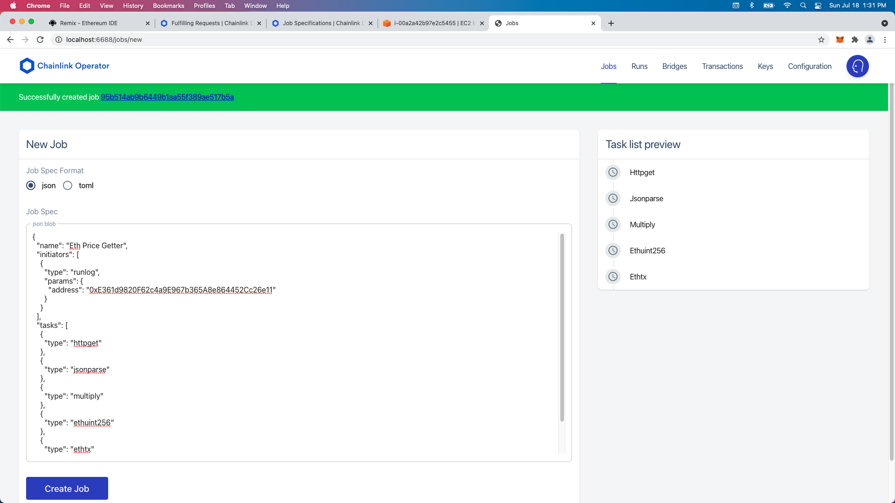

Now our node can begin fulfilling requests!

## Fulfill a request

Note: Changed currentPrice, price and, _price from bytes32 to Uint256

View the **Consumer.sol** file and see line 21

```jsx
req.add("get", "https://min-api.cryptocompare.com/data/price?fsym=ETH&tsyms=USD,EUR,JPY");
```

We will use Chainlink's "**get**" request on the end point "[**https://min-api.cryptocompare.com/data/price?fsym=ETH&tsyms=USD,EUR,JPY**](https://min-api.cryptocompare.com/data/price?fsym=ETH&tsyms=USD,EUR,JPY)" to get ETH/USD price data.

End points and data parameters can be modified using "paths". Please see [Job Specifications](https://docs.chain.link/docs/job-specifications/)  and [Fulfilling Requests](https://docs.chain.link/docs/fulfilling-requests/) for more info.

We must convert our jobSpecId into Bytes32 for our contact to read it. Navigate to your created job and then click on the **Definition** tab, find your jobSpecId and convert it into bytes32 using a tool of your choice. I recommend using [https://web3-type-converter.onbrn.com/](https://web3-type-converter.onbrn.com/). Be sure to use the jobSpecID **without** dashes. In this example case, it looks like this: `95b514ab9b6449b1aa55f389ae517b5a`.

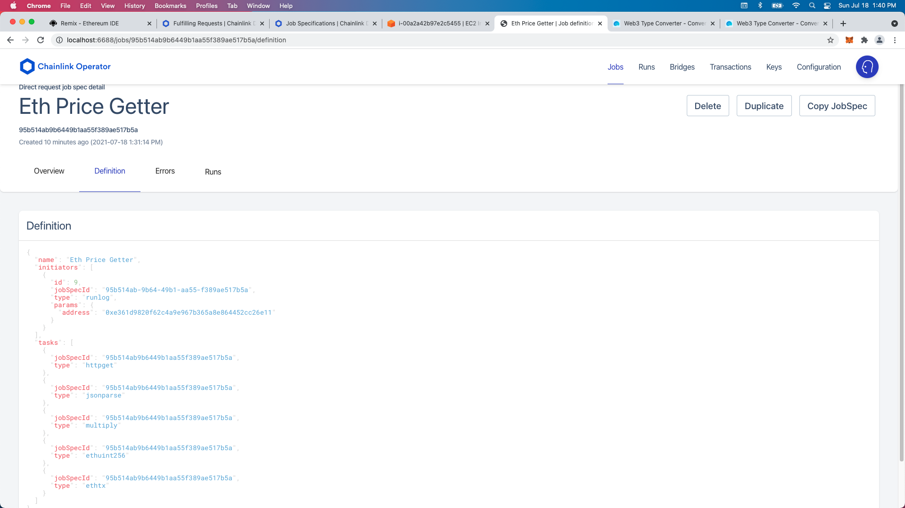

Select and compile the **BasicConsumer.sol** file. Enter the LINK, ORACLE, and SPECID parameters. Press `transact` to deploy!

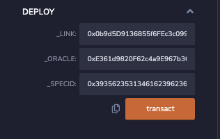

## Request lifecycle

Now that the BasicConsumer contract is deployed, we must fund it before making a request. Paste your BasicConsumer address into Metamask and send it LINK. We do this because each data request costs LINK to execute:

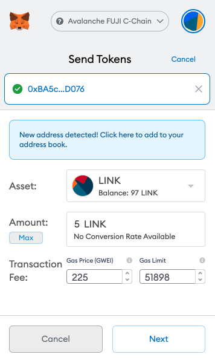

In your BasicConsumer contract , call the **requestEthereumPrice** function with USD and the payment amount (1000000000000000000) wei:

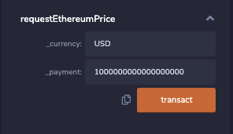

Confirm the transaction in Metmask and click back over to your Chainlink GUI. Select the **Runs** tab and review the request in action! 

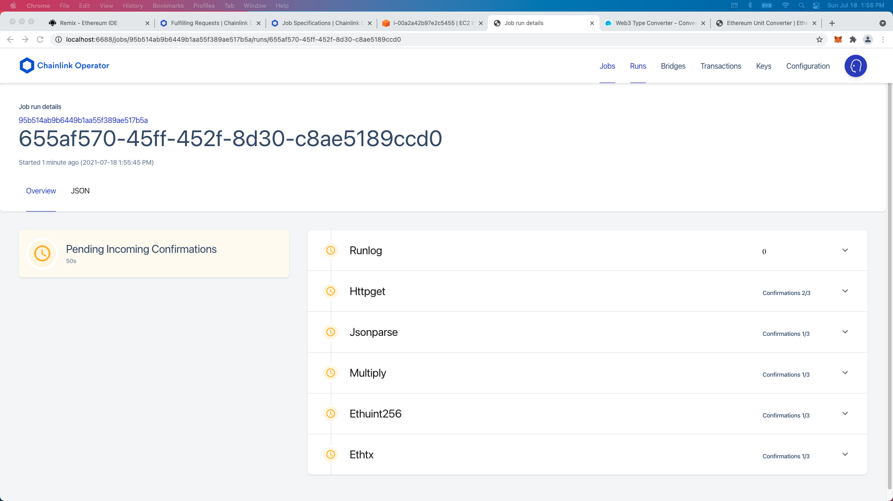

You can refresh the page and see the confirmations as well as when your job is complete.Switch back over to remix and call the **currentPrice** function to see the job request has been fulfilled!

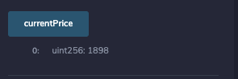

Congrats! Your node has successfully fulfilled the ETH/USD price request!

If you have questions, comments, or just want to reach out, you can contact us on our official [Discord](https://chat.avalabs.org/) server.

