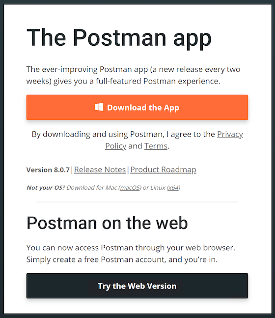
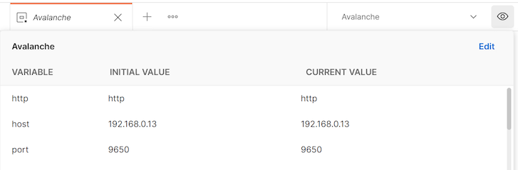
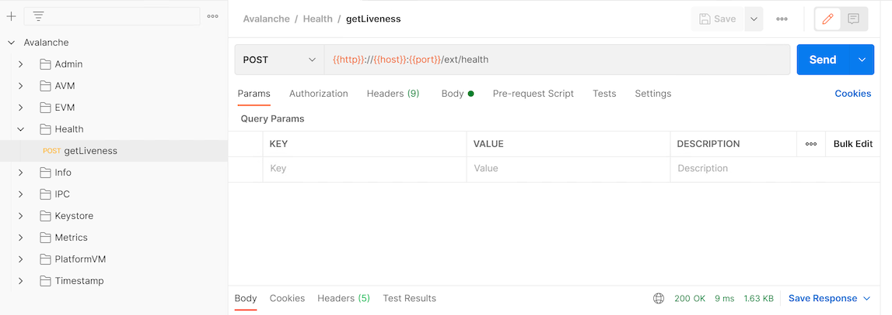

# Colección postal

## ¿Qué es Postman?

Postman es una herramienta gratuita utilizada por los desarrolladores para enviar rápidamente y fácilmente solicitudes de REST, SOAP, y GraphQL y las API de prueba. Está disponible tanto como herramienta en línea como aplicación para Linux, MacOS y Windows. Postman le permite emitir rápidamente llamadas de API y ver las respuestas en un formato muy formateado y buscable.

Hemos hecho una colección de Postman para [Avalanche](https://docs.avax.network), que incluye todas las llamadas de API públicas que están disponibles en [la instancia de AvalancheGo](../release-notes/avalanchego.md) para que pueda emitir rápidamente comandos a su nodo y ver la respuesta, sin tener que copiar y pegar comandos de `curl` largos y complicados.

Junto con la colección API, también hay el ejemplo entorno Avalanche para Postman, que define variables comunes como la dirección IP del nodo, sus direcciones Avalanche y elementos comunes similares de las consultas, por lo que no tienes que introducirlas varias veces.

Combinados, te permitirán mantener fácilmente las pestañas en tu nodo, revisar su estado y hacer consultas rápidas para averiguar detalles sobre su funcionamiento.

## Configuración

### Instalación de Postales

Postman se puede instalar localmente o utilizar como una aplicación web. Recomendamos instalar la aplicación, ya que simplifica la operación. Puede descargar Postman desde su [sitio web](https://www.postman.com/downloads/). Se recomienda que se inscriba utilizando su dirección de correo electrónico ya que entonces su espacio de trabajo puede ser fácilmente respaldado y compartido entre la aplicación web y la aplicación instalada en su computadora.



Después de instalar la aplicación, ejecutarla. Le pedirá que cree una cuenta o inicie sesión. Hazlo. De nuevo, no es necesario, pero recomendado.

### Importación de colección

Seleccione `Nuevo` espacio de trabajo en la pestaña Espacios de trabajo y siga las indicaciones para crear un nuevo espacio de trabajo. Aquí será donde se hará el resto del trabajo.


Estamos listos para importar la colección. En el encabezado de la pestaña Worskspaces seleccione `Nuevo` y cambie a `la` pestaña Enlace.


Allí, en el campo de entrada de URL pega el enlace a la colección:

```text
https://raw.githubusercontent.com/ava-labs/avalanche-postman-collection/master/Avalanche.postman_collection.json
```

Postman reconocerá el formato del contenido de archivo y ofrecerá importar el archivo como una colección. Completa la importación. Ahora tendrás la colección Avalanche en tu espacio de trabajo.


### Importación de medio ambiente

A continuación, tenemos que importar las variables de entorno. De nuevo, el encabezado de la pestaña Worskspaces selecciona `Nuevo` y cambia a `la` pestaña Enlace. Esta vez, pega el enlace al entorno JSON:

```text
https://raw.githubusercontent.com/ava-labs/avalanche-postman-collection/master/Example-Avalanche-Environment.postman_environment.json
```

Postal reconocerá el formato del archivo:


Importarlo a su espacio de trabajo. Ahora, necesitaremos editar ese entorno para adaptarse a los parámetros reales de su instalación en particular. Estos son los parámetros que difieren de los valores predeterminados en el archivo importado.

Haga clic en el icono de ojo junto al menú desplegable del entorno:



Seleccione el botón `Editar` para cambiar los valores predeterminados. Como mínimo, tendrá que cambiar la dirección IP de su nodo, que es el valor de la variable `anfitriona.` Cambiarlo a la IP de su nodo \(cambie tanto los valores `iniciales` como `actuales).` Además, si su nodo no se ejecuta en la misma máquina donde instaló Postman, asegúrese de que su nodo está aceptando las conexiones en el puerto API desde el exterior mediante la verificación de la [opción](../references/command-line-interface.md#http-server) de línea de comandos adecuada.

Ahora hemos arreglado todo, y estamos listos para consultar el nodo.

## Hacer llamadas de API

Abra uno de los grupos de llamadas de API, por ejemplo `Health`. Haga doble clic en `getLiveness` llamada:



Verá ese formato de la llamada utiliza las variables de entorno `http`, `host` y `port`. Haga clic en `Enviar`. La solicitud será enviada y pronto verá la respuesta, en la pestaña `Cuerpo` en la `Respuesta`:


Para ver la llamada real y las variables que se envían al nodo, cambie a pestaña `Cuerpo` en las pestañas de llamadas API . Allí puede cambiar rápidamente las variables para ver la respuesta a diferentes consultas.

## Conclusión

Si completó el tutorial, ahora es capaz de emitir rápidamente llamadas API a su nodo sin meterse con los comandos de curl en la terminal. Esto le permite ver rápidamente el estado de su nodo, realizar cambios o revisar la salud o la vida de su nodo.

## Contribución

Esperamos mantener esta colección continuamente actualizada con las [API de Avalanche](https://docs.avax.network/build/avalanchego-apis), y también añadir [visualizaciones de datos](https://learning.postman.com/docs/sending-requests/visualizer/#visualizing-response-data). Si puedes ayudar a mejorar la colección Avalanche Postman de cualquier manera, primero cree una rama de función ramificando fuera del `maestro`, a continuación haz las mejoras en tu rama de funciones y por último crea una [solicitud](https://github.com/ava-labs/avalanche-docs/pulls) de tracción para fusionar tu trabajo de nuevo al `maestro`.

Si tienes alguna otra pregunta o sugerencias, ven [a hablar con nosotros](https://chat.avalabs.org/).

