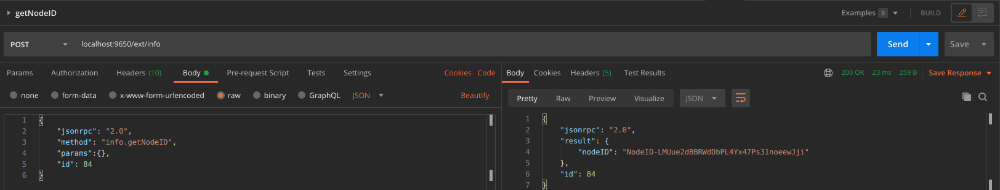
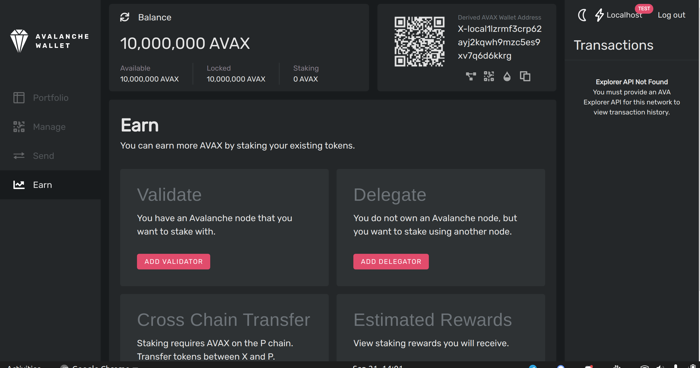
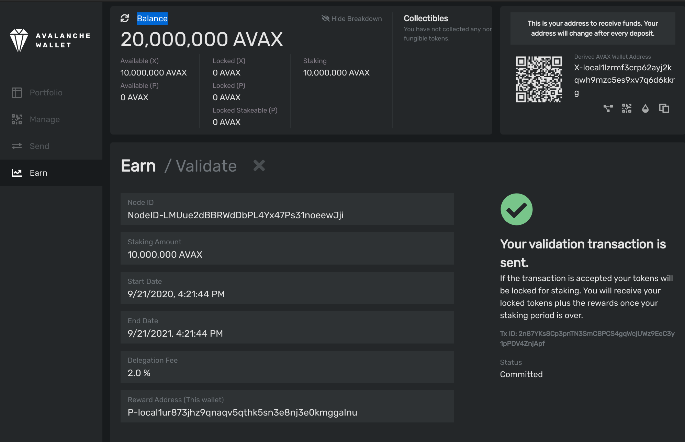

# [**Añadir un Validador**](https://stackedit.io/add-a-validator.md)

## Introducción

La [Red Primaria](https://avalanche.gitbook.io/avalanche/build/tutorials/platform/add-a-validator#introduction) es propia de la plataforma de Avalanche y valida las [ blockchains incorporadas](https://avalanche.gitbook.io/avalanche/learn/platform-overview) de Avalanche. En este tutorial, añadiremos un nodo a la Red Primaria y una [subnet](https://avalanche.gitbook.io/avalanche/learn/platform-overview#subnets) en Avalanche.

La P-Chain maneja los metadatos de Avalanche. Esto incluye el seguimiento de qué nodos están en qué subredes, que blockchains existen, y cuales subnets están validando cuales blockchains. Para añadir un validador, emitiremos [transacciones](http://support.avalabs.org/en/articles/4587384-what-is-a-transaction) a la P-Chain.


Ten en cuenta que una vez que se emite la transacción para añadir un nodo como validador, no hay forma de cambiar los parámetros. **No puedes quitar tu Stake antes de tiempo o cambiar la cantidad del Stake, el ID del nodo o la dirección de la recompensa.** Por favor, asegúrate de utilizar los valores correctos en los llamados de la API a continuación. Si no estás seguro, consulta el [Developer FAQ's](http://support.avalabs.org/en/collections/2618154-developer-faq) o pregunta por ayuda en [Discord.](https://chat.avalabs.org/)


## Requisitos

Has completado [Ejecutando un Nodo de Avalanche](../../getting-started.md) y estás familiarizado con la [Arquitectura de Avalanche](../../../learn/platform-overview/). En este tutorial, usamos la [Colección de Postman de Avalanche](https://github.com/ava-labs/avalanche-postman-collection) para ayudarnos a hacer llamados a la API.

Para asegurarse de que su nodo está bien conectado, asegúrese de que su nodo puede recibir y enviar el tráfico TCP en el puerto de staking \(`9651` por defecto\) y que iniciaste tu nodo con el argumento de la línea de comandos`--public-ip=[LA IP PÚBLICA DE TU NODO AQUÍ]`. El no hacer ninguna de estas cosas puede poner en peligro su recompensa de Staking.

## Añade un Validador con la Wallet de Avalanche 

Primero, te mostramos cómo añadir tu nodo como validador usando la [Wallet de Avalanche](https://wallet.avax.network).

Obten la ID de tu Nodo ejecutando [`info.getNodeID`](https://avalanche.gitbook.io/avalanche/build/apis/info-api#info-getnodeid):



```cpp
curl -X POST --data '{
    "jsonrpc":"2.0",
    "id"     :1,
    "method" :"info.getNodeID"
}' -H 'content-type:application/json;' 127.0.0.1:9650/ext/info
```

La respuesta contiene el ID de tu Nodo:

```cpp
{
    "jsonrpc": "2.0",
    "result": {
        "nodeID": "NodeID-5mb46qkSBj81k9g9e4VFjGGSbaaSLFRzD"
    },
    "id": 1
}
```

Abre [la wallet](https://wallet.avax.network/), Y ve a la pestaña `Earn` . Elige `Add Validator`.



Rellene los parámetros de Staking. Se explican con más detalle a continuación. Cuando hayas rellenado todos los parámetros de Staking y los hayas comprobado dos veces, haz click en `Confirm`. Asegúrate de que el periodo de Staking es de al menos 2 semanas, la comisión de delegación es de al menos el 2%, y estás haciendo Stake de al menos 2.000 AVAX.




Deberías ver este mensaje de aprobación, y tu balance debería ser actualizado.



Ejecutando [`platform.getPendingValidators`](https://avalanche.gitbook.io/avalanche/build/apis/platform-chain-p-chain-api#platform-getpendingvalidators) verifica que nuestra transacción fue aceptada.


Retrocedemos a la pestaña `Earn` y hacemos click en  `Estimated Rewards`.


Una vez que la hora de inicio de nuestro validador haya pasado, veremos las recompensas que podemos ganar, así como su hora de inicio, su hora de fin y el porcentaje de su período de validación que ha pasado.


Eso es todo!

## Añadir un validador con llamados a la API

También podemos añadir un nodo al conjunto de validadores haciendo llamados API a nuestro nodo. Para añadir un nodo a la Red Primaria, ejecutaremos [`platform.addValidator`](https://avalanche.gitbook.io/avalanche/build/apis/platform-chain-p-chain-api#platform-addvalidator).

La firma de este método es:

```cpp
platform.addValidator(
    {
        nodeID: string,
        startTime: int,
        endTime: int,
        stakeAmount: int,
        rewardAddress: string,
        changeAddr: string, (optional)
        delegationFeeRate: float,
        username: string,
        password: string
    }
) -> {txID: string}
```

Vamos a examinar estos argumentos.

`nodeID`

Este es el ID de nodo del validador que se está agregando. Para obtener el ID de tu nodo ejecuta [`info.getNodeID`](https://avalanche.gitbook.io/avalanche/build/apis/info-api#info-getnodeid):

```cpp
curl -X POST --data '{
    "jsonrpc": "2.0",
    "method": "info.getNodeID",
    "params":{},
    "id": 1
}' -H 'content-type:application/json;' 127.0.0.1:9650/ext/info
```

La respuesta contiene el ID de tu Nodo:

```cpp
{
    "jsonrpc": "2.0",
    "result": {
        "nodeID": "NodeID-LMUue2dBBRWdDbPL4Yx47Ps31noeewJji"
    },
    "id": 1
}
```

`startTime` & `endTime`

Cuando se emite una transacción para unirse a la Red Primaria, se especifica la hora en la que entrará \(empezará a validar\) y saldrá \(dejará de validar\) La duración mínima que se puede validar la Red Primaria es de 24 horas, y la máxima de un año. Uno puede volver a entrar en la Red Primaria después de salir, es sólo que la duración máxima _continua_ es de un año.`startTime` y`endTime` son los tiempos de Unix en que nuestro validador comenzará y dejará de validar en la Red Primaria, respectivamente.`startTime` debe ser en el futuro relativo al momento en que se emite la transacción. 

`stakeAmount`

Para validar la Red Primaria, se debe hacer stake de AVAX. Este parámetro define el monto de AVAX del stake.

`rewardAddress`

Cuando un validador deje de validar la Red Primaria, recibirá una recompensa si es lo suficientemente receptivo y correcto mientras valida la Red Primaria. Estos Tokens se envían a `rewardAddress`. El stake original será devuelto a una dirección controlada por `username`.

El stake de un validador nunca es reducido, sin importar su comportamiento; siempre recibirán su stakede vuelta cuando terminen de validar.

`changeAddr`

Cualquier cambio que resulte de esta transacción se enviará a esta dirección. Puedes dejar este campo vacío; si lo haces, el cambio será enviado a una de las direcciones que tu usuario controle.

`delegationFeeRate`

Avalanche permite la delegación del Stake. Este parámetro es el porcentaje de comisión que este validador cobra cuando otros delegan el Stake. Por ejemplo, si `delegationFeeRate` es `1.2345` y alguien delega en este validador, entonces cuando el periodo de delegación termina, el 1.2345% de la recompensa va al validador y el resto al delegador.

`username` & `password`

Estos parámetros son el nombre de usuario y la contraseña del usuario que paga la comisión de la transacción, proporciona el AVAX del Stake y a quien se les devolverá los AVAX en Stake.

Ahora vamos a emitir la transacción. Usamos el comando shell `date` para calcular el tiempo de Unix 10 minutos y 30 días en el futuro para usar como los valores de `startTime` & `endTime`, respectivamente. \(Nota: Si usas Mac, reemplaza`$(date` con`$(gdate`. Si no tienes `gdate` instalado, ejecuta`brew install coreutils`.\)  En este ejemplo hacemos stake de 2,000 AVAX \(2 x 1012 nAVAX\).

```cpp
curl -X POST --data '{
    "jsonrpc": "2.0",
    "method": "platform.addValidator",
    "params": {
        "nodeID":"NodeID-LMUue2dBBRWdDbPL4Yx47Ps31noeewJji",
        "startTime":'$(date --date="10 minutes" +%s)',
        "endTime":'$(date --date="30 days" +%s)',
        "stakeAmount":2000000000000,
        "rewardAddress":"P-avax1d4wfwrfgu4dkkyq7dlhx0lt69y2hjkjeejnhca",
        "changeAddr": "P-avax103y30cxeulkjfe3kwfnpt432ylmnxux8r73r8u",
        "delegationFeeRate":10,
        "username":"USERNAME",
        "password":"PASSWORD"
    },
    "id": 1
}' -H 'content-type:application/json;' 127.0.0.1:9650/ext/P
```

La respuesta tiene el ID de la transacción, así como la dirección a la que fué enviado el cambio.

```cpp
{
    "jsonrpc": "2.0",
    "result": {
        "txID": "6pb3mthunogehapzqmubmx6n38ii3lzytvdrxumovwkqftzls",
        "changeAddr": "P-avax103y30cxeulkjfe3kwfnpt432ylmnxux8r73r8u"
    },
    "id": 1
}
```

Podemos comprobar el estado de la transacción ejecutando [`platform.getTxStatus`](https://avalanche.gitbook.io/avalanche/build/apis/platform-chain-p-chain-api#platform-gettxstatus):

```cpp
curl -X POST --data '{
    "jsonrpc": "2.0",
    "method": "platform.getTxStatus",
    "params": {
        "txID":"6pb3mthunogehapzqmubmx6n38ii3lzytvdrxumovwkqftzls"
    },
    "id": 1
}' -H 'content-type:application/json;' 127.0.0.1:9650/ext/P
```

El estatus debe ser `Committed`, lo que significa que la transacción fue exitosa. Podemos ejecutar [`platform.getPendingValidators`](https://avalanche.gitbook.io/avalanche/build/apis/platform-chain-p-chain-api#platform-getpendingvalidators) y ver que el nodo está ahora en el validador pendiente establecido para la Red Primaria:

```cpp
curl -X POST --data '{
    "jsonrpc": "2.0",
    "method": "platform.getPendingValidators",
    "params": {},
    "id": 1
}' -H 'content-type:application/json;' 127.0.0.1:9650/ext/P
```

La respuesta debería incluir el nodo que acabamos de añadir:

```cpp
{
    "jsonrpc": "2.0",
    "result": {
        "validators": [
            {
                "nodeID": "NodeID-LMUue2dBBRWdDbPL4Yx47Ps31noeewJji",
                "startTime": "1584021450",
                "endtime": "1584121156",
                "stakeAmount": "2000000000000",
            }
        ] 
    },
    "id": 1
}
```

Cuando el tiempo llegue a `1584021450`, este nodo comenzará a validar la Red Primaria. Cuando llegue a `1584121156`, este nodo dejará de validar la Red Primaria. Los AVAX en Stake serán devueltos a una dirección controlada por `username`, y las recompensas, si las hay, se otorgarán a `rewardAddress`.

## Añadir un Validador de Subnet

### Emisión de una Transacción de Validador de una Subnet

Ahora añadamos el mismo nodo a una subnet. Lo siguiente tendrá más sentido si ya has hecho este [tutorial sobre la creación de una Subnet](https://avalanche.gitbook.io/avalanche/build/tutorials/platform/create-a-subnet). Ahora mismo sólo puedes añadir validadores a las subnets con llamados API, no con la Wallet de Avalanche.

Supongamos que la Subnet tiene la ID `nTd2Q2nTLp8M9qv2VKHMdvYhtNWX7aTPa4SMEK7x7yJHbcWvr`, límite 2, y que `username` tiene al menos 2 llaves de control.

Para agregar el validador, ejecutaremos el método API [`platform.addSubnetValidator`](https://avalanche.gitbook.io/avalanche/build/apis/platform-chain-p-chain-api#platform-addsubnetvalidator). Its signature is:

```cpp
platform.addSubnetValidator(
    {
        nodeID: string,
        subnetID: string,
        startTime: int,
        endTime: int,
        weight: int,
        changeAddr: string, (optional)
        username: string,
        password: string
    }
) -> {txID: string}
```

Examinemos los parámetros:

`nodeID`

Este es el ID de nodo del validador que se está agregando a la subnet. **Este validador debe validar la Red Primaria durante todo el tiempo que valide esta Subnet.**

`subnetID`

Este es el ID de la subnet a la que estamos añadiendo un validador.

`startTime` &`endTime`

Similar a lo anterior, estos son los tiempos de Unix en que el validador comenzará y dejará de validar la subnet. `startTime` debe ser en o después del momento en que el validador comience a validar la Red Primaria, y `endTime` debe ser en el momento o antes de que el validador deje de validar la Red Primaria.

`weight`

Este es el peso de la muestra del validador para el consenso. Si el peso del validador es 1 y el peso acumulado de todos los validadores en la subnet es 100, entonces este validador se incluirá en aproximadamente 1 de cada 100 muestras durante el consenso.

`changeAddr`

Cualquier cambio que resulte de esta transacción se enviará a esta dirección. Puede dejar este campo vacío; si lo hace, el cambio será enviado a una de las direcciones que su usuario controle.

`username` & `password`

Estos parámetros son el nombre de usuario y la contraseña del usuario que paga la comisión de la transacción. Este usuario debe tener un número suficiente de las claves de control de esta Subnet para poder añadir un validador a esta Subnet.

Usamos el comando shell `date` para calcular el tiempo de Unix 10 minutos y 30 días en el futuro para usar como los valores de `startTime` & `endTime`, respectivamente. \(Nota: Si usas Mac, reemplaza`$(date` con`$(gdate`. Si no tienes `gdate` instalado, ejecuta`brew install coreutils`.\) 

```cpp
curl -X POST --data '{
    "jsonrpc": "2.0",
    "method": "platform.addSubnetValidator",
    "params": {
        "nodeID":"NodeID-LMUue2dBBRWdDbPL4Yx47Ps31noeewJji",
        "subnetID":"nTd2Q2nTLp8M9qv2VKHMdvYhtNWX7aTPa4SMEK7x7yJHbcWvr",
        "startTime":'$(date --date="10 minutes" +%s)',
        "endTime":'$(date --date="30 days" +%s)',
        "weight":1,
        "changeAddr": "P-avax103y30cxeulkjfe3kwfnpt432ylmnxux8r73r8u",
        "username":"USERNAME",
        "password":"PASSWORD"
    },
    "id": 1
}' -H 'content-type:application/json;' 127.0.0.1:9650/ext/P
```

La respuesta tiene el ID de la transacción, así como la dirección a la que fué enviado el cambio.

```cpp
{
    "jsonrpc": "2.0",
    "result": {
        "txID": "2exafyvRNSE5ehwjhafBVt6CTntot7DFjsZNcZ54GSxBbVLcCm",
        "changeAddr": "P-avax103y30cxeulkjfe3kwfnpt432ylmnxux8r73r8u"
    },
    "id": 1
}
```

Podemos comprobar el estado de la transacción ejecutando  [`platform.getTxStatus`](https://avalanche.gitbook.io/avalanche/build/apis/platform-chain-p-chain-api#platform-gettxstatus):

```cpp
curl -X POST --data '{
    "jsonrpc": "2.0",
    "method": "platform.getTxStatus",
    "params": {
        "txID":"2exafyvRNSE5ehwjhafBVt6CTntot7DFjsZNcZ54GSxBbVLcCm"
    },
    "id": 1
}' -H 'content-type:application/json;' 127.0.0.1:9650/ext/P
```

El estatus debe ser `Committed`, lo que significa que la transacción fue exitosa. Podemos ejecutar [`platform.getPendingValidators`](https://avalanche.gitbook.io/avalanche/build/apis/platform-chain-p-chain-api#platform-getpendingvalidators) y ver que el nodo está ahora en el validador pendiente establecido para la Red Primaria. Esta vez, especificamos el ID de la subnet:

```cpp
curl -X POST --data '{
    "jsonrpc": "2.0",
    "method": "platform.getPendingValidators",
    "params": {"subnetID":"nTd2Q2nTLp8M9qv2VKHMdvYhtNWX7aTPa4SMEK7x7yJHbcWvr"},
    "id": 1
}' -H 'content-type:application/json;' 127.0.0.1:9650/ext/P
```

La respuesta debe incluir el nodo que acabamos de añadir:

```cpp
{
    "jsonrpc": "2.0",
    "result": {
        "validators": [
            {
                "nodeID": "NodeID-LMUue2dBBRWdDbPL4Yx47Ps31noeewJji",
                "startTime":1584042912,
                "endTime":1584121156,
                "weight": "1"
            }
        ]
    },
    "id": 1
}
```

Cuando el tiempo llegue a  `1584042912`, este nodo comenzará a validar esta Subnet. Cuando llegue a `1584121156`, este nodo dejará de validar esta Subnet.

### Agregando la Subnet a la Lista Blanca

Ahora que el nodo ha sido añadido como validador de la subnet, añadámoslo a la lista blanca de subnets. La lista blanca evita que el nodo valide una subnet sin querer.

Para hacer una lista blanca de la subnet, reinicie el nodo y añada el parámetro `--whitelisted-subnets` con una lista separada por comas de subnets a ingresar en la lista blanca.

El comando completo es:

`./build/avalanchego --whitelisted-subnets=nTd2Q2nTLp8M9qv2VKHMdvYhtNWX7aTPa4SMEK7x7yJHbcWvr`

<!--stackedit_data:
eyJoaXN0b3J5IjpbLTY5MTYxNzI4NCwtNTQwMDU4NjY2LC04Mj
M1MDI1NDYsMjgyMDcwODExLDMzMjc3NzQ4NywtMTgyOTg1NzE4
NywtMTM0NDMzMDY0OCwzMjEyMzI1NzMsMTQzNDgxMzg4NSw5ND
Y5Njk3NjksLTExMDk5MzAyNywtMTIzNzM1MzkyOCwtMTA1NTk4
OTM2OSwxMjYzNjc4NDg3LDEwMzM3NTMzNjddfQ==
-->