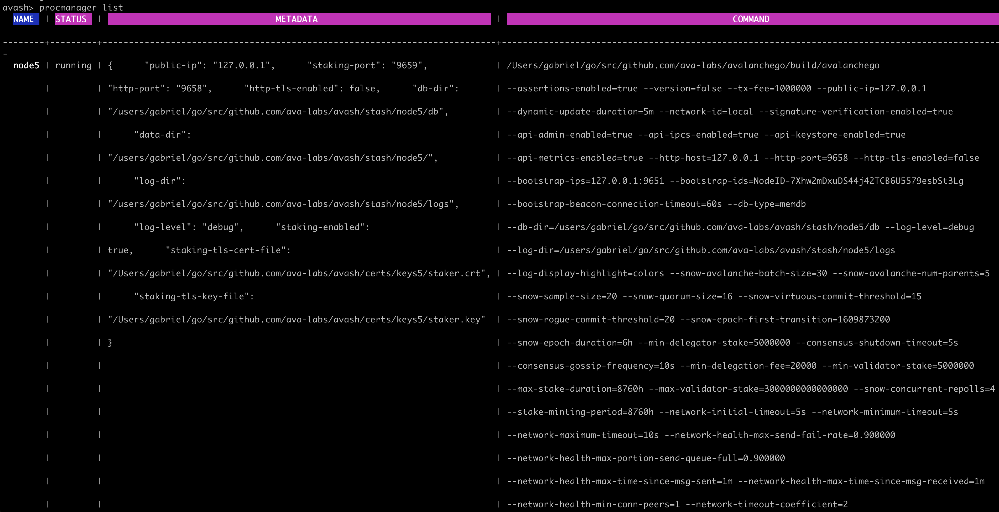

# Avashによる5つのノードネットワークの実行

[Avash](https://github.com/ava-labs/avalanche-docs/tree/5d8eee7598db8da63038af14437e5ed6dac39af7/build/tools/avash/README.md)は、ローカルマシン上でテストまたはプライベートAvalancheネットワークを実行するための開発ネットワークです。ローカルネットワークを任意の状態に設定し、自動化することができます。これにより、現地での開発作業やテストが大幅に加速されます。

## 依存関係

まず、それぞれの依存関係が最新かつ最高のバージョンであることを確認してください。

### Golang

まず、[最新バージョンのGolang](https://golang.org/dl)がインストールされているかどうかを確認し、インストールされていなければインストールしてください。このチュートリアルでは`go1.17.1`を使用します。

```text
go version
go version go1.17.1 darwin/amd64
```

### AvalancheGo

次に、[AvalancheGoの最新バージョン](https://github.com/ava-labs/avalanchego/releases)がインストールされ、ビルドされていることを確認します。このチュートリアルでは、`avalanche/1.6.0`を使用します。

```text
cd /path/to/avalanchego
git fetch -p
git checkout v1.6.0
./scripts/build.sh
...building
...building
Build Successful

./build/avalanchego --version
avalanche/1.6.0 [database=v1.4.5, commit=43ab26923909bf5750c1edeb8477a3b912e40eaa]
```

### Avash

そして、[最新バージョンのAvash](https://github.com/ava-labs/avalanchego/releases)がインストールされ、ビルドされていることを確認します。このチュートリアルでは、`v1.2.0`を使用します。`help`コマンドを呼び出して、Avashが正しくビルドしたことを確認します。

```text
cd /path/to/avash
git fetch -p
git checkout v1.2.0
go build

./avash help
A shell environment for launching and interacting with multiple Avalanche nodes.
```

## ローカルネットワークの起動

すべての依存関係が適切に構築されているので、ローカルのアバランチネットワークを起動する準備が整いました。この例では、Avashに付属している`five_node_staking.lua`のスクリプトを実行します。

### 5つのノードステーキングスクリプト

Avashでは、任意の数のローカルAvalancheGoインスタンスと、各インスタンスに固有の構成を持つ開発環境を自動化することができます。例えば、`five_node_staking.lua`スクリプトは、5つの完全なAvalancheGo Nodesを備えたローカルAvalancheネットワークを起動します。個々のノードとはRPCでやりとりできます。

以下の`five_node_staking.lua`のスクリプト通知では、任意の数のフルノードを実行・設定することができます。[Avashのcerts/ディレクトリ](https://github.com/ava-labs/avash/tree/master/certs)にあるステーカーキーの数によって制限されます。AvalancheGoには7つのステーカーキーが同梱されています。

有効な[AvalancheGoコマンドライン引数](https://docs.avax.network/build/references/command-line-interface)を渡すことで、各ノードを個別に設定します。

```lua
cmds = {
    "startnode node1 --db-type=memdb --staking-enabled=true --http-port=9650 --staking-port=9651 --log-level=debug --bootstrap-ips= --staking-tls-cert-file=certs/keys1/staker.crt --staking-tls-key-file=certs/keys1/staker.key",
    "startnode node2 --db-type=memdb --staking-enabled=true --http-port=9652 --staking-port=9653 --log-level=debug --bootstrap-ips=127.0.0.1:9651 --bootstrap-ids=NodeID-7Xhw2mDxuDS44j42TCB6U5579esbSt3Lg --staking-tls-cert-file=certs/keys2/staker.crt --staking-tls-key-file=certs/keys2/staker.key",
    "startnode node3 --db-type=memdb --staking-enabled=true --http-port=9654 --staking-port=9655 --log-level=debug --bootstrap-ips=127.0.0.1:9651 --bootstrap-ids=NodeID-7Xhw2mDxuDS44j42TCB6U5579esbSt3Lg --staking-tls-cert-file=certs/keys3/staker.crt --staking-tls-key-file=certs/keys3/staker.key",
    "startnode node4 --db-type=memdb --staking-enabled=true --http-port=9656 --staking-port=9657 --log-level=debug --bootstrap-ips=127.0.0.1:9651 --bootstrap-ids=NodeID-7Xhw2mDxuDS44j42TCB6U5579esbSt3Lg --staking-tls-cert-file=certs/keys4/staker.crt --staking-tls-key-file=certs/keys4/staker.key",
    "startnode node5 --db-type=memdb --staking-enabled=true --http-port=9658 --staking-port=9659 --log-level=debug --bootstrap-ips=127.0.0.1:9651 --bootstrap-ids=NodeID-7Xhw2mDxuDS44j42TCB6U5579esbSt3Lg --staking-tls-cert-file=certs/keys5/staker.crt --staking-tls-key-file=certs/keys5/staker.key",
}

for key, cmd in ipairs(cmds) do
    avash_call(cmd)
end
```

avashを起動し、Avashのシェル経由で`five_node_staking.lua`スクリプトを実行します。

```text
cd /path/to/avash
./avash
avash> runscript scripts/five_node_staking.lua
```

今度は新しいタブを開いて、この`curl`を実行します。

```text
curl --location --request POST 'http://localhost:9650/ext/info' \
--header 'Content-Type: application/json' \
--data-raw '{
    "jsonrpc":"2.0",
    "id"     :1,
    "method" :"info.getNetworkName",
    "params" :{
    }
}'

{
    "jsonrpc": "2.0",
    "result": {
        "networkName": "local"
    },
    "id": 1
}
```

以前の各ステップが正常に完了すれば、ローカルのアバッシュネットワークは正常に動作します。

## ネットワークの点検

Avashのシェルには`procmanager`コマンドが用意されており、プロセスマネージャに登録されているプロセスの一覧表示、停止、起動を行うことができます。

利用可能なコマンド：

```text
kill        Kills the process named if currently running.
killall     Kills all processes if currently running.
list        Lists the processes currently running.
metadata    Prints the metadata associated with the node name.
remove      Removes the process named.
removeall   Removes all processes.
start       Starts the process named if not currently running.
startall    Starts all processes if currently stopped.
stop        Stops the process named if currently running.
stopall     Stops all processes if currently running.
```

すべてのプロセスを`list`すると、AvalancheGoインスタンスを起動するために使用されたすべてのフラグの値を見ることができます。



## まとめ

Avashは、開発者が価値のない資産を使って、高度な設定が可能な環境で自分の作品を素早くテストできるようにするという重要な機能を果たしています。AvalancheGoの各インスタンスはフルノードであり、Avashは実際のコンセンサスを行い、実際のブロックと頂点を生成する実際のAvalancheGoネットワークです。

Avalancheネットワークのソフトウェアを書いている場合、Avashはあなたのワークフローの基本的な構成要素となるはずです。新しいプロジェクトは、ローカルのAvashネットワークで開始し、広範なテストとQAを経てから、Fujiテストネット、最終的にはメインネットにデプロイする必要があります。

