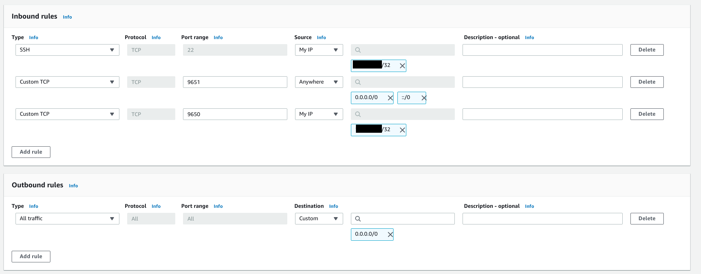

# Ejecutar un nodo de Avalanche con Amazon Web Services \(AWS\)

## Introduction

Este tutorial le guiará a través de la configuración de un nodo de Avalanche en [Amazon Web Services \(AWS\)](https://aws.amazon.com/). Los cloud services como AWS son una buena manera de garantizar que su nodo sea altamente seguro, disponible y accesible.

Para empezar, necesitarás:

* Una cuenta de AWS
* Un terminal para SSH en su máquina AWS
* Un lugar para almacenar de forma segura y reespaldar sus archivos

Este tutorial asume que su máquina local tiene un terminal de estilo Unix. Si estás en Windows, tendrás que adaptar algunos de los comandos utilizados aquí.


## Ingresa en AWS <a id="ff31"></a>

Registrarse en AWS está fuera del alcance de este artículo, pero Amazon tiene instrucciones [aquí](https://aws.amazon.com/premiumsupport/knowledge-center/create-and-activate-aws-account).


Es _muy_ recomendable que establezca una autenticación de múltiples factores en su cuenta de usuario root de AWS para protegerla. Amazon tiene documentación para esto [aquí](https://docs.aws.amazon.com/IAM/latest/UserGuide/id_credentials_mfa_enable_virtual.html#enable-virt-mfa-for-root).

Una vez que su cuenta esté configurada, debería crear una nueva instancia EC2. Un EC2 es una instancia de máquina virtual en la nube de AWS. Vaya a la [Consola de Gestión de AWS](https://console.aws.amazon.com/) y entre en el panel de control del EC2.


Para acceder a la instancia EC2, necesitará una llave en su máquina local que le permita acceder a la instancia. Primero, cree esa clave para que pueda ser asignada a la instancia EC2 más adelante. En la barra de la izquierda, bajo **Network & Security**, seleccione **Key Pairs.**


Seleccione **Create key pair** para iniciar el asistente de creación de key pairs.


Nombra tu key pair`avalanche`. Si tu máquina local tiene MacOS o Linux, selecciona el formato de archivo `pem` . Si es Windows, utiliza el formato de archivo `ppk` . Opcionalmente, puedes agregar etiquetas a el key pair para ayudar con el seguimiento.


Haz clic en `Create key pair`. Debería ver un mensaje de éxito, y el archivo de claves debería ser descargado a su máquina local. Sin este archivo, no podrá acceder a su instancia EC2. **Haga una copia de este archivo y póngalo en un medio de almacenamiento separado, como un disco duro externo. Mantenga este archivo en secreto; no lo comparta con otros.**


## Crear un Grupo de Seguridad <a id="f8df"></a>

Un Grupo de Seguridad AWS define qué tráfico de Internet puede entrar y salir de su instancia EC2. Piensa en ello como un firewall.Cree un nuevo Grupo de Seguridad seleccionando **Security Groups** en el menú desplegable **Network & Security**.


Esto abre el panel de Grupos de Seguridad. Haz clic en **Create security group** en la parte superior derecha del panel de Grupos de seguridad.


Tendrás que especificar qué tráfico de entrada está permitido. Permite el tráfico SSH desde tu dirección IP para que puedas acceder a tu instancia EC2. (Cada vez que su ISP cambie su dirección IP, tendrá que modificar esta regla. Si tu ISP cambia regularmente, puedes permitir el tráfico SSH desde cualquier lugar para evitar tener que modificar esta regla con frecuencia.\) Permite el tráfico TCP en el puerto 9651 para que tu nodo pueda comunicarse con otros nodos de la red. Permite el tráfico TCP en el puerto 9650 de tu IP para que puedas hacer llamados API a tu nodo. **Es importante que sólo permitas el tráfico en este puerto desde tu IP.** Si permites el tráfico entrante desde cualquier lugar, esto podría ser usado como un vector de ataque de denegación de servicio. Finalmente, permite todo el tráfico saliente.



Añade una etiqueta al nuevo grupo de seguridad con la clave `Name` y el valor `Avalanche Security Group`. Esto nos permitirá saber qué es este grupo de seguridad cuando lo veamos en la lista de grupos de seguridad.


Haz clic en `Create security group`. Deberías ver el nuevo grupo de seguridad en la lista de grupos de seguridad.

## Iniciar una instancia EC2 <a id="0682"></a>

Ahora estás listo para iniciar una instancia de EC2. Ve al panel de control del EC2 y selecciona **Launch instance**.


Seleccione **Ubuntu 20.04 LTS \(HVM\), SSD Volume Type** para el sistema operativo.


A continuación, elije el tipo de instancia. Esto define las especificaciones de hardware de la instancia en la nube. En este tutorial hemos creado un **c5.large**. Esto debería ser más que poderoso ya que Avalanche es un protocolo de consenso ligero. Para crear una instancia c5.large, selecciona la opción **Compute-optimized**  dentro del filtro del menú desplegable .


Selecciona la casilla de verificación junto a la instancia c5.large en la tabla.


Haz clic en **Next: Configure Instance Details** en la esquina inferior derecha.


Los detalles de la instancia pueden permanecer como sus predeterminados.

### Opcional: Usando Spot Instances o Reserved Instances <a id="c99a"></a>

Por defecto, se te cobrará por hora por ejecutar tu instancia de EC2. Hay dos maneras en las que puedes pagar menos por tu EC2.


La primera es poniendo en marcha su EC2 como una **Spot Instance**. Las Spot instances son instancias que no están garantizadas para estar siempre encendidas, pero que cuestan menos en promedio que las instancias persistentes. Las spot instances utilizan una estructura de precios de mercado de oferta y demanda. A medida que la demanda de instancias sube, el precio de una spot instance sube. Puedes establecer un precio máximo que estés dispuesto a pagar por la spot instance. Es posible que puedas ahorrar una cantidad significativa de dinero, con la salvedad de que tu instancia EC2 puede detenerse si el precio aumenta. Haz tu propia investigación antes de seleccionar esta opción para determinar si la frecuencia de interrupción a su precio máximo justifica el ahorro de costos. Si eliges usar una spot instance, asegúrate de establecer el comportamiento de interrupción en **Stop**, no en **Terminate,** y marca la opción **Persistent Request**.

La otra forma en que podría ahorrar dinero es usando una **Reserved Instance**. Con una reserved instance, pagas por adelantado un año entero de uso de EC2, y recibes una tarifa por hora más baja a cambio del bloqueo. Si tienes la intención de ejecutar un nodo por un largo tiempo y no quieres arriesgarte a interrupciones del servicio, esta es una buena opción para ahorrar dinero. Una vez más, haz tu propia investigación antes de seleccionar esta opción.

### Añadir Almacenamiento, Etiquetas, Grupo de Seguridad <a id="dbf5"></a>

Haz clic en **Next: Add Storage** en la esquina inferior derecha de la pantalla.

Necesitas añadir espacio al disco de tu instancia. Usamos 100 GB en este ejemplo. La base de datos de Avalanche crecerá continuamente hasta que se implemente el pruning, por lo que es más seguro tener una mayor asignación de disco duro por ahora.


Haz clic en **Next: Add Tags** en la esquina inferior derecha de la pantalla para agregar etiquetas a la instancia. Las etiquetas nos permiten asociar metadatos con nuestra instancia. Añade una etiqueta con la clave `Name` y el valor `My Avalanche Node`. Esto aclarará que esta instancia está en su lista de instancias EC2.


Ahora asigna el grupo de seguridad creado anteriormente a la instancia. Elija **Select an existing security group**  y elije el grupo de seguridad creado anteriormente.


Finalmente, haz clic en **Review and Launch** en la parte inferior derecha. Una página de revisión mostrará los detalles de la instancia que estás a punto de iniciar. Revísalos y si todo se ve bien, haz clic en el botón azul **Launch** en la esquina inferior derecha de la pantalla.

Se te pedirá que selecciones un key pair para esta instancia. Selecciona **Choose an existing key pair** y luego selecciona el key pair `avalanche` que hiciste anteriormente en el tutorial. Marca la casilla reconociendo que tiene acceso al archivo `.pem` o `.ppk` creado anteriormente \(asegúrate de hacerle una copia de seguridad!\) y luego haz clic en **Launch Instances**.


¡Deberías ver un nuevo pop-up que confirma que la instancia se está iniciando!


### Asignar una IP elástica

Por defecto, tu instancia no tendrá una IP fija. Démosle una IP fija a través del servicio de IP Elástica de AWS. Vuelve al tablero del EC2. En **Network & Security**, seleccione **Elastic IPs**.


Selecciona **Allocate Elastic IP address**.


Selecciona la región en la que se ejecuta tu instancia y elige usar el conjunto de direcciones IPv4 de Amazon. Haz click en **Allocate**.


Selecciona la IP Elástica que acabas de crear desde el Elastic IP manager. En el menú desplegable **Actions**, seleccione **Associate Elastic IP address**.


Selecciona la instancia que acabas de crear. Esto asociará la nueva IP elástica con la instancia y le dará una dirección IP pública que no cambiará.


## Configura AvalancheGo <a id="829e"></a>

Vuelve al tablero del EC2 y selecciona `Running Instances`.


Seleccione la instancia de EC2 recién creada. Esto abre un panel de detalles con información sobre la instancia.


Copia el campo `IPv4 Public IP` para usarlo más tarde. A partir de ahora llamaremos a este valor `PUBLICIP`.

**Remember: the terminal commands below assume you're running Linux. Commands may differ for MacOS or other operating systems. When copy-pasting a command from a code block, copy and paste the entirety of the text in the block.**

Log into the AWS instance from your local machine. Open a terminal \(try shortcut `CTRL + ALT + T`\) and navigate to the directory containing the `.pem` file you downloaded earlier.

Move the `.pem` file to `$HOME/.ssh` \(where `.pem` files generally live\) with:

```bash
mv avalanche.pem ~/.ssh
```

Add it to the SSH agent so that we can use it to SSH into your EC2 instance, and mark it as read-only.

```bash
ssh-add ~/.ssh/avalanche.pem; chmod 400 ~/.ssh/avalanche.pem
```

SSH into the instance. \(Remember to replace `PUBLICIP` with the public IP field from earlier.\)

```text
ssh ubuntu@PUBLICIP
```

If the permissions are **not** set correctly, you will see the following error.


You are now logged into the EC2 instance.


If you have not already done so, update the instance to make sure it has the latest operating system and security updates:

```text
sudo apt update; sudo apt upgrade -y; sudo reboot
```

This also reboots the instance. Wait 5 minutes, then log in again by running this command on your local machine:

```bash
ssh ubuntu@PUBLICIP
```

You're logged into the EC2 instance again. Now we’ll need to set up our Avalanche node. To do this, follow the [Set Up Avalanche Node With Installer](set-up-node-with-installer.md) tutorial which automates the installation process. You will need the `PUBLICIP` we set up earlier.

Your AvalancheGo node should now be running and in the process of bootstrapping, which can take a few hours. To check if it's done, you can issue an API call using `curl`. If you're making the request from the EC2 instance, the request is:

```text
curl -X POST --data '{
    "jsonrpc":"2.0",
    "id"     :1,
    "method" :"info.isBootstrapped",
    "params": {
        "chain":"X"
    }
}' -H 'content-type:application/json;' 127.0.0.1:9650/ext/info
```

Once the node is finished bootstrapping, the response will be:

```text
{
    "jsonrpc": "2.0",
    "result": {
        "isBootstrapped": true
    },
    "id": 1
}
```

You can continue on, even if AvalancheGo isn't done bootstrapping.

In order to make your node a validator, you'll need its node ID. To get it, run:

```text
curl -X POST --data '{
    "jsonrpc":"2.0",
    "id"     :1,
    "method" :"info.getNodeID"
}' -H 'content-type:application/json;' 127.0.0.1:9650/ext/info
```

The response contains the node ID.

```text
{"jsonrpc":"2.0","result":{"nodeID":"NodeID-DznHmm3o7RkmpLkWMn9NqafH66mqunXbM"},"id":1}
```

In the above example the node ID is`NodeID-DznHmm3o7RkmpLkWMn9NqafH66mqunXbM`. Copy your node ID for later. Your node ID is not a secret, so you can just paste it into a text editor.

AvalancheGo has other APIs, such as the [Health API](../../avalanchego-apis/health-api.md), that may be used to interact with the node. Some APIs are disabled by default. To enable such APIs, modify the ExecStart section of `/etc/systemd/system/avalanchego.service` \(created during the installation process\) to include flags that enable these endpoints. Don't manually enable any APIs unless you have a reason to.


Back up the node's staking key and certificate in case the EC2 instance is corrupted or otherwise unavailable. The node's ID is derived from its staking key and certificate. If you lose your staking key or certificate then your node will get a new node ID, which could cause you to become ineligible for a staking reward if your node is a validator. **It is very strongly advised that you copy your node's staking key and certificate**. The first time you run a node, it will generate a new staking key/certificate pair and store them in directory `/home/ubuntu/.avalanchego/staking`.

Exit out of the SSH instance by running:

```bash
exit
```

Now you're no longer connected to the EC2 instance; you're back on your local machine.

To copy the staking key and certificate to your machine, run the following command. As always, replace `PUBLICIP`.

```text
scp -r ubuntu@PUBLICIP:/home/ubuntu/.avalanchego/staking ~/aws_avalanche_backup
```

Now your staking key and certificate are in directory `~/aws_avalanche_backup` . **The contents of this directory are secret.** You should hold this directory on storage not connected to the internet \(like an external hard drive.\)

### Upgrading Your Node <a id="9ac7"></a>

AvalancheGo is an ongoing project and there are regular version upgrades. Most upgrades are recommended but not required. Advance notice will be given for upgrades that are not backwards compatible. To update your node to the latest version, SSH into your AWS instance as before and run the installer script again.

```text
./avalanchego-installer.sh
```

Your machine is now running the newest AvalancheGo version. To see the status of the AvalancheGo service, run `sudo systemctl status avalanchego.`

## Wrap Up

That's it! You now have an AvalancheGo node running on an AWS EC2 instance. We recommend setting up [node monitoring ](setting-up-node-monitoring.md)for your AvalancheGo node. We also recommend setting up AWS billing alerts so you're not surprised when the bill arrives. If you have feedback on this tutorial, or anything else, send us a message on [Discord](https://chat.avalabs.org).

<!--stackedit_data:
eyJoaXN0b3J5IjpbMTk0MDA0OTQwMSw0NjYwOTE0OTEsLTE1Nj
gwOTE0OTMsNTU3NjU5MTQsMTYxMDI3ODQ1LDcyODY2NTc5OSwt
NzIwNjg0Njc2LDg2MTA5NTMwM119
-->