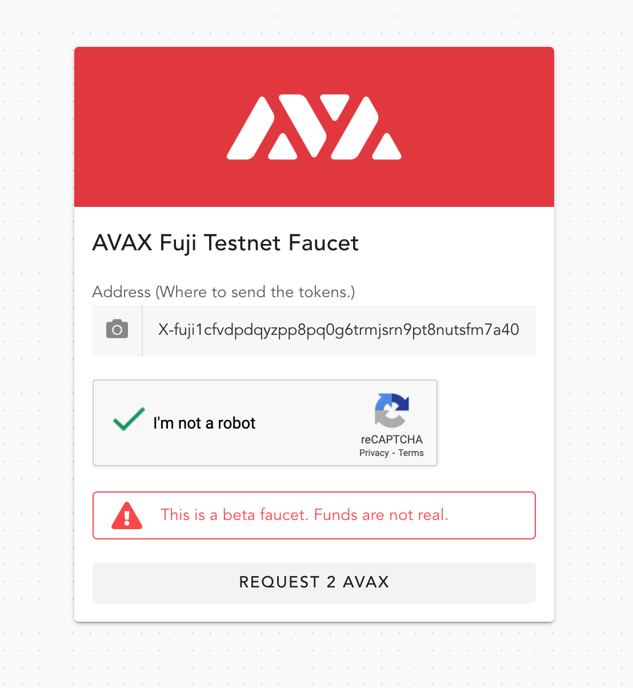
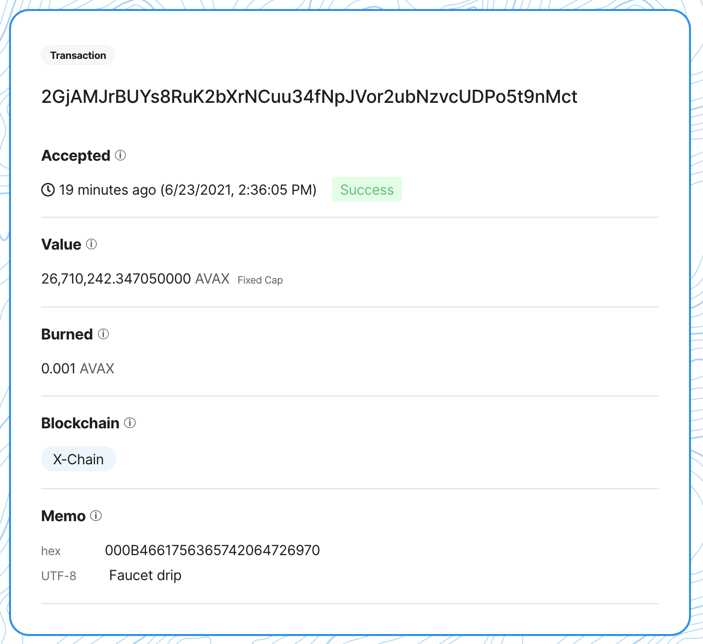
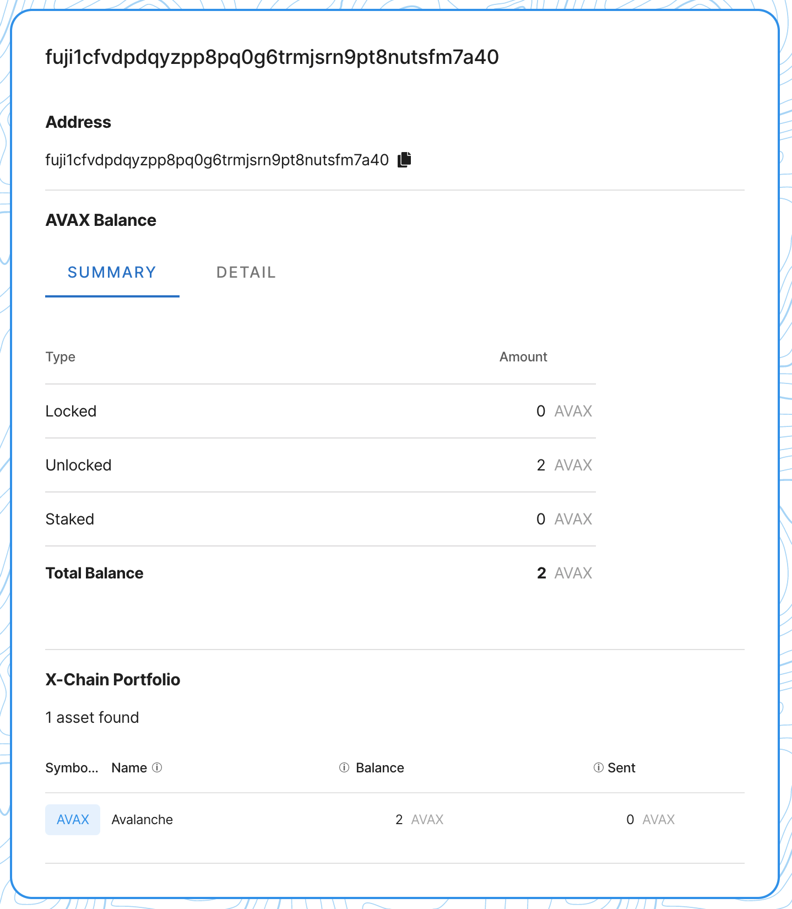
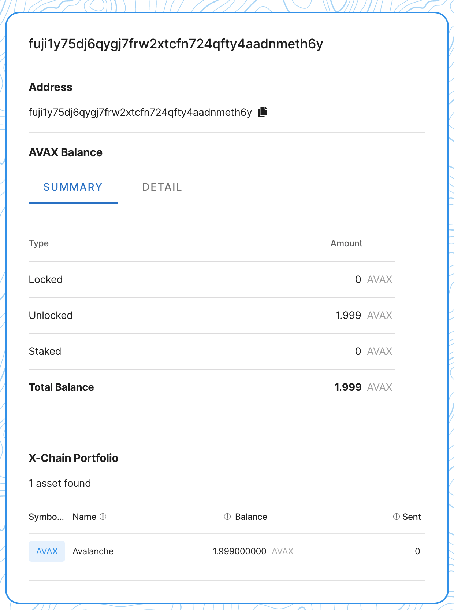
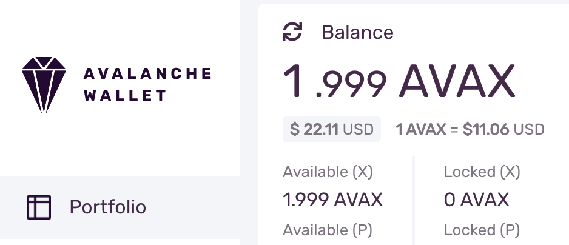

# Fuji Workflow

## Introduction

Fuji is the Avalanche network's testnet and is the place for testing your dapp or smart contract after you've developed it locally using [avash](https://docs.avax.network/build/tools/avash). Fuji is a mirror of the Mainnet (sans any issued assets) and testing your dapp or smart contract against a test environment before going live ensures that no actual value-bearing assets are lost during development and testing. It's considered a best-practice to first develop your dapp locally using avash, once you're confident the features are baked then deploy your dapp to the Fuji testnet and only after passing all tests and QA do you actually deploy on the Mainnet with real value-bearing assets.

Every resource which you would use on the Mainnet, such as an explorer, wallet and cloud full-node infrastructure, are all available on the Fuji network. In this tutorial, we’ll explore a full Fuji workflow, from generating a mnemonic to sending a transaction. Ultimately we will accomplish the following:

1. Generating a 24 word english mnemonic via AvalancheJS
2. Deriving the first external BIP44 X-Chain address via AvalancheJS
3. Getting a drip from the faucet
4. Sending AVAX from the first external BIP44 address to the second external BIP44 address via AvalancheJS
5. Checking out the txid on the explorer
6. Using the same mnemonic from step 1 to sign into the web wallet and confirm the balance is there. The wallet should auto-derive the third external BIP44 address

### Prerequisites

We'll be using [AvalancheJS](https://docs.avax.network/build/tools/avalanchejs) during our steps. In the code snippets we use the `await` keyword for asynchronous requests. Unless properly configured w/ tsconfig the `await` keyword needs to be wrapped in an `async` keyword which is missing from the examples. The example scripts were purposefully terse w/ the intention of only highlighting the functionality at-hand. At the end of the tutorial is a list of example scripts which are properly formatted.

## Generate Mnemonic

To begin we need a mnemonic which we can generate w/ AvalancheJS. Mnemonics enable us to encode a strong 256 bit source of entropy into a human-readable string. AvalancheJS supports 10 languages including

Generating a 24 word english mnemonic via AvalancheJS

```ts
import { Mnemonic } from "avalanche"
const mnemonic: Mnemonic = Mnemonic.getInstance()
const strength: number = 256
const wordlist = mnemonic.getWordlists("english") as string[]
const m: string = mnemonic.generateMnemonic(strength, randomBytes, wordlist)
// "pool hat domain flame stomach canal fury master farm gown tide supreme winner motion this first divide spray forum wall reopen bounce spider palm"
```

9 other languages and you can pass in a custom dictionary for any language.

### Derive Addresses

```ts
const seed: Buffer = mnemonic.mnemonicToSeedSync(m)
const hdnode: HDNode = new HDNode(seed)
for (let i: number = 0; i <= 2; i++) {
  // Deriving the _i_th external BIP44 X-Chain address
  const child: HDNode = hdnode.derive(`m/44'/9000'/0'/0/${i}`)
  keychain.importKey(child.privateKeyCB58)
}
// Getting a drip from the faucet
const xAddressStrings: string[] = xchain.keyChain().getAddressStrings()
console.log(xAddressStrings)
// [
//   'X-fuji1cfvdpdqyzpp8pq0g6trmjsrn9pt8nutsfm7a40',
//   'X-fuji1y75dj6qygj7frw2xtcfn724qfty4aadnmeth6y',
//   'X-fuji1p6n0vyjqgmp06f7pr405q2flqu9v93j383ncam'
// ]
```

**Note** that we're using `keychain` which hasn't been defined yet. Creating an empty keychain can be seen in [this example AvalancheJS script](https://github.com/ava-labs/avalanchejs/blob/master/examples/avm/newKeyChain.ts).

Mnemonics and HD paths enable us to deterministically recreate a vast number of keys from nothing more than a string of words. This is an extremely empowering technology for personal and financial sovereignty. This convention let's us at any time in the future recreate the 3 keypairs which the addresses were created from in order to sign a transaction moving funds.

### Getting a drip from the faucet
 
**Note** that the previous step generated 3 addresses per the BIP44 spec. We're going to first get some AVAX from the [Fuji faucet](https://faucet.avax-test.network) sent to the 1st address. Then we'll use AvalancheJS to send the AVAX from the 1st to the 2nd address. After confirming that the transaction was successful we'll use the mnemonic to access the Avalanche Web Wallet and see that it automagically generated the 3rd address per the BIP44 spec.

To get AVAX go to the faucet and paste in your Fuji address. **Note** that this is for the Fuji testnet and these AVAX tokens have no monetary value.



After the faucet successfully drips some AVAX to the address it will return a transaction id, also known as a txid. This txid can be used with the Fuji testnet blockchain explorer to learn more about the transaction.


#### Check the Transaction Details

The txid, `2GjAMJrBUYs8RuK2bXrNCuu34fNpJVor2ubNzvcUDPo5t9nMct`, can be seen on the [Fuji Explorer](https://explorer.avax-test.network/tx/2GjAMJrBUYs8RuK2bXrNCuu34fNpJVor2ubNzvcUDPo5t9nMct). **Note** Avalanche also has a [Mainnet](https://explorer.avax.network)




#### Get the Balance

We can also get the balance for the 1st BIP44 derived address.




## Sending AVAX

The faucet dripped 2 AVAX. First, let's send both AVAX, sans the fees, from the 1st address to the 2nd address.

```ts
const avaxAssetID: string = Defaults.network[networkID].X['avaxAssetID']

// get the AVAX balance for the 1st address
const getBalanceResponse: any = await xchain.getBalance(xAddressStrings[0], avaxAssetID)
const balance: BN = new BN(getBalanceResponse.balance)

// subtract the fee
const fee: BN = xchain.getDefaultTxFee()
const amount: BN = balance.sub(fee)

// get the UTXOs for the 1st address
const avmUTXOResponse: any = await xchain.getUTXOs(xAddressStrings[0])
const utxoSet: UTXOSet = avmUTXOResponse.utxos

// build an UnsignedTx sending AVAX from the first external BIP44 address to the second external BIP44 address
const unsignedTx: UnsignedTx = await xchain.buildBaseTx(
  utxoSet,
  amount,
  avaxAssetID,
  [xAddressStrings[1]],
  [xAddressStrings[0]],
  [xAddressStrings[1]],
  memo,
  asOf,
  locktime,
  threshold
)

// sign it
const tx: Tx = unsignedTx.sign(xKeychain)

// issue it and get a txid
const txid: string = await xchain.issueTx(tx)
console.log(`Success! TXID: ${txid}`)
// Success! TXID: ankMr1tD65A9SSto5w4ic1d31t6w42jeu8pfv6v4gRPpMg17g
```

### Verify Success

```ts
const ip: string = "api.avax-test.network"
const port: number = 443
const protocol: string = "https"
const networkID: number = 5
const avalanche: Avalanche = new Avalanche(ip, port, protocol, networkID)
const xchain: AVMAPI = avalanche.XChain()
const status: string = await xchain.getTxStatus("ankMr1tD65A9SSto5w4ic1d31t6w42jeu8pfv6v4gRPpMg17g")
console.log(status)
// Accepted
```

#### Check the Transaction Details

The txid, `ankMr1tD65A9SSto5w4ic1d31t6w42jeu8pfv6v4gRPpMg17g`, can be seen on the [Fuji Explorer](https://explorer.avax-test.network/tx/ankMr1tD65A9SSto5w4ic1d31t6w42jeu8pfv6v4gRPpMg17g).


#### Get the Balance

We can also get the balance for the 2nd BIP44 derived address.




### Sign into the Web Wallet

Lastly, we can take the mnemonic and access the [Avalanche Web Wallet](https://wallet.avax.network). We'll see that it has the AVAX balance and that it auto-magically generates the 3rd address per the BIP44 spec.




Also **note** that the wallet GUI shows it derived the same 3 addresses as our script above.


## Summary

The Fuji network plays a critical role as the final step for testing and QAing dapps, smart contracts and financial products on non-value-bearing assets before deploying to the Mainnet. The entire Avalanche ecosystem, from developer tooling like AvalancheJS, the API nodes and the faucet, to the explorer for verifying transactions and balances and even the wallet are all available on the Fuji network to ensure that your testing and QA cycle is as close to Mainnet as possible so that you can be confident when you go live on production. 

## Resources

For additional and valuable resources please see below.

### Faucet

The [Fuji Faucet](https://faucet.avax-test.network) is the place to get AVAX for the X-Chain and the C-Chain to test your dapps with non-value-bearing assets before deploying to the Mainnet.

### Wallet

The [Avalanche Web Wallet](https://wallet.avax.network) is a simple, secure, non-custodial wallet for storing Avalanche assets. It has support for Mainnet, Fuji and custom networks.

### Explorer

The Avalanche Explorer works for [Mainnet](https://explorer.avax.network) and [Fuji](https://explorer.avax-test.network).

### API Nodes

There is a public API server that allows developers to access the Avalanche network without having to run a node thesmelves. The public API server is actually several AvalancheGo nodes behind a load balancer to ensure high availability and high request throughput with support for both [Mainnet](https://api.avax.network) and [Fuji](https://api.avax-test.network).
