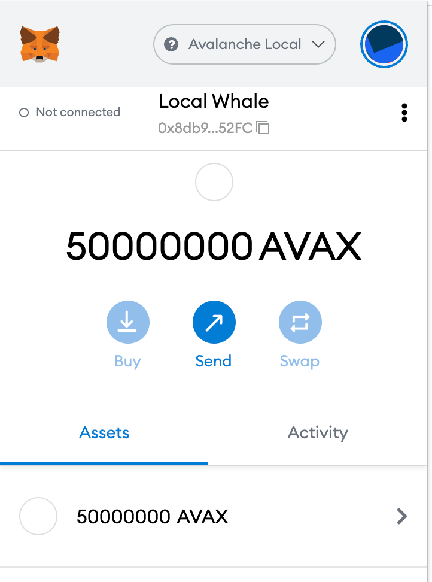

# ローカルテストネットワークの構築

## はじめに

[ローカルテストネットワークの作成](create-a-local-test-network.md)では、5つのノードのローカルテストネットワークを立ち上げる方法を紹介しました。ローカルネットワークができたら、次のステップはアドレスを確保して、取引やスマートコントラクトとのやりとりを始められるようにすることです。

あらかじめ用意された秘密鍵を活用して、Xチェーン、Cチェーン、Pチェーンの資金にアクセスする方法を紹介します。**注：**この同じ秘密鍵は`PrivateKey-ewoqjP7PxY4yr3iLTpLisriqt94hdyDFNgchSxGGztUrTXtNN`、[AvalancheJS](../../tools/avalanchejs/)を使用してローカルでtxsに署名するために使用できます。その資金にアクセスするために、鍵をローカルの鍵屋にインポートする必要はありません。それらは、それぞれのチェーンのジェネシスバーテックスとブロックにあります。

## ユーザーの作成

最初の実行`keystore.createUser`では、ローカルのキーストアにユーザーを作成します。

```text
curl --location --request POST '127.0.0.1:9650/ext/keystore' \
--header 'Content-Type: application/json' \
--data-raw '{
    "jsonrpc":"2.0",
    "id"     :1,
    "method" :"keystore.createUser",
    "params" :{
        "username": "username",
        "password": "password"
    }
}'

{
    "jsonrpc": "2.0",
    "result": {
        "success": true
    },
    "id": 1
}
```

次に、事前に調達した秘密鍵`PrivateKey-ewoqjP7PxY4yr3iLTpLisriqt94hdyDFNgchSxGGztUrTXtNN`-aka`ewoq`を、デフォルトのサブネット上にある3つのブロックチェーンのいずれかにインポートします。キーをインポートした後、残高をチェックして、動作したことを確認できます。

## X-Chain

[X-Chain](../../avalanchego-apis/exchange-chain-x-chain-api.md)にインポート`ewoq`します。

```text
curl --location --request POST '127.0.0.1:9650/ext/bc/X' \
--header 'Content-Type: application/json' \
--data-raw '{
    "jsonrpc":"2.0",
    "id"     :1,
    "method" :"avm.importKey",
    "params" :{
        "username": "username",
        "password": "password",
        "privateKey":"PrivateKey-ewoqjP7PxY4yr3iLTpLisriqt94hdyDFNgchSxGGztUrTXtNN"
    }
}'

{
    "jsonrpc": "2.0",
    "result": {
        "address": "X-local18jma8ppw3nhx5r4ap8clazz0dps7rv5u00z96u"
    },
    "id": 1
}
```

### X-Chainの残高を確認

`X-local18jma8ppw3nhx5r4ap8clazz0dps7rv5u00z96u`のアドレスのX-Chainに300m AVAXの残高があることを確認します。

```text
curl --location --request POST '127.0.0.1:9650/ext/bc/X' \
--header 'Content-Type: application/json' \
--data-raw '{
  "jsonrpc":"2.0",
  "id"     : 1,
  "method" :"avm.getBalance",
  "params" :{
      "address":"X-local18jma8ppw3nhx5r4ap8clazz0dps7rv5u00z96u",
      "assetID": "AVAX"
  }
} '

{
    "jsonrpc": "2.0",
    "result": {
        "balance": "300000000000000000",
        "utxoIDs": [
            {
                "txID": "2fombhL7aGPwj3KH4bfrmJwW6PVnMobf9Y2fn9GwxiAAJyFDbe",
                "outputIndex": 1
            }
        ]
    },
    "id": 1
}
```

## C-Chain

[](../../avalanchego-apis/contract-chain-c-chain-api.md)C-Chainにインポート`ewoq`します。

```text
curl --location --request POST '127.0.0.1:9650/ext/bc/C/avax' \
--header 'Content-Type: application/json' \
--data-raw '{
    "method": "avax.importKey",
    "params": {
        "username":"username",
        "password":"password",
        "privateKey":"PrivateKey-ewoqjP7PxY4yr3iLTpLisriqt94hdyDFNgchSxGGztUrTXtNN"
    },
    "jsonrpc": "2.0",
    "id": 1
}'

{
    "jsonrpc": "2.0",
    "result": {
        "address": "0x8db97C7cEcE249c2b98bDC0226Cc4C2A57BF52FC"
    },
    "id": 1
}
```

### C-Chainの残高を確認

`0x8db97C7cEcE249c2b98bDC0226Cc4C2A57BF52FC`のアドレスのC-Chainの残高が50m（16進数で0x295be96e64066972000000）であることを確認します。

```text
curl --location --request POST 'localhost:9650/ext/bc/C/rpc' \
--header 'Content-Type: application/json' \
--data-raw '{
    "jsonrpc": "2.0",
    "method": "eth_getBalance",
    "params": [
        "0x8db97C7cEcE249c2b98bDC0226Cc4C2A57BF52FC",
        "latest"
    ],
    "id": 1
}'

{
    "jsonrpc": "2.0",
    "id": 1,
    "result": "0x295be96e64066972000000"
}
```

### MetaMaskとの連携

このアカウントをMetamaskで確認するには、以下の手順で行います。

* [これ](../smart-contracts/deploy-a-smart-contract-on-avalanche-using-remix-and-metamask.md#local-testnet-avash-settings-avash-tutorial)に沿ってMetamaskを設定し、`Avalanche Local`ネットワークを作成します。
* この秘密鍵を`0x56289e99c94b6912bfc12adc093c9b51124f0dc54ac7a766b2bc5ccf558d8027`Metamaskにインポートして、新しいアカウントを作成します。


* これで、新たに作成したアカウントの残高が`Avalanche Local`に表示されるようになりました。



## P-Chain

[P-Chain](../../avalanchego-apis/platform-chain-p-chain-api.md)にインポート`ewoq`します。

```text
curl --location --request POST '127.0.0.1:9650/ext/bc/P' \
--header 'Content-Type: application/json' \
--data-raw '{
    "jsonrpc":"2.0",
    "id"     :1,
    "method" :"platform.importKey",
    "params" :{
        "username":"username",
        "password":"password",
        "privateKey":"PrivateKey-ewoqjP7PxY4yr3iLTpLisriqt94hdyDFNgchSxGGztUrTXtNN"
    }
}'

{
    "jsonrpc": "2.0",
    "result": {
        "address": "P-local18jma8ppw3nhx5r4ap8clazz0dps7rv5u00z96u"
    },
    "id": 1
}
```

### P-Chainの残高を確認

`P-local18jma8ppw3nhx5r4ap8clazz0dps7rv5u00z96u`のアドレスのP-Chainの残高がAVAX30mであることを確認します。20mはロック解除され、10mはロックされてステーク可能である必要があります。

```text
curl --location --request POST '127.0.0.1:9650/ext/bc/P' \
--header 'Content-Type: application/json' \
--data-raw '{
    "jsonrpc":"2.0",
    "id"     :1,
    "method" :"platform.getBalance",
    "params" :{
      "address":"P-local18jma8ppw3nhx5r4ap8clazz0dps7rv5u00z96u"    
    }
}'

{
    "jsonrpc": "2.0",
    "result": {
        "balance": "30000000000000000",
        "unlocked": "20000000000000000",
        "lockedStakeable": "10000000000000000",
        "lockedNotStakeable": "0",
        "utxoIDs": [
            {
                "txID": "11111111111111111111111111111111LpoYY",
                "outputIndex": 1
            },
            {
                "txID": "11111111111111111111111111111111LpoYY",
                "outputIndex": 0
            }
        ]
    },
    "id": 1
}
```

