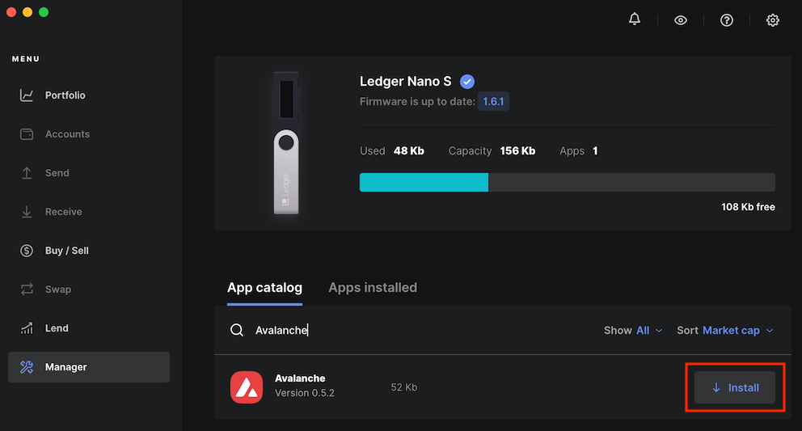
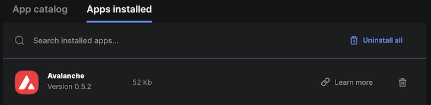
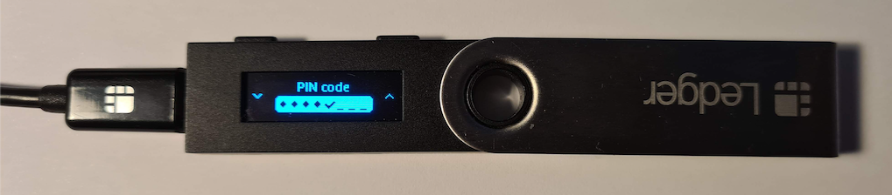
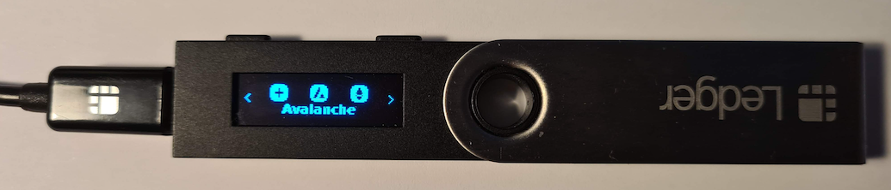
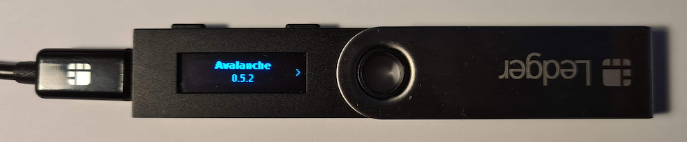
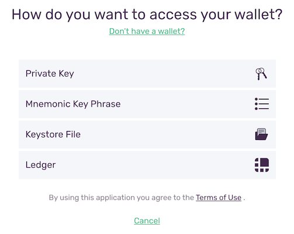
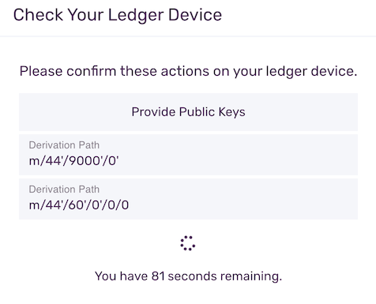
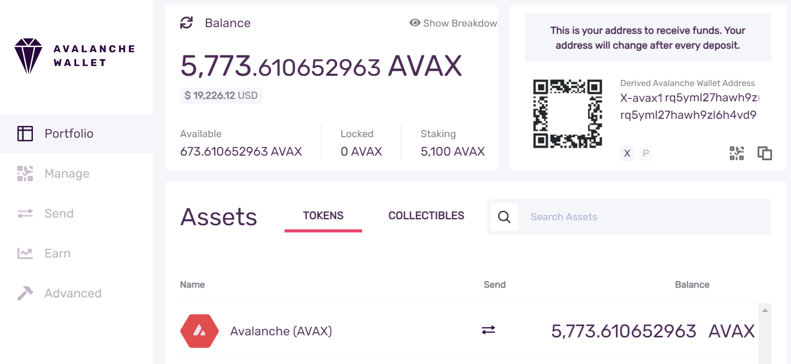
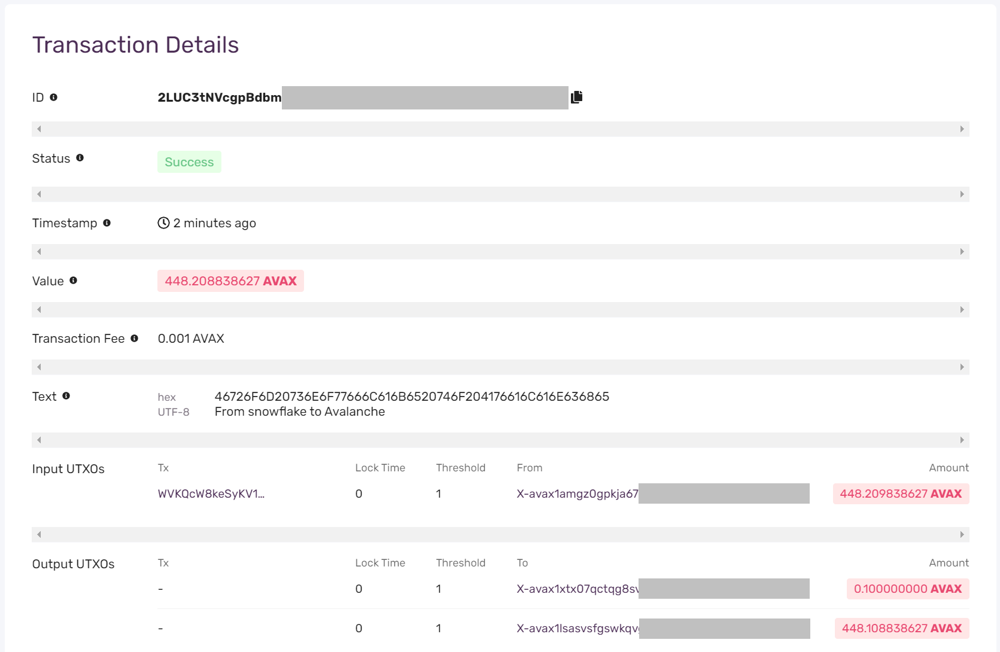

# Utilisez le Ledger Nano S ou Nano X avec Avalanche

La norme de l'industrie pour sécuriser en toute sécurité cryptocurrencies est des portefeuilles matériels, des dispositifs spécialisés qui fournissent l'isolement complet entre votre ordinateur et vos clés privées.

Si vous voulez utiliser l'adresse Avalanche que vous avez créée précédemment, vous devez utiliser la restauration de la procédure [de phrase de récupération](https://support.ledger.com/hc/en-us/articles/360005434914) à l'aide de la phrase mnémonique que vous avez obtenu du portefeuille Avalanche. Si vous configurez une nouvelle adresse, il suffit de suivre [la configuration](https://support.ledger.com/hc/en-us/articles/360000613793-Set-up-as-new-device) régulière comme nouvelle procédure de périphérique.

L'application portefeuille Avalanche Ledger est disponible via [Ledger Live](https://www.ledger.com/ledger-live).

## Comment configurer l'avalanche sur Ledger Live

Premièrement, vous aurez besoin d'installer [Ledger Live](https://www.ledger.com/ledger-live). Il y a un téléchargement pour MacOS, Windows et Linux ainsi que iOS et Android.

 Assurez-vous que vous avez la dernière version de l'application Ledger Live avant de procéder. Les versions plus anciennes peuvent ne pas afficher le dernier firmware du périphérique et la version d'application Avalanche. La dernière version de l'application Ledger Live au moment de l'écriture est 2.26.1. 

Après l'installation réussie de l'application. Allez dans l'onglet "Manager", et autoriser la gestion des appareils en appuyant sur les deux boutons sur l'appareil. Dans le champ de recherche Catalogue App entrez "Avalanche". Confirmez que l'application Avalanche est v0.5.2 \(ou plus\), et cliquez sur le bouton "Installer".

Vous pouvez confirmer que l'installation a été réussie en allant à l'onglet "Apps installés" où vous devriez voir Avalanche v0.5.2.

## Utilisez le portefeuille Avalanche avec Ledger

Une fois que vous avez l'application Avalanche, vous êtes en mesure d'interagir avec le [portefeuille](https://wallet.avax.network/) Avalanche via le Ledger. Cela inclut l'envoi sending jetons, NFT, swaps interchaînes ainsi que la mise en fuite ou la délégation.

Premièrement, pour accéder au portefeuille, branchez le ledger à votre ordinateur et entrez votre broche.

Si vous avez plus d'une application installée sur l'appareil, utilisez les boutons gauche et droit pour sélectionner l'application Avalanche:

Appuyez sur les deux boutons pour démarrer l'application. Vous devez atterrir sur l'écran de l'application "Avalanche" où vous pouvez confirmer que l'application est la version 0.5.2 \(ou plus\).

Après vous avoir confirmé que l'application Avalanche est en cours d'exécution puis sur la page d'accueil du portefeuille cliquez sur le bouton "Access Wallet".

Sur la suite "Comment voulez-vous accéder à votre portefeuille ?", cliquez sur le bouton "Ledger".

Vous serez maintenant invité à confirmer l'accès aux clés publiques de votre appareil Ledger. Cliquez sur le bouton droit à travers les invites sur l'appareil et sur le dernier écran confirmer en appuyant sur les deux boutons.

Vous aurez besoin de le faire deux fois, parce que différentes clés sont utilisées pour différentes chaînes. Si vous avez réussi, vous serez connecté au portefeuille et les soldes précédents seront affichés.

Pour transférer des fonds, allez à l'onglet "Envoyer" et collez une adresse Xdans le champ "Adresse". Définissez un montant et configurez éventuellement un mémo. Appuyez sur "Confirmer" puis sur le bouton "Envoyer la transaction".

Vous serez invité à confirmer l'action sur votre Ledger. Vérifiez que le hachage qui est affiché dans le portefeuille web correspond à ce qui est affiché sur votre Ledger. Si tout correspond alors en appuyant sur les deux boutons sur le dernier écran pour envoyer la transaction.

Vous pouvez cliquer sur l'icône pour rafraîchir votre solde et vous devriez le voir diminuer par le montant que vous venez d'envoyer et les frais de transaction.

Dans la colonne de droite, vous verrez votre dernière transaction. Cliquer sur l'icône de loupe ouvrira la transaction dans notre explorateur.

Enfin, vous devriez être en mesure de voir les détails de la transaction dans notre explorateur. Cela répertorie tout sur la transaction, y compris l'ID de transaction, le statut, lorsque la transaction a eu lieu, et toutes les informations relatives aux entrées et aux sorties.

## Plus d'outils à venir

Ava Labs est la construction de l'Internet des finances. Nous développons des solutions pour créer un monde sans friction en redéfinissant la manière dont les gens construisent et utilisent les applications financières. Une partie critique de cette infrastructure est un portefeuille matériel afin que les utilisateurs peuvent être totalement confiants que leurs clés privées et les pièces de monnaie sont complètement isolés de tous les acteurs potentiellement malveillants. Notre application Ledger nouvellement publiée le fait simplement en suivant les meilleures pratiques de l'industrie pour protéger les utilisateurs et les pièces de monnaie en sécurité et en sécurité.

