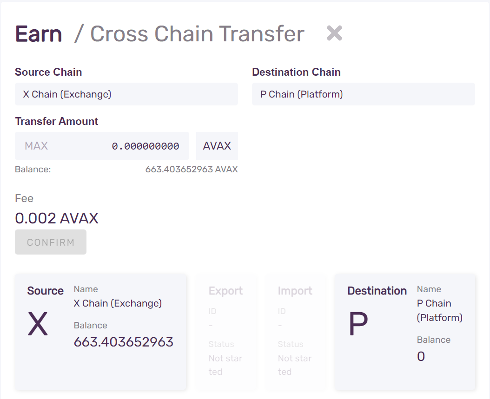
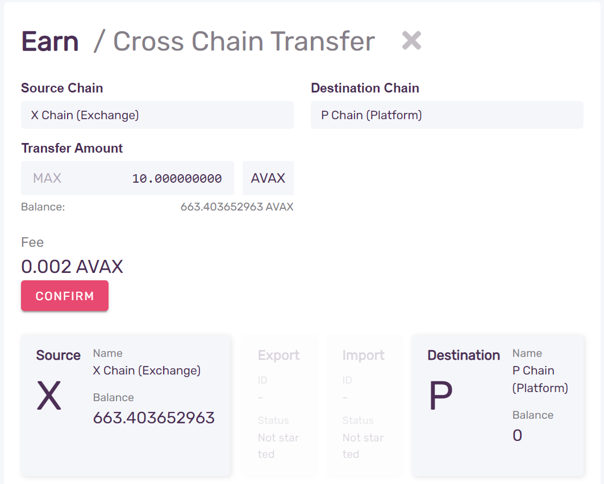
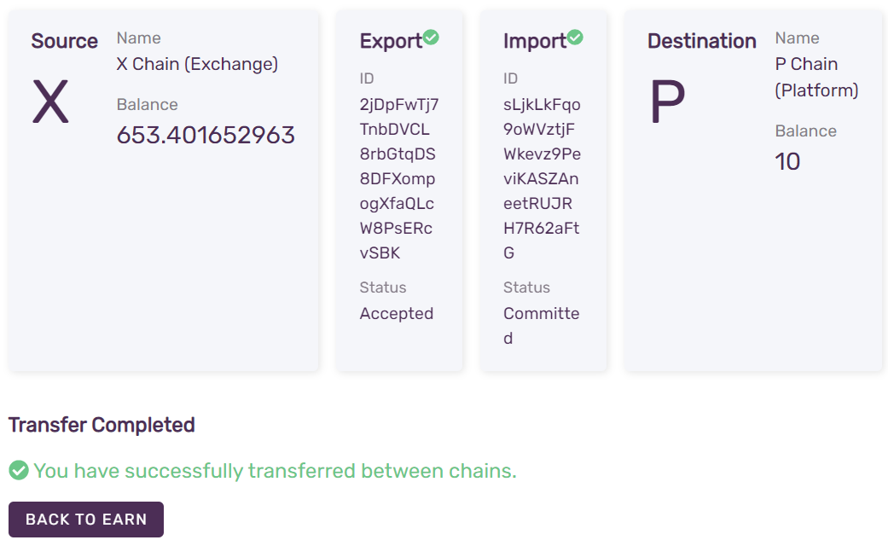

# X-ChainとP-Chain間でAVAXを転送する

## はじめに

AVAXトークンは、取引可能なX-Chain上、一次ネットワークを検証する際にステークとして提供できるP-Chain上、スマートコントラクトで使用するあるいはガス代を支払う C-Chain上に存在しています。Avalancheは、これらのチェーン間でのAVAXの移動をサポートしています。そして将来的には、Avalancheはチェーン間でのより一般的なアトミックスワップのサポートを予定しています。このチュートリアルでは、X-ChainとP-Chain間でAVAXトークンを送信します。

## 要件

[Getting Started（はじめに）](../nodes-and-staking/run-avalanche-node.md)を修了したので、[Avalancheのアーキテクチャ](../../../learn/platform-overview/)をよく理解されていることと思います。

AVAXを送信するには、AVAXがいくらか必要です。実際のAVAXを取得するには、取引所で購入することもできますし、[AVAX Test Faucet](https://faucet.avax-test.network)からテストネットAVAXを取得することもできます。後者は、Avalanche上で試してみるには無料で簡単な方法です。

## ウェブウォレットを使用してAVAXを転送する

チェーン間でAVAXを転送する最も簡単な方法は、[Avalancheウォレット](https://wallet.avax.network/)を使用することです。これは、AVAXにアクセスし、移行させる非管理かつ安全な方法です。

Avalancheウォレットのソースコードは、[ここ](https://github.com/ava-labs/avalanche-wallet)にあります。

### ステップ1 - Avalancheウォレットを開く


**Access Wallet**（ウォレットにアクセス）を選択し、自分のウォレットを入力します。メインのAvalancheネットワーク以外のネットワークにウォレットを接続させるには、**Mainnet**を選択し、接続するネットワークを選びます。

### ステップ2 - ウォレットにログインする

秘密鍵、ニーモニック鍵フレーズ、キーストアファイルあるいはLedger Nano Sを使用して、ウォレットにアクセスできます。


ログインに成功すると、残高、資産ポートフォリオや様々な情報が表示されます。

### ステップ3 - Cross Chain（クロスチェーン）タブに移動する


チェーン間でトークンを転送するための機能は、**Cross Chain**（クロスチェーン）タブにあります。

### ステップ4 - 転送する金額を入力する

**Source Chain**（送信元チェーン）と**Destination Chain**（送信先チェーン）の選択が表示されます。X-ChainとP-Chainをそれぞれ選択します。XとPでの残高と送信元から送信先チェーンへ転送する金額を入力するフィールドが表示されます。



X-ChainからP-Chainに転送する金額を入力します。

### ステップ5 - トランザクションを確認する



**Confirm**（確認）を押し、その後**Transfer**(転送）を押して、転送を開始します。

### ステップ6 - 完了しました。

クロスチェーン転送は2段階のプロセスで行われます。まずX-Chainから資金をエクスポートするトランザクション、そしてP-Chainにインポートするトランザクションです。ウォレットは両方を行い、実行中進捗を表示します。



完了です。AVAXは、X-ChainからP-Chainに転送されました。これで、Avalancheネットワーク上でAVAXを使用して検証またはデリゲートすることができます。

### P-ChainからX-Chainへの転送

AVAXをX-Chainに戻すには、逆の方向に転送を行う必要があります。

**Source**（送信元）と**Destination**(送信先）をドロップダウンメニューから選択し、送信元と送信先を入れ替えます。後のプロセスは同じです。金額を入力し、確認し、転送します。

## APIコールでのX-ChainからP-Chainへの転送

Avalancheネットワーク上でアプリケーションを構築している場合は、より広範な機能の一部としてプログラムによる転送を行うことを望まれるかもしれません。AvalancheGoノード上で適切なAPIを呼び出すことで可能です。このチュートリアルのここ以降では、AvalancheGoノード、X-Chain上のAVAXトークン、およびノードのキーストアで[作成](../../avalanchego-apis/keystore-api.md#keystorecreateuser)、保存されたユーザー認証情報にアクセスできることを前提にしています。

次のAPI呼び出しの例はすべて、ノードがローカルで実行されている（つまり`127.0.0.1`上でリスニングしている）ことを前提にしています。ノードは、メインネットワーク、テストネットワーク、またはローカルネットワークに接続することができます。それぞれのケースで、アドレスの形式を除き、API呼び出しとレスポンスは同じでなければなりません。ノードはローカルである必要はありません。他の場所でホスティングされているノードを呼び出すことも可能です。

Avalancheウォレットを使用してAVAXを転送する際に気づかれているかもしれませんが、クロスチェーン転送は2つのトランザクションオペレーションからなります。

* X-ChainからAVAXをエクスポートする
* P-ChainにAVAXをインポートする

### ステップ1 - X-ChainからAVAXをエクスポートする

AVAXをエクスポートするには、X-Chainの[`avm.export`](../../avalanchego-apis/exchange-chain-x-chain-api.md#avm-export)メソッドをassetID`AVAX`で呼び出します。

呼び出しは、次のようになります。

```cpp
curl -X POST --data '{
    "jsonrpc":"2.0",
    "id"     :1,
    "method" :"avm.export",
    "params" :{
        "to":"P-avax1wkmfja9ve3lt3n9ye4qp3l3gj9k2mz7ep45j7q",
        "assetID": "AVAX",
        "amount": 5000000,
        "changeAddr": "X-avax1turszjwn05lflpewurw96rfrd3h6x8flgs5uf8",
        "username":"myUsername",
        "password":"myPassword"
    }
}' -H 'content-type:application/json;' 127.0.0.1:9650/ext/bc/X
```

`to`に、ユーザーが管理するP-Chainのアドレスがあり、`changeAddr`は変更を送信するアドレスです。`changeAddr`は、空白のままにしておくこともできます。空白のままにしておくと、変更はユーザーが管理するアドレスに返されます。（新しいP-Chainのアドレスの作成手順は[ここ](../../avalanchego-apis/platform-chain-p-chain-api.md#platform-createaddress)を参照してください。）

エクスポートとインポートの両方にトランザクション手数料を支払うことに注意してください。ここでは、トランザクション手数料が`.001`AVAXであるとします。上記のエクスポートでは、`.006`AVAXが消費されます。そして`.005`はP-Chainに移動し、トランザクション手数料と`.001`してが使い果されます。

送信する額がトランザクション手数料を上回っていることを確認してください。さもなければ、AVAXをP-Chain上にインポートするときに、トランザクション手数料が消費され、結果P-Chain上のAVAXが_マイナス_になってしまいます。

レスポンスは、次のようになります。

```cpp
{
    "jsonrpc": "2.0",
    "result": {
        "txID": "MqEaeWc4rfkw9fhRMuMTN7KUTNpFmh9Fd7KSre1ZqTsTQG73h",
        "changeAddr": "X-avax1turszjwn05lflpewurw96rfrd3h6x8flgs5uf8",
    },
    "id": 1
}
```

このトランザクションが、[`avm.getTxStatus`](../../avalanchego-apis/exchange-chain-x-chain-api.md#avm-gettxstatus)を呼び出すことで受け入れられたことを検証することができます。

```cpp
curl -X POST --data '{
    "jsonrpc": "2.0",
    "method": "avm.getTxStatus",
    "params":{
        "txID":"MqEaeWc4rfkw9fhRMuMTN7KUTNpFmh9Fd7KSre1ZqTsTQG73h"
    },
    "id": 1
}' -H 'content-type:application/json;' 127.0.0.1:9650/ext/bc/X
```

これがトランザクションが受け入れられていることを示すものです。

```cpp
{
    "jsonrpc": "2.0",
    "result": {
        "status": "Accepted"
    },
    "id": 1
}
```

[`avm.getBalance`](../../avalanchego-apis/exchange-chain-x-chain-api.md#avm-getbalance)を呼び出して、AVAXがユーザーが保有するアドレスから差し引かれたことを確認することもできます。

```cpp
curl -X POST --data '{
    "jsonrpc":"2.0",
    "id"     :1,
    "method" :"avm.getBalance",
    "params" :{
        "address":"X-ADDRESSGOESHERE",
        "assetID":"AVAX"
    }
}' -H 'content-type:application/json;' 127.0.0.1:9650/ext/bc/X
```

差し引かれた額は、エクスポートされた額（この例では`.005`AVAX）にトランザクション手数料を加えた額です。ユーザーが複数のX-Chainアドレスを管理する場合、AVAXはそのいずれの組み合わせからでも送信される場合があります。

### ステップ2 - P-ChainにAVAXをインポートする

転送はまだ完了していません。転送を完了させるには、P-Chainの[`platform.importAVAX`](../../avalanchego-apis/platform-chain-p-chain-api.md#platform-importavax)メソッドを呼び出す必要があります。

呼び出しは、次のようになります。

```cpp
curl -X POST --data '{
    "jsonrpc": "2.0",
    "method": "platform.importAVAX",
    "params": {
        "to":"P-avax1wkmfja9ve3lt3n9ye4qp3l3gj9k2mz7ep45j7q",
        "sourceChain":"X",
        "changeAddr":"P-avax103y30cxeulkjfe3kwfnpt432ylmnxux8r73r8u",
        "username":"myUsername",
        "password":"myPassword",
    },
    "id": 1
}' -H 'content-type:application/json;' 127.0.0.1:9650/ext/bc/P
```

これによりトランザクションIDを返します。

```cpp
{
    "jsonrpc": "2.0",
    "result": {
        "txID": "2sxo3ySETZ4xzXqAtgsUvZ5pdkqG4SML4c7Z7NoKLZcp77YNXC",
        "changeAddr":"P-avax103y30cxeulkjfe3kwfnpt432ylmnxux8r73r8u"
    },
    "id": 1
}
```

トランザクションが受け入れられたことを確認することができます。

```cpp
curl -X POST --data '{
    "jsonrpc":"2.0",
    "id"     :1,
    "method" :"avm.getTxStatus",
    "params" :{
        "txID":"2sxo3ySETZ4xzXqAtgsUvZ5pdkqG4SML4c7Z7NoKLZcp77YNXC"
    }
}' -H 'content-type:application/json;' 127.0.0.1:9650/ext/bc/X
```

これは、`Committed`となり、転送が完了したことを意味します。アドレスの残高を確認することもできます。

```cpp
curl -X POST --data '{
    "jsonrpc": "2.0",
    "method": "platform.getBalance",
    "params":{
        "address":"P-avax1wkmfja9ve3lt3n9ye4qp3l3gj9k2mz7ep45j7q"
    },
    "id": 1
}' -H 'content-type:application/json;' 127.0.0.1:9650/ext/bc/P
```

レスポンスは、次のようになります。

```cpp
{
    "jsonrpc": "2.0",
    "result": {
        "balance": "4000000",
        "utxoIDs": [
            {
                "txID": "2sxo3ySETZ4xzXqAtgsUvZ5pdkqG4SML4c7Z7NoKLZcp77YNXC",
                "outputIndex": 0
            }
        ]
    },
    "id": 1
}
```

表示されている残高が、X-Chain（`.004`AVAX）からエクスポートされた金額からトランザクション手数料（この例`.001`ではAVAX）をマイナスしたものであることにご注意ください。これで、P-Chainアドレスで保有しているAVAXを使用してPrimary Networkを検証するためにステークを提供することができます。

## P-ChainからX-Chainにプログラムで転送する

さて、P-ChainからX-ChainにAVAXを移動してみましょう。

上記で説明したように、これは、2つのトランザクション操作です。

* P-Chainからエクスポートする
* X-Chainにインポートする

### ステップ1 - P-ChainからAVAXをエクスポートする

これを行うのに、[`platform.exportAVAX`](../../avalanchego-apis/platform-chain-p-chain-api.md#platform-exportavax)を呼び出します。

```cpp
curl -X POST --data '{
    "jsonrpc": "2.0",
    "method": "platform.exportAVAX",
    "params": {
        "to":"X-avax1fjn5rffqvny7uk3tjegjs6snwjs3hhgcpcxfax",
        "amount":3000000,
        "changeAddr":"P-avax103y30cxeulkjfe3kwfnpt432ylmnxux8r73r8u",
        "username":"myUsername",
        "password":"myPassword"
    },
    "id": 1
}' -H 'content-type:application/json;' 127.0.0.1:9650/ext/P
```

`to`に、AVAXの送信先となるX-Chainアドレスがあります。

これによりトランザクションIDを返します。そして、別の[`platform.getTxStatus`](../../avalanchego-apis/platform-chain-p-chain-api.md#platform-gettxstatus)への呼び出しでトランザクションがコミットされたことを確認します。繰り返しになりますが、送信する額がトランザクション手数料を上回ることを確認してください。

### ステップ2 - X-ChainにAVAXをインポートする

P-ChainからX-Chainへの転送を完了させるには、[`avm.import`](../../avalanchego-apis/exchange-chain-x-chain-api.md#avm-import)を呼び出します。

```cpp
curl -X POST --data '{
    "jsonrpc":"2.0",
    "id"     :1,
    "method" :"avm.import",
    "params" :{
        "to":"X-avax1fjn5rffqvny7uk3tjegjs6snwjs3hhgcpcxfax",
        "sourceChain":"P",
        "changeAddr": "X-avax1turszjwn05lflpewurw96rfrd3h6x8flgs5uf8",
        "username":"myUsername",
        "password":"myPassword"
    }
}' -H 'content-type:application/json;' 127.0.0.1:9650/ext/bc/X
```

`to`は、[`platform.exportAVAX`](../../avalanchego-apis/platform-chain-p-chain-api.md#platform-exportavax)への呼び出しで指定した同じアドレスであることに注意してください。

前述のように、[`avm.getBalance`](../../avalanchego-apis/exchange-chain-x-chain-api.md#avm-getbalance)を呼び出して、資金を受け取ったことを確認することができます。残高がトランザクション手数料を差し引いた`.003`AVAX増えているはずです。

## まとめ

完了です。これで、Avalancheウォレットを使用してと、Avalancheノード上の適切なAPIコールを呼び出すことで、X-ChainとP-Chain間でAVAXを交換することができるようになりました。

これで、P-Chain上のトークンを使用して、一次ネットワーク上で[バリデータとしてノードを追加する追加する](../nodes-and-staking/add-a-validator.md)ことができます。

