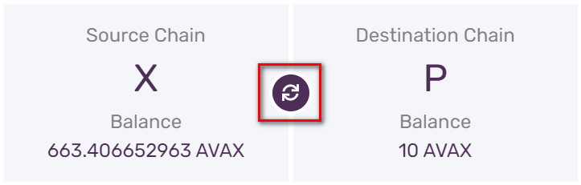

# Transfer AVAX Between X-Chain and P-Chain

## Introduction

AVAX tokens exist on the X-Chain, where they can be traded, on the P-Chain, where they can be provided as a stake when validating the Primary Network, and on the C-Chain, where they can be used in smart contracts or to pay for gas. Avalanche supports **atomic swaps** of AVAX between the X-Chain and P-chain \(in the future, Avalanche will support more generic atomic swaps between chains\). In this tutorial, we’ll send AVAX tokens between the X-Chain and P-Chain.

## Requirements

You've completed [Getting Started](../../getting-started.md) and are familiar with [Avalanche's architecture](../../../learn/platform-overview/).

In order to send AVAX, you need to have some AVAX! You can get real AVAX by exchanging them on exchanges. You can get test net AVAX from the [AVAX Test Faucet](https://faucet.avax-test.network), which is a free and easy way to get to play around with the technology.

## Transferring AVAX using the web wallet

The easiest way to transfer AVAX between chains is to use [the Avalanche Wallet](https://wallet.avax.network/) which is a non-custodial and secure way to access and move AVAX.

The Avalanche Wallet source code can be found [here](https://github.com/ava-labs/avalanche-wallet).

### Step 1 - Open the Avalanche Wallet


Select **Access Wallet** to enter, or **Mainnet** if you wish to switch to test or local network.

### Step 2 - Login to your wallet

You can access your wallet using the private key, mnemonic key phrase, keystore file or Ledger Nano S.


After a successful login you will see your balance, assets portfolio and various other information.

### Step 3 - Go to **Earn** tab


Functionality for transferring tokens between chains is on the "Earn" tab.

### Step 4 - Cross chain transfer

On the **Earn** tab are various operations for becoming a validator, delegating your tokens and other related functions. 


Select Cross Chain Transfer.

### Step 5 - Enter amount To transfer

You will be presented with your X and P balances, and an input field for entering the amount to transfer from source to destination chain.


Enter the amount you wish to transfer from X to P chain.

### Step 6 - Confirm the transaction


Press Confirm, and then Transfer to initiate the transfer:


### Step 7 - Transfer

Cross chain transfer is a two step process: export from X, import to P. Wallet will carry out both transactions, and show you the progress while doing it. 


And that's it, you've transferred AVAX from X to P Chain! Now you can use them to validate or delegate on the Avalanche network.

### Transfer from P-Chain to X-Chain

To return the AVAX back to X chain, you need to do the transfer in the opposite direction.



Swap source and destination chain, by pressing the highlighted icon. The rest of the process is the same, just repeat Steps 5 to 7.

## Transferring from X-Chain to P-Chain programmatically

If you're building applications on the Avalanche network, you might want to do the transfer programmatically, as a step in some bigger functionality. You can do that by calling the appropriate APIs on AvalancheGo node or an API server. The rest of the tutorial assumes you have access to AvalancheGo node or an API server, some tokens on the X chain, and user credentials [created](../../avalanchego-apis/keystore-api.md#keystorecreateuser) and stored in the node's keystore.

All the presented API calls are shown using the node hosted locally \(127.0.0.1\). Node itself can be on the main network, on the test network or on a local network. In each case, the API calls and responses should be the same, except for the address formats. Node itself need not be local, we can use a node elsewhere on the internet, as long as it's accessible. It can even be an API server form an online service.

As you may have noticed while transferring AVAX using the Avalanche Wallet, cross chain transfer is a two transaction operation:
* export from X chain
* import to P chain

### Step 1 - Export AVAX from X-Chain

To export AVAX, call the X-Chain’s [`avm.exportAVAX`](../../avalanchego-apis/exchange-chain-x-chain-api.md#avm-exportavax) method.

Your call should look like this:

```cpp
curl -X POST --data '{
    "jsonrpc":"2.0",
    "id"     :1,
    "method" :"avm.exportAVAX",
    "params" :{
        "to":"P-avax1wkmfja9ve3lt3n9ye4qp3l3gj9k2mz7ep45j7q",
        "destinationChain": "P",
        "amount": 5000000,
        "changeAddr": "X-avax1turszjwn05lflpewurw96rfrd3h6x8flgs5uf8",
        "username":"myUsername",
        "password":"myPassword"
    }
}' -H 'content-type:application/json;' 127.0.0.1:9650/ext/bc/X
```

where `to` is the address of a P-Chain address you hold and `changeAddr` is the address to send any change to. You can leave `changeAddr` blank; if you leave it blank, change will be returned to an address controlled by your user \(see [here](../../avalanchego-apis/platform-chain-p-chain-api.md#platform-createaddress) for instructions on creating a new P-Chain address\).

Note that you will pay a transaction fee for both the export and import operations. In this example, let’s assume the transaction fee is `1,000,000` nAVAX. Then, the above export actually consumes `6,000,000` nAVAX; `5,000,000` goes to the P-Chain and `1,000,000` is burned as a transaction fee.

Make sure that the amount that you’re sending exceeds the transaction fee. Otherwise, when you import AVAX on the P-Chain, it will consume the transaction fee, and you’ll end up with _less_ AVAX on the P-Chain.

The response should look like this:

```cpp
{
    "jsonrpc": "2.0",
    "result": {
        "txID": "MqEaeWc4rfkw9fhRMuMTN7KUTNpFmh9Fd7KSre1ZqTsTQG73h",
        "changeAddr": "X-avax1turszjwn05lflpewurw96rfrd3h6x8flgs5uf8",
    },
    "id": 1
}
```

We can verify that this transaction was accepted by calling [`avm.getTxStatus`](../../avalanchego-apis/exchange-chain-x-chain-api.md#avm-gettxstatus):

```cpp
curl -X POST --data '{
    "jsonrpc": "2.0",
    "method": "avm.getTxStatus",
    "params":{
        "txID":"MqEaeWc4rfkw9fhRMuMTN7KUTNpFmh9Fd7KSre1ZqTsTQG73h"
    },
    "id": 1
}' -H 'content-type:application/json;' 127.0.0.1:9650/ext/bc/X
```

Which shows our transaction is accepted:

```cpp
{
    "jsonrpc": "2.0",
    "result": {
        "status": "Accepted"
    },
    "id": 1
}
```

We can also call [`avm.getBalance`](../../avalanchego-apis/exchange-chain-x-chain-api.md#avm-getbalance) to check that the AVAX was deducted from an address held by our user:

```cpp
curl -X POST --data '{
    "jsonrpc":"2.0",
    "id"     :1,
    "method" :"avm.getBalance",
    "params" :{
        "address":"X-ADDRESSGOESHERE",
        "assetID":"AVAX"
    }
}' -H 'content-type:application/json;' 127.0.0.1:9650/ext/bc/X
```

The amount deducted is the exported amount \(`5,000,000` in this example\) plus the transaction fee. If your user controls multiple X-Chain addresses, AVAX may have been sent from any combination of them.

### Step 2 - Import AVAX to P-Chain

Our transfer isn’t done just yet. We need to call the P-Chain’s [`platform.importAVAX`](../../avalanchego-apis/platform-chain-p-chain-api.md#platform-importavax) method to finish the transfer.

Your call should look like this:

```cpp
curl -X POST --data '{
    "jsonrpc": "2.0",
    "method": "platform.importAVAX",
    "params": {
        "to":"P-avax1wkmfja9ve3lt3n9ye4qp3l3gj9k2mz7ep45j7q",
        "sourceChain":"X",
        "changeAddr":"P-avax103y30cxeulkjfe3kwfnpt432ylmnxux8r73r8u",
        "username":"myUsername",
        "password":"myPassword",
    },
    "id": 1
}' -H 'content-type:application/json;' 127.0.0.1:9650/ext/bc/P
```

This returns the transaction ID:

```cpp
{
    "jsonrpc": "2.0",
    "result": {
        "txID": "2sxo3ySETZ4xzXqAtgsUvZ5pdkqG4SML4c7Z7NoKLZcp77YNXC",
        "changeAddr":"P-avax103y30cxeulkjfe3kwfnpt432ylmnxux8r73r8u"
    },
    "id": 1
}
```

We can check that the transaction was accepted with:

```cpp
curl -X POST --data '{
    "jsonrpc":"2.0",
    "id"     :1,
    "method" :"avm.getTxStatus",
    "params" :{
        "txID":"2sxo3ySETZ4xzXqAtgsUvZ5pdkqG4SML4c7Z7NoKLZcp77YNXC"
    }
}' -H 'content-type:application/json;' 127.0.0.1:9650/ext/bc/X
```

It should be `Committed`, meaning the transfer is complete. We can also check the balance of the address with:

```cpp
curl -X POST --data '{
    "jsonrpc": "2.0",
    "method": "platform.getBalance",
    "params":{
        "address":"P-avax1wkmfja9ve3lt3n9ye4qp3l3gj9k2mz7ep45j7q"
    },
    "id": 1
}' -H 'content-type:application/json;' 127.0.0.1:9650/ext/bc/P
```

The response should look like this:

```cpp
{
    "jsonrpc": "2.0",
    "result": {
        "balance": "4000000",
        "utxoIDs": [
            {
                "txID": "2sxo3ySETZ4xzXqAtgsUvZ5pdkqG4SML4c7Z7NoKLZcp77YNXC",
                "outputIndex": 0
            }
        ]
    },
    "id": 1
}
```

Note that the balance we see is the amount exported from the X-Chain \(`5,000,000`\) less the transaction fee \(`1,000,000` in this example\). Now, we can use the AVAX held by this P-Chain address to provide a stake in order to validate the Primary Network.

## Transferring from P-Chain to X-Chain programmatically

Now, let’s move AVAX on the P-Chain back to the X-Chain.

Same as before, this is also a two transaction operation:
* export from P chain
* import to X chain

### Step 1 - Export AVAX from P-Chain

To do so, call [`platform.exportAVAX`](../../avalanchego-apis/platform-chain-p-chain-api.md#platform-exportavax):

```cpp
curl -X POST --data '{
    "jsonrpc": "2.0",
    "method": "platform.exportAVAX",
    "params": {
        "to":"X-avax1fjn5rffqvny7uk3tjegjs6snwjs3hhgcpcxfax",
        "amount":3000000,
        "changeAddr":"P-avax103y30cxeulkjfe3kwfnpt432ylmnxux8r73r8u",
        "username":"myUsername",
        "password":"myPassword"
    },
    "id": 1
}' -H 'content-type:application/json;' 127.0.0.1:9650/ext/P
```

where `to` is the X-Chain address the AVAX is being sent to.

This returns the transaction ID, and we can check that the transaction was committed with another call to [`platform.getTxStatus`](../../avalanchego-apis/platform-chain-p-chain-api.md#platform-gettxstatus). Again, make sure that the amount you’re sending exceeds the transaction fee.

### Step 2 - Import AVAX to X-Chain

To finish our transfer from the P-Chain to the X-Chain, call [`avm.importAVAX`](../../avalanchego-apis/exchange-chain-x-chain-api.md#avm-importavax):

```cpp
curl -X POST --data '{
    "jsonrpc":"2.0",
    "id"     :1,
    "method" :"avm.importAVAX",
    "params" :{
        "to":"X-avax1fjn5rffqvny7uk3tjegjs6snwjs3hhgcpcxfax",
        "sourceChain":"P",
        "changeAddr": "X-avax1turszjwn05lflpewurw96rfrd3h6x8flgs5uf8",
        "username":"myUsername",
        "password":"myPassword"
    }
}' -H 'content-type:application/json;' 127.0.0.1:9650/ext/bc/X
```

Note that `to` is the same address specified in our call to [`platform.exportAVAX`](../../avalanchego-apis/platform-chain-p-chain-api.md#platform-exportavax).

Just as before, we can call [`avm.getBalance`](../../avalanchego-apis/exchange-chain-x-chain-api.md#avm-getbalance) to verify the funds were received. The balance should have increased by `3,000,000` minus the transaction fee.

## Wrapping Up

That’s it! Now, you can swap AVAX back and forth between the X-Chain and P-Chain, both by using the Avalanche Wallet, and by calling the appropriate API calls on the network node.

The next step would be to use the tokens deposited on the the P chain to [add a node as a validator](../nodes-and-staking/add-a-validator.md) on the Primary Network.