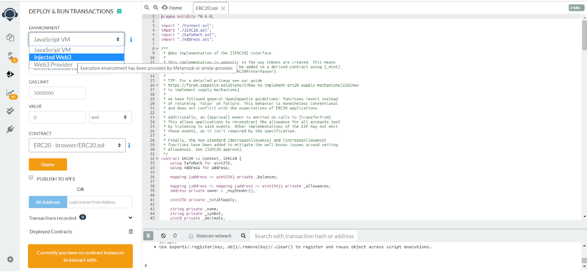
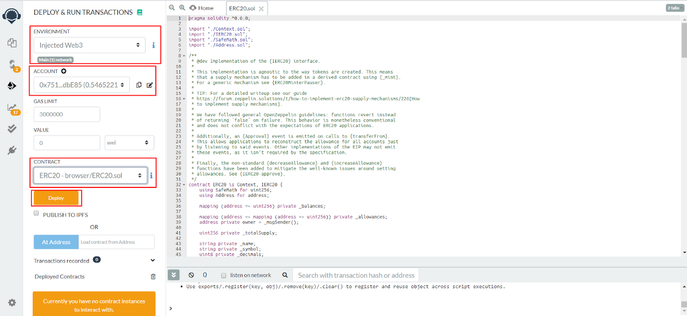
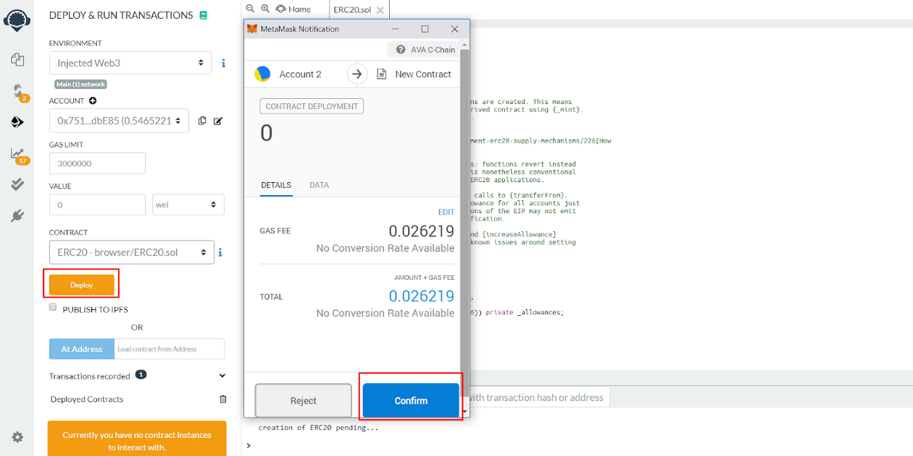
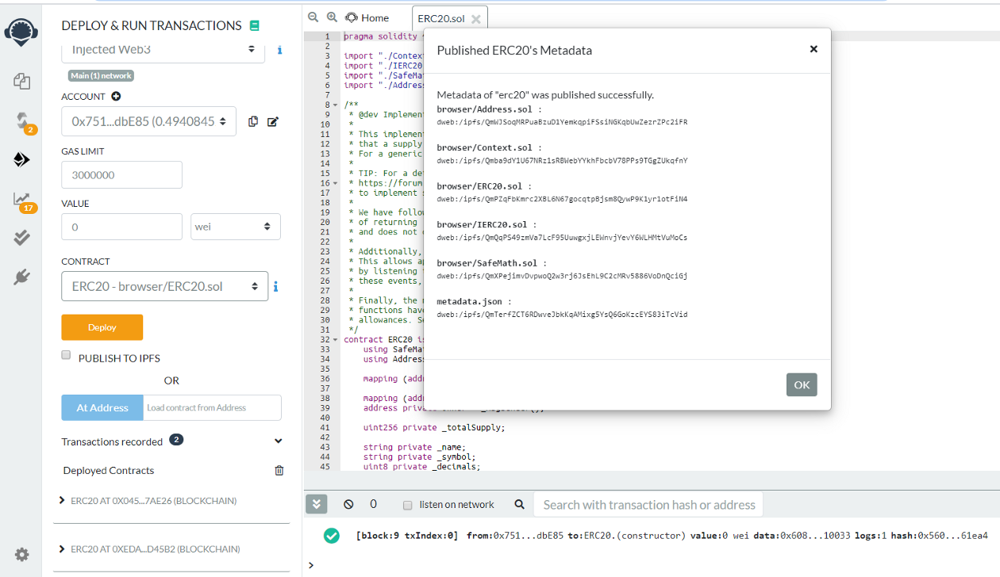
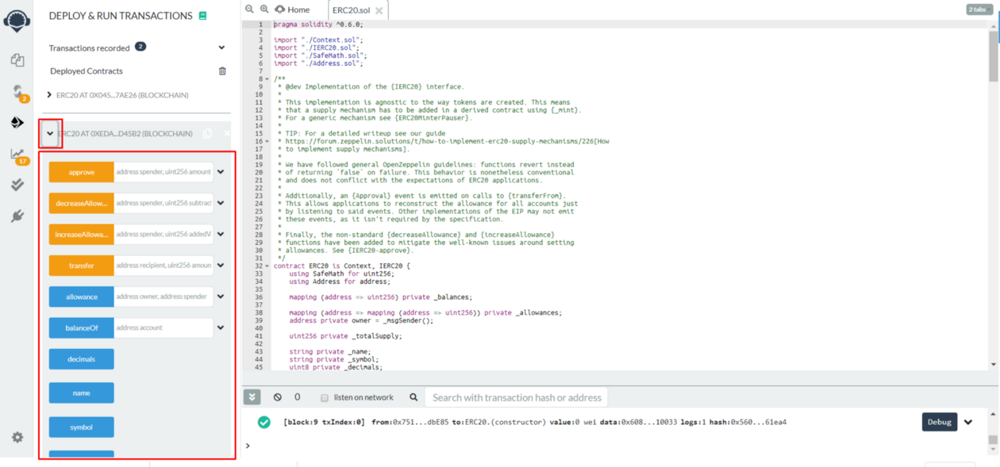
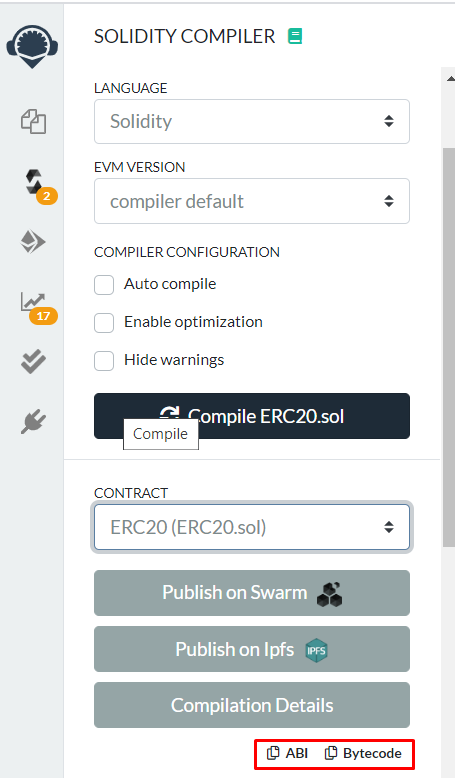

# RemixとMetaMaskを使用してAvalanche上にスマートコントラクトを展開します

## はじめに

Avalancheのプライマリネットワークは、P-Chain、X-Chain、C-Chainの3つのチェーンを持つサブネットです。C-Chainは、AvalancheのSnowmanコンセンサスプロトコルにより可能になるイーサリアムバーチャルマシンのインスタンスです。[C-Chain RPC](../../avalanchego-apis/contract-chain-c-chain-api.md)は、イーサリアム標準のRPC呼び出しを使用することにより、典型的なイーサリアムクライアントができることはできます。イーサリアムではなくC-Chainを使用する際のメリットは、Avalancheを使用する際にメリットです。DAppsとユーザーエクスペリエンスを大幅に向上させることができるこれらのプロパティ。

本日、RemixとMetaMaskを使用してAvalanche上にスマートコントラクトを展開、テストします。

## ステップ 1: MetaMaskをセットアップ

MetaMaskにログイン ->ネットワークドロップダウンをクリックする ->カスタムRPCを選択する

#### **Avalancheメインネット設定：**

* **ネットワーク名**：AvalancheメインネットC-Chain
* **新しいRPC URL**：[https://api.avax.network/ext/bc/C/rpc](https://api.avax.network/ext/bc/C/rpc)
* **ChainID**：`43114`
* **シンボル**：`AVAX`
* **エクスプローラ**：[https://cchain.explorer.avax.network/](https://cchain.explorer.avax.network/)

#### **FUJIテストネット設定：**

* **ネットワーク名**：Avalanche FUJI C-Chain
* **新しいRPC URL**：[https://api.avax-test.network/ext/bc/C/rpc](https://api.avax-test.network/ext/bc/C/rpc)
* **ChainID**：`43113`
* **シンボル**：`AVAX`
* **エクスプローラ**：[https://cchain.explorer.avax-test.net](https://cchain.explorer.avax-test.network/)

#### **ローカルテストネット（AVASH）設定：[（Avashチュートリアル）](../../tools/avash.md)**

* **ネットワーク名**:Avalancheローカル
* **新しいRPC URL:[http://localhost:9650/ext/bc/C/rpc](http://localhost:9650/ext/bc/C/rpc)**
* **ChainID**：`43112`
* **シンボル**：`AVAX`
* **エクスプローラ**：なし

## ステップ 2：C-Chainアドレスを資金調達する

### **Avalancheウォレットを使用する**

メインネット上で、[Avalancheウォレット](https://wallet.avax.network/)を使用して、X-ChainからC-Chainアドレスに資金を送金することができます。この[チュートリアル](../platform/transfer-avax-between-x-chain-and-c-chain.md)で説明したように、プロセスはシンプルウォレットは、テストやローカルネットワーク上でも使用できます。

### **テストネットワークフォーセットを使用する**

テストネットワーク上で資金を提供するには、テストネットワークコーセットを使用することができます。[https://faucet.avax-test.network/](https://faucet.avax-test.network/)に移動し、C-Chainアドレスを貼り付けます。Faucetは、AVAXをC-Chainに送信する必要があることを自動的に知ることができます。captchaチェックボックスをクリックし、「AVAXを要求する」ボタンを選択します。アドレスは、数秒でAVAXテストを受け取ります。

### ローカルテストネット上で資金を提供

ローカルネットワーク上で、[これ](../platform/create-a-local-test-network.md#getting-avax)に従うことで簡単にアドレスを資金調達ができます。

## ステップ3：MetaMaskを接続し、Remixを使用してスマートコントラクトを展開します。

[オープンリミックス](https://remix.ethereum.org/) ->Solidityを選択

Remixファイルエクスプローラを使用して、コンパイル、デプロイをしたいスマートコントラクトをロードしたり作成したりします。

この例では、[OpenZeppelin](https://openzeppelin.com/contracts)からERC20コントラクトを展開します。

Deploy Tabに移動します。 -> "環境"ドロップダウンを開き、インジェクションWeb3を選択します（MetaMaskがロードされていることを確認してください）。

web3-> インジェクションが完了したら、コンパイラに戻り、選択したコントラクトをコンパイルします。 -> デプロイタブに移動します。

スマートコントラクトがコンパイルされ、MetaMaskがインジェクションされ、ERC20を展開する準備が完了しました。「デプロイ.」をクリックします。

MetaMaskポップアップ上のトランザクションを確認します。

我々のコントラクトが正常に展開されました！

現在、「デプロイされたコントラクト」タブから選択し、テストアウトすることで展開できます。

コントラクトABIとBytecodeは、コンパイラタブで利用可能です。

このチュートリアルの後で困難が発生した場合、あるいはAvalancheと話し合いたい場合、[Discord](https://chat.avalabs.org/)で我々のコミュニティに参加することができます！

