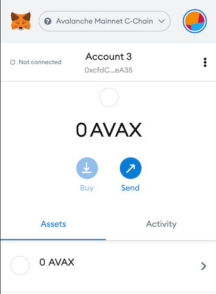
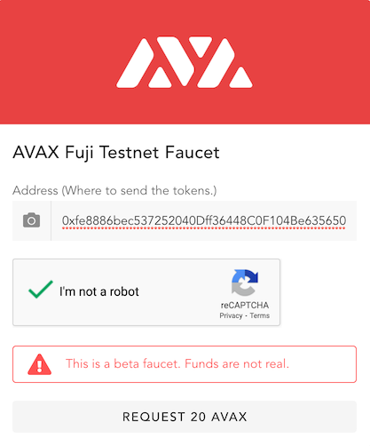

# ERC-20トークンを作成する

ERC-20トークンは、Ethereumの最も基本的かつ本質的なコンセプトです。Avalancheコミュニティとエコシステムが成長するにつれ、Ethereumや他のチェーンで実行されている新しいユースケースやプロジェクトがAvalancheに実装されます。このプロジェクトで使用されるトークンのスタンダードは、特定のものではなく、誰もが自分のスタンダード、自分のトークンを作ることが可能です。

したがって、独自のミント可能なERC-20トークンを作成し、それを任意のアドレスにミントすることになります。トークンはAvalanche  C-Chainで生成され、そのチェーン上でアクセスできます。

主に考慮しておかなければならないのは、Solidityで書かれたスマートコントラクトをAvalancheにデプロイすることです。これは、Avalancheがいかなるスマートコントラクトもチェーンにデプロイすることを可能にする機能であり、新しい言語固有のコントラクトコンセプトをやり取りする必要はありません。ERC-20コントラクトを作成し、Avalanche  C-Chainにデプロイする方法を見てみましょう。

## Metamaskを設定する

まず設定するのは、metamaskウォレットです。


ブラウザ上にあるmetamaskアイコンをクリックし、「ネットワーク」ドロップダウンメニューを選択します。ここでは、 C-Chainに接続します。「Custom RPC」をクリックします。


まず、これらのボックスに正しい値を設定する必要があります。

* **Network Name（ネットワーク名）**：Avalanche C-Chain
* **New RPC URL（新しいRPC URL）**：
   * **Mainnet：** [https://api.avax.network/ext/bc/C/rpc](https://api.avax.network/ext/bc/C/rpc)
   * **Fuji Testnet：** [https://api.avax-test.network/ext/bc/C/rpc](https://api.avax-test.network/ext/bc/C/rpc)
   * **Local Testnet（ローカルテストネット）：** [http://localhost:9650/ext/bc/C/rpc](http://localhost:9650/ext/bc/C/rpc)
* **ChainID**：
   * **Mainnet:** `43114`
   * **Fuji Testnet:** `43113`
   * **Local Testnet（ローカルテストネット）：** `43112`
* **Symbol（シンボル）**： AVAX
* **Explorer（エクスプローラー）**：
   * **Mainnet：** [https://cchain.explorer.avax.network](https://cchain.explorer.avax.network/)
   * **Fuji Testnet：** [https://cchain.explorer.avax-test.network](https://cchain.explorer.avax-test.network/)
   * **Localnet（ローカルネット）：** n/a



全てのパラメータを正しく設定すると、このページが表示されます。現在、0 AVAXを持っています。

##  C-Chainアドレスに資金を入れる

使用するネットワークにより、 C-Chainアドレスへの資金の入金には3つの方法があります。

### **Avalancheウォレットを使用する**

Mainnetでは、[Avalancheウォレット](https://wallet.avax.network/)を使用して、X-Chainから C-Chainアドレスに資金を転送することができます。この[チュートリアル](../platform/transfer-avax-between-x-chain-and-c-chain.md)で説明されているように、プロセスはシンプルです。ウォレットは、テストネットワークやローカルネットワークでも使用できます。

### **Test Network Faucetを使用する**

テストネットワーク上に資金を入れるには、Test Network Faucetを使用することもできます。[https://faucet.avax-test.network/](https://faucet.avax-test.network/)に移動し、 C-Chainアドレスを貼り付けます。

### ローカルテストネット上に資金を入れる

ローカルネットワークでは、自分のフォーセットをデプロイすることで、簡単に自分のアドレスに資金を入れることができます。[チュートリアル](https://medium.com/avalabs/the-ava-platform-tools-pt-2-the-ava-faucet-48f28da57146)

[AVAXのフォーセット](https://faucet.avax-test.network/)にアクセスし、C-Chainアドレス、例えば「0xfe8886bec537252040Dff36448C0F104Be635650」を貼り付けましょう。



ここにアドレスをコピーして貼り付けた後、「REQUEST 20 AVAX（20AVAXを要求）」をクリックします。このテストフォーセットトークンに価値はありません。開発目的のためだけのものです。

ここで、自分のウォレットの残高を確認してください。自身のmetamask上にいくらかのトークンがあるはずです。

## ミント可能なトークンを作成する

ここで、Remix上にミント可能なトークンを作成できます。自分のブラウザでRemixを開くか、[このリンク](https://remix.ethereum.org/#optimize=false&evmVersion=null&version=soljson-v0.6.6+commit.6c089d02.js)に移動します。


このページが表示されます。このページで、まず｢Featured Plugins」から「SOLIDARITY」をクリックします。そして「New File」ボタンをクリックします。「New File」ボタンをクリックすると、ファイル名を要求するポップアップが現れます。名前を入力するか、デフォルトのままにしておくかを選びます。

[OpenZeppelin](https://openzeppelin.com/contracts/)からERC-20コントラクトを使用するため、この行をファイルに貼り付け、保存します。

```javascript
import "https://github.com/OpenZeppelin/openzeppelin-contracts/blob/master/contracts/token/ERC20/presets/ERC20PresetMinterPauser.sol";
```


ファイルを保存した後、Remixにインポートされたファイルのグループが表示されます。これはremixの機能です。これにより、インポートステートメントと共にURL-Link.を指定して、GitHubコントラクトリポジトリをremixにインポートすることができます


ERC20PresetMinterPauser.solファイルがプリセットに含まれています。このファイルは、ミンター機能を備えたERC20標準に従って、OpenZeppelinによって書き込まれます。このファイルをデプロイした後、我々はコントラクトの所有者になり、トークンをミントする権限と機能をもつことになります。


## コントラクトをデプロイする

2番目のタブ「SOLIDITY COMPILER」を開き、「pragma solidity...」としてファイルに書かれたsolidityバージョンと一致するsolidityバージョンを選択します。バージョンは、ファイルのバージョンと同等かそれ以降である必要があります。例えば、ファイルに「pragma solidity ^0.6.0」と書かれているなら、必要なバージョンは0.6.0以降です。表示されているように、コンパイラのsolidityバージョンは、0.6.6なので、OKです。solidityのバージョンを確認した後、「Compile（コンパイル）」ボタンを押します。ファイルに何も変更していない、あるいはsolidityバージョンが間違っていない場合は、コントラクトはエラーを起こさずコンパイルされます。


次に、3つ目の「DEPLOY & RUN TRANSACTION」のタブに移動ましょう。ここでは、コントラクトをデプロイする前に、環境を変更する必要があります。「ENVIRONMENT（環境）」をクリックし、「Injected Web3」を選択します。ポップアップが表示され、アカウントを接続するよう求められた場合は、クリックして接続します。その後、「ACCOUNT（アカウント）」テキストボックスにアカウントアドレスが表示されます。

デプロイメントプロセスの前、最後にすべきことは、トークンとしてデプロイするコントラクトの設定です。「Deploy（デプロイ）」ボタンの上に、コントラクトを選択するドロップダウンメニューがあります。「ERC20PresetMinterPauser.sol」という名前のコントラクトを選択します。


さて、ここで自分のトークンの名前とシンボルを入力します。名前を「test」とし、シンボルは「tst」としてみます。それを入力し、「transact（取引）」ボタンをクリックします。


ボタンをクリックすると、ポップアップが表示されます。確認してください。


そのあと、別のポップアップ、metamaskの確認が表示されます。「Confirm（確認）」します。

これらすべてのポップアップを確認すると、トークンがAvalanche  C-Chainにデプロイされています。これで、やり取りを始めることができます。

## トークンとのやり取りを行う

この[ C-Chainエクスプローラ](https://cchain.explorer.avax-test.network/)を介してavalanche  C-Chainにデプロイされたトランザクションを見ることができます

しかし、まず、Remixコンソールからトランザクションハッシュを見てみましょう。


コントラクトをデプロイした後、remixコンソールでログが表示されます。矢印をクリックして展開すると、トランザクションハッシュが表示されます。それをコピーします。


トランザクションハッシュを、上記でシェアした[エクスプローラ](https://cchain.explorer.avax-test.network/)に貼り付け、「Enter（入力）」を押します。


ここでトランザクションとトークンコントラクトのすべての詳細が確認できます。


最初のアドレスは、トークンを作成するウォレットアドレスで、2番目のアドレスは、「test」と名付けたトークンコントラクトアドレスです。さあ、自分のアドレスにトークンをミントしましょう。


remixに戻り、デプロイした後「Deployed Contracts」セクションでコントラクトを確認することができます。

ここには、トークンコントラクトとやり取りするために使用できる多くの機能があります。OpenZeppelinのドキュメントで、これらのメソッドすべてを確認して、使用方法を確認することができます。しかしここでは、ミントメソッドのみを使います。

「mint」メソッド横の矢印をクリックして読みます。


アドレスと額をWEIに入力します。例えば、1000tstトークンミントするので、「1000000000000000000000」を入力しました。


## トークンをMetamaskに追加する

これで、契約に1000トークンを作成しましたが、metamaskウォレットにトークンが表示されていないはずです。トークンを見るには、追加する必要があります。Metamaskでは、「Add Token（トークンを追加）」ボタンをクリックし、「Custom Token（カスタマイズされたトークン）」タブを選択します。

ここに、上記のように、エクスプローラから見ることのできるトークンのアドレスを入力します。ここにコピーペーストします。次に、「Next（次に進む）」ボタンをクリックすると、自分のmetamaskウォレットに名付けた1000トークンが表示されます。remixやmetamaskで別のアカウントに送信することもできます。

