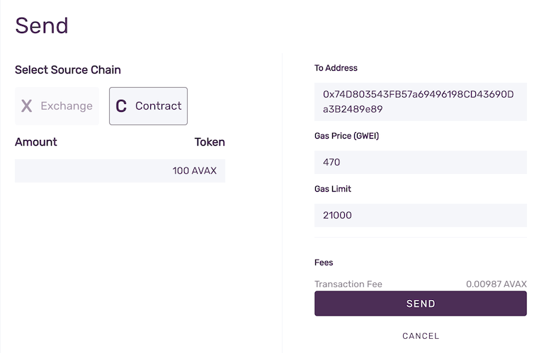
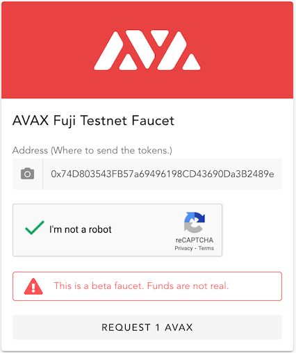
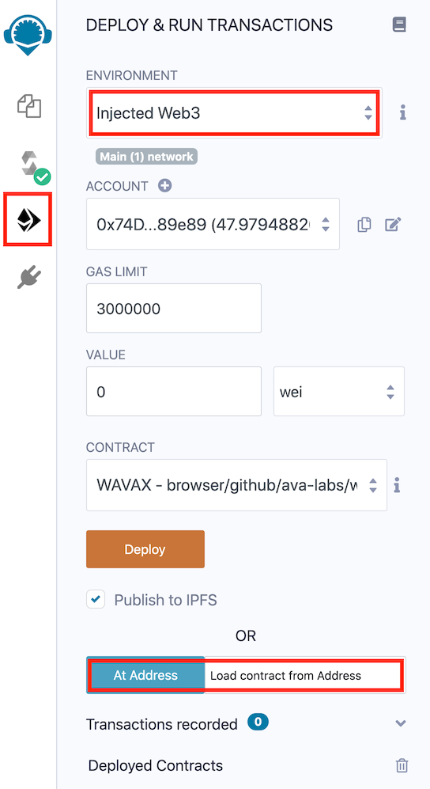

# How to use WAVAX on Avalanche

## What is WAVAX?

AVAX is the native token on the [Avalanche platform](../../../learn/platform-overview/README.md). However, many of the smart contracts on the Contract Chain (C-Chain), which is an instance of the Ethereum Virtual Machine, are designed to work with Ethereum's ERC-20 tokens. Since the two are not directly compatible, to be able to use AVAX in the contracts that expect ERC-20 tokens, AVAX needs to be *wrapped* into WAVAX \(Wrapped AVAX\), which is ERC-20 compatible.

## Overview

The process of converting AVAX to WAVAX consists of depositing AVAX to a smart contract that locks the received tokens, and issues ERC-20 WAVAX to you. When you wish to get your AVAX back, you return the WAVAX to the smart contract, it burns the WAVAX and unlocked AVAX are withdrawn to you.

There are several steps involved:
* connecting Metamask to Avalanche Platform
* funding your account  
* loading WAVAX contract into Remix
* connecting to deployed contract
* issuing deposit/withdraw commands to the contract
* adding WAVAX to Metamask

Ok, let's go.

## Connecting Metamask

[Metamask](https://metamask.io/) is a popular web browser extension that makes it easy to interact with Ethereum and compatible blockchains, such as Avalanche's C-Chain. Setting up Metamask, and an account on it is beyond the scope of this tutorial, but there are a number of readily available resources on the internet for that.

After you log in to your Metamask account, we need to connect it to the Avalanche platform. Click the Network drop-down -&gt; Select Custom RPC:

Enter the information for the network of your choice as described below.

### Avalanche Mainnet Settings:

* **Network Name**: Avalanche Mainnet C-Chain
* **New RPC URL**: [https://api.avax.network/ext/bc/C/rpc](https://api.avax.network/ext/bc/C/rpc)
* **ChainID**: `0xa86a`
* **Symbol**: `AVAX`
* **Explorer**: [https://cchain.explorer.avax.network/](https://cchain.explorer.avax.network/)

### FUJI Testnet Settings:

* **Network Name**: Avalanche FUJI C-Chain
* **New RPC URL**: [https://api.avax-test.network/ext/bc/C/rpc](https://api.avax-test.network/ext/bc/C/rpc)
* **ChainID**: `0xa869`
* **Symbol**: `AVAX`
* **Explorer**: [https://cchain.explorer.avax-test.network](https://cchain.explorer.avax-test.network/)

After the changes are saved, select one of the Avalanche networks. You should see your AVAX balance, which will probably be 0.

## Funding your C-Chain account

We need to get some funds into the account.

### **Using Avalanche Wallet**

If you already have some AVAX, you can transfer them to the Metamask account using your [Avalanche Wallet](https://wallet.avax.network/). You can send tokens between different wallets on same chain. You can see where your funds are by selecting **show breakdown** in the wallet panel showing your balance. If you don't have the funds on the C-Chain already, you need do a [Cross Chain Transfer](../platform/transfer-avax-between-x-chain-and-c-chain.md), to move your AVAX from X-Chain to C-Chain.

After you have the funds on the C-Chain, just do a regular transaction, by selecting **Send** on the left side menu in the Wallet, and then switching the source chain to **C Contract**. In the **To Address** field paste your Metamask address, enter the amount to send in the appropriate field, and complete the transaction by clicking **Confirm** and then **Send**.

Funds should soon be visible in the Metamask interface.

### **Using Test Network Faucet**

For funding on the test network, you can use the Test Network Faucet. Navigate to [https://faucet.avax-test.network/](https://faucet.avax-test.network/) and paste your Ethereum address, as it is shown below the account name in Metamask: `0x` prefix, followed by 40 hexadecimal numbers. Ex: 0xDd1749831fbF70d88AB7bB07ef7CD9c53D054a57. When you click on the account name, it will automatically copy it to the clipboard.

Paste that address into the faucet, prove that you're not a robot, and then request test AVAX. They should appear in your Metamask shortly.

Ok, we're funded and ready for WAVAX smart contract.

## Loading WAVAX contract into Remix

Remix is a popular online tool for writing, deploying and interacting with smart contracts. It works in the browser, no need for installation or any local files. Point your browser to [https://remix.ethereum.org/](https://remix.ethereum.org/). You will land on the Home screen, with options for importing contracts.

Select **GitHub**, and in the input field paste `https://github.com/ava-labs/wrapped-assets/raw/main/WAVAX.sol` and select **OK**. That will load the contract into Remix.

After switching to the File Explorer on the left side, select `WAVAX.sol`, which is the contract we just loaded.

On the left side menu, switch to Compile tab:

Check that compiler version is compatible with the contract, as shown. Press **Compile WAVAX.sol**, and check that WAVAX has appeared under Contract. If everything is ok, we're now ready to connect to the deployed contract on the Avalanche platform.

## Connecting to deployed WAVAX contract

Switch to **Deploy & Run Tranasactions** tab in the menu:

Make sure you're logged in your Metamask. In the **Environment** dropdown menu, select `Injected Web3`. That will pop up Metamask, asking you to select the account \(choose the one connected with Avalanche\) and allow it to connect. This will pre-fill the **Account** field. Make sure `WAVAX` is selected under **Contract**. We can now connect to the contract that is already published on Avalanche. In the **At Address** edit field, copy:
* For main net: `0xB31f66AA3C1e785363F0875A1B74E27b85FD66c7`
* For Fuji test net: `0xd00ae08403B9bbb9124bB305C09058E32C39A48c`

After pasting the address, press the **At Address** button.
  
Remix should find the deployed contract:

We are now ready to interact with the contract. Open the contract interface by pressing the highlighted arrow.

## Issuing commands to the contract

Let's wrap some AVAX!

Since ETH is denominated in 10^18 smaller units \(wei\), and AVAX is denominated in 10^9, switch the value selector from `wei` to `gwei` \(giga-wei, or 10^9 wei, making the units compatible\). 

### Wrapping AVAX to WAVAX

So, to wrap 10AVAX, enter `10000000000` gwei in the **value** field. To initiate the wrapping, click **Deposit**. You will be presented with a Confirm transaction dialog by Remix. When you press **Confirm** Metamask will pop up, also asking for confirmation. Press **Confirm** in Metamask too. You should notice your AVAX amount lowered by 10, plus the fee amount. Skip to the next section to see your WAVAX in Metamask.

### Unwrapping WAVAX to AVAX

To unwrap WAVAX, expand the arrow next to **Withdraw** button:

Unfortunately, withdraw field is denominated in wei, so our 10AVAX ends up as `10000000000000000000` for the withdraw amount. Pressing **Transact** will trigger the same confirmation first in Remix, then in Metamask. Your AVAX should be back in the account, minus the fee amount.

## Adding WAVAX to Metamask

To see your WAVAX balance, we need to add WAVAX as a custom token. Select **Add token** button in Metamask, and switch to **Custom Token** tab:

In the **Token Contract Address** paste the same contract address we used before:
* For main net: `0xB31f66AA3C1e785363F0875A1B74E27b85FD66c7`
* For Fuji test net: `0xd00ae08403B9bbb9124bB305C09058E32C39A48c`

Click **Next** and **Add Tokens**. Your WAVAX should now be visible in under your account in Metmask.

## Conclusion

You should now be able to interact with smart contracts on Avalanche's C-Chain with WAVAX, ERC-20 version of AVAX. In the future, this should be significantly simpler, with built-in support from the Wallet and exchanges, but in the meantime, you will still be able to access upcoming DEXes, bridges and other Solidity-based contracts on the Avalanche Platform.

