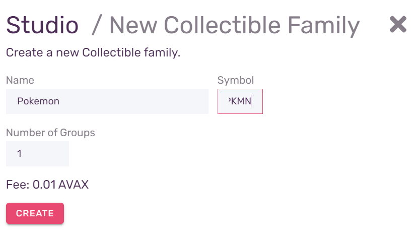
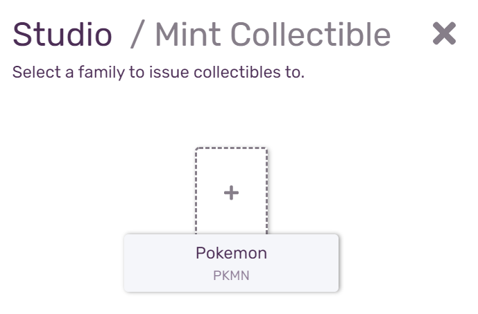
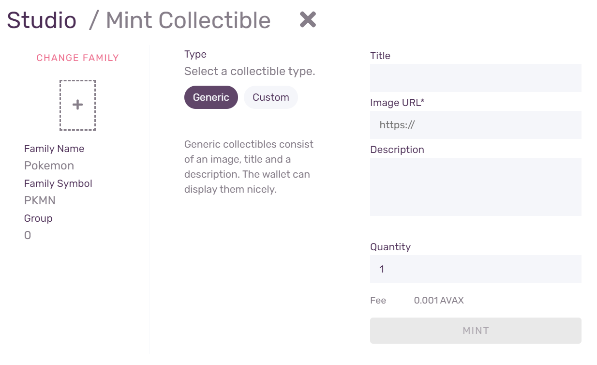
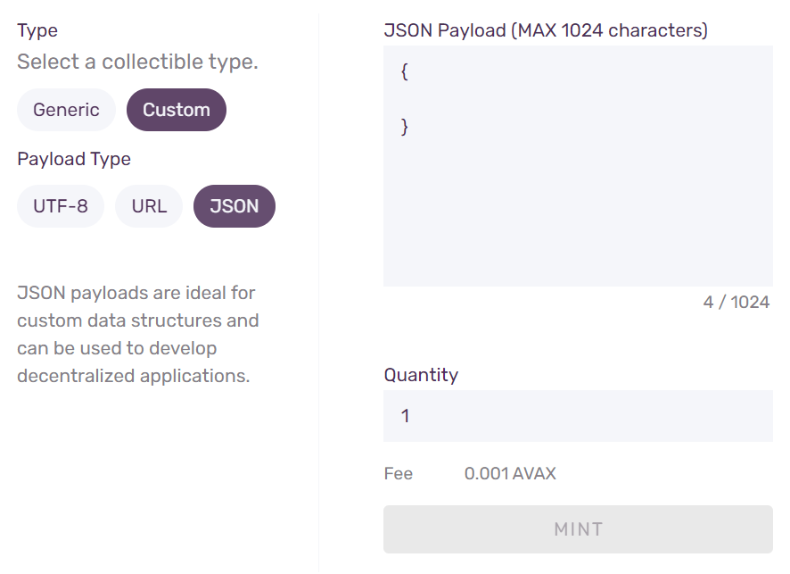
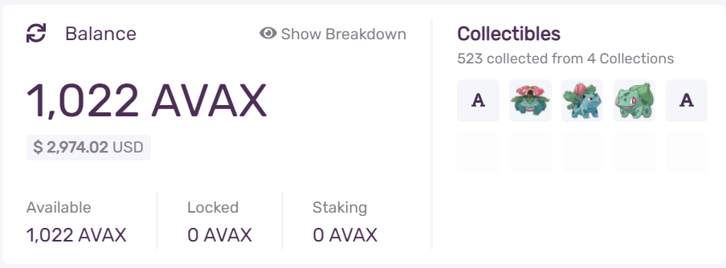
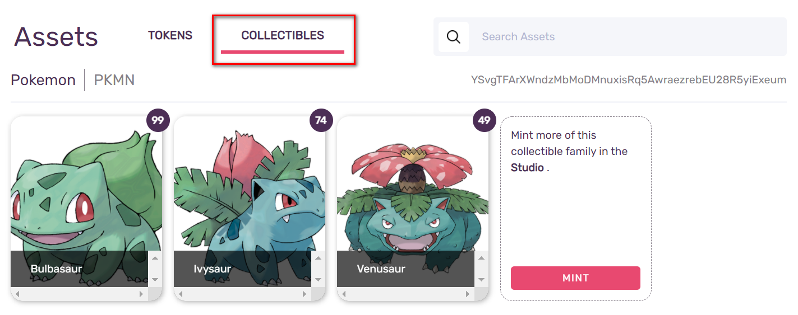
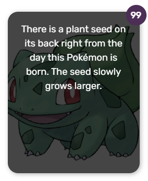
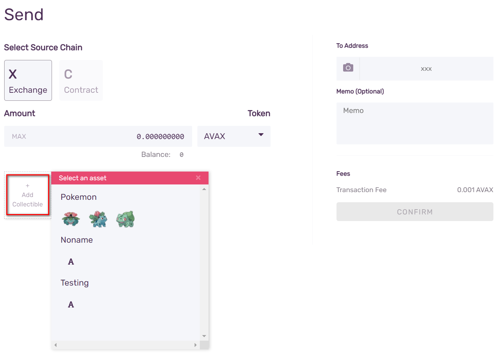
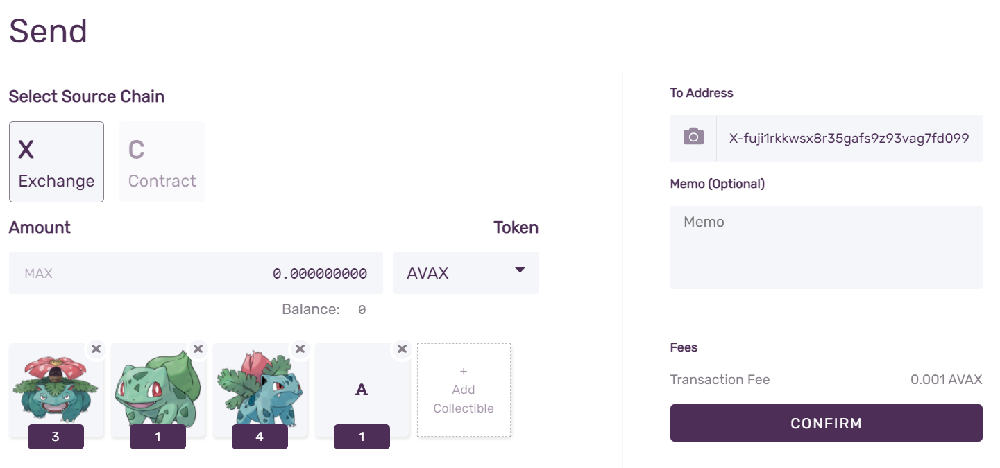
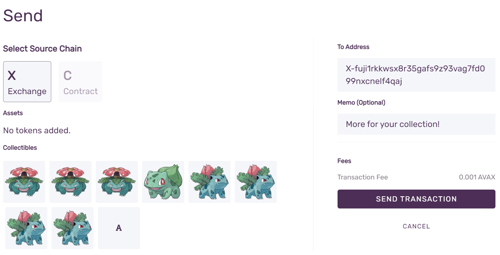

# Acuña NFTs con la Wallet de Avalanche

## Tokens No Fungibles en Avalanche

Además del token nativo de AVAX, [La Plataforma de Avalanche](../platform/) apoya nativamente la creación de otros tipos de activos digitales: activos de capital fijo, activos de capital variable y tokens no fungibles \(NFTs\).

A diferencia de las fichas regulares, que son intercambiables \(fungibles\), lo que significa que cada uno es el mismo, cada token no fungible es único en la red, con un ID distinto que lo hace diferente de cualquier otro. Esto permite muchos casos de uso que serían imposibles con los tokens intercambiables, como la prueba de propiedad de un activo único.

## NFT Studio en la Wallet de Avalanche

Para facilitar la experimentación con la creación e intercambio de NFTs, hemos construido **NFT Studio** en la [Wallet de Avalanche](https://wallet.avax.network/), donde los puedes usar para crear NFTs como activos que llamamos Coleccionables. Los coleccionables pueden ser NFT genéricos con una imagen y una descripción, o NFT personalizados con cargas útiles que contienen JSON, URL personalizado o datos UTF-8. Puedes crearlos usando una simple interfaz de apuntar y hacer clic, lo que te permite la idea de enviar NFTs a tus amigos en cuestión de minutos. Sin que se requieran conocimientos técnicos.

Para acceder al **NFT Studio**, entra en tu Wallet de Avalanche, y en el lado izquierdo selecciona **Studio**:

Esto abrirá  **NFT Studio**. Ahí tienes dos opciones: **New Family**, para la creación de una nueva familia de NFTs, y **Mint Collectible** para la creación de nuevos activos en las familias existentes. Necesitamos crear nuestra primera familia de NFTs, así que haz clic en **New Family**.

### Crear la Familia NFT

Allí se te pedirá que introduzcas el nombre, así como un símbolo \(ticker\). Los nombres no tienen que ser únicos.

Además del nombre y el indicador, tendrás que introducir **Number of Groups**, es decir, cuántos coleccionables distintos tendrá la familia que creaste. Elige con cuidado, porque una vez creada, los parámetros no pueden ser cambiados.

When you decided upon the name, ticker, and number of groups, press **Create** to actually create the collectible family. The transaction fee will be deducted from your wallet's balance. When the family is created, you will see the transaction ID \(TxID\), as well as parameters for the family. You can use the TxID to look up the transaction in [the explorer](https://explorer.avax.network/), but it is not necessary to write it down.

Press **Back to Studio** to return, and we're ready to create our first collectibles. Press **Mint Collectible**.

### Mint NFTs

After pressing **Mint Collectible** you will be presented with a list of all the Collectible families that still have Collectible groups that have not been created yet.

Select the family we have just created. You will be presented with a form to fill out with the parameters of the new collectible:

By default, a **Generic** type of collectible will be selected. That is an NFT that has a **Title**, **URL** for the image, and a **Description**. Enter the required data, as well as the **Quantity**, which will determine how many copies of the collectible will be created, and therefore, how many of them you will be able to send. As before, enter the data carefully, you won't be able to change anything once collectibles are minted. You will see a preview of the data where you can check how your collectible will look like.

If you would like to have something else besides a picture collectible, select **Custom**.

A custom collectible can contain an **UTF-8** encoded string, an **URL**, or a **JSON** payload. Size of the data cannot exceed 1024 characters.

After you enter and check the data, press **Mint** to create the collectible. Transaction fees will be deducted from your wallet, and a newly created collectible will be placed in your wallet.

### See your collectibles

An overview of your collectibles is always visible in the top of the screen, along with your balances.

To see your collectibles in more detail, select **Portfolio** from the left-hand side menu. You will be presented with a screen showing all of your assets, with tokens selected by default. Change the selection to **Collectibles** by clicking the corresponding tab.

For each Generic collectible, a picture will be shown, along with the title, and the number indicating how many copies of the collectible are in your portfolio. Hovering over the collectible with your pointer will show the detailed description:

If you select a collectible by clicking on it, you will see which group it belongs to, its quantity, along with the **Send** button.

## Send NFTs

To send your collectible to someone, either click the **Send** button on the selected collectible in the Portfolio, or navigate to **Send** tab on the left-hand side menu, and click **Add Collectible**:

You will be presented with a menu to select a collectible you wish to send.

You can send multiple collectibles in a single transaction. Clicking the label on the collectible will let you edit the number of copies you wish to send. You can send multiple families and collectible types in a single transaction.

When you have entered the destination address, and optionally entered the memo text, press **Confirm** to initiate the transaction.

After pressing **Send Transaction** it will be published on the network, and the transaction fee will be deducted from your balance. Collectibles will be deposited into the destination address shortly after.

## Summary

Now, you should know how to create NFT families, mint NFT groups, and send them to other addresses. Have fun with it! Make sure to share your creations with us on our [social media channels](https://www.avalabs.org/social)!

If you would like to know the technical background of how NFTs work on the Avalanche network or would like to build products using NFTs, please check out the [NFT tutorial](creating-a-nft-part-1.md). If you have technical questions, reach out to us on our [Discord](https://chat.avalabs.org/) server.

<!--stackedit_data:
eyJoaXN0b3J5IjpbMTExOTM3ODUzMywxMTA2MTU4Nzk4LDEyMD
kzMjI1MjVdfQ==
-->