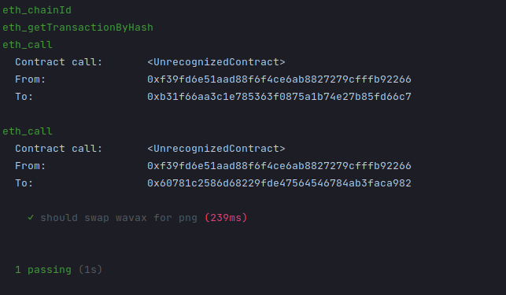

## はじめに

このチュートリアルでは、強力なEVM開発ツールであるHardhatをAvalancheと一緒に使用する方法を説明します。具体的には、Avalanche C-Chainと動作するためにどのように構成するということ及びDeFidApsをテストするためにどのようにHardhat`fork`メカニズムを使用するかについて説明します。

### Hardhat ?

Hardhatは、**プロフェッショナルのためのEthereum開発環境**です。Ethereum用に開発されましたが、他の多くのブロックチェーンがEVMを再利用しているため、それらのブロックチェーンでもHardlatを適用することができます。

つまり、スマートコントラクト開発のすべての重要なステップで役に立ちます。Solidityコードのコンパイル、展開、テストまで。スマートコントラクトのコードで「console.log」を使用できる機能さえあります。

これらすべての機能を説明することは、このチュートリアルの目的ではありません。（また別のチュートリアルで！）そのため、それについて知りたい場合のためにここにいくつかのリンクを提示しておきます。

* https://hardhat.org/getting-started/
* https://github.com/nomiclabs/hardhat

## 「フォーク」機能とは何ですか？

このチュートリアルのコアになる部分に戻りましょう：Hardhatフォーク機能。

この機能の重要性を理解していただくために、例を示します。

シンプルなコントラクト`Swapper.sol`があるとします。適切なパラメータで呼び出されると、いくらかのWavaxトークンをDEXにリストされている別のERC20トークンと交換するという`swap`機能があります。このチュートリアルのために、[Pangolin](https://pangolin.exchange/)を使用します。

フローは以下の通りです。

```
1* Your send a call to Swapper's swap function
2* Swapper use Pangolin's router `swapExactTokensForTokens` function, it will find the appropriate Pair contract address to call
3* Pangolin's router call a Pair contract to make the swap
```

どのように外部コントラクトへの呼び出しが要求されるかに注意してください。

Swapper`swap`をテストしたい場合は、ご自身のテスト環境で設定する必要があります。

* 2 ERC20コントラクト
* Pangolinファクトリ
* Pangolinルーターコントラクト
* 2つ前に作成したERC20を使用したペアコントラクト（PGL）。
* そして、すべての適切なコンストラクタパラメータで、これらすべてを連携させます。可能ですが、これをすべて適切に設定するには時間がかかります。

そのため、これらすべてを避けて、自身のスマートコントラクトのためのテストを作成するステップに直接ジャンプできるとしたらいかがでしょう。

それが、「Hardhatフォーク」が便利な点なのです。

これにより、EVMチェーン（我々の場合ではC-Chain）の状態をコピーするだけで、自身のテストに直接使用することができるのです！すべてのコントラクトで、アドレス残高を使用できます。

従って、関連するPangolinコントラクトをすべて展開する必要のない我々のケースでは、大した労力をかけずに、Mainnetに展開されているものを使用して、自身のスマートコントラクトをテストできるのです。

## 順を追った説明

### スマートコントラクトの概要

ではまず最初に、これから使用するsolidityコードを簡単に見ていきましょう。

```solidity
// SPDX-License-Identifier: MIT
pragma solidity 0.8.4;

interface IRouter {
    function swapExactTokensForTokens(uint amountIn, uint amountOutMin, address[] calldata path, address to, uint deadline) external returns (uint[] memory amounts);
}

interface IERC20 {
    function transferFrom(address from, address to, uint value) external;

    function approve(address to, uint value) external returns (bool);

}

/**
* I would not recommend you to use this code as it is. It is really simple and stripped of some basic security checks.
*/
contract Swapper {

    address private wavax; // Address of the ERC20 Wrapped Avax
    address private router; // Address of the 'Uniswap-like' router contract

    constructor(address _wavax_address, address _router){
        wavax = _wavax_address;
        router = _router;
    }

    /**
    * This function will perform a swap on Pangolin. The pair must be a WAVAX-ERC20 pair.
    * @param amountOutMin Minimum amount of token that we want to get after our swap.
    * @param path Array of tokens' address
    * @param pair Address of the liquidity pair we will use in this swap
    * @param deadline Not relevant for avalanche, just pass timestamp that is in the future
    */
    function swap(uint256 amountOutMin, address[] calldata path, address pair, uint256 amountIn, uint256 deadline) external {
        // We transfer the wavax from the user (msg.sender) to this contract.
        IERC20(wavax).transferFrom(msg.sender, address(this), amountIn);
        // We approve the router as a spender for our Wavax.
        IERC20(wavax).approve(router, amountIn);
        // We do te swap using the router.
        IRouter(router).swapExactTokensForTokens(amountIn, amountOutMin, path, msg.sender, deadline);
    }
}
```

### Hardhat構成

ご覧のように、外部コントラクト（Pangolinルータ）を使用します。つまり、このコードをテストしたい場合、このルータとこのルータを使ったすべてのコントラクトをモック／再生する必要があります、、、ちょっと面倒ですよね？

Hardhatのおかげで、物事はシンプルになり、これをすべて省略することができます。

まず、Hardhatを構成します。`hardhat.config.ts`を確認すると、このように表示されます。

```ts
const config: HardhatUserConfig = {
    defaultNetwork: "hardhat",
    solidity: "0.8.4",
    networks: {
        hardhat: {
            chainId: 43114,
            gasPrice: 225000000000,
            forking: {
                url: "https://api.avax.network/ext/bc/C/rpc",
                enabled: true,
            },
        },
        fuji: {
            chainId: 43113,
            gasPrice: 225000000000,
            url: "https://api.avax-test.network/ext/bc/C/rpc",
            accounts: [
                PK_TEST
            ]
        }
    },
    typechain: {
        outDir: "typechain",
        target: "ethers-v5",
    },
};
```

コードの最も面白い部分は、`network`の部分です。ここは、プロジェクトで使用したいネットワークを構成する場所です。上記で示すように、このチュートリアルでは、2つのネットワークを定義しました。

* `hardhat`、つまり`defaultNetwork`でもあります。
* `fuji`、つまりfujiテストネットを指しています。

複数のネットワーク定義を置くことができるということに注意ください。そのうちの一つが「デフォルト」とみなされます。つまり、`npx hardhat test`を使用する際、そのデフォルトのネットワークが使用されるということです。デフォルト以外のネットワークでテストを実行したい場合は、コマンドのこのバリエーション：`npx hardhat test --network fuji`を使うことができます。

さて、`hardhat`に焦点を当ててみましょう。

```ts
hardhat: {
    chainId: 43114,
        gasPrice
:
    225000000000,
        forking
:
    {
        url: "https://api.avax.network/ext/bc/C/rpc",
            enabled
    :
        true,
            blockNumber
    :
        2975762
    }
,
}
,
```

* `chainId`は[ここ](https://docs.avax.network/build/avalanchego-apis/contract-chain-c-chain-api)で確認できるようにMainnnetの値に設定します。
* `gasPrice`は、Avalanche C-Chain上のダイナミック値です（詳細はこの[投稿](https://medium.com/avalancheavax/apricot-phase-three-c-chain-dynamic-fees-432d32d67b60)を参照してください）。テスト目的では、固定値（225nAvax）を使用できます。
* `forking`は、フォークのパラメータを設定する場所です。
   * ここの`url`ではAva Lab APIエンドポイントを指していることがわかります。フルアーカイブノードとして実行している限り、これがご自身のローカルノードとなりえます。Hardhatは、このノードからC-Chainの状態を取得し、自身のコードを展開、テストできるローカル開発ネットワークをスタートしてくれます。
   * `blockNumber`Hardhatがフォークを作成するブロックを指定します。これはオプションです。設定しない場合は、デフォルトの動作が、最新の既知のブロックでC-Chainをフォークすることになります。これで、決定論的なやり方でテストできるようになったので、特定のブロックナンバーを指定することをお勧めします。

すべての設定オプションを確認したい場合は、この機能の[公式ドキュメント](https://hardhat.org/hardhat-network/reference/)を参照してください。

### テストの概要

これで、Solidityコード、Hardhatの構成をすべて見てきました。それでは、Hardhatを使用してテストを作成する方法を見ていきましょう。

では、テストコードを見てみましょう。

Hardhatでテストを行うのはかなりシンプルで、多くのことを取り除いてくれます。

Swapperコントラクトに書いたテストを最初に見てみましょう。心配いりません。後で詳しく見ていきますから。

```ts
import { ethers } from "hardhat";
import * as dotenv from "dotenv";
import { SignerWithAddress } from "hardhat-deploy-ethers/src/signers";
import { BigNumber } from "ethers";
import { Swapper, IWAVAX } from "../typechain";

dotenv.config();

const AVALANCHE_NODE_URL: string = process.env.AVALANCHE_MAINNET_URL as string;
const WAVAX_ADDRESS: string = process.env.WAVAX_ADDRESS as string;
const PNG_ADDRESS = "0x60781C2586D68229fde47564546784ab3fACA982"

describe("Swappity swap", function () {

    let swapper: Swapper;
    let account1: SignerWithAddress;

    beforeEach(async function () {
        await ethers.provider.send(
            "hardhat_reset",
            [
                {
                    forking: {
                        jsonRpcUrl: AVALANCHE_NODE_URL,
                        blockNumber: 2975762,
                    },
                },
            ],
        );

        let accounts = await ethers.getSigners()

        // @ts-ignore
        account1 = accounts[0]

        // Here we get the factory for our Swapper contrat and we deploy it on the forked network
        const swapperFactory = await ethers.getContractFactory("Swapper")
        swapper = await swapperFactory.deploy(process.env.WAVAX_ADDRES as string, "0xE54Ca86531e17Ef3616d22Ca28b0D458b6C89106");
    });

    it("should swap wavax for png", async function () {

        // We get an instance of the wavax contract
        const wavaxTokenContract = await ethers.getContractAt("IWAVAX", WAVAX_ADDRESS)
        // @ts-ignore
        const pngTokenContract = await ethers.getContractAt("IWAVAX", PNG_ADDRESS)
        //makes sure owner has enough WAVAX balance
        if ((await wavaxTokenContract.balanceOf(account1.address)).lt("1000000000000000000000")) {
            await wavaxTokenContract.deposit({
                value: BigNumber.from("1000000000000000000000")
                    .sub(await wavaxTokenContract.balanceOf(account1.address))
            })
        }

        // We tell Wavax contract that we are cool with Swapper contract using our Wavax on our behalve
        await wavaxTokenContract.approve(swapper.address, ethers.constants.MaxUint256)

        // Check balance before the swap
        const wavaxBalanceBefore = await wavaxTokenContract.balanceOf(account1.address);
        const pngBalanceBefore = await pngTokenContract.balanceOf(account1.address)
        expect(wavaxBalanceBefore).eq("1000000000000000000000");
        expect(pngBalanceBefore).eq(0)

        // We call Swapper contract to make a swap from Wavax to Png. I chose some weird values for the swap cause it's just for the sack of this tutorial.
        await swapper.swap(100, [WAVAX_ADDRESS, PNG_ADDRESS], "0xd7538cABBf8605BdE1f4901B47B8D42c61DE0367", 1000000000, 1807909162115)
        // Check balance after

        const wavaxBalanceAfter = await wavaxTokenContract.balanceOf(account1.address);
        const pngBalanceAfter = await pngTokenContract.balanceOf(account1.address)

        // Since we have done the swap, we expect the balance to be slightly different now. Less Wavax and more Png.
        expect(wavaxBalanceBefore).lt(wavaxBalanceAfter);
        expect(pngBalanceBefore).gt(pngBalanceAfter);
    });
});

```

まず、すべてのインポートを行います。

```ts
import { ethers } from "hardhat";
import * as dotenv from "dotenv";
import { SignerWithAddress } from "hardhat-deploy-ethers/src/signers";
import { BigNumber } from "ethers";
import { Swapper, IWAVAX } from "../typechain";

dotenv.config();
```

これらについて詳しく説明しません。ただ`typechain`を使用するということに注意しておいてください。これは、solidityコントラクトのtypescriptバインディングを自動的に生成するツールです。つまり基本的には、Solidityコントラクトに対応するオブジェクトのインスタンスを作成するとき、フルタイピングと自動コンプリートがあるということです。これにより、多くの時間が節約でき、より良く安全なコードを書くのに役立ちます。（どんなにTypescriptを愛しているか強調してもしきれません。）

以下のスニペットでは、各テストケースをこのファイルに記述する前に実行する`beforeEach`機能（実際には[フック](https://mochajs.org/#hooks)です）が表示されています。

```ts
describe("Swappity swap", function () {

    let swapper: Swapper;
    let account1: SignerWithAddress;

    beforeEach(async function () {
        await ethers.provider.send(
            "hardhat_reset",
            [
                {
                    forking: {
                        jsonRpcUrl: AVALANCHE_NODE_URL,
                        blockNumber: 2975762,
                    },
                },
            ],
        );

        let accounts = await ethers.getSigners()

        account1 = accounts[0]

        // Here we get the factory for our Swapper contrat and we deploy it on the forked network
        const swapperFactory = await ethers.getContractFactory("Swapper")
        swapper = await swapperFactory.deploy(process.env.WAVAX_ADDRES as string, "0xE54Ca86531e17Ef3616d22Ca28b0D458b6C89106");
    });
...
```

いくつか注意しておくべきことをここに記します。

* `await ethers.provider.send(
   "hardhat_reset", ...`C-Chainフォークの状態がリセットされます。つまり、それぞれのテストがクリーンなインスタンスで実行されるということです。
* `let accounts = await ethers.getSigners()`Etherは、「Signer(署名者）」にアクセスする方法です。つまり、テストに使用するC-Chainアカウントを表す方法です。
* `const swapperFactory = await ethers.getContractFactory("Swapper")`Etherを介して、ここでContractFactoryを取得します。これはスマートコントラクトを展開するのに使用する抽象化されたものです。
* `swapper = await swapperFactory.deploy(process.env.WAVAX_ADDRES as string, "0x....");`ここでは、Factoryを使用して、hardhatネットワーク上でC-Chain mainnetのフォークされたバージョンであるコントラクトを実際に展開します！結果として、`swapper`は`Swapper`コントラクトを表す（typechainのおかげ完全にタイプされた）オブジェクトであり、`swap`のように、そこで機能を呼び出すことができるのです。

ここでは、テストコードを表示します。もう少し詳細に、それぞれ重要な部分を下記で説明します。

```ts
it("should swap wavax for png", async function () {

    // We get an instance of the wavax contract
    const wavaxTokenContract = await ethers.getContractAt("IWAVAX", WAVAX_ADDRESS)
    // @ts-ignore
    const pngTokenContract = await ethers.getContractAt("IWAVAX", PNG_ADDRESS)
    //makes sure owner has enough WAVAX balance
    if ((await wavaxTokenContract.balanceOf(account1.address)).lt("1000000000000000000000")) {
        await wavaxTokenContract.deposit({
            value: BigNumber.from("1000000000000000000000")
                .sub(await wavaxTokenContract.balanceOf(account1.address))
        })
    }

    // We tell Wavax contract that we are cool with Swapper contract using our Wavax on our behalve
    await wavaxTokenContract.approve(swapper.address, ethers.constants.MaxUint256);

    // Check balance before the swap
    const wavaxBalanceBefore = await wavaxTokenContract.balanceOf(account1.address);
    const pngBalanceBefore = await pngTokenContract.balanceOf(account1.address);

    expect(wavaxBalanceBefore).eq("1000000000000000000000");
    expect(pngBalanceBefore).eq(0);

    // We call Swapper contract to make a swap from Wavax to Png. I chose some weird values for the swap cause it's just for the sack of this tutorial.
    await swapper.swap(100, [WAVAX_ADDRESS, PNG_ADDRESS], "0xd7538cABBf8605BdE1f4901B47B8D42c61DE0367", 1000000000, 1807909162115);

    // Check balance after
    const wavaxBalanceAfter = await wavaxTokenContract.balanceOf(account1.address);
    const pngBalanceAfter = await pngTokenContract.balanceOf(account1.address);

    expect(wavaxBalanceBefore).lt(wavaxBalanceAfter);
    expect(pngBalanceBefore).gt(pngBalanceAfter);
});
```

次のスニペットでは、特定のアドレスにコントラクトのインスタンスを取得する方法を示します。ここでは`WAVAX_ADDRESS`と`PNG_ADDRESS`で、ABIとしての`IWAVAX`と展開するコントラクトの参照となるオブジェクトを提供するようにEtherに求めます。

そして、使用するアカウントの残高を確認し、残高が少なすぎる場合は、そのアカウントに少額のavaxを預け入れます。

```ts
    // We get an instance of the wavax contract
const wavaxTokenContract = await ethers.getContractAt("IWAVAX", WAVAX_ADDRESS)
// @ts-ignore
const pngTokenContract = await ethers.getContractAt("IWAVAX", PNG_ADDRESS)
//makes sure owner has enough WAVAX balance
if ((await wavaxTokenContract.balanceOf(account1.address)).lt("1000000000000000000000")) {
    await wavaxTokenContract.deposit({
        value: BigNumber.from("1000000000000000000000")
            .sub(await wavaxTokenContract.balanceOf(account1.address))
    })
}
```

それではここで、このテストの興味深い部分、`Swapper`コントラクトへの実際の呼び出しに取り組みましょう。

フォーク機能のおかげで、まだ展開していなかったコントラクトとやり取りしていることがわかります。例えばここで、WAVAXコントラクトの承認機能を呼び出します。そして、スワップを行う前に、アドレスの残高の確認もします。

次に、Swapperコントラクトのスワップ機能への実際の呼び出しを行います。必要なパラメータを渡します。パラメータの概要はこちらです。

* `100`このスワップで受け取りたい最低限のトークンの額です。テストなので、あえて低く設定しています。
* `[WAVAX_ADDRESS, PNG_ADDRESS]`基本的に、WAVAXからPNGトークンに移動したいと言って、取得したいパスに応じるアドレスの配列です。
* `0xd7538cABBf8605BdE1f4901B47B8D42c61DE0367`は、WAVAX * PNGのPangolin Liquidityペアのアドレスに対応します。
* `1000000000`PNGとスワップする準備ができているWAVAX量です。
* `1807909162115`これは、期限パラメータに対応するために、無視できます。トランザクションが（ほとんどの場合1秒未満という）短時間でファイナライズされるため、Avalanche（afaik）上では役に立ちません。

そして、再度アドレスの残高をフェッチします。そして、残高が自身の仮定に対応しているかをチェックします。対応している場合、この機能のために期待通りにコードが機能しているということです。

```ts
// We tell Wavax contract that we are cool with Swapper contract using our Wavax on our behalve
await wavaxTokenContract.approve(swapper.address, ethers.constants.MaxUint256);

// Check balance before the swap
const wavaxBalanceBefore = await wavaxTokenContract.balanceOf(account1.address);
const pngBalanceBefore = await pngTokenContract.balanceOf(account1.address);

expect(wavaxBalanceBefore).eq("1000000000000000000000");
expect(pngBalanceBefore).eq(0);

// We call Swapper contract to make a swap from Wavax to Png. I chose some weird values for the swap cause it's just for the sack of this tutorial.
await swapper.swap(100, [WAVAX_ADDRESS, PNG_ADDRESS], "0xd7538cABBf8605BdE1f4901B47B8D42c61DE0367", 1000000000, 1807909162115);

// Check balance after
const wavaxBalanceAfter = await wavaxTokenContract.balanceOf(account1.address);
const pngBalanceAfter = await pngTokenContract.balanceOf(account1.address);

expect(wavaxBalanceAfter).lt(wavaxBalanceBefore);
expect(pngBalanceAfter).gt(pngBalanceBefore);
```

コードが実行されているのを見たい場合は、ターミナル：`npx hardhat test`でこのコマンドを実行してください。

これにより、次のような出力が生成されるはずです。

やった！AvalancheのC-Chain mainnetのフォークを使用して、コントラクトを無事テストできました。

## ボーナス

### タイムトラベル

さて、まだ後2つ紹介するものがあります。

WAVAX PNGペア上で動作するコンパウンダーコントラクトをテストしたいとしましょう。最も興味をお持ちのことは、自分のコンパウンダーコントラクトが、ファーム報酬をファームに再投資することができるのかというでしょう。問題は、この報酬が`time bound`であることであり、つまり、自分の報酬が上に上がってくるのを少し待つ必要があるということです。Hardhatにより、このような状況を簡単にテストする方法があります。

以下のスニペットでは、時間を変更する機能を`HardhatRuntimeEnvironment`（hre）から呼び出すのを見ていただけます。そして、新しいブロックをマイニングします。これにより、Pangolinファームから1週間相当の報酬を「人工的に」受け取ることができ、自身のコンパウンダーコントラクトをテストできるようになります。すごくないですか？

```ts
// Advance the time to 1 week so we get some reward
await hre.ethers.provider.send('evm_increaseTime', [7 * 24 * 60 * 60]);
await network.provider.send("evm_mine");
```

### なりすまし

Hardhatにはもう一つ大変便利な機能：`impersonation`があります。この機能を使用して、例えば既に展開されているコントラクトの所有者など別の人になりすましてコントラクトコールを呼び出すことができます。

以下のスニペットでは、elkIlpStrategyV5から`setCoverageAmount`機能を呼び出そうとしています。これは、コントラクトの所有者のみが呼び出すことができるものです。つまり、自分が管理しているアドレスによるものではないということです。次のスニペットを見てください。

```ts
// We impersonate the 'owner' of the WAVAX-ELK StakingRewardsILP contract
await ethers.provider.send('hardhat_impersonateAccount', ['0xcOffeexxxxxxxxxxxxxxxxxxxxxxx']);
const admin = await ethers.provider.getSigner('0xcOffeexxxxxxxxxxxxxxxxxxxxxxx')

const stakingcontract = await ethers.getContractAt('IStakingRewardsILPV2', elpStakingRewardAddress, admin);
// We set the coverage elpBalanceAccount1 for our Strategy
await stakingcontract.setCoverageAmount(elkIlpStrategyV5.address, 1000000000000);

await hre.network.provider.request({
    method: "hardhat_stopImpersonatingAccount",
    params: ["0xba49776326A1ca54EB4F406C94Ae4e1ebE458E19"],
});
```

どうやって始めるかをここで見ることができます。

```ts
await ethers.provider.send('hardhat_impersonateAccount', ['0xcOffeexxxxxxxxxxxxxxxxxxxxxxx']);
const owner = await ethers.provider.getSigner('0xcOffeexxxxxxxxxxxxxxxxxxxxxxx')
```

つまり、`IStakingRewardsILPV2`コントラクトの`owner`であるアドレス`0xcOffeexxxxxxxxxxxxxxxxxxxxxxx`を`impersonate`しているということです。

次のセクションで示すように、コントラクトとやり取りする`admin`署名者を使用することができます。

```ts
const stakingcontract = await ethers.getContractAt('IStakingRewardsILPV2', elpStakingRewardAddress, owner);
```

## 結論

このチュートリアルでは、Hardhat環境を設定して、Avalanche C-Chainのフォークを使用し、それをテストの基盤として使用する方法を見てきました。Hardhatについてさらに知りたい方は、[公式ドキュメント](https://hardhat.org/getting-started/)をぜひ確認してください。

このチュートリアルで何らかを学んでいただければ幸いです。ミスや誤植を見つけられた場合はお知らせください。AvalancheでXを使用する方法について別のチュートリアルをご覧になりたい場合は、お知らせください！

# 追加リンク

Avalancheについてさらにお知りになりたい場合は、こちらに一連のリンクがあります。

[ウェブサイト](https://avax.network/) | [ホワイトペーパー](https://avalabs.org/whitepapers)
| [Twitter](https://twitter.com/avalancheavax) | [Discord](https://chat.avalabs.org/)
| [GitHub](https://github.com/ava-labs) | [ドキュメント](https://docs.avax.network/)
| [フォーラム](https://forum.avax.network/) | [Avalanche-X](https://avalabs.org/avalanche-x)
| [Telegram](https://t.me/avalancheavax) | [Facebook](https://facebook.com/avalancheavax)
| [LinkedIn](https://linkedin.com/company/avalancheavax) | [Reddit](https://reddit.com/r/avax)
| [YouTube](http://www.youtube.com/c/AVALabsOfficial)
