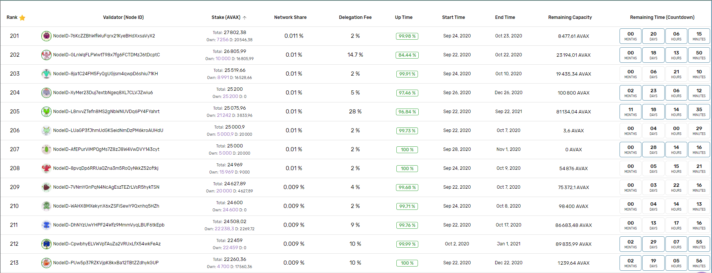

# Déléguer à un nœud

## Délégateur

Un délégateur est un détenteur de jeton, qui souhaite participer au jalonnement \(staking\), mais choisit de faire confiance à un nœud de validation existant par délégation. Les délégations sont initiées par le biais d'une transaction spéciale «**addDelegator**» émise vers la Platform Chain \(P-Chain\). La transaction spécifie: l'ID du nœud \(du validateur choisi\), l'heure de début et de fin et l'adresse de récompense.

Jetons un coup d'œil à ces entrées:

* **Node ID :** un ID unique dérivé du certificat de staking de chaque nœud individuel.
* **Start Time** : la date et l'heure auxquelles le jalonnement d'un délégant ou d'un validateur est activé.
* **End time** : la date et l'heure auxquelles le jalonnement d'un délégant ou d'un validateur est terminé.
* **Delegation Fee** : les frais de délégation sont spécifiés par chaque validateur au fur et à mesure de son adhésion au réseau. Les délégués paient des frais de délégation au validateur auquel ils ont délégué.
* **Reward Address** : Une adresse de récompense est l'adresse de destination des récompenses de jalonnement accumulées.

## Déléguer à un nœud

### Les conditions

* Avoir plus de 25 AVAX.
* Avoir trouver le node ID du nœud auquel vous voulez déléguer.
* Avoir ces tokens disponibles sur la P-chain.
* Déléguer pour une période entre 14 jours et 365 jours.

#### Trouver le nœud en vous aidant des outils disponibles

Pour vous aidez dans votre recherche et trouver le nœud qui répondra à vos attentes vous pouvez vous aider des liens suivants :

[**https://vscout.io/**](https://vscout.io/) qui vous permettra de trouver les nœuds qui sont dans la liste des validateurs.

Sur ce site vous pourrez trouver plusieurs informations qui vous aideront dans votre choix :

* **Le node ID**
* **Le nombre de token stake et le nombre de tokens délégués à ce nœud.**
* **Le prix de la délégation** \(Delegation Fee\) - actuellement entre 20% et 2%.
* **L'UP time** qui correspond au temps de disponibilité du nœud.
* **Start time** qui correspond à la date de départ de la période de staking pour ce nœud.
* **End time** qui correspond à la date de fin de la période de stakings pour ce nœud.
* **Remaining capacity** pour vous indiquez si vous pouvez déléguer à ce nœud \(si la capacité restante est inférieur au nombre de tokens que vous voulez déléguer la transaction ne fonctionnera pas\).
* **Remaining time \(coutdown\)** qui correspond au temps restant avant la fin de la période de staking du nœud sous forme de compte à rebours.

L'up time dépend du point de vue d'un nœud alors nous nous aideront d'un autre lien pour s'assurer que le nœud choisit ait bien le même rendu sur une autre source.

[**https://avascan.info**/](https://avascan.info/) qui va nous permettre de valider les données trouvées sur vscout.io.

Copier coller l'ID du nœud dans la barre de recherche et appuyer sur entrer.

Ici nous vérifions que les réponses vers Avascan sont au plus près de 100%, on vérifira encore une fois que la période de validation est bien supérieure à 14 jours pour le nœud sélectionné et que la fin de la période de la période de staking est plus longue que la période de votre délégation. Par exemple si vous voulez déléguer vos AVAX pendant une période de 30 jours, alors vous devrez trouver un nœud qui ait une période de validation supérieure à 30 jours.

_Les données sont volontairement cachées pour ne pas influencer votre choix._

### Après avoir trouver le nœud qui correspond à vos critères de sélection

Si vous préférez un support vidéo pour cette étape :



Ouvrez le [portefeuille](https://wallet.avax.network/) et passez à l’onglet **Earns**.

Deux options s'offrent à vous, soit vous posséder au minimum 25 AVAX sur la P-Chain \(locked\) et dans ce cas là passer directement à l'étape suivante \(**Add Validator**\). Soit vous possédez au minimum 25 AVAX sur la X-Chain et vous avez besoin de les transférer sur la P-Chain afin de les staker.

Pour voir le détail de la répartition de vos tokens entre X-Chain et P-Chain et les tokens Locked et Avaialable cliquez sur "**Show Breakdown**" :

**Transférer mes avax sur de la X-Chain à la P-Chain :**

Appuyez sur MAX ou choisissez le montant que vous souhaitez staker \(minimum 25\) puis appuyer sur **CONFIRM** :

Si vous ne pouvez toujours pas stake vos jetons la transaction est peut-être bloquée pour cela aller dans l'onglet advanced de votre portefeuille et cliquez sur import P :

**Pour déléguer à un nœud validateur choisissez l'option Add Delegate \(Delegate\) dans l'onget Earn :**

Copier coller l'ID du nœud que vous avez préalablement sélectionné :

Vérifiez que les informations correspondent bien, puis cliquez sur "**Select**".

Spécifiez votre période de délégation et le montant de celle-ci. Votre période de délégation ne peut pas être définie pour se terminer après la date de fin que le validateur a définie.

Vérifiez que toutes les informations sont correctes et appuyez sur "**Confirm**", un message apparaitra à droite de votre écran "**You are now delegating**" pour confirmer la transaction de votre délégation.

**Vous êtes maintenant un délégateur du réseau Avalanche !**

