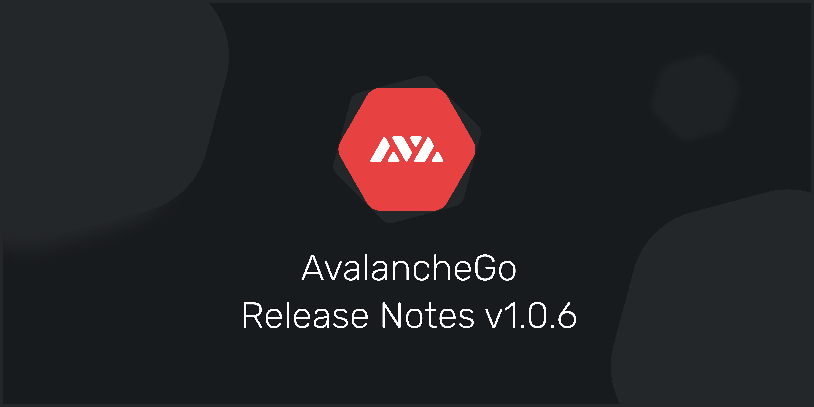

# Notas de lanzamiento de AvalancheGo



## Notas de Versión de AvalancheGo v1.0.6 \([Ver en GitHub](https://github.com/ava-labs/avalanchego/releases/tag/v1.0.6)\)




Ten en cuenta que este comunicado contiene cambios de última hora descritos [aquí](https://docs.avax.network/build/apis/deprecated-api-calls). Cambia el formato de respuesta por defecto de platform.getTxStatus y platform.getCurrentValidators. La actualización es opcional pero se recomienda. El parche incluye mejoras en el rendimiento y algunas mejoras en la calidad de vida.


* Se han eliminado los formatos obsoletos de platform.getTxStatus y platform.getCurrentValidators.
* Se añadió soporte para codificaciones hexadecimales de usuarios importados y exportados desde la API de keystore.
* Se ha establecido el requisito de golang a la v1.15.5 para evitar una vulnerabilidad de DoS encontrada en el estándar golang lib.
* Se han añadido clientes de la API para que actúen como ayudantes interactuando con el software del nodo.
* Se ha habilitado la posibilidad de volver al arranque si un nodo se desconecta del resto de la red.
* Arregladas las APIs de GetUTXOs cuando UTXOs referenciaba múltiples direcciones.
* Se refactorizó la codificación binaria para generalizar mejor las opciones de RPC.
* Se ha fijado el filtrado de bloque IP para establecer correctamente la longitud de la ventana.
* Se ha generalizado el paquete de códecs para poder manejar múltiples códecs con diferentes versiones.
* Se añadió Epoch a la interfaz Vertex en preparación de una futura versión.
* Se aplazó el hashing de las transacciones para reducir la utilización de la CPU/Memoria más allá de los chequeos rápidos.
* Para aquellos usando [https://explorerapi.avax-dev.network/](https://explorerapi.avax-dev.network/), la URL va a ser cerrada en un futuro lanzamiento. Por favor, cambiate a [https://explorerapi.avax.network/](https://explorerapi.avax.network/). 

Para ayuda con esta actualización ve a [Preguntas Frecuentes de los Desarrolladores](https://support.avalabs.org/en/collections/2618154-developer-faq), si todavía tienes problemas, puedes unirte a nuestro servidor de [Discord](https://chat.avax.network) para que te ayudemos.

## Notas de Versión de AvalancheGo v1.0.5 \([Ver en GitHub](https://github.com/ava-labs/avalanchego/releases/tag/v1.0.5)\)



Ten en cuenta que la versión posterior a ésta, la v1.0.6, contendrá los cambios de última hora de descritos [aquí](https://docs.avax.network/build/apis/deprecated-api-calls). El formato de respuesta de `platform.getTxStatus` y`platform.getCurrentValidators` cambiará.


Los cambios en esta versión, v1.0.5, son compatibles con versiones anteriores. La actualización es opcional pero se recomienda. El parche incluye mejoras en el rendimiento y algunas mejoras en la calidad de vida.

* Se añadió `IssueTx` y `GetUTXOs` a la API de la C-chain para permitir la emisión de intercambios atómicos sin revelar las claves privadas de un nodo.
* Se corregió la fuga de memoria en el gestor de peticiones de snowman con el procesamiento de bloques de oráculo.
* Se corregió el error de paginación de UTXO que no informaba sobre los fondos disponibles.
* Se han movido los registros de la cadena http a la carpeta de registros de la cadena legible por los humanos.
* Se ha reestructurado la forma en que se gestionan las ID para evitar las asignaciones de montones.
* Se optimizó el `UniformSampler` para evitar la creación de múltiples mapas.
* Se ha reducido el uso de `ids.Set` a favor de `[]ids.ID` para utilizar mejor la memoria continua.
* Se introdujo la reutilización de `[]byte` en `PrefixDB`.
* Se han implementado funciones de clasificación específicas de tipo para evitar asignaciones frecuentes de conversión de interfaz.
* Se ha optimizado el usuario de carga AVM para evitar leer información innecesaria del disco.
* Eliminada una asignación de memoria + copia en el envío de sockets para toda la longitud del mensaje.

Para ayuda con esta actualización ve a [Preguntas Frecuentes de los Desarrolladores](https://support.avalabs.org/en/collections/2618154-developer-faq), si todavía tienes problemas, puedes unirte a nuestro servidor de [Discord](https://chat.avax.network) para que te ayudemos.

## Notas de Versión de AvalancheGo v1.0.4 \([Ver en GitHub](https://github.com/ava-labs/avalanchego/releases/tag/v1.0.4)\)


Esta actualización es opcional pero se recomienda. El parche incluye mejoras en la calidad de vida y varias mejoras en el rendimiento. Tenga en cuenta que esta actualización requiere que los parámetros de la CLI se especifiquen con -- en lugar de permitir - o --. Por ejemplo, `-public-ip=127.0.0.1` ya no está permitido y debe especificarse como `--public-ip=127.0.0.1`. De resto, esta actualización es compatible con las versiones anteriores.

```text
- Se añadió la lista blanca de subnets para permitir al propietario de un nodo elegir qué subnets validar.
- Se añadió el análisis sintáctico del archivo de configuración para la configuración de los nodos.
- Añadidas más opciones para especificar la dirección IP de un nodo y añadido getNodeIP a la información *endpoint.
- Se añadió un TxID al resultado de los validadores get.Validators en la platformvm.
- Actualizada la versión de Coreth.
- Se limpió la implementación de la prueba snowball y añadió pruebas adicionales para alinearse con las pruebas de mutación.
- Se implementaron y optimizaron los promedios de tiempo continuo para el seguimiento de la latencia de la CPU y la red.
- Se optimizaron significativamente las asignaciones de memoria en varios lugares.
- Aumentado el tamaño de la caché de verificación de firmas.
- Reducción de las lecturas de la base de datos durante la gestión de vértices.
```

```text
• Añadido un argumento opcional includeReason to platform.getTxStatus.
Si no se proporciona, o si es falso, la salida de getTxStatus es la misma que antes.

Por ejemplo:
{
    "jsonrpc": "2.0",
    "result": "Dropped",
    "id": 1
}

Si includeReason es verdadero, la salida de getTxStatus tendrá un nuevo formato. Es un elemento que se ve así:

{
    "jsonrpc": "2.0",
    "result": {
        "status":"[Status]",
        "reason":"[Reason tx was dropped, if applicable]"
    },
    "id": 1
}

En este nuevo formato, la razón no estará presente a menos que el estado sea "Dropped".
Cualquier cosa que dependa de platform.getTxStatus debería cambiar a usar el argumento includeReason y usar el nuevo formato de respuesta. Después de algunos lanzamientos, sólo soportaremos el nuevo formato de respuesta.
```

Para ayuda con esta actualización ve a [Preguntas más frecuentes de los desarrolladores](http://support.avalabs.org/en/articles/4593477-how-do-i-upgrade-my-node), si todavía tienes problemas, puedes unirte a nuestro servidor de [Discord](https://chat.avalabs.org/) para que te ayudemos.

