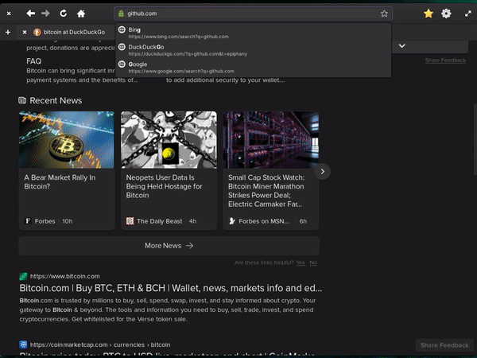

# Asset Bridge Security

In this Advanced tutorial, we'll discuss how to __Build__, __Test__ and __Deploy__ various forms of Cross-chain Asset Bridges. Each Bridge that we build will be engineered and hardened for __Enterprise-level__ asset management.

# Table of contents

- [Introduction](#introduction)
  - [Prerequisites](#prerequisites)
  - [Requirements](#requirements)
- [What Is A Bridge?](#what-is-a-bridge)
  - [How do bridges work?](#how-do-bridges-work)
  - [On-chain event handling](#on-chain-event-handling)
  - [How serious is the threat?](#how-serious-is-the-threat)
  - [What are best practices?](#what-are-best-practices)
- [Software Security](#software-security)
  - [Securing your VPS](#securing-your-vps)
  - [Securing your network](#securing-your-network)
- [Hardware Security](#hardware-security)
  - [Enclaves](#enclaves)
  - [Two-factor authentication](#two-factor-authentication)
- [Contract Security](#contract-security)
  - [Code audits](#code-audits)
- [Security Design](#security-design)
- [Important Warnings](#important-warnings)
  - [Attacks and vulnerabilities](#attacks-and-vulnerabilities)
  - [Most famous bridge hacks](#most-famous-bridge-hacks)
- [Conclusion](#conclusion)
  - [Recap of what we learned](#recap-of-what-we-learned)
  - [Possible use-cases](#possible-use-cases)
  - [Recommended resources](#recommended-resources)

## Introduction

Asset Bridge security is a Billion dollar a year business. Blockchain hackers know that all it takes is one vulnerability to siphon off millions of dollars in assets from unsuspecting Asset Bridges.

The cryptocurrency network Ronin disclosed a breach in which attackers made off with $540 million worth of Ethereum and USDC stablecoin. The incident, which is one of the biggest heists in the history of cryptocurrency, specifically siphoned funds from a service known as the Ronin Bridge.

### Prerequisites

- You should have an understanding of how Software Firewalls work
- You should understand the basic concepts of Data Encryption

To get started with these topics or for a comprehensive review, see the [Recommended Resources](#recommended-resources) to learn more.

### Requirements

- Ubuntu &gt;=20.04
- [__Golong__](https://go.dev/dl/) &gt;=v1.18.x
- [__Solidity__](https://docs.soliditylang.org/) &gt;=0.8.x
- Uncomplicated Firewall _(UFW)_ &gt;=0.36.x
- [__VeraCrypt__](https://www.veracrypt.fr/code/VeraCrypt/) &gt;=v1.24.x
- Ledger HW wallet _(optional)_
- Yubikey _(optional)_

:::info

__Did you know? —__ Most cross-chain bridges work using compatible EVM technology. This allows assets to be sent to the same account address (ie. 0x0000) on one chain to the other. This makes asset transfers relatively safe, as the sending wallet is automatically the receiving wallet.
:::

👇 __Watch a short walk-through of what we'll cover in this tutorial__ 👇

__↳__ [___click here to watch the full-screen Introduction video___](assets/intro.webm) &nbsp; 👀 🍿

## What Is A Bridge?

A platform that allows tokens designed for one blockchain to be used on another. Back when there was only the Bitcoin blockchain, there was no need for Bridges. Now, there are thousands of blockchains, each with its own advantages, eg.:
- lower transaction fees

And with its own army of applications, ranging from:
- nonfungible token (NFT) marketplaces
- decentralized crypto exchanges

The exponential growth of DeFi has increased the need for mechanisms to bridge the gap between blockchains, as more and more investors are seeking to jump from one chain to another to earn yields or to buy art.

:::danger

__You should know! —__ Successful attacks on “blockchain bridges” have become increasingly common over the past couple of years, and the situation with Ronin is a prominent reminder of the urgency of the problem.
:::

### How do bridges work?

Bridge services “wrap” cryptocurrency to convert one type of coin into another. So if you go to a bridge to use another currency, like Bitcoin (BTC), the bridge will spit out wrapped bitcoins (WBTC). It's like a gift card or a check that represents stored value in a flexible alternative format. Bridges need a reserve of cryptocurrency coins to underwrite all those wrapped coins, and that trove is a major target for hackers.

### On-chain event handling

Nodes are deployed to watch &amp; react to on-chain Events triggered by smart contracts.

:::tip

__You should know! —__ The technical structure and operation of an Asset Bridge is outside the scope of this __Security & Threat Assessment__ tutorial.

If you would like to learn more about how Bridge nodes work, you should read [__Deploying Cross-Chain EVM <-> EVM Bridge__](/subnets/deploying-cross-chain-evm-bridge) and follow the tutorials on how to move assets between the [__WAGMI__](/subnets/wagmi#adding-wagmi-to-metamask) and [__Fuji__](/quickstart/fuji-workflow#set-up-fuji-network-on-metamask-optional) chains.
:::

### How serious is the threat?

> _“Any capital on-chain is __subject to attack 24/7/365,__ so bridges will always be a popular target.”  
— says James Prestwich_

### What are best practices?

They need to be aware that security remains a widespread issue.

Fortunately for Wormhole users, its sponsor Jump Crypto ended up covering the bridge’s losses.

Axie Infinity creator Sky Mavis said it would restart the bridge and reimburse users in late June '22. But such compensation isn’t guaranteed, and shouldn’t be expected every time.

:::info

__Did you know? —__ Ethereum co-founder Vitalik Buterin said in January '22 that bridges are insecure, and users need to keep tokens only on blockchains they are native to to stay safe.
:::

## Software Security

https://www.veracrypt.fr/code/VeraCrypt/

VeraCrypt is a free and open-source utility for on-the-fly encryption (OTFE). The software can create a virtual encrypted disk that works just like a regular disk but within a file. It can also encrypt a partition or (in Windows) the entire storage device with pre-boot authentication.

### Securing your VPS

(video)

### Securing your network

The [__Uncomplicated Firewall (UFW)__](https://wiki.ubuntu.com/UncomplicatedFirewall) is a frontend for iptables and is particularly well-suited for host-based firewalls. UFW provides a framework for managing netfilter, as well as a command-line interface for manipulating the firewall.

UFW aims to provide an easy to use interface for people unfamiliar with firewall concepts, while at the same time simplifies complicated iptables commands to help an administrator who knows what he or she is doing.

## Hardware Security

Learn how to operate and secure your asset bridge, in production.

- Enclaves
- Yubikeys work great!

## Contract Security

Smart contracts are not perfect, as they are written by imperfect humans.

### Code audits

The majority of hacks have occured on un-audited smart contracts.

__Here is a list of some of the TOP contract security firms:__

- [Certik](https://www.certik.com/)

## Security Design

most other bridge hacks. In particular, other attacks have targeted bugs in how bridges implement “smart contracts,”

But social engineering to take over privileged target accounts is also a classic attacker strategy that has been used widely, including in decentralized finance.

> _“Social engineering and associated private key compromises have always been a vector of attack on DeFi platforms in general, not just bridges“  
— Arda Akartuna (a cryptocurrency threat analyst at [Elliptic](https://www.elliptic.co/))_

## Important Warnings

There are many concerns to be aware of when it comes to deploying a bridge into a Production environment.

### Attacks and vulnerabilities

- Integer Overflow and Underflow
- Reentrancy

### Most famous bridge hacks

It is usually best to learn from the past mistakes of others so as to not repeat them yourself. We analyzed six recent cross-chain security accidents that happened on:

| Blockchain  | US$ Value (in mil)  | Exploit reason  |
|---|---|---|
| [Chainswap](https://chain-swap.medium.com/chainswap-exploit-11-july-2021-post-mortem-6e4e346e5a32) | $4M | contract bug |
| [Anyswap](https://medium.com/multichainorg/anyswap-multichain-router-v3-exploit-statement-6833f1b7e6fb) | $1.5M  | contract bug |
| [Ronin Network](https://halborn.com/explained-the-ronin-hack-march-2022/) | $4.1 | Social engineering |

_source: various_

:::danger

__You should know! —__ In most cases, cross-chain bridges are hacked by exploiting Software bugs, instead of stealing Private Keys. Conducting multiple, thorough Code Audits have proven to be the best defense against Exploits.
:::

Five of them are caused by software bugs. Only Ronin Network had their bridge’s private keys stolen.

Thus, even if the operators are all trustworthy and vow to never collude, we are still far from being safe because the software run by operators may still have vulnerabilities.

## Conclusion

Well done, you made it!  
💯 🔥 👏 🎊

That covers the MOST important aspects of securing an Asset Bridge in a Production environment.

### Recap of what we learned

1. How to secure a Virtual Private Server (VPS)
2. How to secure private keys on a Server
3. How to setup and deploy a Firewall
4. How Enclaves enhance physical security

If you had any difficulties following this tutorial or simply want to discuss Avalanche tech with us you can join our community today!

### Possible use-cases

Don't stop here!

Let's move on to bigger and better things.

1. NFT artwork storage
2. Data archives
3. Rich-media (ie. photos &amp; videos)
4. other

### Recommended resources

- [__Deploying Cross-Chain EVM <-> EVM Bridge__](/subnets/deploying-cross-chain-evm-bridge)  
  _Learn how to move assets between the [WAGMI](/subnets/wagmi#adding-wagmi-to-metamask) and [Fuji](/quickstart/fuji-workflow#set-up-fuji-network-on-metamask-optional) chains_
- [__Discord__](http://chat.avax.network/)  
  _Join the official Avalanche Discord_
- [__Avalanche Testnet LINK Token details__](https://docs.chain.link/docs/link-token-contracts)  
  _LINK tokens are used to pay node operators_

If you want to know more about Avalanche, here's a bunch of links for you:

[Website](https://avax.network/) | [Whitepapers](https://avalabs.org/whitepapers)
| [Twitter](https://twitter.com/avalancheavax) | [Discord](https://chat.avalabs.org/)
| [GitHub](https://github.com/ava-labs) | [Documentation](https://docs.avax.network/)
| [Forum](https://forum.avax.network/) | [Telegram](https://t.me/avalancheavax) | [Facebook](https://facebook.com/avalancheavax)
| [LinkedIn](https://linkedin.com/company/avalancheavax) | [Reddit](https://reddit.com/r/avax)
| [YouTube](http://www.youtube.com/c/AVALabsOfficial)
