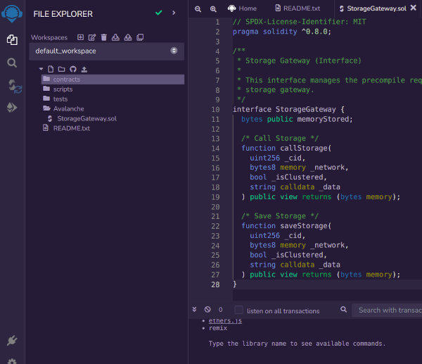

# Precompile Storage Gateway

Provides a gateway to externally stored data directly from within a smart contract call.

# Table of contents

- [Introduction](#introduction)
  - [Prerequisites](#prerequisites)
  - [Requirements](#requirements)
- [Getting Started](#getting-started)
  - [Supported networks](#supported-networks)
- [Installation](#installation)
- [Smart Contracts](#smart-contracts)
  - [Storage gateway](#storage-gateway)
  - [Get storage](#get-storage)
  - [Set storage](#set-storage)
- [Warnings](#warnings)
- [Conclusion](#conclusion)
  - [Recap of what we learned](#recap-of-what-we-learned)
  - [Troubleshooting](#troubleshooting)
  - [Popular use-cases](#popular-use-cases)
  - [Recommended resources](#recommended-resources)

## Introduction

The goal of this Precompile contract is to enable on-chain contracts the ability to save and retrieve dynamic content to and from external storage networks. This Precompile contract exists at address `0x53C`.

### Prerequisites

To get the most out of this tutorial, you will need to have a basic understanding of:

- General understanding of the [__Remix IDE__](http://remix.ethereum.org/)  
_How to write and deploy a Solidity smart contract_
- General understanding of the [__Solidity language__](https://docs.soliditylang.org/)
- General understanding of [__Precompiles__](https://docs.avax.network/subnets/customize-a-subnet#precompiles)

To get started with these topics or for a comprehensive review, see the [Recommended Resources](#recommended-resources) to learn more.

### Requirements

- Ubuntu
- Metamask wallet

👇 __Watch a short walk-through of what we'll cover in this tutorial__ 👇

[](assets/intro.webm)

__↳__ [___click here to watch the full-screen Introduction video___](assets/intro.webm) &nbsp; 👀 🍿

## Getting Started

This precomiled contract offers the following new EVM features &amp; benefits to your Subnet:

1. Contracts can read / write external data storage systems.
2. Save and load information from multiple storage systems, eg. IPFS, AWS, Storj, Azure, Sia, Dropbox and more..
3. Use immutable or named (mutable) files.
4. Perform caching on-chain.

:::info

__Did you know? —__ You can easily customize the user permissions, gas and precompiled contracts for your Subnet using the new Avalanche CLI.

:::

### Supported networks

Allows Avalanche to interact with several decentralized storage systems that can hold a bigger data load that the on-chain, for example:

- [x] __IPFS__ — [https://ipfs.io](https://ipfs.io)
- [ ] __AWS__ — [https://aws.amazon.com](https://aws.amazon.com)
- [ ] __Storj__ — [https://www.storj.io](https://www.storj.io)
- [ ] __Azure__ — [https://azure.microsoft.com/en-us/services/storage/files](https://azure.microsoft.com/en-us/services/storage/files)
- [ ] __Sia__ — [https://sia.tech](https://sia.tech)
- [ ] __Dropbox__ — [https://www.dropbox.com](https://www.dropbox.com)

An IPFS contract becomes an oracle for information that comes from IPFS.

## Installation

__Steps to install:__

1. Clone the [__Subnet EVM__](https://github.com/ava-labs/subnet-evm.git) repo

```bash
git clone https://github.com/ava-labs/subnet-evm.git
```

2. Modify `params/config.go`

```bash
vim params/config.go
```

- add this line ↴

```json
  StorageGatewayConfig            precompile.StorageGatewayConfig            `json:"storageGateway,omitempty"`                  // Config for the storage gateway precompile
```

```diff
  ContractDeployerAllowListConfig precompile.ContractDeployerAllowListConfig `json:"contractDeployerAllowListConfig,omitempty"` // Config for the contract deployer allow list precompile
  ContractNativeMinterConfig      precompile.ContractNativeMinterConfig      `json:"contractNativeMinterConfig,omitempty"`      // Config for the native minter precompile
  TxAllowListConfig               precompile.TxAllowListConfig               `json:"txAllowListConfig,omitempty"`               // Config for the tx allow list precompile
  FeeManagerConfig                precompile.FeeConfigManagerConfig          `json:"feeManagerConfig,omitempty"`                // Config for the fee manager precompile
+ StorageGatewayConfig            precompile.StorageGatewayConfig            `json:"storageGateway,omitempty"`                  // Config for the storage gateway precompile
}

```

3. Modify `precompile/params.go`

```bash
vim precompile/params.go
```

- add these lines ↴

```js
    ReadStorageGatewayCost  = 5_000
    WriteStorageGatewayCost = 25_000
```

```diff
// Gas costs for stateful precompiles
const (
	writeGasCostPerSlot = 20_000
	readGasCostPerSlot  = 5_000

	ModifyAllowListGasCost = writeGasCostPerSlot
	ReadAllowListGasCost   = readGasCostPerSlot

	MintGasCost             = 30_000
+	ReadStorageGatewayCost  = 5_000
+	WriteStorageGatewayCost = 25_000

	SetFeeConfigGasCost     = writeGasCostPerSlot * (numFeeConfigField + 1) // plus one for setting last changed at
	GetFeeConfigGasCost     = readGasCostPerSlot * numFeeConfigField
	GetLastChangedAtGasCost = readGasCostPerSlot
)
```

4. Modify `scripts/run.sh`

```bash
vim scripts/run.sh
```

```diff
{
  "config": {
    "chainId": $CHAIN_ID,
    ...
    "subnetEVMTimestamp": 0,
    "feeConfig": {
      "gasLimit": 20000000,
      ...
      "blockGasCostStep": 500000
    },
+   "StorageGateway": {
+     "blockTimestamp": 0
+   }
  },
  "alloc": {
    "${GENESIS_ADDRESS:2}": {
      "balance": "0x52B7D2DCC80CD2E4000000"
    }
  },
  "nonce": "0x0",
  ...
  "parentHash": "0x0000000000000000000000000000000000000000000000000000000000000000"
}
```

5. Finally we add our Precompile `precompile/storage_gateway.go`

_( see this [custom fork of Subnet EVM](https://github.com/avasdao/subnet-evm) )_
:::tip
__Did you know? —__ You can run this command to find your process id.

```
ps aux | grep [a]valanche-network-runner
```
:::

## Smart Contracts

Solidity smart contracts are used to interface with the Precompile contracts.

### Storage gateway

`Type: Interface`

This will reside at `0x53B`, and provide a bridge to the requested storage network, taking as input, in order:

:::caution

__You need to know! —__ It's important to grant your Precompile Contracts as `setEnabled` so that `isEnabled` is `true`. Otherwise, you contract will revert when you attempt to execute a "state-mutating" method.
:::



:::info

__Did you know? —__ The first line tells you that the source code is licensed under the MIT software license. Machine-readable [__SPDX license specifiers__](https://spdx.org/licenses/) are important in a setting where publishing the source code is the default.
:::

- __callStorage__ (`method`)
- __setStorage__ (`method`)

```js
// SPDX-License-Identifier: MIT
pragma solidity ^0.8.0;

/**
 * Storage Gateway (Interface)
 *
 * This interface manages the precompile requests to the external
 * storage gateway.
 */
interface StorageGateway {
  bytes public memoryStored;

  /* Call Storage */
  function callStorage(
	uint256 _cid,
	bytes8 memory _network,
	bool _isClustered,
	string calldata _data
  ) public view returns (bytes memory);

  /* Save Storage */
  function saveStorage(
	uint256 _cid,
	bytes8 memory _network,
	bool _isClustered,
	string calldata _data
  ) public view returns (bytes memory);
}
```

### Get storage

`Type: Method`

This will reside at `0x53B`, and provide a bridge to the requested storage network, taking as input, in order:
- __CID__ [`uint256`] _(content identifier)_
- __Network ID__ [`uint8`] _(ie. IPFS, Storj, Sia, etc)_
- __IsClustered__ [`bool`] _(default is 2-of-3 nodes)_

```js
/**
 * Get Storage
 *
 * User specifies a data identifier and network to query. Validators will
 * connect to the respective network and retrieve the data.
 */
function getStorage(
  uint256 _cid,
  bytes8 memory _network,
  bool _isClustered
) public view returns (bytes memory) {
  /* Initialize stored data holder. */
  bytes memory stored;

  /* Build request package. */
  bytes memory pkg = abi.encodePacked(
	_cid,
	_network,
	_isClustered,
  );

  /* Perform assembly action. */
  assembly {
	/* Initialize free memory. */
	let freemem := mload(0x40)

	/* Append package to memory. */
	let pkg := add(freemem, 12)

	/* Call precompiled contract. */
	// if iszero(staticcall(not(0), 0x53B, add(pkg, 32), 0xd5, stored, 0x40)) {
	if iszero(call(gas(), 0x53b, 0, 0, 0, pkg, 20)) {
	  invalid()
	}

	/* Load stored data. */
	stored := mload(freemem)
  }

  /* Return stored data. */
  return stored;
}
```

#### CID

__Content Identifier__

Type: `uint256`

This will be used to query the respective storage network for the user's requested data.

#### Network ID

Type: `uint8`

Specifies which storage network to query.

#### IsClustered

Type: `bool`

Will allow the request to be made to multiple nodes and validate the results before returning the data.

### Set storage

`Type: Method`

This will reside at `0x53B`, and provide a bridge to the requested storage network, taking as input, in order:
- __CID__ [`uint256`] _(content identifier)_
- __Network ID__ [`uint8`] _(ie. IPFS, Storj, Sia, etc)_
- __IsClustered__ [`bool`] _(default is 2-of-3 nodes)_
- __Data__ [`string`] _(content to store)_

```js
/**
 * Set Storage
 *
 * User specifies a data identifier and network to query. Validators will
 * connect to the respective network and retrieve the data.
 */
function setStorage(
  uint256 _cid,
  bytes8 memory _network,
  bool _isClustered,
  string calldata _data
) public view returns (bytes memory) {
  /* Initialize stored data holder. */
  bytes memory stored;

  /* Build request package. */
  bytes memory pkg = abi.encodePacked(
	_cid,
	_network,
	_isClustered,
	_data
  );

  /* Perform assembly action. */
  assembly {
	/* Initialize free memory. */
	let freemem := mload(0x40)

	/* Append package to memory. */
	let pkg := add(freemem, 12)

	/* Call precompiled contract. */
	// if iszero(staticcall(not(0), 0x53B, add(pkg, 32), 0xd5, stored, 0x40)) {
	if iszero(call(gas(), 0x53b, 0, 0, 0, pkg, 20)) {
	  invalid()
	}

	/* Load stored data. */
	stored := mload(freemem)
  }

  /* Return stored data. */
  return stored;
}
```

#### CID

__Content Identifier__

Type: `uint256`

This will be used to query the respective storage network for the user's requested data.

#### Network ID

Type: `uint8`

Specifies which storage network to query.

#### IsClustered

Type: `bool`

Will allow the request to be made to multiple nodes and validate the results before returning the data.

#### Data

Type: `string`

This is the content that you wish to write to the external storage.

---

## Warnings

:::danger

__You need to know! —__ Data stored on the IPFS network is 100% public and shared amongst its nodes. If you need to protect this data, you MUST encrypt it before storing it on ANY public system.
:::

## Conclusion

Well done, you made it!  
💯 🔥 👏 🎊

There are countless decentralized applications that can utilize the convenience of external storage providers directly accessible to their smart contracts.

### Recap of what we learned

- How to build `subnet-evm` from [source](https://github.com/ava-labs/subnet-evm) with a custom [Precompile](/subnets/customize-a-subnet#precompiles) contract
- How to deploy a [Solidity](https://docs.soliditylang.org/) contract using the [Remix IDE](http://remix.ethereum.org/)
- How to interact with a [Precompile](/subnets/customize-a-subnet#precompiles) contract using the [Ethers.js](https://docs.ethers.io/v5/) library
- How to retrieve metadata from IPFS and use it in a [Solidity](https://docs.soliditylang.org/) contract

:::danger

__You need to know! —__ It's important to grant your Precompile Contracts as `setEnabled` so that `isEnabled` is `true`. Otherwise, you contract will revert when you attempt to execute a "state-mutating" method.
:::

### Troubleshooting

There are still issues that need to be solved, related to:

1. Contract permissions
2. Request timeout

#### Contract permissions

It's important that your requester (could be a contract) is on the list of authorized addresses. You can do so by either setting:

- `setAdmin`
- `setEnabled`

Set your contract address, otherwise, your `setStorage` transaction will get rejected.

#### Request timeout

Some external networks have a high latency. This will occasionally result in a timeout for a data request. It's important to handle these errors in your contract code.

### Possible use-cases

Don't stop here! Let's move on to bigger and better things.

1. NFT artwork storage
2. Music storage
3. Video storage
4. Data archives
5. Rich-media (ie. photos &amp; videos)

### Recommended resources

- [__Developer Documents__](http://docs.avax.network/)  
  _Tap into the official Avalanche documentation_
- [__Discord__](http://chat.avax.network/)  
  _Join the official Avalanche Discord_
- [__Support__](http://support.avax.network/)
- [__Github__](https://github.com/ava-labs/subnet-evm)
- [__Subnets as a Scaling solution__](https://research.thetie.io/subnets/)
- [__A Comparison of Heterogeneous Blockchain Networks__](https://medium.com/@arikan/a-comparison-of-heterogeneous-blockchain-networks-4bf7ff2fe279)
- [__DFK Subnet__](https://twitter.com/_patrickogrady/status/1509683314017275919)

If you want to know more about Avalanche, here's a bunch of links for you:

[Website](https://avax.network/) | [Whitepapers](https://avalabs.org/whitepapers)
| [Twitter](https://twitter.com/avalancheavax) | [Discord](https://chat.avalabs.org/)
| [GitHub](https://github.com/ava-labs) | [Documentation](https://docs.avax.network/)
| [Forum](https://forum.avax.network/) | [Telegram](https://t.me/avalancheavax) | [Facebook](https://facebook.com/avalancheavax)
| [LinkedIn](https://linkedin.com/company/avalancheavax) | [Reddit](https://reddit.com/r/avax)
| [YouTube](http://www.youtube.com/c/AVALabsOfficial)
