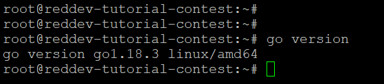

# How to Extend Avalanche's Subnet-EVM with a Stateful Precompile

This tutorial will show you how to extend Avalanche's Subnet-EVM with custom functionality. It adds a novel stateful precompile contract to verify the X-Chain signature of a message that has been signed using the Avalanche Wallet or by other means.

Previously, we at [red·dev](https://www.red.dev) wrote a [tutorial](https://docs.avax.network/community/tutorials-contest/red-dev-sig-verify-tutorial) on the same topic using solidity. But we think it is faster, more user-friendly, and more gas-efficient to recreate it as a stateful precompile that works similarly to `ecrecover()`, a precompile that is already built into Subnet-EVM that can verify C-Chain signatures.

In this tutorial, we describe each step of setting up the environment and adding the new stateful precompile. For more information, see the **Resources** section at the end of this tutorial.

## Audience

To get the most out of this tutorial, you will need to have a basic understanding of Avalanche, Linux, Go (a.k.a. GoLang), Solidity, and how to write dApps and use Remix. If you do not yet know about these topics, see the [**Resources**](#resources) section at the end for links to learn more.

# Prerequisites

1. Ubuntu 20.04 or later
2. [Go 1.18.3](https://storage.googleapis.com/golang/go1.18.3.linux-amd64.tar.gz)
3. [Metamask wallet](https://metamask.io/) set up for use with Local EVM Subnet
4. User with _sudo_ access

## Install Go

Download the Go package. We have used version 1.18.3 for this tutorial:

```
$ wget https://storage.googleapis.com/golang/go1.18.3.linux-amd64.tar.gz
```

Extract `go1.18.3.linux-amd64.tar.gz` to `/usr/local`:

```
$ sudo tar -C /usr/local -xzf go1.18.3.linux-amd64.tar.gz
```

Add `/usr/local/go/bin` to the PATH environment variable. You can do this by adding the following line to your `$HOME/.profile` or `/etc/profile` (for a system-wide installation):

```
export PATH=$PATH:/usr/local/go/bin
```

Verify that you've installed Go by running the command below:

```
$ go version
```



Set `$GOPATH` environment variable properly for Go to look for Go Workspaces. Please read [this](https://go.dev/doc/gopath_code) for details. You can verify by running `echo $GOPATH`.

As some software will be installed into `$GOPATH/bin`, please make sure that `$GOPATH/bin` is in your `$PATH`. Otherwise, you may get errors running the commands below.

## Clone the Subnet-EVM Repo

Download the [`Subnet-EVM`](https://github.com/ava-labs/subnet-evm.git) repository into your `$GOPATH`:

```sh
cd $GOPATH
mkdir -p src/github.com/ava-labs
cd src/github.com/ava-labs
git clone git@github.com:ava-labs/subnet-evm.git
cd subnet-evm
```

This will clone and checkout the `master` branch.

## Add a Stateful Precompile

To add a novel stateful precompile into Subnet-EVM, follow these steps:

1. Modify the [precompile/params.go](https://github.com/ava-labs/subnet-evm/blob/master/precompile/params.go) - which is used to define the designated address for the stateful precompiles.
2. Create your own custom precompile contract and place it under the precompile folder. In this tutorial we have created as an example [contract_xchain_ecrecover.go](./contract_xchain_ecrecover.go). (We reference this example throughout the tutorial. Of course, you'll need to replace each of these references with ones to your own precompile.)
3. Modify the [params/config.go](https://github.com/ava-labs/subnet-evm/blob/master/params/config.go). This supports adding the chain configuration and managed the Subnet-EVM via the `genesis.json` file. Since, the precompiles is optional and can be added or removed from the Subnet-EVM at anytime which can be managed by the `genesis.json` file.
4. Modify the [scripts/run.sh](https://github.com/ava-labs/subnet-evm/blob/master/scripts/run.sh) to include the custom precompile configuration.

### Modify the Parameters File

As we mentioned earlier, the [precompile/params.go](https://github.com/ava-labs/subnet-evm/blob/master/precompile/params.go) is used to define the designated address for the stateful precompiles. The designated address should not be conflict with the any other precompile addresses. For forks of Subnet-EVM, users should start at `0x0300000000000000000000000000000000000000` to ensure that their own modifications do not conflict with stateful precompiles that may be added to Subnet-EVM in the future.

We have taken the address `0x0300000000000000000000000000000000000000` for this tutorial.

Make changes below in the [params.go](https://github.com/ava-labs/subnet-evm/blob/master/precompile/params.go) file at about [line 13](https://github.com/ava-labs/subnet-evm/blob/master/precompile/params.go#L13) to declare the gas estimation value:

```diff
const (
	ModifyAllowListGasCost = 20_000
	ReadAllowListGasCost   = 5_000
	MintGasCost = 30_000
+	XChainECRecoverCost = 10_000
)
```

Next, at about [line 28](https://github.com/ava-labs/subnet-evm/blob/master/precompile/params.go#L28), declare the varaible `ContractXchainECRecoverAddress` and assign the designated contract address:

```diff
var (
	ContractDeployerAllowListAddress = common.HexToAddress("0x0200000000000000000000000000000000000000")
	ContractNativeMinterAddress      = common.HexToAddress("0x0200000000000000000000000000000000000001")
	TxAllowListAddress               = common.HexToAddress("0x0200000000000000000000000000000000000002")
+   	ContractXchainECRecoverAddress   = common.HexToAddress("0x0300000000000000000000000000000000000000")
	UsedAddresses = []common.Address{
		ContractDeployerAllowListAddress,
		ContractNativeMinterAddress,
		TxAllowListAddress,
+       	ContractXchainECRecoverAddress,
	}
)
```

### Create a New Custom Precompile Contract

We have created the example precompile contract [contract_xchain_ecrecover.go](./contract_xchain_ecrecover.go). All stateful precompile contracts should implement the interfaces `Address()`, `Contract()`, `Configure()` and `Timestamp()`.

The `xChainECRecoverReadSignature` contains the function selector which can be used in solidity smart contracts to execute the precompile.

The `getXChainECRecover()` function contains the business logic for verifying the signature and returning the X-Chain address.

Please [go take a look at it now](./contract_xchain_ecrecover.go).

Returning the recovered X-Chain address was the trickiest part of writing this code since Avalanche X-Chain addresses are not in the same format as EVM addresses. You will see at the end that we had to return it as a byte[] but pad it with special bytes at the beginning to prevent an error from being thrown as Solidity interprets it as a string. Depending on the type of data your custom precompile returns, you may encounter a similar issue. Let our pain be your gain!

Note that in the case of a bad signature, the call to the precompile from Solidity may throw an error, or the precompile may return an X-Chain address that does not match the expected X-Chain address. Both responses should be considered negative. The only positive response is if the X-Chain address returned exactly matches the expected X-Chain address.

### Modify the Config File

As we mentioned earlier, the [params/config.go](https://github.com/ava-labs/subnet-evm/blob/master/params/config.go) is used to add the chain configuration and managed the Subnet-EVM via the `genesis.json` file. Five sections of this file require modifications.

First, at about [line 122](https://github.com/ava-labs/subnet-evm/blob/master/params/config.go#L122), add the new custom contract `ContractXChainECRecoverConfig` in the ChainConfig struct which will manage the new precompile through the `genesis.json` file:

```diff
type ChainConfig struct {
	ChainID *big.Int `json:"chainId"` // chainId identifies the current chain and is used for replay protection
    .....
    .....
+   ContractXChainECRecoverConfig	precompile.ContractXChainECRecoverConfig   `json:"contractXChainECRecover,omitempty"` 		  // Config for the contract XChain ECrecover
}
```

Second, at about [line 261](https://github.com/ava-labs/subnet-evm/blob/master/params/config.go#L261), create a function to return the fork enabled status based on block timestamp:

```diff
func (c *ChainConfig) IsTxAllowList(blockTimestamp *big.Int) bool {
	return utils.IsForked(c.TxAllowListConfig.Timestamp(), blockTimestamp)
}
+ func (c *ChainConfig) IsXChainECRecover(blockTimestamp *big.Int) bool {
+	  return utils.IsForked(c.ContractXChainECRecoverConfig.Timestamp(), blockTimestamp)
+ }
```

Third, at about [line 496](https://github.com/ava-labs/subnet-evm/blob/master/params/config.go#L496), introduce a boolean variable `IsContractXChainECRecoverEnabled` to enable mapping of the addresses to the stateful precompile:

```diff
type Rules struct {
	ChainID                                                 *big.Int
  	.....
  	.....

	// Optional stateful precompile rules
	IsContractDeployerAllowListEnabled bool
	IsContractNativeMinterEnabled      bool
	IsTxAllowListEnabled               bool
+ 	IsContractXChainECRecoverEnabled   bool

	// Precompiles maps addresses to stateful precompiled contracts that are enabled
	// for this rule set.
	// Note: none of these addresses should conflict with the address space used by
	// any existing precompiles.
	Precompiles map[common.Address]precompile.StatefulPrecompiledContract
}
```

Fourth, at about [line 533](https://github.com/ava-labs/subnet-evm/blob/master/params/config.go#L533), set the enabled status of the `IsContractXChainECRecoverEnabled` by checking whether a fork scheduled at given block timestamp is active at the given head block:

```diff
func (c *ChainConfig) AvalancheRules(blockNum, blockTimestamp *big.Int) Rules {
  .....
  .....
  rules.IsContractDeployerAllowListEnabled = c.IsContractDeployerAllowList(blockTimestamp)
	rules.IsContractNativeMinterEnabled = c.IsContractNativeMinter(blockTimestamp)
	rules.IsTxAllowListEnabled = c.IsTxAllowList(blockTimestamp)
+ 	rules.IsContractXChainECRecoverEnabled = c.IsXChainECRecover(blockTimestamp)

	// Initialize the stateful precompiles that should be enabled at [blockTimestamp].
	rules.Precompiles = make(map[common.Address]precompile.StatefulPrecompiledContract)
    .....

	return rules
}
```

And fifth, at about [line 563](https://github.com/ava-labs/subnet-evm/blob/master/params/config.go#L563), include your custom precompiles into the stateful precompiled configs:

```diff
func (c *ChainConfig) enabledStatefulPrecompiles() []precompile.StatefulPrecompileConfig {
	statefulPrecompileConfigs := make([]precompile.StatefulPrecompileConfig, 0)

	if c.ContractDeployerAllowListConfig.Timestamp() != nil {
		statefulPrecompileConfigs = append(statefulPrecompileConfigs, &c.ContractDeployerAllowListConfig)
	}
    	.....
    	.....
+   	if c.ContractXChainECRecoverConfig.Timestamp() != nil {
+ 		statefulPrecompileConfigs = append(statefulPrecompileConfigs, &c.ContractXChainECRecoverConfig)
+ 	}
}
```

### Modify the Run Script

The script [scripts/run.sh](https://github.com/ava-labs/subnet-evm/blob/master/scripts/run.sh) by default includes the default configuration. Since, the precompiles created under precompile folder are optional and can be added to the Subnet-EVM by configuring in the `genesis.json` file.

Modify the default `genesis.json` setting in the [scripts/run.sh](https://github.com/ava-labs/subnet-evm/blob/master/scripts/run.sh) to enable the custom precompile. At about [line 125](https://github.com/ava-labs/subnet-evm/blob/master/scripts/run.sh#L125) under the `config` object, add the configuration for custom precompile. The configuration name `contractXChainECRecover` can be derived from [params/config.go line 122](https://github.com/ava-labs/subnet-evm/blob/master/params/config.go#L122):

```diff
{
  "config": {
    "chainId": $CHAIN_ID,
    "homesteadBlock": 0,
    "eip150Block": 0,
    .....
    .....
    "feeConfig": {
      "gasLimit": 20000000,
      .....
      .....
      "blockGasCostStep": 500000
    },
+     "contractXChainECRecover": {
+       "blockTimestamp": 0
+     }
  },
  "alloc": {
    "${GENESIS_ADDRESS:2}": {
      "balance": "0x52B7D2DCC80CD2E4000000"
    }
  },
  "nonce": "0x0",
  ....
  ....

}
```

## Run the Local Subnet-EVM

The final step is to run the local Subnet-EVM.

[`scripts/run.sh`](https://github.com/ava-labs/subnet-evm/blob/master/scripts/run.sh) automatically installs `avalanchego`, sets up a local network,
and creates a `Subnet-EVM` genesis file. The usage of this script is:

```bash
./scripts/run.sh [AVALANCHEGO VERSION] [GENESIS_ADDRESS]
```

```bash
# to startup a local cluster (good for development)
cd ${HOME}/go/src/github.com/ava-labs/subnet-evm
./scripts/run.sh 1.7.13 0x8db97C7cEcE249c2b98bDC0226Cc4C2A57BF52FC
```

Note that this address (`0x8db97C7cEcE249c2b98bDC0226Cc4C2A57BF52FC`) is a prefunded address on the local network, see [here](https://docs.avax.network/quickstart/fund-a-local-test-network) for more info. The private key for this address is
`0x56289e99c94b6912bfc12adc093c9b51124f0dc54ac7a766b2bc5ccf558d8027`.

With this command, `avalanchego`, `avalanche-network-runner` and `GoLang` packages will be downloaded and installed on a `/tmp` directory. Note: please make sure that your have fast internet connection to download these packages, otherwise, it will take a long time.

Once the the network is started up, the following info will be printed to the console (parts clipped for brevity):

```bash
cluster is ready!

Logs Directory: /var/folders/0h/v4nrbbsn1vvbr5h2wfrh5h500000gn/T/network-runner-root-data2328077371

EVM Chain ID: 99999
Funded Address: 0x8db97C7cEcE249c2b98bDC0226Cc4C2A57BF52FC
RPC Endpoints:
- http://127.0.0.1:14463/ext/bc/28N1Tv5CZziQ3FKCaXmo8xtxoFtuoVA6NvZykAT5MtGjF4JkGs/rpc
.
.
.
WS Endpoints:
- ws://127.0.0.1:14463/ext/bc/28N1Tv5CZziQ3FKCaXmo8xtxoFtuoVA6NvZykAT5MtGjF4JkGs/ws
.
.
.
MetaMask Quick Start:
Funded Address: 0x8db97C7cEcE249c2b98bDC0226Cc4C2A57BF52FC
Network Name: Local EVM
RPC URL: http://127.0.0.1:14463/ext/bc/28N1Tv5CZziQ3FKCaXmo8xtxoFtuoVA6NvZykAT5MtGjF4JkGs/rpc
Chain ID: 99999
Curreny Symbol: LEVM
network-runner RPC server is running on PID 79100...

use the following command to terminate:

pkill -P 79100
kill -2 79100
pkill -9 -f srEXiWaHuhNyGwPUi444Tu47ZEDwxTWrbQiuD7FmgSAQ6X7Dy
```

You can then ping the local cluster or add the network to MetaMask:

```bash
curl --location --request POST 'http://127.0.0.1:14463/ext/bc/28N1Tv5CZziQ3FKCaXmo8xtxoFtuoVA6NvZykAT5MtGjF4JkGs/rpc' \
--header 'Content-Type: application/json' \
--data-raw '{
    "jsonrpc": "2.0",
    "method": "eth_blockNumber",
    "params":[],
    "id": 1
}'
```

Response:

```json
{
  "jsonrpc": "2.0",
  "id": 1,
  "result": "0x0"
}
```

To terminate the cluster, run the following commands:

```bash
pkill -P 79100
kill -2 79100
pkill -9 -f srEXiWaHuhNyGwPUi444Tu47ZEDwxTWrbQiuD7FmgSAQ6X7Dy
```

## Connect with Metamask

Please use the value provided by `MetaMask Quick Start` to connect with Metamask.

```text
MetaMask Quick Start:
Funded Address: 0x8db97C7cEcE249c2b98bDC0226Cc4C2A57BF52FC
Network Name: Local EVM
RPC URL: http://127.0.0.1:14463/ext/bc/28N1Tv5CZziQ3FKCaXmo8xtxoFtuoVA6NvZykAT5MtGjF4JkGs/rpc
Chain ID: 99999
Curreny Symbol: LEVM
```

You can create a new metamask account by importing the private key `0x56289e99c94b6912bfc12adc093c9b51124f0dc54ac7a766b2bc5ccf558d8027`, and then you can start working with this account.

## Using the Precompile from Remix

You can copy paste the Solidity interface [contract_xchain_ecrecover.sol](./contract_xchain_ecrecover.sol) into Remix and compile it by hitting “Compile contract_xchain_ecrecover.sol”.

Once you’ve compiled the interface, you can navigate to the Deploy tab in remix, select “Injected Web3” for your local environment so that you can interact with your EVM instance, and paste the address `0x0300000000000000000000000000000000000000` of the precompile in the field to the right of “At Address”.

Clicking “At Address” will deploy the interface at that address, as if you had deployed a fully implemented contract in Solidity, and from there you can interact with the precompile directly in Solidity.

As input to the `getXChainECRecover()` function, pass the prefixed hashed message, r, s and v from the signature as arguments. The function will return the X-chain address which signed the message.

### Extraction Tool

For your convenience, we have created a simple tool to make it easy to extract the prefixed hashed message and the r, s, and v values required by this function: [Avalanche Wallet Signature Extraction Tool](https://rediyeti.com/avax-sig-extraction-tool)

# Resources

Here is a list of resources that can give you background and additional information about the topics mentioned in this tutorial.

1. [Customizing the EVM with Stateful Precompiles](https://medium.com/avalancheavax/customizing-the-evm-with-stateful-precompiles-f44a34f39efd)
2. [Customize a Subnet](https://docs.avax.network/subnets/customize-a-subnet)
3. [Create an EVM Subnet on a Local Network](https://docs.avax.network/subnets/create-a-local-subnet)
4. [Remix](https://remix-project.org/)
5. [GoLang](https://go.dev/)

# Conclusion

The ability to add stateful precompiles to an Avalanche Subnet based on Subnet-EVM opens up a world of possibilities. We chose to write a precompile to address one significant use-case pertaining to Subnet inter-communication, the ability to verify signatures signed with Avalanche X-Chain addresses, but the possibilities are endless. In any case, no matter what particular precompile you chose to write, you can follow the steps in this tutorial to integrate it into your fork of the Subnet-EVM.
