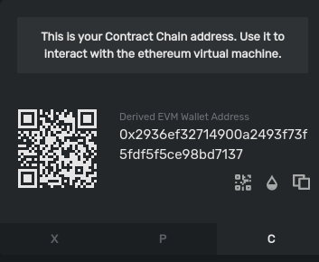

# Create an Auction Bidding on Avalanche using ReactJS

Learn how to create an Avalanche-based auction bidding with a ReactJS frontend.

# Introduction

We will learn how to build smart contracts by making an auction bidding and deploy them on Avalanche and interact with them using ReactJS and Drizzle.

We are going to generate [ReactJS](https://reactjs.org) boilerplate code using `create-react-app`, which we will modify for our auction bidding frontend. React is useful for the frontend due to its efficiency and user-friendly blockchain interaction. For the backend,  [Solidity](https://docs.soliditylang.org/en/v0.8.4/) smart contracts will be deployed to the Avalanche blockchain using [Truffle Suite](https://www.trufflesuite.com). 

## Prerequisites

* Basic familarity with [NodeJS](https://nodejs.org/en) and [npm](https://www.npmjs.com/).
* Basic familarity with [ReactJS](https://reactjs.org/), [React context APIs](https://reactjs.org/docs/context.html) and [Drizzle](https://www.trufflesuite.com/drizzle).
* Basic familarity with [Avalanche](https://avax.network) network, [Solidity](https://docs.soliditylang.org/en/v0.8.6/) and [Truffle](https://www.trufflesuite.com/truffle).

## Requirements

* [NodeJS](https://nodejs.org/en) >= 10.16 and [npm](https://www.npmjs.com/) >= 5.6 installed.
* [Truffle](https://www.trufflesuite.com/truffle), which can be installed globally with `npm install -g truffle`
* [Metamask](https://metamask.io) extension added to the browser.

**Note: Do not download Metamask from an unofficial source**.

# Initialize the project directory & install all dependencies

The developer needs to set up a working directory according to ReactJS and Truffle.

Follow the steps below to create the application. Open up the terminal and navigate to the directory where you would like to create this application.
Now create a new directory with `mkdir <directory_name>` command. Change the current directory to this newly created directory using `cd <directory_name>`. For instance: if we name it `bid`, then

```bash
mkdir bid
cd bid
```

## Setup the ReactJS project

Let us now create a new react app using _npx_ (npm package runner). The typical use is to download and run a package temporarily or for trials. Using _npx_ to execute the package binaries for `create-react-app` will generate a new React app scaffold in the specified directory.

```bash
npx create-react-app client
```

Now change to the recent directory "client" using `cd client` command and install the required dependencies using

```bash
npm install --save dotenv web3 @truffle/contract @truffle/hdwallet-provider @drizzle/store
```

Open the file `index.js` inside the `src` directory and replace the existing code with the following code.

```javascript
import React from 'react';
import ReactDOM from 'react-dom';
import App from './App';

import { Drizzle } from "@drizzle/store";
import drizzleOptions from './drizzleOptions';
import { DrizzleProvider } from './drizzleContext';

const drizzle = new Drizzle(drizzleOptions);

ReactDOM.render(
  <DrizzleProvider drizzle={drizzle}>
    <App/>
  </DrizzleProvider>
  ,
  document.getElementById('root')
);
```

Next step: Open up the `App.js` file present inside the `src` directory and replace the existing code with the following code mentioned below.

```javascript
import Auction from "./Auction";
import { useDrizzleContext } from "./drizzleContext";

function App() {
  const {drizzleVariables} = useDrizzleContext();

  if(!drizzleVariables.initialized) {
    return "Loading..."
  } else {
    return <Auction/>
  }
}

export default App;
```

By doing the above steps, the ReactJS project setup is completed.

## Setup the Truffle project

To create a boilerplate for the Truffle project execute the following command in the project root directory.

```bash
truffle init
```
Now, the initial project is being set up. Solidity code will be stored in the `contracts` directory. Deployment functions written in JavaScript will be stored in the `migrations` folder. By default, the `/build/contracts` folder contains information about the compiled and deployed contract, like the ABI, in JSON format. These meta-files are commonly referred to as `artifacts`.
 
`truffle-config.js` is another *config* file created by the `truffle init` command. This file carries a lot of information like how to deploy a contract, how to choose a network to deploy the following contract, and much more. Thus it became a priority to save this file for reference and we can create a copy of this file using the command mentioned below.

```bash
cp truffle-config.js truffle-config-default.js
```

Now, the name of the copied file will be `truffle-config-default.js`. Consequently, we will update the `truffle-config.js` file, with the information needed to deploy the smart contract on the Fuji test network. This file helps us in connecting to the Avalanche node, and we will require an Avalanche wallet mnemonic for deploying the contract on the network.

```javascript
require("dotenv").config();
const HDWalletProvider = require("@truffle/hdwallet-provider");

// Account credentials from which our contract will be deployed
const MNEMONIC = process.env.MNEMONIC;

module.exports = {
  contracts_build_directory: "./src/build/contracts",
  networks: {
    development: {
      host: "127.0.0.1",
      port: 7545,
      network_id: "*",
    },
    fuji: {
      provider: function () {
        return new HDWalletProvider({
          mnemonic: MNEMONIC,
          providerOrUrl: `https://api.avax-test.network/ext/bc/C/rpc`,
        });
      },
      network_id: "*",
      gas: 3000000,
      gasPrice: 470000000000,
      skipDryRun: true,
    },
  },
  compilers: {
    solc: {
      version: "0.8.0"
    }
  }
};
```
Here we are setting the `gas` and `gasprice` to an appropriate value of the Avalanche C-chain. The developer may observe that `contract_build_directory` is being used to change the default location of `artifacts` from the project root directory to the `src` folder. Since React is unable to access the files present outside the `src` folder.

## Recieve Avalanche Credentials

For deploying smart contracts we need two things: A node connected to the Avalanche network and an account with few AVAX. Avalanche connected node through RPC (Remote Procedure Call) is provided for free by the Avalanche Networks.

Now we need an Avalanche wallet, where we would keep our funds, required for all the transactions on the network. So, visit [here](https://wallet.avax.network) and create an account. Save the mnemonic in a secure place (we would need it later). Instructions to add funds will be provided later in the tutorial.

### **Add .env file**

Now we need an **Avalanche** wallet, where we would keep our funds, required for all the transactions on the network. Visit the [Avalanche Wallet](https://wallet.avax.network/) and create an account. While creating your account you will see your public address and mnemonic. This public address will be required to transfer funds. Save the **mnemonic** in a secure place, we will need it later. Instructions to add funds will be provided later in the tutorial.

Create a `.env` file in the project root folder. Please take a note that dot (.) is necessary for the `.env` file name. Now copy your Avalanche wallet's mnemonic in the .env file as shown below. In the .env file, **MNEMONIC** should be enclosed within double-quotes (" ").

```bash
MNEMONIC="<avalanche-wallet-mnemonic>"
```

> Never share or commit your `.env` file. It contains your credentials like `mnemonics`. Therefore, it is advised to add `.env` to your `.gitignore` file.

Now, the project setup is completed, and run the command given below in the project root folder to check whether we are on the same page or not.

```bash
npm start
```

## Create Auction smart contract

Create an `Auction.sol` (sol stands for solidity) file inside the contracts directory and use the code given in this [file](./contracts/Auction.sol).

`Auction` is a solidity contract which enables us to view Auction details and correspondingly its minimum price. We will be accessing the deployed Auction contracts using their `address` and `ABI`. Each time when a new auction is created, the solidity code will be deployed to the blockchain.

## Let's understand this contract in detail

### Users, bids, auctions and analytics

```solidity
// List of all auctions
Auction[] public auctions;

// Mapping for storing user info, bids and auction analytics
mapping (uint => User) public users;
mapping (uint => Bid[]) public bids;
mapping (uint => AuctionAnalytics) public auctionAnalytics;
```
The above block of code will declare public variables for storing user information, bids, auctions, and auction analytics. Have a look at the structures like User, Bid, etc of used in these variables.

### Function to check registered user

```solidity
// Public function to check the registration of users (public address)
function isRegistered(address _publicAddress) public view returns (uint256[2] memory) {
    uint256[2] memory result = [uint256(0), uint256(0)];
    for(uint i = 0; i < uId; i++) {
      if(_publicAddress == users[i].publicAddress) {
        result[0] = 1;
        result[1] = i;
        return result;
      }
    }
    return result;
}
```

This function takes the public address as its argument and returns an integer array with 2 elements - **isRegistered** at index **0** and **userId** at index **1**. If **0th** index is 1 then the user exists and vice-versa. And ** 1st index** represents userId of the user. This function basically iterates over the mapping **users** to check if there is the required public address.

### Auction analytics

We have created a mapping for storing analytics like latest bid, highest bid, lowest bid, etc. for each auction. This mapping will map **auctionId** to **AuctionAnalytic** struct. Every time a new auction is created, we initialize its corresponding entry in the **AuctionAnalytics** map.

### Updating auction analytics

```solidity
// Private function to update auction analytics after the new bids
function updateAucionAnalytics(uint _aId, uint _latestBid) private {
    auctionAnalytics[_aId].latestBid = _latestBid;
    auctionAnalytics[_aId].auctionBidId = auctions[_aId].auctionBidId;
    if(_latestBid < auctionAnalytics[_aId].lowestBid) {
      auctionAnalytics[_aId].lowestBid = _latestBid;
    }
    if(_latestBid > auctionAnalytics[_aId].highestBid) {
      auctionAnalytics[_aId].highestBid = _latestBid;
    }
}
```
Auction analytics needs to be updated every time there is a new bid. So, this function is called whenever a bid is created. It takes **auction id** and **latest bid amount** as its two arguments, and updates the analytics corresponding to the auction.

The rest of the functions are self-explanatory but are well commented for the readers to understand.

## Create Migration smart contracts

Create the file `Migration.sol` inside of the contracts directory and paste the following code:

```solidity 
// SPDX-License-Identifier: MIT
pragma solidity >=0.4.22 <0.9.0;

contract Migrations {
  address public owner = msg.sender;
  uint public last_completed_migration;

  modifier restricted() {
    require(
      msg.sender == owner,
      "This function is restricted to the contract's owner"
    );
    _;
  }

  function setCompleted(uint completed) public restricted {
    last_completed_migration = completed;
  }
}
```
`Migration.sol` smart contract manages the deployment of other contracts that we want to migrate to the chain.

## Create a file for migrating smart contracts

Create a new file in the `migrations` directory named `2_deploy_contracts.js`, and add the following block of code. This handles deploying the `Auction` smart contract to the blockchain.

```javascript
const AuctionManager = artifacts.require("./AuctionManager.sol");

module.exports = function(deployer) {
  deployer.deploy(AuctionManager);
};
```

## Compile Contracts with Truffle

If we have altered the code within our Solidity source files or made new ones (like `Auction.sol`), we need to run `truffle compile` in the terminal, from inside the project root directory.

The expected output would look similar:

```bash
Compiling your contracts...
===========================
> Compiling ./contracts/Auction.sol
> Compiling ./contracts/Migrations.sol

> Artifacts written to /home/guest/blockchain/client/build/contracts
> Compiled successfully using:
   - solc: 0.8.0+commit.c7dfd78e.Emscripten.clang
```

The compiled smart contracts are written as JSON files in the /src/build/contracts directory. These are the stored ABI and other necessary metadata - the artifacts.

> `ABI` refers to Application Binary Interface, which is a standard for interacting with the smart contracts from outside the blockchain as well as contract-to-contract interaction. Please refer to the Solidity's documentation about ABI's [here](https://docs.soliditylang.org/en/v0.5.3/abi-spec.html#:~:text=The%20Contract%20Application%20Binary%20Interface,contract%2Dto%2Dcontract%20interaction.&text=This%20specification%20does%20not%20address,known%20only%20at%20run%2Dtime) to learn more.

## **Fund the account and run migrations on the C-Chain**

During the deployment of the smart contract to the C-chain, deployment cost will be required. Already we have seen this inside `truffle-config.js` HDWallet Provider will help us in deploying on Fuji C-chain and deployment cost will be managed by the account whose mnemonic has been stored in the `.env` file. Therefore, we need to fund the account.

### **Fund your account**

We need funds in our C-Chain address, as smart contracts are deployed on C-Chain i.e. Contract-Chain. This address can easily be found on the [Avalanche Wallet](https://wallet.avax.network) dashboard. Avalanche network has 3 chains: X-Chain, P-Chain, and C-Chain. The address of all these chains can be found by switching tabs at the bottom of the division, where there is a QR code. So, switch to C-Chain, and copy the address. Now fund your account using the faucet link [here](https://faucet.avax-test.network/) and paste your C-Chain address in the input field. Refer to the below image, to identify the address section.



> You'll need to send at least `135422040` nAVAX to the account to cover the cost of contract deployments. Here `nAVAX` refers nano-AVAX i.e. billionth of an `AVAX` or simply 1 `nAVAX` = (1/1000,000,000) `AVAX`. Though funding through faucet would give you enough `AVAX` to run multiple deployments and transactions on the network.

## Run Migration

All the required thing has been placed to run and now deploy the `Auction`.

```bash
truffle migrate --network fuji
```
The developer can deploy our contracts on a local network by executing Ganache (Truffle's local blockchain simulation) and using the command mentioned below

```bash
truffle migrate --network development
```
On successful execution of the above command, the developer may find the similar as mentioned below:


```bash
Starting migrations...
======================
> Network name:    'fuji'
> Network id:      1
> Block gas limit: 8000000 (0x7a1200)


1_initial_migration.js
======================

   Deploying 'Migrations'
   ----------------------
   > transaction hash:    0x094a9c0f12ff3158bcb40e266859cb4f34a274ea492707f673b93790af40e9e9
   > Blocks: 0            Seconds: 0
   > contract address:    0x0b1f00d0Af6d5c864f86E6b96216e0a2Da111055
   > block number:        40
   > block timestamp:     1620393171
   > account:             0x80599dd7F8c5426096FD189dcC6C40f47e8e3714
   > balance:             39.71499696
   > gas used:            173118 (0x2a43e)
   > gas price:           20 gwei
   > value sent:          0 ETH
   > total cost:          0.00346236 ETH


   > Saving migration to chain.
   > Saving artifacts
   -------------------------------------
   > Total cost:          0.00346236 ETH


2_deploy_contracts.js
=====================

   Deploying 'AuctionManager'
   ------------------------
   > transaction hash:    0xbeb13fc6bbee250eea9151faf02bfe247ec497294acc84c9b8319ed609ced086
   > Blocks: 0            Seconds: 0
   > contract address:    0xf30D372A6911CCF6BBa1e84c3CEd51cC0F3D7769
   > block number:        42
   > block timestamp:     1620393172
   > account:             0x80599dd7F8c5426096FD189dcC6C40f47e8e3714
   > balance:             39.69235442
   > gas used:            1090212 (0x10a2a4)
   > gas price:           20 gwei
   > value sent:          0 ETH
   > total cost:          0.02180424 ETH


   > Saving migration to chain.
   > Saving artifacts
   -------------------------------------
   > Total cost:          0.02180424 ETH


Summary
=======
> Total deployments:   2
> Final cost:          0.0252666 ETH
```


If you didn't create an account on the C-Chain you'll see this error:

```bash
Error: Expected parameter 'from' not passed to function.
```

If you didn't fund the account, you'll see this error:

```bash
Error:  *** Deployment Unsuccessful***

"Migrations" could not deploy due to insufficient funds
   * Account:  0x090172CD36e9f4906Af17B2C36D662E69f162282
   * Balance:  0 wei
   * Message:  sender doesn't have enough funds to send tx. The upfront cost is: 1410000000000000000 and the sender's account only has: 0
   * Try:
      + Using an adequately funded account
```
The information and ABI of the deployed contract are present in the `src/build/contracts` directory as Auction.json.

## Building the user interface

Our blockchain code, which will act as a backend for this application, is deployed on the chain and now we can code client-side for interacting with the contracts. We will be using Trufflesuite's **Drizzle** library for connecting our web app with blockchain. Drizzle makes the integration process very easy and scalable. It also provides a mechanism to **cache** a particular contract-call, so that, we can get a real-time update of the changes of data on the blockchain.

We will be using **React's context APIs** for facilitating our integration. Context APIs make the use of variables that are declared in the parent component very easy to access in the child components.

It is based upon the **Provider** and **Consumer** concepts. The **Provider** component contains the necessary logic and variables that need to be passed. Then this Provider component is wrapped around the components which want to access its variables. Every child component can access these variables. But in order to access it, we use **Consumer** API. This API will return the variables that are provided by the Provider component (only when called from its child). Look at the below codes for understanding it better.

In the `drizzleContext.js` file, **DrizzleProvider** is the provider component and **useDrizzleContext** is the consumer function. Look at the return statement of these functions. One is returning the Context Provider (provider) and the other the returning the values of the Context itself (consumer).

## Drizzle Option component

Create a file `drizzleOptions.js` inside the `drizzle-auction/client/src/` directory and paste the following code:

```javascript
import AuctionManager from "./build/contracts/AuctionManager.json";

const drizzleOptions = {
    contracts: [AuctionManager]
}

export default drizzleOptions;
```
The `drizzleOptions` constant contains the configuration like contracts we want to deploy, our custom web3 provider, smart contract events, etc. Here we just instantiating only the `AuctionManager` smart contract.

## Index component

Inside the file `index.js` of `src` directory, paste the following code mentioned below:
```javascript
import React from 'react';
import ReactDOM from 'react-dom';
import App from './App';

import { Drizzle } from "@drizzle/store";
import drizzleOptions from './drizzleOptions';
import { DrizzleProvider } from './drizzleContext';

const drizzle = new Drizzle(drizzleOptions);

ReactDOM.render(
  <DrizzleProvider drizzle={drizzle}>
    <App/>
  </DrizzleProvider>
  ,
  document.getElementById('root')
);
```
Importing `Drizzle` from `@drizzle/store` module will help in instantiating the drizzle according to our drizzleOptions. The following line is responsible for this action.
```javascript
const drizzle = new Drizzle(drizzleOptions);
```
Then we wrap the `App` component inside the `DrizzleProvider`, so that, we can use extracted variables (see drizzleContext.js) inside App. We pass the `drizzle` object to the provider component because it will be required to extract other information from it.

## Drizzle Context

Create a file `drizzleContext.js` inside the `drizzle-auction/client/src/` directory and paste the following code mentioned below:

```javascript
import React, { createContext, useContext, useState } from "react";

const Context = createContext();

export function DrizzleProvider({ drizzle, children }) {
    const [drizzleVariables, setDrizzleVariables] = useState({
        initialized: false,
        state: null,
        web3: null,
        accounts: null,
        AuctionManager: null,
        subscriber: null
    })
    const unsubscribe = drizzle.store.subscribe(() => {
        const drizzleState = drizzle.store.getState();
        if (drizzleState.drizzleStatus.initialized) {
            const { web3, accounts } = drizzleState;
            const AuctionManager =  drizzle.contracts.AuctionManager.methods;
            const subscriber = drizzleState.contracts.AuctionManager;
            setDrizzleVariables({
                state: drizzleState,
                web3,
                accounts,
                AuctionManager,
                subscriber,
                initialized: true
            });
        }
    });
    drizzleVariables.initialized && unsubscribe()
    
    return <Context.Provider value={{drizzle, drizzleVariables}}>{children}</Context.Provider>;
}

export function useDrizzleContext() {
  const context = useContext(Context);
  return context;
}
```
**DrizzleProvider** function takes **drizzle** as its argument and extracts other information like whether drizzle contracts are initialized or not, web3 info, account info, deployed contract's instance, etc. We need to **subscribe** to the drizzle's **store** for this information because these data are not fetched at once, and since we do not know when will we get these data, we subscribe to the store (where all data resides). Once the drizzle is initialized with contract data, we **unsubscribe** to store, so that, it will not re-render infinitely many times.

### Drizzle state

```javascript
const drizzleState = drizzle.store.getState();
```
This variable holds the state of the store which consists of data like web3 provider, account info, cached call information, etc. Cached calls are those contract calls for which we want real-time data from the blockchain. Whenever there is some change in our data on the blockchain, it gets notified in the drizzle state variable of the store.

### AuctionManager

```javascript
const AuctionManager =  drizzle.contracts.AuctionManager.methods;
```
`drizzle.contracts` is an object which contains instances of all the deployed contracts which are added to drizzle (in drizzleOptions or manually). We are simply storing all the **methods** of this contract instance, so that, whenever we want to call a function or public identifier from this contract, we can simply use `AuctionManager.method_name().call()`

## App component
Now open `App.js` inside the `drizzle-auction/client/src/` directory and paste the following code as mentioned below:
```javascript
import Auction from "./Auction";
import { useDrizzleContext } from "./drizzleContext";

function App() {
  const {drizzleVariables} = useDrizzleContext();

  if(!drizzleVariables.initialized) {
    return "Loading..."
  } else {
    return <Auction/>
  }
}

export default App;
```
`drizzleVariables.initialized` would ensure that, `Loading...` state is visible until Drizzle is ready for interaction.

## Auction Component

Create a file `Auction.js` inside the `drizzle-auction/client/src/` directory. and paste the code given in this [file](./frontend/Auction.js.md). This component deals with the entry-point of our application, where all the data like `userInfo`, `AuctionLists`, `AuctionDetails` etc. get generated.

In order to keep data fresh from the blockchain, Drizzle uses the caching mechanism. On our behalf Drizzle keeps track of every change on the blockchain. If there is any transaction involving our smart contracts, then it will notify our DApp.

We need to specifically define the calls which we want to monitor. Caching a particular method will provide cache keys (hash) to us. Each cached method is associated with a particular unique hash. Using this key, we can get live data from the blockchain, and the component will re-render anytime there is some new value associated with this call.

For example, in the above code, we used the following cache keys

```javascript
const [cacheKeys, setCacheKey] = useState({
    uId: null,
    aId: null,
    showAuctions: null,
    isRegistered: null,
    auctionAnalytics: [null]
});
```
Suppose we want to cache `isRegistered` method, then this can be done using 
```javascript
const _isRegistered = AuctionManager?.isRegistered?.cacheCall(accounts[0]);
setCacheKey({
    isRegistered: _isRegistered
})
```
Once a method is cached, the Drizzle `store` would create a `key-value` pair representing hash-key and real-time data associated with this call. In the above program, this is data is accessed using the `subscriber` variable as follows
```javascript
const realTimeIsRegistered = subscriber?.isRegistered[cacheKeys?.isRegistered]?.value
```
In this component, we made a simple object of cached call variables named `cacheCall`, which implements the above code snippet. The cached version of `isRegistered` can be accessed as `cacheCalls.isRegistered`.

## Auction List

Create a file `Auctionlist.js` inside the `drizzle-auction/client/src/` directory and use the code as given in this [file](./frontend/AuctionList.js.md). This component deals with the management of the auction like creating a new bid, displaying the real-time auction analytics, etc. All these data are passed by its parent component i.e. `Auction.js` which manages the cache keys and calls.

## Creating new Auctions

Create a file `CreateAuction.js` inside the `drizzle-auction/client/src/` directory and use the code as given in this [file](./frontend/CreateAuction.js.md). This component deals with creation of new Auctions, by submitting transactions on the network.

## Starting the application

Now go to the project root directory of the project, i.e. `drizzle-auction` directory, and run the command `npm start`. The ReactJS server would start automatically. Visit [http://localhost:3000](http://localhost:3000) to interact with the built dApp.

Don't forget to set up Metamask with Avalanche Fuji testnet and also fund the account with Avalanche test tokens to upload files.

In the Metamask extension, add a custom RPC by clicking at the network dropdown in the center of the extension. Fill in the details as shown in the below image.

| Info | Value |
| :--- | :--- |
| Network Name | Avalanche Fuji |
| New RPC URL | [https://api.avax-test.network/ext/bc/C/rpc](https://api.avax-test.network/ext/bc/C/rpc) |
| Chain ID | 43113 |
| Currency Symbol | AVAX-C |
| Block Explorer URL | [https://testnet.snowtrace.io](https://testnet.snowtrace.io) |


## Conclusion

We have successfully built a dApp through which we can organize auctions, bid in them and declare results, with both frontend and smart contracts. We have used the Drizzle library from Trufflesuite for integrating our frontend with the blockchain and to keep our data updated in real-time.

## Next Steps

Our dApp currently has very minimalistic designs. We can use Consensys' Rimble UI library for adding modals for each transaction, add links to drip Avalanche's test tokens etc. which can help users to navigate through our dApp.

## About the author

This tutorial was created by [Raj Ranjan](https://www.linkedin.com/in/iamrajranjan).
