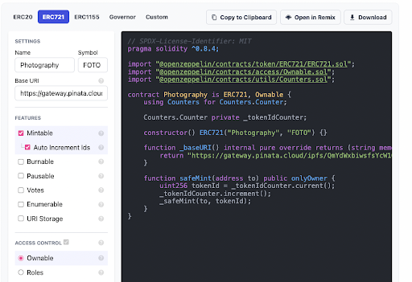
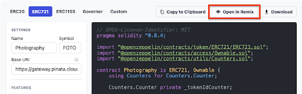
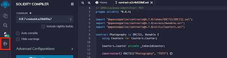
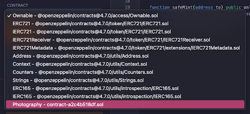
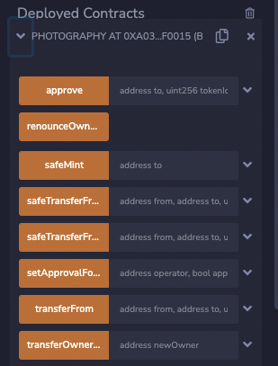
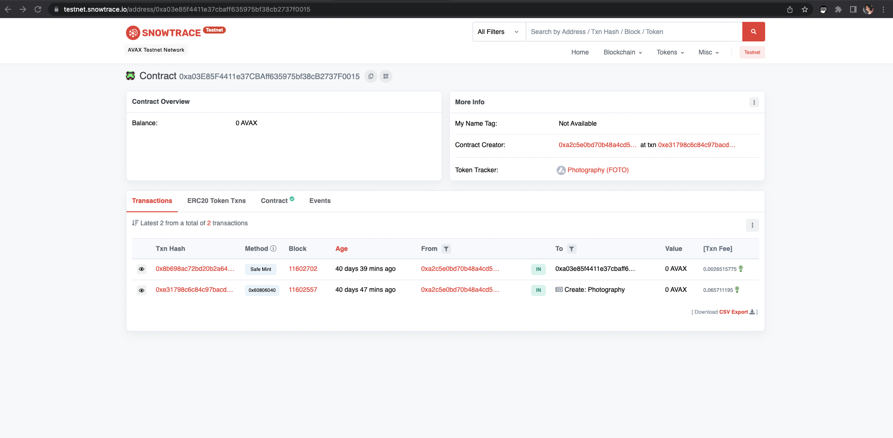

# Introduction to ERC-721 (NFT) Smart Contracts

This tutorial will start you with a basic [ERC-721 (NFT)](https://eips.ethereum.org/EIPS/eip-721) smart contract on the Avalanche Network, regardless of your previous development experience. We'll deploy our NFT on the Avalanche Fuji Testnet and view it on the Snowtrace Testnet Explorer. Note that these aren't transferable to the Mainnet. However, once you feel comfortable launching your project, you can do so on Avalanche Mainnet and list it on an NFT marketplace.

The following tools will be used during this tutorial:

- [Pinata](https://www.pinata.cloud/): To store your NFT images and metadata.
- [OpenZeppelin’s Wizard](https://wizard.openzeppelin.com/): to create the ERC-721 smart contract.
- [Remix IDE](https://remix-project.org/): To edit the code and deploy it to Fuji.
- [Avalanche Testnet Faucet](https://faucet.avax.network/): To fund the deployment.
- [MetaMask browser Extension](https://chrome.google.com/webstore/detail/metamask/nkbihfbeogaeaoehlefnkodbefgpgknn): To process transactions related to funding and deploying the smart contract.
- [Snowtrace Testnet Explorer](https://testnet.snowtrace.io/): To view the deployed smart contract.

:::caution
DISCLAIMER: This Solidity smart contract tutorial is for demonstration purposes only. Users should consider proper precautions, error handling, and safeguards for production use. No one at Ava Labs is responsible for your development, and you must take full responsibility for ensuring your code is secure.
:::

## Preparing Your NFT Files

The first step of setting up an NFT smart contract is having your NFT files ready to use. In this example, the files will get uploaded to Pinata, a pinning service that prevents files from being garbage collected on IPFS.

If you're unfamiliar with the process of uploading image and metadata files to an IPFS provider for NFT collection usage, please check out [this article on preparing NFT files](preparing-nft-files.md). Ensure that your files are uploaded and your base URI is ready to plug into your smart contract.

Once the image and metadata files are ready, we can prepare to deploy a smart contract.

## Preparing Your Environment

### MetaMask Extension

You'll need the MetaMask Extension installed on whatever browser you're using to be able to fund the deployment of the smart contract. If you've not done so already, download MetaMask and [add the Fuji network to MetaMask](https://support.avax.network/en/articles/6224787-how-to-connect-metamask-to-the-fuji-testnet). Create or import a Fuji account as necessary.

### Getting Testnet Funds

Because we're deploying on the Fuji Network, you'll need to get AVAX on the Fuji network. If you visit the [Avalanche Faucet](https://faucet.avax.network/), you can request up to 2 Fuji AVAX per day. Please enter the C Chain address of the account linked to your MetaMask in the previous step.

## Creating the Smart Contract

To create the smart contract, we're going to use [Open Zeppelin](https://docs.openzeppelin.com/). Open Zeppelin is a key tool for building smart contracts quickly and easily. While we're only scratching the surface in this tutorial, ample documentation is available on their website for you to read when you want to build more complex contracts.

Open Zeppelin provides a [Contract Wizard](https://docs.openzeppelin.com/contracts/4.x/wizard) that will build out ERC contracts. To avoid any complex coding environments, we'll use this to create our ERC-721 contract.

Select `ERC-721` on the Contract Wizard to get started. This will create the contract in the [Solidity programming language](https://docs.soliditylang.org/en/v0.8.15/).

As you can see, the template contract is bare-boned. We'll fill out the information in the left panel to auto-populate it into our contract. Make sure you change to the ERC-721 tab as you get started to make the proper contract.

The Wizard auto-fills in a name and symbol for your NFT collection, which we'll modify here. I'm naming it `Photography` and giving it the symbol `FOTO`. If you chose your own files to use during this tutorial, you can choose a relevant name and symbol for your collection.

The Base URI field listed here is the URL of the metadata folder uploaded to Pinata(for example, ours is `https://gateway.pinata.cloud/ipfs/QmYdWxbiwsfsYcW1CYQPgYujAc9FMLPG3fgFcxFskbSsFa`). Paste that into the Base URI field. After the Wizard adds our variables to the template, our contract should look like this:

Next, we'll want to check the `Mintable` and `Auto Increment Ids` boxes. This will populate a mint function into our template that would handle the incrementation of token Ids on mint if we had more than one NFT in our collection. We still want it to auto-assign our 1 NFT, so we'll check it.

This automatically checks the `Ownable` button, which gives the safeMint function the `onlyOwner` modifier. This modifier indicates that only the owner of the smart contract will be able to successfully call the function.

:::info
**Note:** This modifier should be removed when creating a smart contract for a public mint. Otherwise, users wouldn't be able to successfully mint the NFTs when calling the safeMint function. This tutorial only handles the owner’s wallet address, so it is being left in.
:::

Now, our contract is a little more populated:

For this simple example, we'll not add any additional functionality to the `safeMint` function. Currently, it mints one NFT to the address specified in the function call. There is no cost to mint the NFT other than the gas fee for the transaction itself.

This `safeMint` function currently doubles as an airdrop function because the address the NFT is minted to does not need to be the function owner. This functionality becomes very useful when NFT collection owners want to give away NFTs for free outside of the normal minting window.

At this point, our smart contract is ready. At the top, you can click `Open in Remix` to get ready to deploy your smart contract.

## Deploying the Smart Contract with Remix

[Remix IDE](https://remix.ethereum.org/) is a solidity compiler that allows you to edit, compile, and deploy your smart contract. This will prevent you from needing to download any other coding environments at this stage.

Once you've imported your contract, the first thing you need to do is compile it. Hit the `Compile` button on the left-hand side. You could also use the keyboard shortcut `Ctrl / Command + S`.

Once completed, you'll get a green checkmark on the far left tab and will see options to Publish on Ipfs or Swarm. Those aren't important to our tutorial. Next, you'll click on the bottom tab on the left-hand side to move to the deployment page.

Now, we need to change the environment that Remix will try to use to deploy the smart contract. Click on the `Environment` drop-down, and select `Injected web3`.

This should prompt you to connect with your MetaMask account. Once connected, you can verify the correct connection by checking that the Account number matches your MetaMask address.

Now click on the `Contract` drop-down and select the contract you created and compiled. It should show up with the name you gave it in the Open Zeppelin Wizard.

Now, click deploy. This will open MetaMask and ask you to confirm the transaction. Click `Confirm`.

It may take a second, but once completed, your newly deployed contract will appear underneath the `Transactions Recorded` field.

Copy your contract’s address and open the [Snowtrace Testnet Explorer](https://testnet.snowtrace.io/). Paste your contract address in the search bar, and click `Search`.

You'll now see information on your contract. The first transaction you see should be the contract deployment you just did in the Remix IDE.

## Minting an NFT

Now that you've deployed the contract, you can mint the NFT. Go back to the Remix IDE tab and click on your contract to expand its information. A list of functions will appear that you can interact with.

The only function you're interested in is the `safeMint` function. Click the drop-down arrow for the function to expand the address field.

Now, copy your MetaMask address and paste it into this address field. This will send the NFT to your address when the mint function is called. After, hit `transact`.

This will reopen MetaMask and ask you to verify the transaction. Click `Confirm` to mint your NFT.

Once the transaction has been confirmed, you'll see a green checkmark in the terminal at the bottom of the Remix IDE.

Head back to the Snowtrace Testnet explorer page for your contract and refresh it. You should now see a second transaction, your call to safeMint.

By clicking on the Txn Hash, you see that your NFT was created!

