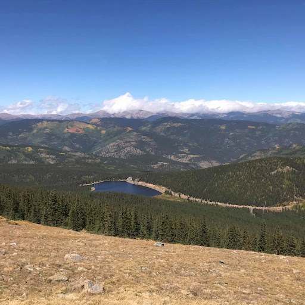
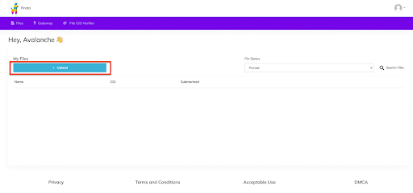
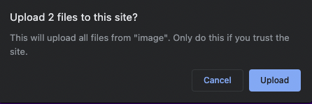

# Preparing NFT Files for an ERC721 Smart Contract

The first step of setting up an NFT smart contract is having your NFT files ready to use. In this example, the files will get uploaded to [Pinata](https://www.pinata.cloud/), a pinning service that prevents files from being garbage collected on IPFS. If you don't already have an account, please create one.

## Preparing the images

This tutorial will create only 1 NFT, however, if you're interested in creating more, you're more than welcome to do so. The image I'm using is linked here if you'd like to use it.



Place your image file in a folder on your computer. Name this image `0`, so it'll be the first image pulled from the smart contract. it'll be the first (and only) NFT in this collection, however, if you're adding more images you'd continue naming them in sequential numeric order. you'll upload this folder to Pinata once your images are organized and named correctly.

:::info
NOTE: Some projects start file names with `0`, and others with `1`. That choice will need to be consistent with the smart contract code. To be consistent with [this ERC-721 tutorial](intro-to-erc721s.md), we'll name this file `0`.
:::


After you log into Pinata, you'll see your dashboard. you'll see the upload button on the left. Click `Upload`, and then `Folder`.




You'll then select the folder that the image is in. You may get a pop-up from your browser confirming you want to upload the folder and the files in it. If you do, confirm by clicking `Upload`.



You'll then be prompted to name the folder you've uploaded. This is beneficial when you have several sets of folders uploaded to Pinata and are trying to keep them organized. After giving it a name, click `Upload` and wait for your file to upload. The quantity and size of the images could affect the upload time, but if you're starting small, it should only take a few seconds.

Once the upload is complete, you'll see your folder in your dashboard.


If you click on the folder name, it'll redirect you to the Pinata gateway to be able to view your newly uploaded files. If you have a paid Pinata account, it'll open the folder through your own gateway. Having a paid plan and personal gateway is NOT required for this tutorial but is recommended to have for larger collection sizes and hosting multiple folders.

If you right-click on the image, you can copy the image’s url. This URL is important. Copy this down to use in the next step as we set up the metadata. For this example, my URL is `https://gateway.pinata.cloud/ipfs/QmPWbixyMsaNkR9v612bBFbncKGmgXDKz9CgMtDDD7Bymw/0.png`

## Preparing the metadata

Now that we have the image uploaded and its URL, we can create the matching metadata file for it.

Where this NFT is going to be an ERC-721, we know we can use metadata standards often found on Marketplaces such as [Joepegs.com](https://joepegs.com). The .json file below is an example of what the [metadata](https://docs.opensea.io/docs/metadata-standards#metadata-structure) should look like.

```json
{
  "name": "",
  "tokenId": 0,
  "image": "",
  "description": "",
  "attributes": []
}
```

Now, we'll populate the values into the metadata file. You can choose any `name` and `description` that you want.

The `tokenId` here will be `0` so that it corresponds to the image we just uploaded. If uploading multiple files, this needs to be incremented in each file.

The `image` link is the URL we saved from the last step of the previous section. Paste that link here so the smart contract knows where to find the image file for your NFT. If uploading multiple files, the end of the URL (the specific image) needs to increment in each file.

The `attributes` field isn't quite as important here, but if you were uploading NFTs with several layers, the attributes would be the information of those specific layers. This is often used when calculating the rarity of NFTs to be able to rank them by how frequently their layers appear throughout the entire collection. it'll be erased in this tutorial.

Below is an example of how you'd fill out the fields in the metadata file.

```json
{
  "name": "Cool Photography",
  "tokenId": 0,
  "image": "https://gateway.pinata.cloud/ipfs/QmPWbixyMsaNkR9v612bBFbncKGmgXDKz9CgMtDDD7Bymw/0.png",
  "description": "A cool image"
}
```

When saving this file, you want it to share the same name as the image it corresponds to. In this case, it is 0.

Once the metadata file is uploaded to Pinata, the file extension will actually not be needed. it'll search for the file as a directory and be able to pull its information from there. To remove the file extension, follow these steps for a [Mac](https://support.apple.com/guide/mac-help/show-or-hide-filename-extensions-on-mac-mchlp2304/mac) environment, or these for a [Windows](https://www.techwalla.com/articles/how-to-remove-file-extensions) environment.

Now that the file extension has been removed, place it in another folder as you did with the image file. They need to be SEPARATE folders.


You'll now repeat the folder upload process to add the metadata to Pinata. Follow the same steps as above. Once completed, you'll have both folders available on your dashboard.


Click on the metadata folder to be directed to the IPFS gateway and save the URL. This URL will be your base URL and won't need the direct file links. The smart contract will append the necessary file information for each NFT as needed. For example, my URL is `https://gateway.pinata.cloud/ipfs/QmYdWxbiwsfsYcW1CYQPgYujAc9FMLPG3fgFcxFskbSsFa`.

Now that the image and metadata files are ready, we can prepare to deploy a smart contractt by following this [ERC-721 tutorial](intro-to-erc721s.md).
