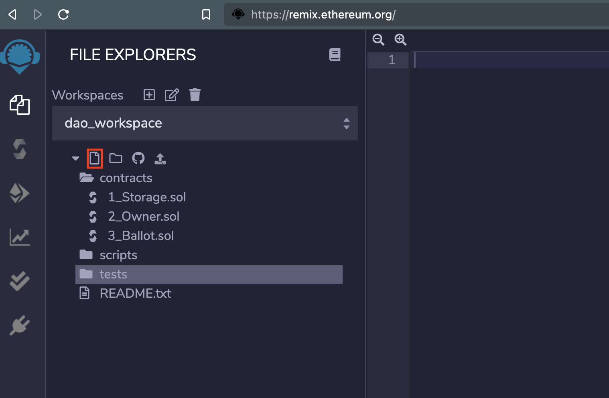
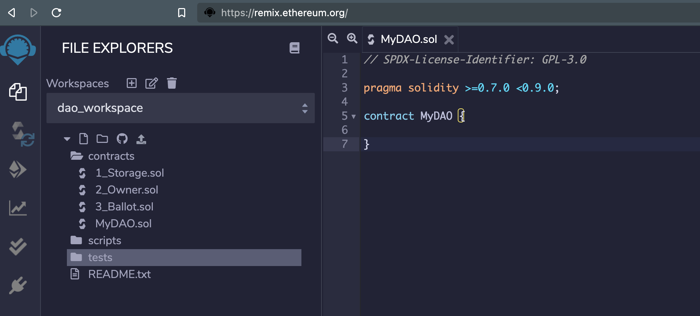
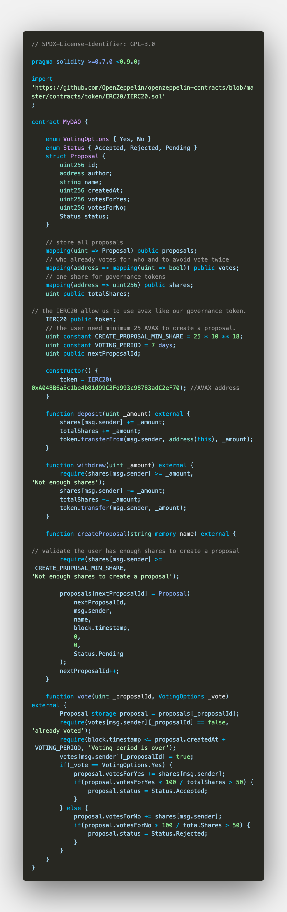
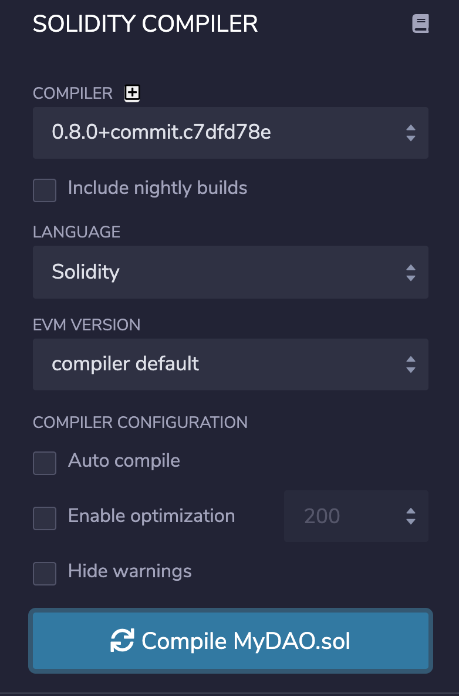
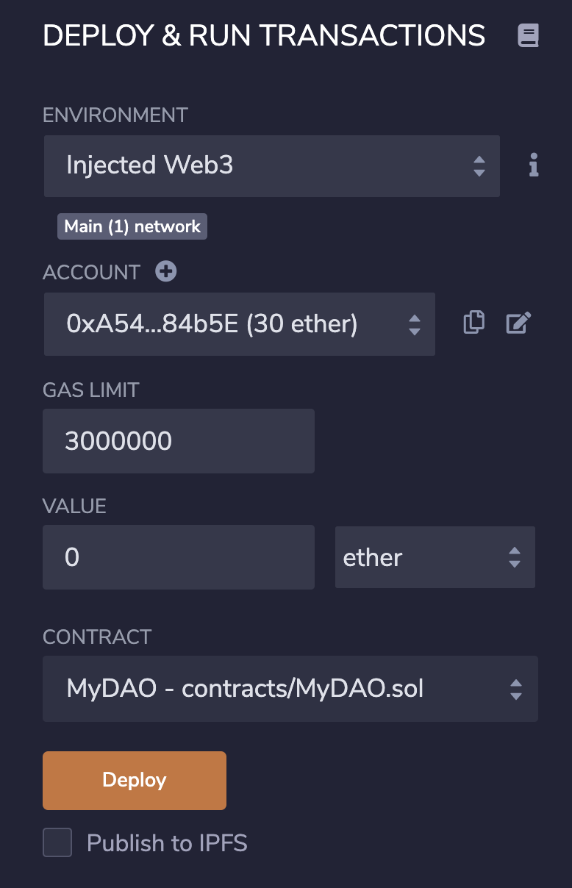
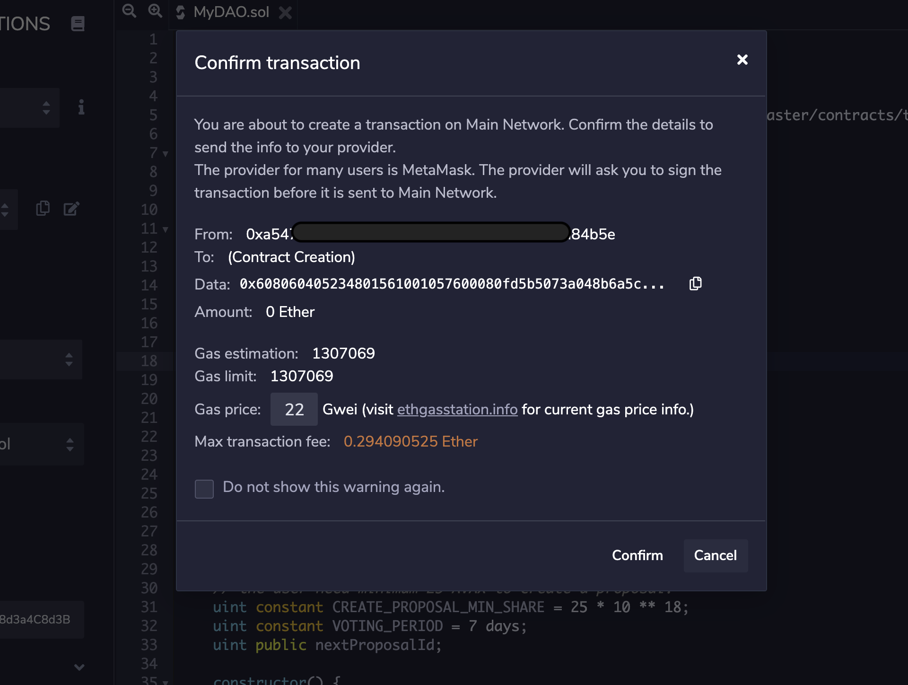
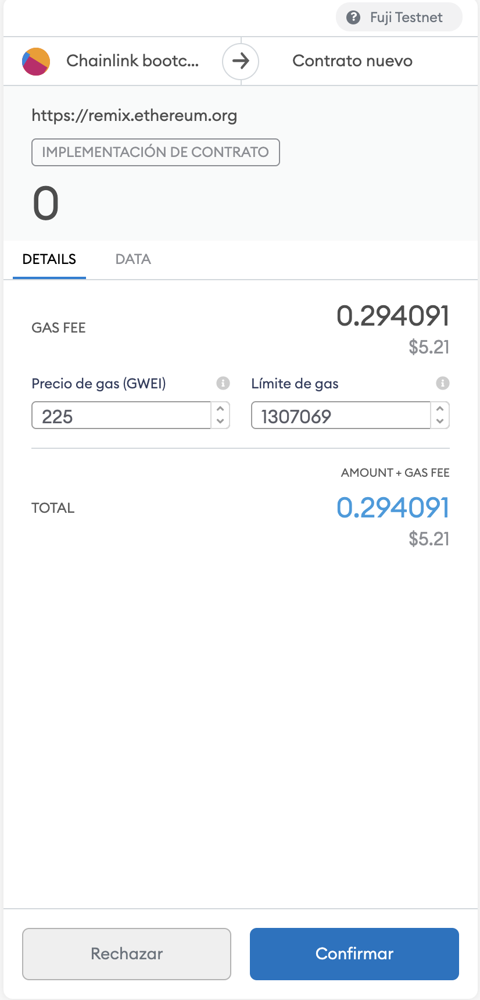
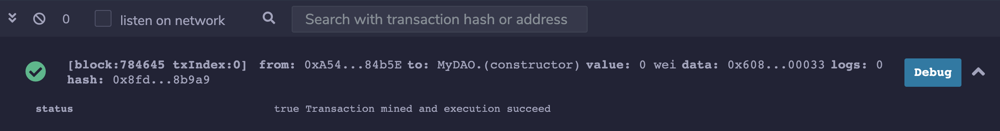

# How to Create Your Own DAO with Avalanche

:::warning

These tutorials were published as a snapshot of when they were written,
and may contain out-of-date-information.
For up-to-date information, please reach out to the owners of these
projects.

:::

## What Is a DAO

The DAO's are systems that help us to work with people around the world in a safe and clear way.

Think of them like an internet-native business that's collectively owned and
managed by its members. They have built-in treasuries that no one has the
authority to access without the approval of the group. Decisions are governed by
proposals and voting to ensure everyone in the organization has a voice.

There's no CEO who can authorize spending based on their own whims and no chance
of a dodgy CFO manipulating the books. Everything is out in the open and the
rules around spending are baked into the DAO via its code.

## How the DAO's Work?

The backbone of a DAO is in smart contracts. The smart contracts defines the
rules of the organization.

Generally the DAO consists of two main smart contracts: the ERC20 token that is
a governance token, and the smart contract that have the rules for the DAO. So
like a DAO's members you need to have some governance tokens and then deposit to
the DAO contract, and then we can create a proposal if the proposal is accepted
the other members in the DAO can start to vote.

The vote is based in how many governance tokens have been deposited on the DAO.

For example if you have a 100 of the governance tokens but you deposited only 20
tokens on the DAO contract only 20 tokens will be taken into account for you
vote.

## Let's Start to Build Our DAO

- **Tools We will use**
  - [REMIX IDE](https://remix.ethereum.org/)
  - [MetaMask Wallet](https://metamask.io/)

> We need to setup the Fuji Testnet on our MetaMask. [`find here the rpc values`](https://docs.avax.network/build/tutorials/smart-contracts/deploy-a-smart-contract-on-avalanche-using-remix-and-metamask)

### Step 1: Creating a New .sol File on REMIX

On REMIX we click the new file icon and put some name, in my case my file name is `MyDAO.sol`



and we add the basic lines of code:

The first line tells you that the source code is licensed under the GPL version
3.0. Machine-readable license specifiers are important in a setting where
publishing the source code is the default.

`pragma` Specifies that the source code is written for Solidity version 0.7.0 or
a newer version of the language up to, but not including version 0.9.0.

`contract MyDAO {...}` specifies the name and a new block of code for our contract.



### Step 2: Defining Our DAO Functions

Commonly the DAO's contract has four main functions:

- Deposit governance tokens.
- Withdraw the tokens.
- Create a proposal.
- Vote.

We use AVAX our governance token.
Fuji contract address: 0xA048B6a5c1be4b81d99C3Fd993c98783adC2eF70
and we need import
[IERC20](https://github.com/OpenZeppelin/openzeppelin-contracts/blob/master/contracts/token/ERC20/IERC20.sol)
template from [OpenZeppelin](https://openzeppelin.com/).

### Step 3: Defining the Proposal Variables

For the proposal format we defined a group with custom properties, the properties for our proposal are:

- Author which is an address from the account that create a proposal.
- Id that will help us to identify a proposal.
- Name of the proposal.
- Creation date, that allow us to set a period of time for allow the voting.
- Voting options, in this case we will keep it simple(Yes / NO).
- Number of Votes for Yes and Votes for No this will allow us set an status for
  the proposal when number of votes for any option be greater than fifty
  percent.
- Status for the Proposal this options will be Accepted, Rejected, Pending.

For the voting options and the proposal status we will use an `enums` types.

`Enums` can be used to create custom types with a finite set of 'constant
values'. **[see more about
Enums](https://docs.soliditylang.org/en/v0.8.7/types.html#enums)**

```solidity
enum VotingOptions { Yes, No }
enum Status { Accepted, Rejected, Pending }
```

For the other proposal properties we can use an `struct` type.  
`Structs` alow us to define a custom group of properties. **[see more about
structs](https://docs.soliditylang.org/en/v0.8.7/types.html#structs)**

```solidity
    struct Proposal {
        uint256 id;
        address author;
        string name;
        uint256 createdAt;
        uint256 votesForYes;
        uint256 votesForNo;
        Status status;
    }
```

Until this step our DAO contract looks like this:

```solidity
// SPDX-License-Identifier: GPL-3.0

pragma solidity >=0.7.0 <0.9.0;

import 'https://github.com/OpenZeppelin/openzeppelin-contracts/blob/master/contracts/token/ERC20/IERC20.sol';

contract MyDAO {

    enum VotingOptions { Yes, No }
    enum Status { Accepted, Rejected, Pending }
    struct Proposal {
        uint256 id;
        address author;
        string name;
        uint256 createdAt;
        uint256 votesForYes;
        uint256 votesForNo;
        Status status;
    }

}
```

Now we need to store all the proposals created for our DAO, we need to be sure
that someone does not vote more than once, also set a period of vote for the
proposals and set a minimum number of governance tokens to create a new
proposal, we can take the number of governance tokens are deposited like a
shares for an shareholder and give a proportional weight to their vote.

```solidity
// store all proposals
mapping(uint => Proposal) public proposals;
// who already votes for who and to avoid vote twice
mapping(address => mapping(uint => bool)) public votes;
// one share for governance tokens
mapping(address => uint256) public shares;
uint public totalShares;
// the IERC20 allow us to use Avax like our governance token.
IERC20 public token;
// the user need minimum 25 AVAX to create a proposal.
uint constant CREATE_PROPOSAL_MIN_SHARE = 25 * 10 ** 18;
uint constant VOTING_PERIOD = 7 days;
uint public nextProposalId;
```

### Step 4: Deposit and Withdraw function for the DAO

We already have our necessary variables to create, save and vote a proposal in
our DAO, now we need our user deposit his `AVAX` tokens to avoid that the same
user can use the same amount of tokens for vote other option in the same
proposal. To interact with AVAX as our token the governance we need to
initialize the token address in the constructor.

```solidity
constructor() {
    token = IERC20(0xA048B6a5c1be4b81d99C3Fd993c98783adC2eF70); // AVAX address
}
```

For the deposit function.

```solidity
function deposit(uint _amount) external {
    shares[msg.sender] += _amount;
    totalShares += _amount;
    token.transferFrom(msg.sender, address(this), _amount);
}
```

And we need to allow our users to withdraw their tokens when the voting period is over.

```solidity
function withdraw(uint _amount) external {
    require(shares[msg.sender] >= _amount, 'Not enough shares');
    shares[msg.sender] -= _amount;
    totalShares -= _amount;
    token.transfer(msg.sender, _amount);
}
```

until this point our smart contract look like this:

```solidity
// SPDX-License-Identifier: GPL-3.0

pragma solidity >=0.7.0 <0.9.0;

import 'https://github.com/OpenZeppelin/openzeppelin-contracts/blob/master/contracts/token/ERC20/IERC20.sol';

contract MyDAO {

    enum VotingOptions { Yes, No }
    enum Status { Accepted, Rejected, Pending }
    struct Proposal {
        uint256 id;
        address author;
        string name;
        uint256 createdAt;
        uint256 votesForYes;
        uint256 votesForNo;
        Status status;
    }

    // store all proposals
    mapping(uint => Proposal) public proposals;
    // who already votes for who and to avoid vote twice
    mapping(address => mapping(uint => bool)) public votes;
    // one share for governance tokens
    mapping(address => uint256) public shares;
    uint public totalShares;
    // the IERC20 allow us to use Avax like our governance token.
    IERC20 public token;
    // the user need minimum 25 AVAX to create a proposal.
    uint constant CREATE_PROPOSAL_MIN_SHARE = 25 * 10 ** 18;
    uint constant VOTING_PERIOD = 7 days;
    uint public nextProposalId;

    constructor() {
        token = IERC20(0xA048B6a5c1be4b81d99C3Fd993c98783adC2eF70); // AVAX address
    }

    function deposit(uint _amount) external {
        shares[msg.sender] += _amount;
        totalShares += _amount;
        token.transferFrom(msg.sender, address(this), _amount);
    }

    function withdraw(uint _amount) external {
        require(shares[msg.sender] >= _amount, 'Not enough shares');
        shares[msg.sender] -= _amount;
        totalShares -= _amount;
        token.transfer(msg.sender, _amount);
    }
}
```

### Step 5: Create a Proposal and Vote functions

For our `createProposal` function we will add the condition that if the user
does not have minimum 25 AVAX tokens He cannot create a new proposal.

```solidity
function createProposal(string memory name) external {
    // validate the user has enough shares to create a proposal
    require(shares[msg.sender] >= CREATE_PROPOSAL_MIN_SHARE, 'Not enough shares to create a proposal');

    proposals[nextProposalId] = Proposal(
        nextProposalId,
        msg.sender,
        name,
        block.timestamp,
        0,
        0,
        Status.Pending
    );
    nextProposalId++;
}
```

For the `Vote` function we need to receive the id for the proposal and the vote
choice, we will validate that the user has not voted already and the vote period
is currently open.  
Also we validate if the proposal has more than fifty percent of votes in one
option we need to change the proposal status to Accepted or Rejected.

```solidity
function vote(uint _proposalId, VotingOptions _vote) external {
    Proposal storage proposal = proposals[_proposalId];
    require(votes[msg.sender][_proposalId] == false, 'already voted');
    require(block.timestamp <= proposal.createdAt + VOTING_PERIOD, 'Voting period is over');
    votes[msg.sender][_proposalId] = true;
    if(_vote == VotingOptions.Yes) {
        proposal.votesForYes += shares[msg.sender];
        if(proposal.votesForYes * 100 / totalShares > 50) {
            proposal.status = Status.Accepted;
        }
    } else {
        proposal.votesForNo += shares[msg.sender];
        if(proposal.votesForNo * 100 / totalShares > 50) {
            proposal.status = Status.Rejected;
        }
    }
}
```

Finally our DAO contract looks like this.



### Step 6: Deploy Our DAO contract on Fuji

Now we need compile our contract, I'm using the 0.8.0 version compiler, and click on the `Compile` button.



In the environment section we choose the `Injected Web3` option, in account we
chose an account from our MetaMask plugin in the Fuji network, make sure that
your account have the necessary AVAX for the deploy and the minimum for create a
proposal.
[Here you can find the Faucet](https://faucet.avax.network/).  
Click on the `Deploy` button and confirm the transaction in REMIX and MetaMask and await for a few seconds.







If the contract is deployed successfully on Fuji we can see the success transaction on the REMIX inspector.



Now we can test the different functions for our DAO.
