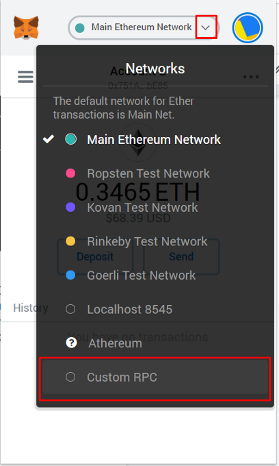
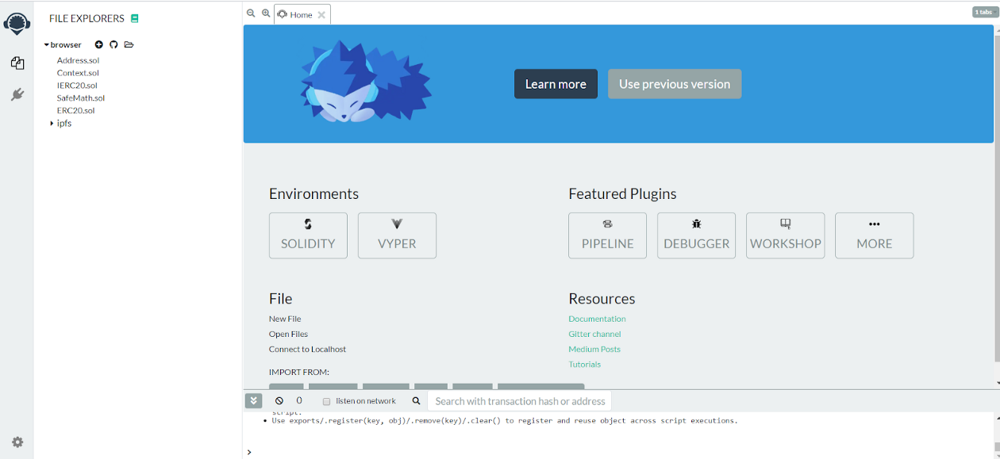
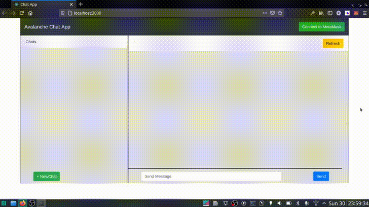
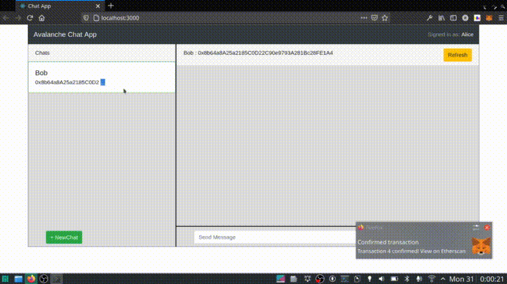
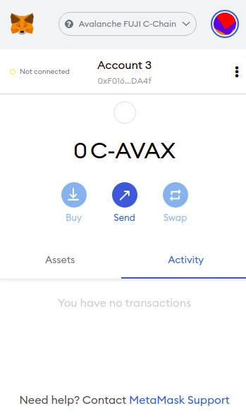
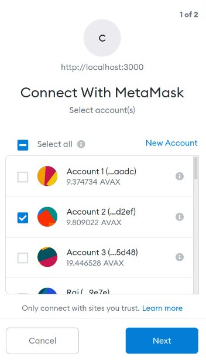
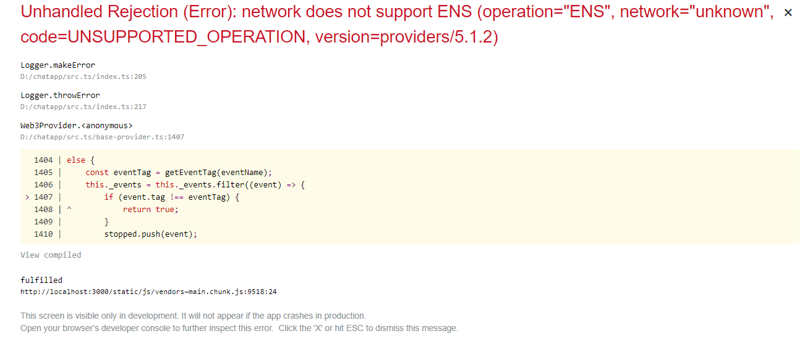

# Create a Chat Dapp Using Solidity and ReactJS

:::warning

These tutorials were published as a snapshot of when they were written, 
and may contain out-of-date-information.
For up-to-date information, please reach out to the owners of these 
projects.

:::

## Introduction

In this tutorial we will build a decentralized chat application on Avalanche's
Fuji test-network from scratch. The dapp will allow users to connect with other
people and chat with them. We will develop our smart contract using Solidity
which will be deployed on Avalanche's C-chain. We will have a basic, easy-to-use
UI developed using ReactJS. So, let us begin!

## Requirements

* Basic familiarity with [ReactJS](https://reactjs.org/) and [Solidity](https://soliditylang.org/)
* [Node.js](https://nodejs.org/en/download/releases/) v10.18.0+
* [MetaMask extension](https://metamask.io/download.html) on your browser

## Implementing the Smart Contract

Our chat dapp needs the basic functionality allowing users to connect with and
share messages with friends. To accomplish this, we will write the functions
responsible for creating an account, adding friends and sending messages.

## Account Creation

We will define 3 functions :

* The `checkUserExists(pubkey)` function is used to check if a user is
  registered with our application or not. It will help make sure duplicate users
  are not created and it will also be called from other functions to check their
  existence.

* The `createAccount(username)` function registers a new user on the platform with the provided username.

* The `getUsername(pubkey)` function will return the username of the given user if it exists.

## Adding Friends

Here also we will define 3 functions :

* The `checkAlreadyFriends(pubkey1, pubkey2)` function checks whether two users
  are already friends with each other or not. This is needed to prevent
  duplicate channel between the same parties and will also be used to prevent a
  user from sending messages to other users unless they are friends.

* The `addFriend(pubkey, name)` function mark the two users as friend if they
  both are registered on the platform and are already not friends with each
  other.

* The `getMyFriendList()` function will return an array of friends of the given user.

## Messaging

The final part of the Solidity contract will enable the exchange of messages
between users. We will divide the task into two functions `sendMessage()` and
`readMessage()`.

* The `sendMessage()` function allows a user to send messages to another
  registered user (friend). This is done with `checkUserExists(pubkey)` and
  `checkAlreadyFriends(pubkey1, pubkey2)`.

* The `readMessage()` function returns the chat history that has happened between the two users so far.

## User Data Collections

We will have three types of user-defined data :

* `user` will have the properties `name` which stores the username, and
  `friendList` which is an array of other users.

* `friend` will have the properties `pubkey` which is the friends' public
  address, and `name` which the user would like to refer them as.

* `message` has three properties: `sender`, `timestamp` and `msg`, which is short for "message."

We would maintain 2 collections in our database:

* `userList` where all the users on the platform are mapped with their public address.

* `allMessages` stores the messages. As Solidity does not allow user-defined
  keys in a mapping, we can instead hash the public keys of the two users. This
  value can then be stored in the mapping.

## Deploying the Smart Contract

## Setting up MetaMask

Log in to MetaMask -> Click the Network drop-down -> Select Custom RPC



**Fuji Testnet Settings:**

* **Network Name**: Avalanche Fuji C-Chain
* **New RPC URL**: [https://api.avax-test.network/ext/bc/C/rpc](https://api.avax-test.network/ext/bc/C/rpc)
* **ChainID**: `43113`
* **Symbol**: `C-AVAX`
* **Explorer**: `https://testnet.snowtrace.io`

Fund your address from the given [faucet](https://faucet.avax.network/).

## Deploy Using Remix

Open [Remix](https://remix.ethereum.org/) -> Select Solidity



Create a `Database.sol` file in the Remix file explorer, and paste the following code :

```solidity
// SPDX-License-Identifier: GPL-3.0

pragma solidity >=0.7.0 <0.9.0;

contract Database {
    
    // Stores the default name of an user and her friends info
    struct user {
        string name;
        friend[] friendList;
    }

    // Each friend is identified by its address and name assigned by the second party
    struct friend {
        address pubkey;
        string name;
    }

    // message construct stores the single chat message and its metadata
    struct message {
        address sender;
        uint256 timestamp;
        string msg;
    }

    // Collection of users registered on the application
    mapping(address => user) userList;
    // Collection of messages communicated in a channel between two users
    mapping(bytes32 => message[]) allMessages; // key : Hash(user1,user2)
    
    // It checks whether a user(identified by its public key)
    // has created an account on this application or not
    function checkUserExists(address pubkey) public view returns(bool) {
        return bytes(userList[pubkey].name).length > 0;
    }
    
    // Registers the caller(msg.sender) to our app with a non-empty username
    function createAccount(string calldata name) external {
        require(checkUserExists(msg.sender)==false, "User already exists!");
        require(bytes(name).length>0, "Username cannot be empty!"); 
        userList[msg.sender].name = name;
    }
    
    // Returns the default name provided by an user
    function getUsername(address pubkey) external view returns(string memory) {
        require(checkUserExists(pubkey), "User is not registered!");
        return userList[pubkey].name;
    }
    
    // Adds new user as your friend with an associated nickname
    function addFriend(address friend_key, string calldata name) external {
        require(checkUserExists(msg.sender), "Create an account first!");
        require(checkUserExists(friend_key), "User is not registered!");
        require(msg.sender!=friend_key, "Users cannot add themselves as friends!");
        require(checkAlreadyFriends(msg.sender,friend_key)==false, "These users are already friends!");
        
        _addFriend(msg.sender, friend_key, name);
        _addFriend(friend_key, msg.sender, userList[msg.sender].name);
    }
    
    // Checks if two users are already friends or not
    function checkAlreadyFriends(address pubkey1, address pubkey2) internal view returns(bool) {
        
        if(userList[pubkey1].friendList.length > userList[pubkey2].friendList.length)
        {
            address tmp = pubkey1;
            pubkey1 = pubkey2;
            pubkey2 = tmp;
        }
    
        for(uint i=0; i<userList[pubkey1].friendList.length; ++i)
        {
            if(userList[pubkey1].friendList[i].pubkey == pubkey2)
                return true;
        }
        return false;
    }
    
    // A helper function to update the friendList
    function _addFriend(address me, address friend_key, string memory name) internal {
        friend memory newFriend = friend(friend_key,name);
        userList[me].friendList.push(newFriend);
    }
    
    // Returns list of friends of the sender
    function getMyFriendList() external view returns(friend[] memory) {
        return userList[msg.sender].friendList;
    }
    
    // Returns a unique code for the channel created between the two users
    // Hash(key1,key2) where key1 is lexicographically smaller than key2
    function _getChatCode(address pubkey1, address pubkey2) internal pure returns(bytes32) {
        if(pubkey1 < pubkey2)
            return keccak256(abi.encodePacked(pubkey1, pubkey2));
        else
            return keccak256(abi.encodePacked(pubkey2, pubkey1));
    }
    
    // Sends a new message to a given friend
    function sendMessage(address friend_key, string calldata _msg) external {
        require(checkUserExists(msg.sender), "Create an account first!");
        require(checkUserExists(friend_key), "User is not registered!");
        require(checkAlreadyFriends(msg.sender,friend_key), "You are not friends with the given user");
        
        bytes32 chatCode = _getChatCode(msg.sender, friend_key);
        message memory newMsg = message(msg.sender, block.timestamp, _msg);
        allMessages[chatCode].push(newMsg);
    }
    
    // Returns all the chat messages communicated in a channel
    function readMessage(address friend_key) external view returns(message[] memory) {
        bytes32 chatCode = _getChatCode(msg.sender, friend_key);
        return allMessages[chatCode];
    }
}
```

Navigate to the Solidity compiler Tab on the left side navigation bar and click
the blue button to compile the `Database.sol` contract. Note down the `ABI` as
it will be required in the next section.

Navigate to Deploy Tab and open the “ENVIRONMENT” drop-down. Select "Injected
Web3" (make sure MetaMask is loaded) and click "Deploy" button.

Approve the transaction on MetaMask pop-up interface. Once our contract is
deployed successfully, Note down the `contract address`.

> An Application Binary Interface (ABI) is a JSON object which stores the
> metadata about the methods of a contract like data type of input parameters,
> return data type & property of the method like payable, view, pure etc. You
> can learn more about the ABI from the [solidity
> documentation](https://docs.soliditylang.org/en/latest/abi-spec.html)  

## Creating a Frontend in React

Now, we are going to create a React app scaffold and set up the frontend of the application.

Open a terminal and navigate to the directory where we will create the application.

```bash
cd /path/to/directory
```

Now use `npm` to install create-react-app. `-g` flag denotes that the package should be installed globally.

```bash
npm install -g create-react-app
```

Create a new react app.

```bash
create-react-app avalanche-chat-app
```

Move to the newly created directory and install the given dependencies.

```bash
cd avalanche-chat-app
npm install --save ethers@5.1.4 react-bootstrap@1.5.2 bootstrap@4.6.0
```

Open `index.html` file in the `public` directory, and paste the following HTML :

```html
<!DOCTYPE html>
<html lang="en">

<head>
    <meta charset="utf-8" />
    <meta name="viewport" content="width=device-width, initial-scale=1" />
    <meta name="theme-color" content="#000000" />
    <title>Chat dapp</title>
</head>

<body>
    <div id="root"></div>
</body>

</html>
```

Move out of the public directory and create a new directory `components` inside
`src` directory, where we will be keeping all our React components, using the
following command :

```bash
mkdir ./src/components
cd ./src/components
```

Now let's create the component having the navbar of our dapp. Create a new file
called `NavBar.jsx` and paste the following code :

```javascript
import React from "react";
import { Button, Navbar } from "react-bootstrap";

// This component renders the Navbar of our application
export function NavBar( props ){
    return (
        <Navbar bg="dark" variant="dark">
            <Navbar.Brand href="#home"> 
                Avalanche Chat App 
            </Navbar.Brand>
            <Navbar.Toggle />
            <Navbar.Collapse className="justify-content-end">
                <Navbar.Text> 
                    <Button style={{ display: props.showButton }} variant="success" onClick={ async () => { props.login(); }}>
                        Connect to MetaMask
                    </Button>
                    <div style={{ display: props.showButton === "none" ? "block" : "none" }}>
                        Signed in as: 
                        <a href="#"> 
                            { props.username }
                        </a>
                    </div>
                </Navbar.Text>
            </Navbar.Collapse>
        </Navbar>
    );
}
```

All the contacts will have a card with their name and public key. Create a new
file called `ChatCard.jsx` and paste the following code :

```javascript
import React from "react";
import { Row, Card } from "react-bootstrap";
import 'bootstrap/dist/css/bootstrap.min.css';

// This is a function which renders the friends in the friends list
export function ChatCard( props ){
    return (
        <Row style={{ marginRight:"0px" }}>
            <Card border="success" style={{ width:'100%', alignSelf:'center', marginLeft:"15px" }} onClick={ () => { props.getMessages( props.publicKey ); }}>
              <Card.Body>
                  <Card.Title> { props.name } </Card.Title>
                  <Card.Subtitle> { props.publicKey.length > 20 ? props.publicKey.substring(0, 20) + " ..." : props.publicKey } </Card.Subtitle>
              </Card.Body>
            </Card>
        </Row> 
    );
}
```

Each message will be rendered by the Message component. This component will have
the timestamp , senders' name and the message. Create a new file called
`Message.jsx` and paste the following code :

```javascript
import React from "react";
import { Row, Card } from "react-bootstrap";

// This is a functional component which renders the individual messages
export function Message( props ){
    return (
        <Row style={{ marginRight:"0px" }}>
            <Card  border="success" style={{ width:'80%', alignSelf:'center', margin:"0 0 5px " + props.marginLeft, float:"right", right:"0px" }}>
                <Card.Body>
                    <h6 style={{ float:"right" }}> 
                        { props.timeStamp } 
                    </h6>
                    <Card.Subtitle>
                        <b>
                            { props.sender }
                        </b>
                    </Card.Subtitle>
                    <Card.Text>
                        { props.data }
                    </Card.Text>
                </Card.Body>
            </Card>
        </Row>
    );
}
```

To add a new contact we will make AddNewChat component. It will show a modal on
clicking the NewChat button and ask for the contact details. Create a new file
called `AddNewChat.jsx` and paste the following code :

```javascript
import React from "react";
import { useState } from "react";
import { Button, Modal, Form } from "react-bootstrap";

// This Modal help Add a new friend
export function AddNewChat( props ){
    const [show, setShow] = useState( false );
    const handleClose = () => setShow( false );
    const handleShow = () => setShow( true );
    return (
        <div className="AddNewChat" style={{ position:"absolute", bottom:"0px", padding:"10px 45px 0 45px", margin:"0 95px 0 0", width:"97%" }}>
            <Button variant="success" className="mb-2" onClick={ handleShow }>
                + NewChat
            </Button>
            <Modal show={ show } onHide={ handleClose }>
                <Modal.Header closeButton>
                  <Modal.Title> Add New Friend </Modal.Title>
                </Modal.Header>
                <Modal.Body>
                    <Form.Group>
                        <Form.Control required id="addPublicKey" size="text" type="text" placeholder="Enter Friends Public Key" />
                        <br />
                        <Form.Control required id="addName" size="text" type="text" placeholder="Name" />
                        <br />
                    </Form.Group>
                </Modal.Body>
                <Modal.Footer>
                    <Button variant="secondary" onClick={ handleClose }>
                        Close
                    </Button>
                    <Button variant="primary" onClick={ () => {
                        props.addHandler( document.getElementById('addName').value, document.getElementById('addPublicKey').value );
                        handleClose();
                    }}>
                        Add Friend
                    </Button>
                </Modal.Footer>
            </Modal>
        </div>  
    
    );
}
```

Now lets create a new file called `Components.js` and export all the components
together. Paste the following code :

```javascript
export { NavBar } from "./NavBar";
export { AddNewChat } from "./AddNewChat";
export { Message } from "./Message";
export { ChatCard } from "./ChatCard";
```

Move out to the `src` directory and create a new file called `App.jsx` and paste the following code :

```javascript
import React from "react";
import { useState, useEffect } from "react";
import { Container, Row, Col, Card, Form, Button } from 'react-bootstrap';
import { NavBar, ChatCard, Message, AddNewChat } from './components/Components.js';
import { ethers } from "ethers";
import { abi } from "./abi";

// Add the contract address inside the quotes
const CONTRACT_ADDRESS = ""; 

export function App( props ) {  
    const [friends, setFriends] = useState(null);
    const [myName, setMyName] = useState(null);
    const [myPublicKey, setMyPublicKey] = useState(null);
    const [activeChat, setActiveChat] = useState({ friendname: null, publicKey: null });
    const [activeChatMessages, setActiveChatMessages] = useState(null);
    const [showConnectButton, setShowConnectButton] = useState("block");
    const [myContract, setMyContract] = useState(null);
  
    // Save the contents of abi in a variable
    const contractABI = abi; 
    let provider;
    let signer;

    // Login to MetaMask and check the if the user exists else creates one
    async function login() {
        let res = await connectToMetamask();
        if( res === true ) {
            provider = new ethers.providers.Web3Provider( window.ethereum );
            signer = provider.getSigner();
            try {
				const contract = new ethers.Contract( CONTRACT_ADDRESS, contractABI, signer );
				setMyContract( contract );
				const address = await signer.getAddress();         
				let present = await contract.checkUserExists( address );
				let username;
				if( present )
					username = await contract.getUsername( address );
				else {
					username = prompt('Enter a username', 'Guest'); 
					if( username === '' ) username = 'Guest';
					await contract.createAccount( username );
				}
				setMyName( username );
				setMyPublicKey( address );
				setShowConnectButton( "none" );
			} catch(err) {
				alert("CONTRACT_ADDRESS not set properly!");
			}
        } else {
            alert("Couldn't connect to MetaMask");
        }    
    }

    // Check if the MetaMask connects 
    async function connectToMetamask() {
        try {
            await window.ethereum.enable();
            return true;
        } catch(err) {
            return false;
        }
    }

    // Add a friend to the users' Friends List
    async function addChat( name, publicKey ) {
        try {
			let present = await myContract.checkUserExists( publicKey );
			if( !present ) {
				alert("Given address not found: Ask him to join the app :)");
				return;
			}
			try {
				await myContract.addFriend( publicKey, name );
				const frnd = { "name": name, "publicKey": publicKey };
				setFriends( friends.concat(frnd) );
			} catch(err) {
				alert("Friend already Added! You can't be friend with the same person twice ;P");
			}
		} catch(err) {
			alert("Invalid address!")
		}
    }

    // Sends messsage to an user 
    async function sendMessage( data ) {
        if( !( activeChat && activeChat.publicKey ) ) return;
        const recieverAddress = activeChat.publicKey;
        await myContract.sendMessage( recieverAddress, data );
    } 

    // Fetch chat messages with a friend 
    async function getMessage( friendsPublicKey ) {
        let nickname;
        let messages = [];
        friends.forEach( ( item ) => {
            if( item.publicKey === friendsPublicKey )
                nickname = item.name;
        });
        // Get messages
        const data = await myContract.readMessage( friendsPublicKey );
        data.forEach( ( item ) => {
            const timestamp = new Date( 1000*item[1].toNumber() ).toUTCString();
            messages.push({ "publicKey": item[0], "timeStamp": timestamp, "data": item[2] });
        });
        setActiveChat({ friendname: nickname, publicKey: friendsPublicKey });
        setActiveChatMessages( messages );
    }

    // This executes every time page renders and when myPublicKey or myContract changes
    useEffect( () => {
        async function loadFriends() {
            let friendList = [];
            // Get Friends
            try {
                const data = await myContract.getMyFriendList();
                data.forEach( ( item ) => {
                    friendList.push({ "publicKey": item[0], "name": item[1] });
                })
            } catch(err) {
                friendList = null;  
            }
            setFriends( friendList );
        }
        loadFriends();
    }, [myPublicKey, myContract]);

    // Makes Cards for each Message
    const Messages = activeChatMessages ? activeChatMessages.map( ( message ) => {
        let margin = "5%";
        let sender = activeChat.friendname;
        if( message.publicKey === myPublicKey ) {
            margin = "15%";
            sender = "You";
        }
        return (
            <Message marginLeft={ margin } sender={ sender } data={ message.data } timeStamp={ message.timeStamp } />
        );
    }) : null;
  
    // Displays each card
    const chats = friends ? friends.map( ( friend ) => {
     return (
         <ChatCard publicKey={ friend.publicKey } name={ friend.name } getMessages={ ( key ) => getMessage( key ) } />
     );
    }) : null;

    return (
        <Container style={{ padding:"0px", border:"1px solid grey" }}>
            {/* This shows the navbar with connect button */}
            <NavBar username={ myName } login={ async () => login() } showButton={ showConnectButton } />
            <Row>
                {/* Here the friends list is shown */}
                <Col style={{ "paddingRight":"0px", "borderRight":"2px solid #000000" }}>
                    <div style={{ "backgroundColor":"#DCDCDC", "height":"100%", overflowY:"auto" }}>
                          <Row style={{ marginRight:"0px" }}  >
                              <Card style={{ width:'100%', alignSelf:'center', marginLeft:"15px" }}>
                                <Card.Header>
                                    Chats
                                </Card.Header>
                              </Card>
                          </Row>
                          { chats }
                          <AddNewChat myContract={ myContract } addHandler={ ( name, publicKey ) => addChat( name, publicKey )} />
                    </div>
                </Col>
                <Col xs={ 8 } style={{ "paddingLeft":"0px" }}>
                    <div style={{ "backgroundColor":"#DCDCDC", "height":"100%" }}>
                        {/* Chat header with refresh button, username and public key are rendered here */}
                        <Row style={{ marginRight:"0px" }}>
                              <Card style={{ width:'100%', alignSelf:'center', margin:"0 0 5px 15px" }}>
                                <Card.Header>
                                    { activeChat.friendname } : { activeChat.publicKey }
                                    <Button style={{ float:"right" }} variant="warning" onClick={ () => {
                                        if( activeChat && activeChat.publicKey )
                                            getMessage( activeChat.publicKey );
                                    } }>
                                        Refresh
                                    </Button>
                                </Card.Header>
                            </Card>
                        </Row>
                        {/* The messages will be shown here */}
                        <div className="MessageBox" style={{ height:"400px", overflowY:"auto" }}>
                           { Messages }
                        </div>
                        {/* The form with send button and message input fields */}
                        <div className="SendMessage"  style={{ borderTop:"2px solid black", position:"relative", bottom:"0px", padding:"10px 45px 0 45px", margin:"0 95px 0 0", width:"97%" }}>
                            <Form onSubmit={ (e) => {
			                	e.preventDefault();
			                	sendMessage( document.getElementById( 'messageData' ).value );
			                	document.getElementById( 'messageData' ).value = "";
			                }}>
                                <Form.Row className="align-items-center">
                                    <Col xs={9}>
                                        <Form.Control id="messageData" className="mb-2"  placeholder="Send Message" />
                                    </Col>
                                    <Col >
                                      <Button className="mb-2" style={{ float:"right" }} onClick={ () => {
                                          sendMessage( document.getElementById( 'messageData' ).value );
                                          document.getElementById( 'messageData' ).value = "";
                                      }}>
                                        Send
                                      </Button>
                                    </Col>
                                </Form.Row>
                            </Form>
                        </div> 
                    </div>
                </Col>
            </Row>
        </Container>
    );
}
```

> **Note:** Write down the contract address obtained from `Implementing the
> smart contract` section in the variable called `CONTRACT_ADDRESS` on line 9 of
> `App.jsx`.

Open the `index.js` file inside the `src` directory and paste the following code :

```javascript
import React from "react";
import ReactDom from "react-dom";
import { App } from "../src/App.jsx";

ReactDom.render( 
    <App /> ,
    document.getElementById('root')
);
```

Create a new file called `abi.js` in the `src` directory, and paste the following code :

```javascript
export const abi = [
    {
        "inputs": [
            {
                "internalType": "address",
                "name": "friend_key",
                "type": "address"
            },
            {
                "internalType": "string",
                "name": "name",
                "type": "string"
            }
        ],
        "name": "addFriend",
        "outputs": [],
        "stateMutability": "nonpayable",
        "type": "function"
    },
    {
        "inputs": [
            {
                "internalType": "address",
                "name": "pubkey",
                "type": "address"
            }
        ],
        "name": "checkUserExists",
        "outputs": [
            {
                "internalType": "bool",
                "name": "",
                "type": "bool"
            }
        ],
        "stateMutability": "view",
        "type": "function"
    },
    {
        "inputs": [
            {
                "internalType": "string",
                "name": "name",
                "type": "string"
            }
        ],
        "name": "createAccount",
        "outputs": [],
        "stateMutability": "nonpayable",
        "type": "function"
    },
    {
        "inputs": [],
        "name": "getMyFriendList",
        "outputs": [
            {
                "components": [
                    {
                        "internalType": "address",
                        "name": "pubkey",
                        "type": "address"
                    },
                    {
                        "internalType": "string",
                        "name": "name",
                        "type": "string"
                    }
                ],
                "internalType": "struct Database.friend[]",
                "name": "",
                "type": "tuple[]"
            }
        ],
        "stateMutability": "view",
        "type": "function"
    },
    {
        "inputs": [
            {
                "internalType": "address",
                "name": "pubkey",
                "type": "address"
            }
        ],
        "name": "getUsername",
        "outputs": [
            {
                "internalType": "string",
                "name": "",
                "type": "string"
            }
        ],
        "stateMutability": "view",
        "type": "function"
    },
    {
        "inputs": [
            {
                "internalType": "address",
                "name": "friend_key",
                "type": "address"
            }
        ],
        "name": "readMessage",
        "outputs": [
            {
                "components": [
                    {
                        "internalType": "address",
                        "name": "sender",
                        "type": "address"
                    },
                    {
                        "internalType": "uint256",
                        "name": "timestamp",
                        "type": "uint256"
                    },
                    {
                        "internalType": "string",
                        "name": "msg",
                        "type": "string"
                    }
                ],
                "internalType": "struct Database.message[]",
                "name": "",
                "type": "tuple[]"
            }
        ],
        "stateMutability": "view",
        "type": "function"
    },
    {
        "inputs": [
            {
                "internalType": "address",
                "name": "friend_key",
                "type": "address"
            },
            {
                "internalType": "string",
                "name": "_msg",
                "type": "string"
            }
        ],
        "name": "sendMessage",
        "outputs": [],
        "stateMutability": "nonpayable",
        "type": "function"
    }
]
```

> An Application Binary Interface (ABI) is a JSON object which stores the
> metadata about the methods of a contract like data type of input parameters,
> return data type & property of the method like payable, view, pure etc. You
> can learn more about the ABI from the [solidity
> documentation](https://docs.soliditylang.org/en/latest/abi-spec.html)  

Now its time to run our React app. Use the following command to start the React app.

```bash
npm start
```

## Walkthrough

* Visit [http://localhost:3000](http://localhost:3000) to interact with the app.

* User registration and adding a new friend  

Make sure your friend is also registered to the application while adding him as a friend.

* Chatting with friend  


## Conclusion

Congratulations! We have successfully developed a decentralized chat application
which can be deployed on Avalanche. We also created a boilerplate React
application to use as the frontend for our dapp. As a next step, You can improve
the application by adding features like delete messages, block users, or create
groups of friends. You can also optimize the gas cost by limiting the maximum
number of messages stored.

## Troubleshooting

## Transaction Failure

* Check if your account has sufficient balance at [Fuji
  block-explorer](https://testnet.snowtrace.io/). You can fund your address from
  the given [faucet](https://faucet.avax.network/)



* Make sure that you have selected the correct account on MetaMask if you have
  more than one account connected to the site.



## Application Crash


Check if you have updated the `CONTRACT_ADDRESS` variable in `src/index.js` properly!

## About the Authors

The tutorial was created by [Nimish Agrawal](https://github.com/realnimish) &
[Sayan Kar](https://github.com/SayanKar). You can also reach out to them on
LinkedIn [@Nimish Agrawal](https://www.linkedin.com/in/realnimish) and [@Sayan
Kar](https://www.linkedin.com/in/sayan-kar-).

## References

* Smart contract deployment process - [Deploy a Smart Contract on Avalanche using Remix and MetaMask](https://docs.avax.network/build/tutorials/smart-contracts/deploy-a-smart-contract-on-avalanche-using-remix-and-metamask)
