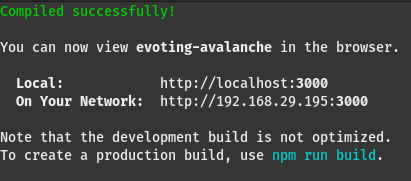
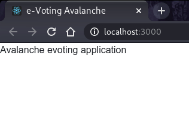
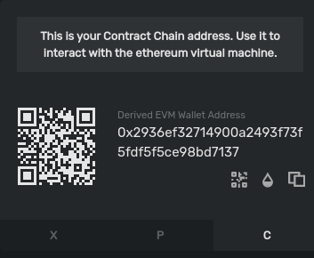
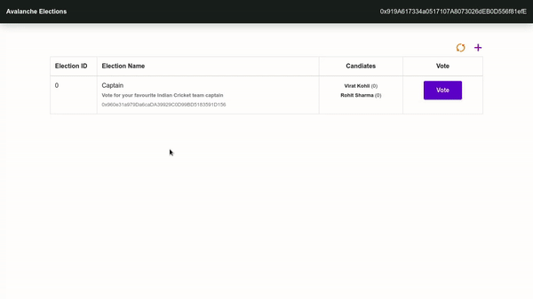

# Create a Voting Dapp on Avalanche Using ReactJS

:::warning

These tutorials were published as a snapshot of when they were written,
and may contain out-of-date-information.
For up-to-date information, please reach out to the owners of these
projects.

:::

## Introduction

We will generate [ReactJS](https://reactjs.org) boilerplate code using
`create-react-app`, which we will modify for our dapp frontend. React is a good
choice for efficient, developer-friendly blockchain interactions. For the
backend, [Solidity](https://docs.soliditylang.org/en/v0.8.4/) smart contracts
will be deployed to the Avalanche blockchain using [Truffle
Suite](https://www.trufflesuite.com).

Truffle Suite is a toolkit for launching decentralized applications (dapps) on
Ethereum Virtual Machine (EVM) compatible blockchains like Avalanche. With
Truffle you can write and compile smart contracts, build artifacts, run
migrations and interact with deployed contracts. This tutorial illustrates how
Truffle can be used with Avalanche's C-Chain, which is an instance of the EVM.

## Prerequisites

- Basic familiarity with [NodeJS](https://nodejs.org/en) and
  [npm](https://www.npmjs.com/).
- Basic familiarity with [ReactJS](https://reactjs.org/).
- Basic familiarity with [Avalanche](https://avax.network) network,
  [Solidity](https://docs.soliditylang.org/en/v0.8.6/) and
  [Truffle](https://www.trufflesuite.com/truffle).

## Requirements

- [NodeJS](https://nodejs.org/en) >= 10.16 and [npm](https://www.npmjs.com/) >=
  5.6 installed.
- [Truffle](https://www.trufflesuite.com/truffle), which can be installed
  globally with `npm install -g truffle`
- [MetaMask](https://metamask.io) extension added to the browser.

## Initializing the Working Directory

The client-side of our dapp is made using **ReactJS**. Smart contracts will be
made using **Solidity** language and will be deployed on the **Avalanche**
network with **Truffle Suite**. Therefore, we need to set up our working
directory according to ReactJS and Truffle, to make the development process
smoother.

Open a terminal and navigate to the directory where we will create the
application. Usually, this will be inside our user home directory but can be
located wherever is practical. On most Linux distributions this will change into
/home/ . On MacOS it will be /Users/. On Windows the user directories are
located in C:\Users.

```bash
cd ~
```

### **Setting up the ReactJS Project**

Create a new react app using npx. npx is a npm package runner (x probably stands
for eXecute). The typical use is to download and run a package temporarily or
for trials. Using npx to execute the package binaries for create-react-app will
generate a new React app scaffold in the specified directory.

```bash
npx create-react-app avalanche-voting
```

Move to the newly created directory and install the basic dependencies.

```bash
cd avalanche-voting
npm install --save dotenv web3 @truffle/contract @truffle/hdwallet-provider
```

Open the file `index.html` file inside of the `public` directory and replace the
existing code with the following HTML :

```html
<!DOCTYPE html>
<html lang="en">
  <head>
    <meta charset="utf-8" />
    <meta name="viewport" content="width=device-width, initial-scale=1" />
    <title>Avalanche Elections</title>
    <link
      rel="stylesheet"
      href="https://cdn.jsdelivr.net/npm/bootstrap@4.6.0/dist/css/bootstrap.min.css"
    />
  </head>

  <body>
    <div id="root"></div>
  </body>
</html>
```

Open the file `App.js` inside of the `src` directory and replace the existing
code with the following code:

```javascript
import React from "react";

// 1. Importing other modules

class App extends React.Component {
  constructor(props) {
    super(props);
    this.state = {
      web3: null,
      account: null,
      mainInstance: null,
    };
  }

  componentDidMount() {
    this.init();
  }

  async init() {
    // 2. Load web3
    // 3. Load Account
    // 4. Load Smart-Contract instance
  }

  render() {
    return <div>Avalanche evoting application</div>;
  }
}
export default App;
```

This `App` component has a constructor to declare and initialize the state
properties. `web3` is an instance of the `MetaMask` provider for interacting
with the Avalanche network, `account` is a user address and `mainInstance` is
the instance of our smart contract.

Open the file `index.js` inside of the `src` directory and replace the existing
code with the following code:

```javascript
import React from "react";
import ReactDOM from "react-dom";
import App from "./App";

ReactDOM.render(
  <React.StrictMode>
    <App />
  </React.StrictMode>,
  document.getElementById("root")
);
```

React project setup is now complete.

### **Setting up the Truffle Project**

Run the following command in the project root directory, to create a boilerplate for the Truffle project.

```bash
truffle init
```

This will set up the initial project structure. Solidity code will be stored in
the `contracts` directory. Deployment functions written in JavaScript will be
stored in the `migrations` folder. By default, the `/build/contracts` folder
contains information about the compiled and deployed contract, like the ABI, in
JSON format. These meta-files are commonly referred to as `artifacts`.

There is also 1 **config** file created by the above command, which is,
**truffle-config.js**. In this file, there is a lot of information regarding how
to deploy contracts, how to choose a network to deploy them, and many others.
Therefore, we should preserve this file for reference. So, use the below command
to make a copy of this file. This would create a copy named
`truffle-config-default.js`.

```bash
cp truffle-config.js truffle-config-default.js
```

Now we will update the `truffle-config.js` file, with the information needed to
deploy the smart contract on the Fuji test network. This file helps us in
connecting to the Avalanche node, and we will require an Avalanche node's RPC
url along with an Avalanche wallet mnemonic for deploying the contract on the
network.

```javascript
require("dotenv").config();
const HDWalletProvider = require("@truffle/hdwallet-provider");

// Account credentials from which our contract will be deployed
const MNEMONIC = process.env.MNEMONIC;

module.exports = {
  contracts_build_directory: "./src/build/contracts",
  networks: {
    development: {
      host: "127.0.0.1",
      port: 7545,
      network_id: "*",
    },
    fuji: {
      provider: function () {
        return new HDWalletProvider({
          mnemonic: MNEMONIC,
          providerOrUrl: `https://api.avax-test.network/ext/bc/C/rpc`,
        });
      },
      network_id: "*",
      gas: 3000000,
      gasPrice: 470000000000,
      skipDryRun: true,
    },
  },
  compilers: {
    solc: {
      version: "0.8.0",
    },
  },
};
```

Note that we're setting the `gasPrice` and `gas` to the appropriate values for
the Avalanche C-Chain. Here, you can see that we have used
`contracts_build_directory` to change the default location of `artifacts` from
the project root directory to the `src` folder. This is because React cannot
access files that are present outside the `src` folder.

### **Get Avalanche Credentials**

For deploying smart contracts we need two things: A node connected to the
Avalanche network and an account with few AVAX. Avalanche connected node through
RPC (Remote Procedure Call) is provided for free by the Avalanche Networks.

Now we need an Avalanche wallet, where we would keep our funds, required for all
the transactions on the network. So, visit [here](https://wallet.avax.network)
and create an account. Save the mnemonic in a secure place (we would need it
later). Instructions to add funds will be provided later in the tutorial.

### **Add .env File**

Now we need a **Avalanche** wallet, where we would keep our funds, required for
all the transactions on the network. Visit the [Avalanche
Wallet](https://wallet.avax.network/) and create an account. While creating your
account you will see your public address and mnemonic. This public address will
be required to transfer funds. Save the **mnemonic** in a secure place, we will
need it later. Instructions to add funds will be provided later in the tutorial.

Create a `.env` file in the project root folder. Please take a note that dot (.)
is necessary for the `.env` file name. Now copy your Avalanche wallet's mnemonic
in the .env file as shown below. In the .env file, **MNEMONIC** should be
enclosed within double-quotes (" ").

```bash
MNEMONIC="<avalanche-wallet-mnemonic>"
```

> Never share or commit your `.env` file. It contains your credentials like
> `mnemonics`. Therefore, it is advised to add `.env` to your `.gitignore` file.

Our project setup is now complete.

To confirm that we are on the same page, run the following command in the project root folder.

```bash
npm start
```

It might take few seconds, to show output as in the image below.



In a browser, visit the URL of our running dapp:
[http://localhost:3000](http://localhost:3000). If you followed the above steps,
you would see the page as shown below.



## **Create Election Smart Contract**

Create the file `Election.sol` (`.sol` stands for Solidity) inside of the
`contracts` directory and use the code as given in this
[file](./contracts/Election.sol).

`Election` is a Solidity contract that lets us view the name and description,
the candidates standing in an election, and vote for them. For this dapp, we
will be accessing the deployed Election contracts using their `address` and
`ABI`. This Solidity code is what will be deployed to the blockchain, each time
we create a new election.

**Let's understand this smart contract**

The code for smart contract is everything within `contract Election { }`.

**Basic fields about election** - This block of code would be storing basic
fields of each `Election` contract. Fields include `name` and `description`.

```solidity
// Election details will be stored in these variables
string public name;
string public description;
```

**Storing candidate details** - The `Candidate` struct consists of the data
fields `id`, `name` and `voteCount`. We will define a mapping between an
unsigned integer (`uint`) and each instance of a Candidate. This will enable us
to refer to each candidate by its index within the mapping - `candidates[n]`,
where `n` is the corresponding `uint` value.

```solidity
// Structure of candidate standing in the election
struct Candidate {
  uint256 id;
  string name;
  uint256 voteCount;
}

// Storing candidates in a map
mapping(uint256 => Candidate) public candidates;
```

**Storing address of voters who have already voted and the number of
candidates** - `voters` is a mapping between the address of the voter and a
boolean. In Solidity, the default boolean value is `false`, so if the return
value of `voters(address)` is `false` we can understand that this address has
not voted. `true` indicates that the account has voted already.

```solidity
// Storing address of those voters who already voted
mapping(address => bool) public voters;

// Number of candidates in standing in the election
uint public candidatesCount = 0;
```

**Constructor call and adding candidates to the election** - When a smart
contract is deployed on Avalanche, the first function to be called is the
`constructor()` function. Whatever we want to initialize in our Solidity smart
contract, we do it inside the `constructor()` function. We will be adding a
name, description, and candidates to the election. Here, `addCandidate()` is a
private function, so that it cannot be called publicly. This function takes
`name` and `description` as a single array named `_nda` in the first argument
and candidates' name as an array in the second argument.

```solidity
// Setting of variables and data, during the creation of election contract
constructor (string[] memory _nda, string[] memory _candidates) public {
  require(_candidates.length > 0, "There should be atleast 1 candidate.");
  name = _nda[0];
  description = _nda[1];
  for(uint i = 0; i < _candidates.length; i++) {
    addCandidate(_candidates[i]);
  }
}

// Private function to add a candidate
function addCandidate (string memory _name) private {
  candidates[candidatesCount] = Candidate(candidatesCount, _name, 0);
  candidatesCount ++;
}
```

**Voting candidates in an election** - We made a `vote()` function. It takes
`candidateId` as an argument and increments the vote of the respective
candidate. It requires two things, a voter should not have voted in the
particular election by checking boolean across the `voters` mapping and
`candidateId` should be a valid one, that is `0 <= candidateId < candiatesCount`.

```solidity
// Public vote function for voting a candidate
function vote (uint _candidate) public {
  require(!voters[msg.sender], "Voter has already Voted!");
  require(_candidate < candidatesCount && _candidate >= 0, "Invalid candidate to Vote!");
  voters[msg.sender] = true;
  candidates[_candidate].voteCount++;
}
```

## **Create MainContract Smart Contract**

Create the file `MainContract.sol` inside of the `contracts` directory and paste the following code:

```solidity
// SPDX-License-Identifier: UNLICENSED
pragma solidity >=0.8.0;

import './Election.sol';

contract MainContract {
  uint public electionId = 0;
  mapping (uint => address) public Elections;

  function createElection (string[] memory _nda, string[] memory _candidates) public {
    Election election = new Election(_nda, _candidates);
    Elections[electionId] = address(election);
    electionId++;
  }
}
```

`MainContract.sol` is the entry point of our dapp. To create a new election, we
need to call the `createElection()` function from this deployed contract. It
will maintain the total number of election contracts deployed, their address on
the network and will also help in deploying them. We also
[import](https://docs.soliditylang.org/en/v0.8.4/layout-of-source-files.html?highlight=import#syntax-and-semantics)
`Elections.sol`.

Here `electionId` is used for assigning ID's to each election that a user
creates and is incremented for using it while creating the next election. Also,
`Elections` is a public mapping between `electionId` and the address of the
deployed election contract.

```solidity
uint public electionId = 0;
mapping (uint => address) public Elections;
```

We have made a `createElection()` function which will be used to deploy our
`Election` smart contract. This function takes `name` and `description` as a
single array named `_nda` in the first argument and candidates' name as an array
in the second argument.

```solidity
function createElection (string[] memory _nda, string[] memory _candidates) public {
  Election election = new Election(_nda, _candidates);
  Elections[electionId] = address(election);
  electionId++;
}
```

The `Election` contract is deployed on the network using the `new` keyword,
which deploys the contract, initializes the contract's variables, runs the
`constructor()` function and returns the **address** of the newly deployed
contract to the caller. Then the address is stored in the `Elections` mapping.
Once the election contract is deployed successfully, `electionId` is
incremented.

## **Create a File for Migrating Smart Contracts**

Create a new file in the `migrations` directory named `2_deploy_contracts.js`,
and add the following block of code. This handles deploying the `MainContract`
and `Election` smart contract to the blockchain.

```javascript
const MainContract = artifacts.require("MainContract");

module.exports = function (deployer) {
  deployer.deploy(MainContract);
};
```

We are deploying only the `MainContract`, because the `Election` contract will
be deployed by the `MainContract` itself during the runtime, using the function
`createElection()`.

## **Compile Contracts with Truffle**

If we have altered the code within our Solidity source files or made new ones
(like `Elections.sol`), we need to run `truffle compile` in the terminal, from
inside the project root directory.

The expected output would look similar:

```bash
Compiling your contracts...
===========================
> Compiling ./contracts/Election.sol
> Compiling ./contracts/MainContract.sol
> Compiling ./contracts/Migrations.sol

> Artifacts written to /home/guest/blockchain/avalanche-voting/build/contracts
> Compiled successfully using:
   - solc: 0.8.0+commit.c7dfd78e.Emscripten.clang
```

The compiled smart contracts are written as JSON files in the
/src/build/contracts directory. These are the stored ABI and other necessary
metadata - the artifacts.

> `ABI` refers to Application Binary Interface, which is a standard for
> interacting with the smart contracts from outside the blockchain as well as
> contract-to-contract interaction. Please refer to the Solidity's documentation
> about ABIs
> [here](https://docs.soliditylang.org/en/v0.5.3/abi-spec.html#:~:text=The%20Contract%20Application%20Binary%20Interface,contract%2Dto%2Dcontract%20interaction.&text=This%20specification%20does%20not%20address,known%20only%20at%20run%2Dtime)
> to learn more.

## **Fund the Account and Run Migrations on the C-Chain**

When deploying smart contracts to the C-Chain, it will require some deployment
cost. As you can see inside `truffle-config.js`, HDWallet Provider will help us
in deploying on Fuji C-chain and deployment cost will be managed by the account
whose mnemonic has been stored in the `.env` file. Therefore we need to fund the
account.

### **Fund Your Account**

We need funds in our C-Chain address, as smart contracts are deployed on C-Chain,
the Contract-Chain. This address can easily be found on the [Avalanche
Wallet](https://wallet.avax.network) dashboard. Avalanche network has 3 chains:
X-Chain, P-Chain and C-Chain. The address of all these chains can be found by
switching tabs at the bottom of the division, where there is a QR code. So,
switch to C-Chain, and copy the address. Now fund your account using the faucet
link [here](https://faucet.avax.network/) and paste your C-Chain address in the
input field. Refer to the below image, to identify the address section.



> You'll need to send at least `135422040` nAVAX to the account to cover the
> cost of contract deployments. Here `nAVAX` refers nano-AVAX, which is a billionth of
> an `AVAX` or simply 1 `nAVAX` = (1/1000,000,000) `AVAX`. Though funding
> through faucet would give you enough `AVAX` to run multiple deployments and
> transactions on the network.

### **Run Migrations**

Now everything is in place to run migrations and deploy the `MainContract`:

```bash
truffle migrate --network fuji
```

This might take a while depending upon your internet connection or traffic on the network.

Note - For development purpose, we may deploy our contracts on the local
network, by running Ganache (Truffle's local blockchain simulation) and using
the command

```bash
truffle migrate --network development
```

On successful execution of this command, you should see:

```bash
Starting migrations...
======================
> Network name:    'fuji'
> Network id:      1
> Block gas limit: 8000000 (0x7a1200)


1_initial_migration.js
======================

   Deploying 'Migrations'
   ----------------------
   > transaction hash:    0x094a9c0f12ff3158bcb40e266859cb4f34a274ea492707f673b93790af40e9e9
   > Blocks: 0            Seconds: 0
   > contract address:    0x0b1f00d0Af6d5c864f86E6b96216e0a2Da111055
   > block number:        40
   > block timestamp:     1620393171
   > account:             0x80599dd7F8c5426096FD189dcC6C40f47e8e3714
   > balance:             39.71499696
   > gas used:            173118 (0x2a43e)
   > gas price:           20 gwei
   > value sent:          0 ETH
   > total cost:          0.00346236 ETH


   > Saving migration to chain.
   > Saving artifacts
   -------------------------------------
   > Total cost:          0.00346236 ETH


2_deploy_contracts.js
=====================

   Deploying 'MainContract'
   ------------------------
   > transaction hash:    0xbeb13fc6bbee250eea9151faf02bfe247ec497294acc84c9b8319ed609ced086
   > Blocks: 0            Seconds: 0
   > contract address:    0xf30D372A6911CCF6BBa1e84c3CEd51cC0F3D7769
   > block number:        42
   > block timestamp:     1620393172
   > account:             0x80599dd7F8c5426096FD189dcC6C40f47e8e3714
   > balance:             39.69235442
   > gas used:            1090212 (0x10a2a4)
   > gas price:           20 gwei
   > value sent:          0 ETH
   > total cost:          0.02180424 ETH


   > Saving migration to chain.
   > Saving artifacts
   -------------------------------------
   > Total cost:          0.02180424 ETH


Summary
=======
> Total deployments:   2
> Final cost:          0.0252666 ETH
```

If you didn't create an account on the C-Chain you'll see this error:

```bash
Error: Expected parameter 'from' not passed to function.
```

If you didn't fund the account, you'll see this error:

```bash
Error:  *** Deployment Failed ***

"Migrations" could not deploy due to insufficient funds
   * Account:  0x090172CD36e9f4906Af17B2C36D662E69f162282
   * Balance:  0 wei
   * Message:  sender doesn't have enough funds to send tx. The upfront cost is: 1410000000000000000 and the sender's account only has: 0
   * Try:
      + Using an adequately funded account
```

The information and ABI of the deployed contract are present in the
`src/build/contract` directory as `Election.json`. Information like contract
address, network info etc. could be found here.

## **Building the User Interface**

We have already set up our React project directory. The client-side files to
interact with the Avalanche blockchain are present in the `src` directory.
First, we will make a ReactJS component with of a couple of functions to connect
our browser with the Avalanche network. These functions will be kept in a
separate file named `BlockchainUtil.js`.

### BlockchainUtils Component

Create the file `BlockchainUtil.js` inside of the project `src` directory and paste the following code:

```javascript
import React from "react";
import Web3 from "web3";
import TruffleContract from "@truffle/contract";

export class GetWeb3 extends React.Component {
  async getWeb3() {
    let web3 = window.web3;

    if (typeof web3 !== "undefined") {
      // Setup Web3 Provider
      this.web3Provider = web3.currentProvider;
      this.web3 = new Web3(web3.currentProvider);
      return this.web3;
    } else {
      this.isWeb3 = false;
    }
  }
}

export class GetContract extends React.Component {
  async getContract(web3, contractJson) {
    // Setup Contract
    this.contract = await TruffleContract(contractJson);
    this.contract.setProvider(web3.currentProvider);
    return await this.contract.deployed();
  }
}

export class GetAccount extends React.Component {
  async getAccount(web3) {
    return await web3.eth.getAccounts();
  }
}
```

### Updating App.js

`App.js` is the entry point of our React application. Therefore, we will need to
update `App.js` with the components which we want to show in our application. As
we move ahead and build components, we will update `App.js` and import the
components so that we can make use of their functionality.

So, now add the following line under the `//Importing...` section of `App.js` to
import `BlockchainUtil.js` module.

```javascript
// 1. Importing other modules
import { GetWeb3, GetContract, GetAccount } from "./BlockchainUtil";
```

Paste the following code inside the `init()` function of `App.js`

```javascript
// 2. Load web3
const Web3 = new GetWeb3();
this.web3 = await Web3.getWeb3();
this.setState({ web3: this.web3 });

// 3. Load Account
const Account = new GetAccount();
this.account = await Account.getAccount(this.web3);
this.setState({ account: this.account[0] });

// 4. Load Contract
const Contract = new GetContract();
this.mainInstance = await Contract.getContract(this.web3, contractJson);
this.setState({ mainInstance: this.mainInstance });
```

### CreateElection Component

Now let's make a component that will create new elections using our deployed
smart contract. Create the file `CreateElection.js` inside of the project `src`
directory and use the code as given in this
[file](./frontend/CreateElection.js.md). The code is commented to draw attention
to the important parts.

### ActiveElections Component

Create the file `ActiveElections.js` inside of the project `src` directory and
use the code as given in this [file](./frontend/ActiveElections.js.md)

### VoteModal Component

In the above component `ActiveElections.js`, we have used a component called
`VoteModal` which contains the candidate details and a button to cast a vote.
Now we will make this component available by creating a file named
`VoteModal.js` inside the `src` directory. Use the code as present in this
[file](./frontend/VoteModal.js.md).

### Integrating Components Into App.js

Now we need to update our `App.js` file with all the components that we have made so far.

**Import Modules** - First import all the modules and components into the
`App.js` file by appending the following code under the `// 1. Importing other
modules` section.

```javascript
// 1. Importing other modules
import {
  BrowserRouter as Router,
  Route,
  Link,
  Redirect,
} from "react-router-dom";
import CreateElection from "./CreateElection";
import ActiveElections from "./ActiveElections";
import contractJson from "./build/contracts/MainContract.json";
```

**Load components** - Inside the `<div>` tag of `return()` function in `App.js`,
replace the sample text (`Avalanche evoting`) with the code of the following
components.

```javascript
// For routing through the react application
<Router>
  {/* Default route to ActiveElections component */}
  <Route path="/" exact>
    <Redirect to="/active" />
  </Route>

  {/* Navbar */}
  <nav
    className="navbar navbar-dark shadow"
    style={{
      backgroundColor: "#1b2021",
      height: "60px",
      color: "white",
      marginBottom: "50px",
    }}
  >
    {/* Link to Active election page (nav-header) */}
    <Link to="/active">
      <b style={{ cursor: "pointer", color: "white" }}>Avalanche Elections</b>
    </Link>

    {/* Account address on the right side of the navbar  */}
    <span style={{ float: "right" }}>{this.state.account}</span>
  </nav>

  {/* Route to CreateElection page */}
  {
    <Route
      path="/createElection"
      exact
      component={() => <CreateElection account={this.state.account} />}
    />
  }

  {/* Route to Active election page */}
  {
    <Route
      path="/active"
      exact
      component={() => <ActiveElections account={this.state.account} />}
    />
  }
</Router>
```

> We have used few other dependencies which we didn't install earlier. So, run
> the following command in the terminal of your project directory.
>
> ```bash
> npm install --save rimble-ui react-router-dom --force
> ```

> Rimble UI library comes with a peer dependency of `react@16.9.0` which is not
> the latest version of React that we are using which is `react@17.0.2`. Running the
> `npm install` command without the `--force` tag would cause an `unable to
resolve dependency tree` conflict. Thus, the `--force` tag is used to override
> any type of conflicts and proceeds with the installation anyway. Another way
> to resolve this conflict is by using the `--legacy-peer-deps` tag instead, but
> this would ignore all peer dependencies which we do not require, as the
> conflict is only between `react` and `rimble-ui`.

Now go to the project root directory, the `avalanche-voting` directory, and run
the command `npm start`. The ReactJS server would start automatically. Visit
[http://localhost:3000](http://localhost:3000) in a browser to interact with the
dapp frontend.

Don't forget to set up MetaMask with Fuji testnet and also fund the account with
Fuji C-Chain test tokens to vote. In the MetaMask extension, add a custom RPC by
clicking at the network dropdown in the centre of the extension. Fill in the
details as shown below

| Info               | Value                                                                                    |
| :----------------- | :--------------------------------------------------------------------------------------- |
| Network Name       | Avalanche Fuji                                                                           |
| New RPC URL        | [https://api.avax-test.network/ext/bc/C/rpc](https://api.avax-test.network/ext/bc/C/rpc) |
| Chain ID           | 43113                                                                                    |
| Currency Symbol    | AVAX-C                                                                                   |
| Block Explorer URL | [https://testnet.snowtrace.io](https://testnet.snowtrace.io)                             |

## Conclusion

You have successfully built a full-fledged e-voting dapp with advanced features
like creating custom elections, voting in them and deployed the smart contract
on the Fuji test network using Truffle Suite. Along with that, we have also
built the client-side application using ReactJS for interacting with the
network. From this tutorial, you have learned not only how to make and
deploy smart contracts but also how to integrate ReactJS with the blockchain
using Truffle Suite.



## What's Next?

Now that we have built and deployed a voting dapp, we can make new elections
with a title and description, and vote on them separately. Some recommended
features to add would be the ability to add start and end dates for an election,
declaring the winner after the election has ended, or UI enhancements like modal
windows and styled buttons.

## About the Author

This tutorial is created by [Raj Ranjan](https://www.linkedin.com/in/iamrajranjan).
