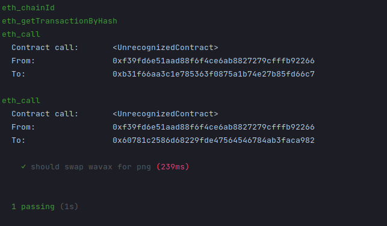

# Introduction

:::warning

These tutorials were published as a snapshot of when they were written, 
and may contain out-of-date-information.
For up-to-date information, please reach out to the owners of these 
projects.

:::

In this tutorial we will cover the use of Hardhat, a powerful EVM development
tool, together with Avalanche. More specifically, we will cover how to configure
it to work with Avalanche C-Chain and how to use the Hardhat `fork` mechanism to
test your DeFi dApps.

## Hardhat ?

Hardhat is an **Ethereum development environment for professionals**. It was
developed for Ethereum, but since lots of other blockchains reuse the EVM you
can apply Hardhat on those as well !

In short, it helps you in all the important steps of smart contract development.
From compiling, deploying, and testing your Solidity code. It has even a
functionality to let you use 'console.log' in your smart contract's code!

It's not the purpose of this tutorial to go over all those functionalities
(maybe in another tutorial, why not :) ), so here is a few links if you want to
know more about it:

- [Getting started](https://hardhat.org/getting-started)
- [Hardhat](https://github.com/nomiclabs/hardhat)

## What Is the 'Fork' Functionality ?

So let's get back to the core of this tutorial : Hardhat fork mechanism.

In order to make you realize the importance of this functionality, let me give you an example:

Let's say you have a simple contract `Swapper.sol`. It has a function `swap`
that once called with the appropriate parameters will swap for you some Wavax
tokens into another ERC20 tokens listed on a DEX. For the sake of this tutorial
we will use [Pangolin](https://pangolin.exchange/)

The flow of it would be:

1. Your send a call to Swapper's swap function 
2. Swapper use Pangolin's router `swapExactTokensForTokens` function, it will
   find the appropriate Pair contract address to call
3. Pangolin's router call a Pair contract to make the swap

Notice how it requires calls to external contracts.

If you want to test your Swapper `swap` function you then need to set up in your test environment :

- 2 ERC20 contracts
- Pangolin Factory
- Pangolin router's contract
- A Pair contract (PGL) using your 2 previously created ERC20.
- And all this with the appropriate constructor parameters, linking all this
  together. Doable but it'll require some time to set up all this properly.

So, what if I told you that we could avoid all of this and jump directly to the
step where you create tests for your smart contracts.

That's where 'Hardhat fork' is coming in handy.

With this you can simply make a copy of the state of an EVM chain (in our case
the C-Chain) and use it directly in your tests ! With all contract, addresses
balance available for you to use.

So in our case we would not have to deploy all the relevant Pangolin's contract,
we could just use the one deployed on the Mainnet and test your smart contract
without much hassle.

## Step by Step Explanation

### Smart Contract Overview

So first let's get over quickly the solidity code that we will use:

```solidity
// SPDX-License-Identifier: MIT
pragma solidity 0.8.4;

interface IRouter {
    function swapExactTokensForTokens(uint amountIn, uint amountOutMin, address[] calldata path, address to, uint deadline) external returns (uint[] memory amounts);
}

interface IERC20 {
    function transferFrom(address from, address to, uint value) external;

    function approve(address to, uint value) external returns (bool);

}

/**
* I would not recommend you to use this code as it is. It is really simple and stripped of some basic security checks.
*/
contract Swapper {

    address private wavax; // Address of the ERC20 Wrapped Avax
    address private router; // Address of the 'Uniswap-like' router contract

    constructor(address _wavax_address, address _router){
        wavax = _wavax_address;
        router = _router;
    }

    /**
    * This function will perform a swap on Pangolin. The pair must be a WAVAX-ERC20 pair.
    * @param amountOutMin Minimum amount of token that we want to get after our swap.
    * @param path Array of tokens' address
    * @param pair Address of the liquidity pair we will use in this swap
    * @param deadline Not relevant for avalanche, just pass timestamp that is in the future
    */
    function swap(uint256 amountOutMin, address[] calldata path, address pair, uint256 amountIn, uint256 deadline) external {
        // We transfer the wavax from the user (msg.sender) to this contract.
        IERC20(wavax).transferFrom(msg.sender, address(this), amountIn);
        // We approve the router as a spender for our Wavax.
        IERC20(wavax).approve(router, amountIn);
        // We do te swap using the router.
        IRouter(router).swapExactTokensForTokens(amountIn, amountOutMin, path, msg.sender, deadline);
    }
}
```

### Hardhat Configuration

As you can see we use some external contract (Pangolin router). Meaning that if
you want to test this code... you'll have to mock/recreate this router and all
the contracts that this router use ... Kinda annoying right ?

Thanks to Hardhat, we can make our life easier and skip it altogether.

First we need to configure Hardhat. If you look in `hardhat.config.ts` you'll see this :

```ts
const config: HardhatUserConfig = {
    defaultNetwork: "hardhat",
    solidity: "0.8.4",
    networks: {
        hardhat: {
            chainId: 43114,
            gasPrice: 225000000000,
            forking: {
                url: "https://api.avax.network/ext/bc/C/rpc",
                enabled: true,
            },
        },
        fuji: {
            chainId: 43113,
            gasPrice: 225000000000,
            url: "https://api.avax-test.network/ext/bc/C/rpc",
            accounts: [
                PK_TEST
            ]
        }
    },
    typechain: {
        outDir: "typechain",
        target: "ethers-v5",
    },
};
```

The most interesting portion of code here is the `network` part. That's where
you configure networks that you want to use with your project. As you can see
above we have defined two networks for this tutorial:

- `hardhat`, which is also the `defaultNetwork`.
- `fuji`, which is pointing to Fuji testnet.

Note that you can put multiple network definition, one of it is considered as
the 'default' one. Meaning that when you are using `npx hardhat test`, it'll use
the default network. If you want to run the test on another network than the
default, you can use this variation of the command : `npx hardhat test --network
fuji`

Now let's focus on the `hardhat` one .

```ts
hardhat: {
    chainId: 43114,
        gasPrice
:
    225000000000,
        forking
:
    {
        url: "https://api.avax.network/ext/bc/C/rpc",
            enabled
    :
        true,
            blockNumber
    :
        2975762
    }
,
}
,
```

- `chainId` is set with to the Mainnet value, as seen
  [here](https://docs.avax.network/build/apis/avalanchego/apis/c-chain).
- `gasPrice` is a dynamic value on Avalanche's C-Chain (see this
  [post](https://medium.com/avalancheavax/apricot-phase-three-c-chain-dynamic-fees-432d32d67b60)
  for more information). For test purposes we can use a fixed value (225 nAvax)
- `forking` is where you configure the parameter of the fork.
  - `url` here we see that we point to the Ava labs API endpoint This could be
      your local node, as long as it is running as full archive node. Hardhat
      will take care of getting the state of the C-Chain from this node and start
      a local development network on which you'll be able to deploy and test
      your code.
  - `blockNumber` Specify at which block Hardhat will create a fork. It is
      optional so if you don't set it, the default behaviour would be to fork
      the C-Chain at the latest known block. Now since you want to be able to run
      your tests in a deterministic manner, I recommend you to specify a
      specific block number.

If you want to see all configurations options, please go check
the [official documentation](https://hardhat.org/hardhat-network/reference/) for this feature.

### Tests Overview

So we went over the Solidity code, the Hardhat configuration. Now let's have a
look at how to create a test using Hardhat.

Now let's have a look at the test code.

Testing with Hardhat is fairly simple, lots of things are abstracted away.

Let's first have a first look at the test I've written for our Swapper contract,
no worries we will dissect it a bit later.

```ts
import { ethers } from "hardhat";
import * as dotenv from "dotenv";
import { SignerWithAddress } from "hardhat-deploy-ethers/src/signers";
import { BigNumber } from "ethers";
import { Swapper, IWAVAX } from "../typechain";

dotenv.config();

const AVALANCHE_NODE_URL: string = process.env.AVALANCHE_MAINNET_URL as string;
const WAVAX_ADDRESS: string = process.env.WAVAX_ADDRESS as string;
const PNG_ADDRESS = "0x60781C2586D68229fde47564546784ab3fACA982"

describe("Swappity swap", function () {

    let swapper: Swapper;
    let account1: SignerWithAddress;

    beforeEach(async function () {
        await ethers.provider.send(
            "hardhat_reset",
            [
                {
                    forking: {
                        jsonRpcUrl: AVALANCHE_NODE_URL,
                        blockNumber: 2975762,
                    },
                },
            ],
        );
      
        let accounts = await ethers.getSigners()

        // @ts-ignore
        account1 = accounts[0]

        // Here we get the factory for our Swapper contrat and we deploy it on the forked network
        const swapperFactory = await ethers.getContractFactory("Swapper")
        swapper = await swapperFactory.deploy(process.env.WAVAX_ADDRES as string, "0xE54Ca86531e17Ef3616d22Ca28b0D458b6C89106");
    });

    it("should swap wavax for png", async function () {

        // We get an instance of the wavax contract
        const wavaxTokenContract = await ethers.getContractAt("IWAVAX", WAVAX_ADDRESS)
        // @ts-ignore
        const pngTokenContract = await ethers.getContractAt("IWAVAX", PNG_ADDRESS)
        //makes sure owner has enough WAVAX balance
        if ((await wavaxTokenContract.balanceOf(account1.address)).lt("1000000000000000000000")) {
            await wavaxTokenContract.deposit({
                value: BigNumber.from("1000000000000000000000")
                    .sub(await wavaxTokenContract.balanceOf(account1.address))
            })
        }

        // We tell Wavax contract that we are cool with Swapper contract using our Wavax on our behalve
        await wavaxTokenContract.approve(swapper.address, ethers.constants.MaxUint256)

        // Check balance before the swap
        const wavaxBalanceBefore = await wavaxTokenContract.balanceOf(account1.address);
        const pngBalanceBefore = await pngTokenContract.balanceOf(account1.address)
        expect(wavaxBalanceBefore).eq("1000000000000000000000");
        expect(pngBalanceBefore).eq(0)

        // We call Swapper contract to make a swap from Wavax to Png. I chose some weird values for the swap cause it's just for the sack of this tutorial.
        await swapper.swap(100, [WAVAX_ADDRESS, PNG_ADDRESS], "0xd7538cABBf8605BdE1f4901B47B8D42c61DE0367", 1000000000, 1807909162115)
        // Check balance after

        const wavaxBalanceAfter = await wavaxTokenContract.balanceOf(account1.address);
        const pngBalanceAfter = await pngTokenContract.balanceOf(account1.address)

        // Since we have done the swap, we expect the balance to be slightly different now. Less Wavax and more Png.
        expect(wavaxBalanceBefore).lt(wavaxBalanceAfter);
        expect(pngBalanceBefore).gt(pngBalanceAfter);
    });
});

```

First we have all the imports.

```ts
import { ethers } from "hardhat";
import * as dotenv from "dotenv";
import { SignerWithAddress } from "hardhat-deploy-ethers/src/signers";
import { BigNumber } from "ethers";
import { Swapper, IWAVAX } from "../typechain";

dotenv.config();
```

I won't go over in details about those, just notice that we use `typechain`,
which is a tool that generate automatically typescript bindings for your
solidity contracts. Basically it means that, when we instantiate an object
corresponding to a Solidity contract, we will have full typings and
auto-completion. It saves you a lot of time and help you write better and safer
code. (I can't emphasize enough how much I love Typescript)

In the snippet below we can see the `beforeEach` function (it is a
[hook](https://mochajs.org/#hooks) actually) that will run before each test case
we write in this file.

```ts
describe("Swappity swap", function () {

    let swapper: Swapper;
    let account1: SignerWithAddress;

    beforeEach(async function () {
        await ethers.provider.send(
            "hardhat_reset",
            [
                {
                    forking: {
                        jsonRpcUrl: AVALANCHE_NODE_URL,
                        blockNumber: 2975762,
                    },
                },
            ],
        );

        let accounts = await ethers.getSigners()

        account1 = accounts[0]

        // Here we get the factory for our Swapper contrat and we deploy it on the forked network
        const swapperFactory = await ethers.getContractFactory("Swapper")
        swapper = await swapperFactory.deploy(process.env.WAVAX_ADDRES as string, "0xE54Ca86531e17Ef3616d22Ca28b0D458b6C89106");
    });
...
 ```

Couple of things to note here :

- `await ethers.provider.send( "hardhat_reset", ...` It will reset the state of
  your C-Chain fork. Meaning that each one of your test will run on a clean
   instance.
- `let accounts = await ethers.getSigners()` Ethers provides us a way to get
   access to some ``Signers`. Which is a way to represent C-Chain account that we
   can use in our tests.
- `const swapperFactory = await ethers.getContractFactory("Swapper")` We get
  here via Ethers a ContractFactory that is an abstraction used to deploy smart
  contracts.
- `swapper = await swapperFactory.deploy(process.env.WAVAX_ADDRES as string,
  "0x....");` Here we use the factory to actually deploy the contract on the
  hardhat network, which is a forked version of C-Chain Mainnet ! The resulting
  `swapper` is an object (fully typed thanks to typechain) that represent the
  `Swapper` contract, and on which you will be able to call functions, like the
  `swap` one !

So here we see the code of a test. We will break it down a bit more and explain
each important portion below.

```ts
it("should swap wavax for png", async function () {

    // We get an instance of the wavax contract
    const wavaxTokenContract = await ethers.getContractAt("IWAVAX", WAVAX_ADDRESS)
    // @ts-ignore
    const pngTokenContract = await ethers.getContractAt("IWAVAX", PNG_ADDRESS)
    //makes sure owner has enough WAVAX balance
    if ((await wavaxTokenContract.balanceOf(account1.address)).lt("1000000000000000000000")) {
        await wavaxTokenContract.deposit({
            value: BigNumber.from("1000000000000000000000")
                .sub(await wavaxTokenContract.balanceOf(account1.address))
        })
    }

    // We tell Wavax contract that we are cool with Swapper contract using our Wavax on our behalve
    await wavaxTokenContract.approve(swapper.address, ethers.constants.MaxUint256);

    // Check balance before the swap
    const wavaxBalanceBefore = await wavaxTokenContract.balanceOf(account1.address);
    const pngBalanceBefore = await pngTokenContract.balanceOf(account1.address);

    expect(wavaxBalanceBefore).eq("1000000000000000000000");
    expect(pngBalanceBefore).eq(0);

    // We call Swapper contract to make a swap from Wavax to Png. I chose some weird values for the swap cause it's just for the sack of this tutorial.
    await swapper.swap(100, [WAVAX_ADDRESS, PNG_ADDRESS], "0xd7538cABBf8605BdE1f4901B47B8D42c61DE0367", 1000000000, 1807909162115);

    // Check balance after
    const wavaxBalanceAfter = await wavaxTokenContract.balanceOf(account1.address);
    const pngBalanceAfter = await pngTokenContract.balanceOf(account1.address);

    expect(wavaxBalanceBefore).lt(wavaxBalanceAfter);
    expect(pngBalanceBefore).gt(pngBalanceAfter);
});
```

In the following snippet we see how we can get an instance of a contract at a
specific address. So here what we are doing is asking Ethers to give us an
object that is a reference to a contract deployed at `WAVAX_ADDRESS` and
`PNG_ADDRESS`, with `IWAVAX` as ABI.

Then we check the balance of the account we will use, and if the balance is too
small for our taste, we deposit a bit of AVAX in it.

```ts
    // We get an instance of the wavax contract
const wavaxTokenContract = await ethers.getContractAt("IWAVAX", WAVAX_ADDRESS)
// @ts-ignore
const pngTokenContract = await ethers.getContractAt("IWAVAX", PNG_ADDRESS)
//makes sure owner has enough WAVAX balance
if ((await wavaxTokenContract.balanceOf(account1.address)).lt("1000000000000000000000")) {
    await wavaxTokenContract.deposit({
        value: BigNumber.from("1000000000000000000000")
            .sub(await wavaxTokenContract.balanceOf(account1.address))
    })
}
```

Now we tackle the interesting bit of this test, the actual call to our `Swapper` contract.

We can see that we interact with contract we did not deploy, thanks again to the
fork feature. For example here we call the approve function of the WAVAX
contract. And we also check the balance of our address before the swap.

Then we do the actual call to the swap function of Swapper contract. Passing in
the necessary parameters. Here is an overview of the parameters :

- `100`, the minimum amount of token we want to receive for this swap. It's
  intentionally put low as it is just a test.
- `[WAVAX_ADDRESS, PNG_ADDRESS]` an array of address that correspond to the path
  we want to take, basically saying that we want to go from WAVAX to PNG token.
- `0xd7538cABBf8605BdE1f4901B47B8D42c61DE0367` correspond to the address of the
  Pangolin Liquidity Pair for WAVAX * PNG.
- `1000000000` the amount of wavax we are ready to swap for PNG.
- `1807909162115` this can be ignored as it correspond to the deadline
  parameter. Which is useless on avalanche because transactions are
  finalized in a very short time frame (< second most of the time).

Then we fetch again the balance of our address. And we check if the balances
correspond to our assumptions. If it does, it means that our code working as we
expect for this functionality.

```ts
// We tell Wavax contract that we are cool with Swapper contract using our Wavax on our behalve
await wavaxTokenContract.approve(swapper.address, ethers.constants.MaxUint256);

// Check balance before the swap
const wavaxBalanceBefore = await wavaxTokenContract.balanceOf(account1.address);
const pngBalanceBefore = await pngTokenContract.balanceOf(account1.address);

expect(wavaxBalanceBefore).eq("1000000000000000000000");
expect(pngBalanceBefore).eq(0);

// We call Swapper contract to make a swap from Wavax to Png. I chose some weird values for the swap cause it's just for the sack of this tutorial.
await swapper.swap(100, [WAVAX_ADDRESS, PNG_ADDRESS], "0xd7538cABBf8605BdE1f4901B47B8D42c61DE0367", 1000000000, 1807909162115);

// Check balance after
const wavaxBalanceAfter = await wavaxTokenContract.balanceOf(account1.address);
const pngBalanceAfter = await pngTokenContract.balanceOf(account1.address);

expect(wavaxBalanceAfter).lt(wavaxBalanceBefore);
expect(pngBalanceAfter).gt(pngBalanceBefore);
```

If you want to see the code in action, you should run this command in the terminal :
`npx hardhat test` .

This should produce an output looking like this:


Yay ! We successfully tested our contract using a fork of the Avalanche's C-Chain Mainnet.

## Bonus

### Time Travel

Now I still have a couple of things to introduce to you.

Let's say you want to test a compounder contract that work on the WAVAX PNG
pair. What you are most interested in is to see if your compounder contract can
reinvest the farm reward into the farm. Issue is that this reward is `time
bound`, meaning that you need to wait a bit to see your reward going up. Hardhat
provides a way to easily test this sort of situation.

In the snippet below you see that we call a function from the
`HardhatRuntimeEnvironment` that will change the time. Then we mine a new
block. This will allow you to 'artificially' get a week worth of reward from a
pangolin farm and you should be able to test your compounder contract ! Awesome
isn't it ?

```ts
// Advance the time to 1 week so we get some reward
await hre.ethers.provider.send('evm_increaseTime', [7 * 24 * 60 * 60]);
await network.provider.send("evm_mine");
```

### Impersonation

There is another Hardhat's feature that is quite useful: the `impersonation`.
With this feature, you can invoke contract call as if you were someone else,
like the owner of a contract that is already deployed for example.

In the snippet below we want to call the function `setCoverageAmount` from the
elkIlpStrategyV5. Which is only callable by the owner of the contract. So not by
an address we have the control of. Look at the following snippet.

```ts
// We impersonate the 'owner' of the WAVAX-ELK StakingRewardsILP contract
await ethers.provider.send('hardhat_impersonateAccount', ['0xcOffeexxxxxxxxxxxxxxxxxxxxxxx']);
const admin = await ethers.provider.getSigner('0xcOffeexxxxxxxxxxxxxxxxxxxxxxx')

const stakingcontract = await ethers.getContractAt('IStakingRewardsILPV2', elpStakingRewardAddress, admin);
// We set the coverage elpBalanceAccount1 for our Strategy
await stakingcontract.setCoverageAmount(elkIlpStrategyV5.address, 1000000000000);

await hre.network.provider.request({
    method: "hardhat_stopImpersonatingAccount",
    params: ["0xba49776326A1ca54EB4F406C94Ae4e1ebE458E19"],
});
```

You see here that we start with

```ts
await ethers.provider.send('hardhat_impersonateAccount', ['0xcOffeexxxxxxxxxxxxxxxxxxxxxxx']);
const owner = await ethers.provider.getSigner('0xcOffeexxxxxxxxxxxxxxxxxxxxxxx')
```

Meaning that we will `impersonate` the address
`0xcOffeexxxxxxxxxxxxxxxxxxxxxxx`which is the `owner` of the
`IStakingRewardsILPV2` contract.

We can then use the `admin` signer to interact with the contract, as wee see in the following section:

```ts
const stakingcontract = await ethers.getContractAt('IStakingRewardsILPV2', elpStakingRewardAddress, owner);
```

## Conclusion

In this tutorial learned how to set up our Hardhat environment to use a fork of
avalanche's C-Chain and use it as a base for our tests, If you want to learn more
about Hardhat, I can't recommend you enough to have a look at their [official
documentation](https://hardhat.org/getting-started/)

I hope you learned something with this tutorial, let me know if you spot a mistake, typo ... 
Also if you would like to have another tutorial on how to use X with Avalanche, let me know !

## Additional Links

If you want to know more about avalanche, here's a bunch of links for you:

[Website](https://avax.network/) | [White Papers](https://avalabs.org/whitepapers)
| [Twitter](https://twitter.com/avalancheavax) | [Discord](https://chat.avalabs.org/)
| [GitHub](https://github.com/ava-labs) | [Documentation](https://docs.avax.network/)
| [Forum](https://forum.avax.network/) | [Avalanche-X](https://avalabs.org/avalanche-x)
| [Telegram](https://t.me/avalancheavax) | [Facebook](https://facebook.com/avalancheavax)
| [LinkedIn](https://linkedin.com/company/avalancheavax) | [Reddit](https://reddit.com/r/avax)
| [YouTube](http://www.youtube.com/c/AVALabsOfficial)
