# How to Mint Your Own ERC721 on Avalanche Using Open Zeppelin

:::warning

These tutorials were published as a snapshot of when they were written, 
and may contain out-of-date-information.
For up-to-date information, please reach out to the owners of these 
projects.

:::

This tutorial teaches you to deploy your own ERC721 token on Avalanche Fuji C-chain testnet.

The steps to deploy on the Mainnet are identical and the differences are mentioned in the tutorial.

## Contents

* [Getting images ready to be uploaded to decentralized
  storage.](#getting-images-ready-to-be-uploaded-to-decentralized-storage) (IPFS
  in this tutorial)
* [Getting metadata ready to be uploaded to decentralized
  storage.](#getting-metadata-ready-to-be-uploaded-to-decentralized-storage)
  (IPFS in this tutorial)
* [Writing code in Remix IDE](#writing-code-in-remix-ide)
* [Compiling and Deploying to Avalanche Fuji C-Chain
  Testnet.](#compiling-and-deploying-to-avalanche-fuji-c-chain-testnet)
* [Check the NFT on the explorer.](#check-the-nft-on-the-explorer)

### Getting Images Ready to Be Uploaded to Decentralized Storage

In order to create NFT we first need to have the image/video content hosted on a
decentralized storage solution like IPFS. IPFS in itself won't be enough because
if you host it on IPFS and garbage collection takes place your assets will be
gone and the NFT will not show your image/video.

For this we need a pinning service like Pinata. So you can make an account on Pinata [here](https://app.pinata.cloud).

Now, let's get the images ready. You might have seen on marketplaces like
OpenSea NFT's are in a collection like BAYC, CryptoPunks etc.

So do we store links to the metadata of every NFT in the collection? The answer is no.

OpenZeppelin has come up with a smart way where you just need to store the
prefix of the url where the metadata is stored and the tokenID is appended to it
to return the url of the metadata for an individual NFT. For example, if the
baseURI is "<https://mynft.com/>" and if you want the metadata for tokenID 1 the
contract simply returns ("<https://mynft.com/1>"). This way we don't need to store
the url of the metadata for every tokenID.

To achieve this we need to rename our images/videos with respect to tokenID.
Make sure to have all the assets in a single folder if you plan to create a
collection of NFT's.

Image / Video for tokenID 0 should be named 0 followed by the extension (jpg,
png, tiff, gif, mp4, etc...) 

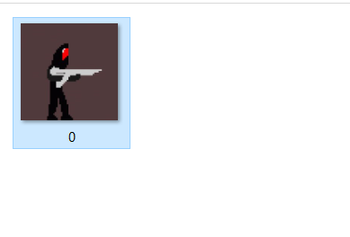

Here I have a single image named 0 to represent the image corresponding to the
tokenID 0. You can name your assets similarly starting from 0 or 1 make sure
that your contract also start the tokenID from 0 if you start naming from 0
otherwise 1 whichever is your case. In this tutorial, we will start from 0.

Let's upload these assets to pinata for pinning on IPFS.

In the pinata dashboard you should see an upload button. 

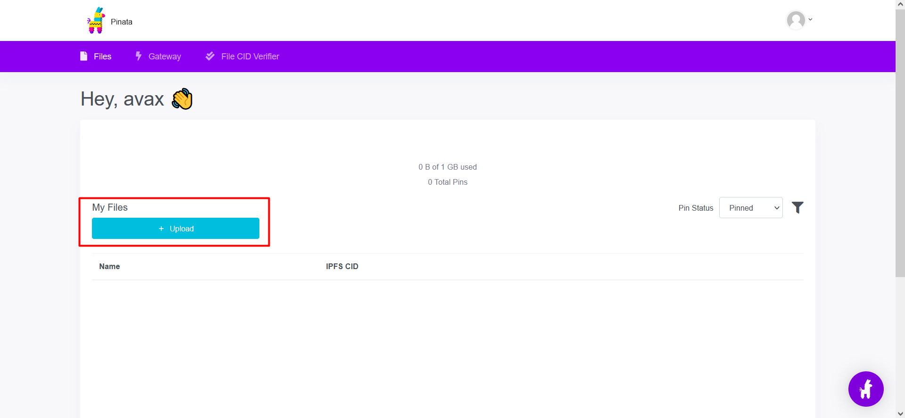

We are supposed to upload the entire folder the reason for that is we get the
same baseURI and tokenID type URL if we upload the folder more about it below.

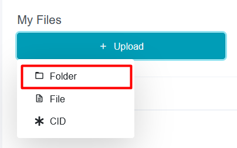

Upload the folder by clicking the "Click to upload" button we don't want a
custom name for the pin and we need not preserve the directory name so we can
ignore those options for now.

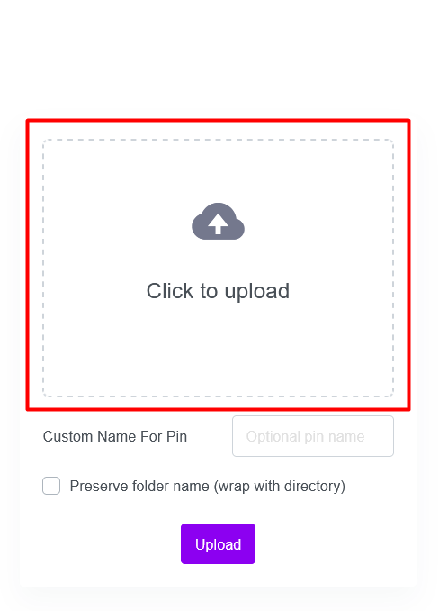

You can see the files that are about to upload since I have only one you can see
it in the image below. Click the "Upload" button to start uploading.

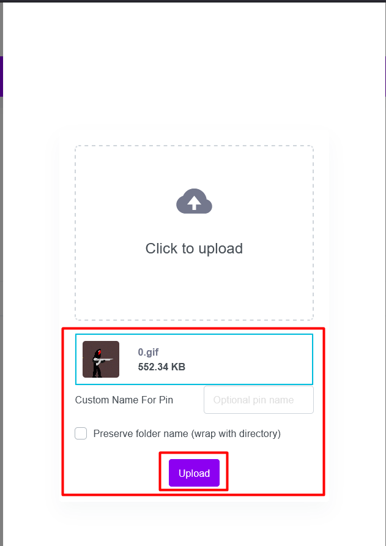

Once done you should see the folder in the files section as shown in the image below.

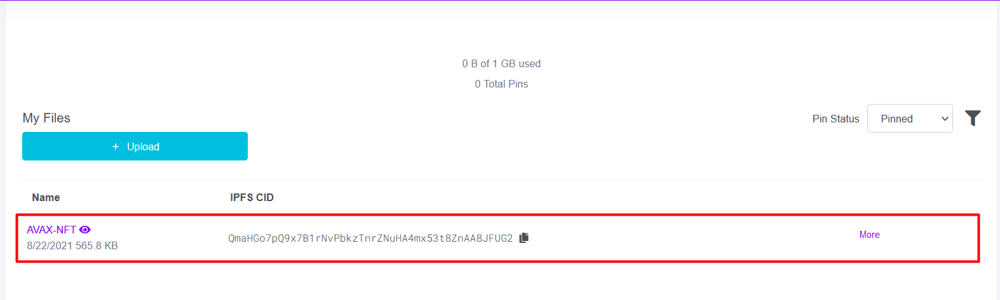

You can now click on the name of the folder to see its content on IPFS.

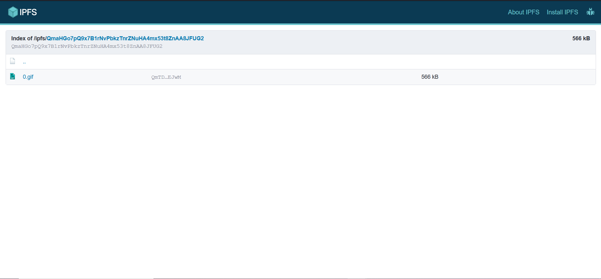

So now we have the baseURI for the assets to get any asset all we need to do is
append the tokenID and extension to the baseURI.

This is the baseURI in my case.
<https://gateway.pinata.cloud/ipfs/QmaHGo7pQ9x7B1rNvPbkzTnrZNuHA4mx53t8ZnAA8JFUG2>

To get asset for tokenID 0 all I need to do is append "/" +  tokenID + extension (.gif in this case)
<https://gateway.pinata.cloud/ipfs/QmaHGo7pQ9x7B1rNvPbkzTnrZNuHA4mx53t8ZnAA8JFUG2/0.gif>

### Getting Metadata Ready to Be Uploaded to Decentralized Storage

Now that we have the baseURI for assets we need to prepare the metadata that the
marketplaces parse in order to extract attributes and artwork from it.

Similar naming convention has to be followed for metadata also in case you plan to create an NFT collection.

The content of metadata files is expected to be in .json format. However, files
need not have an extension. So the metadata for tokenID 0 would be
<code>0.json</code> however when we upload to pinata we suppress the extension.

Create a separate folder to store all the metadata files. Create a text file
using a notepad, notepad++, or text editor of your choice.

This is the metadata format expected by marketplaces like OpenSea.

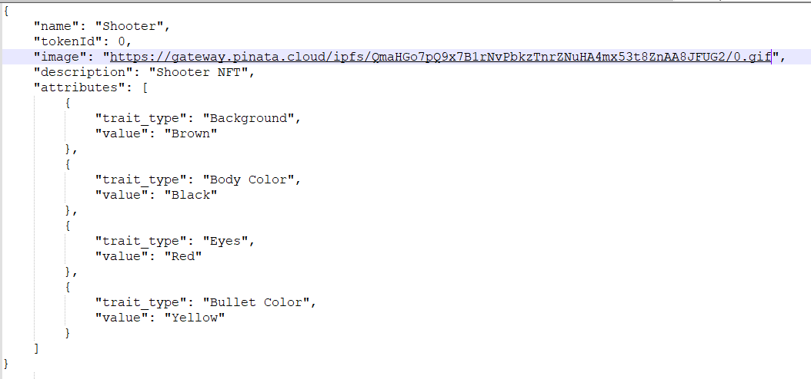

* Let's go through every attribute one by one.
  * `name` - specify the name of the NFT.
  * `tokenId` - specify the tokenID of the NFT.
  * `image` - specify the URL where the assets for the NFT are hosted. This is
      the same URL I have given above. Make sure to include the complete URL
      including the tokenID and extension part.
  * `description` - specify some description about the entire NFT collection.
  * `attributes` - specify the attributes of the NFT. Notice the format to
      specify the attributes.

I have also attached the same metadata file in the repository in case you want
to copy and edit it go for it.

You will need to create such a metadata file for every NFT in the collection.
Usually, people write a script to generate metadata files.

Once you are done you should have a folder of metadata files ready to be uploaded to pinata.

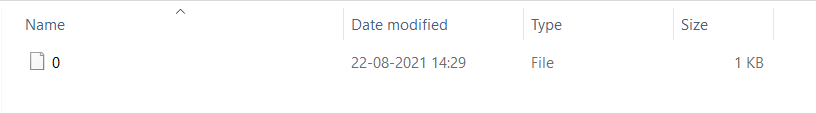

Upload the folder of metadata to pinata.

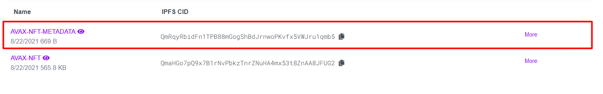

You can click on the folder name and see the contents on IPFS.

### Writing Code in Remix IDE

Let's now write the code for the ERC721 token. In this tutorial we will use the
[Remix IDE](https://remix.ethereum.org/) for deploying smart contracts as it is
beginner-friendly.

This is how the Remix IDE interface looks like and we can see our project files on the left.

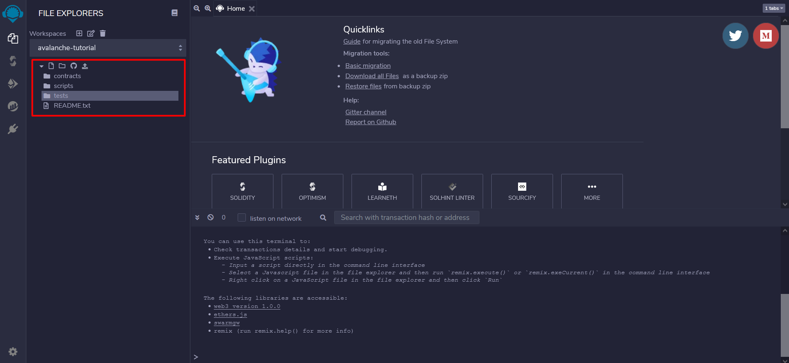

Let's create a file under the <code>contracts</code> folder for our token.

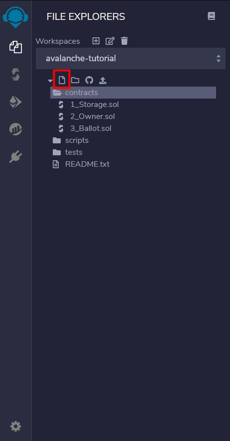

For this tutorial I named it <code>MyNFT.sol</code> make sure to have the
<code>.sol</code> extension. As a good practice, you can name the file with the
same name as the token.

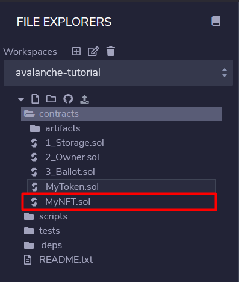

I have attached the code for the NFT in the same repository. 

* Let's go through the code.
  * Inherits
    * `ERC721("MyNFT", "MN")` - replace <code>MyNFT</code> with the name you
          want the collection to have, replace <code>MN</code> with the symbol
          you want for the collection.
    * `Ownable` - ownable is used to have an access control mechanism.
          Ownable provides utility functions to `getOwner`, `setOwner` and
          `renounceOwnership`.
  * Variables
    * `tokenCounter` - It is used to keep track of the tokenId to mint.
    * `price` - specify the price you want the minter to pay (in Wei) (0.01
          AVAX in this case).
    * `MAX_TOKENS` - specify the maximum number of NFT that can be minted
          from this collection. (100 in this case)
    * `baseURI` - the base URL for the metadata stored on Pinata. *(you will
          need to specify this)*
  * Functions
    * `mint` - the main mint function that is to be called in order to
          create an NFT. It consists of 2 require statements one to check if the
          max supply is exceeded and the second to check if the minter is paying
          the correct price.
    * `_baseURI` - we need to override the default OpenZeppelin _baseURI
          because the default one returns an empty string.
    * `withdraw` - this function can be called by the owner of the NFT
          collection to withdraw the funds deposited by the NFT minters. 🤑

### Compiling and Deploying to Avalanche Fuji C-Chain Testnet

Let's now compile the code to check if there are any errors. To compile the
shortcut is Ctrl / Command + S or click the icon shown in the image below.

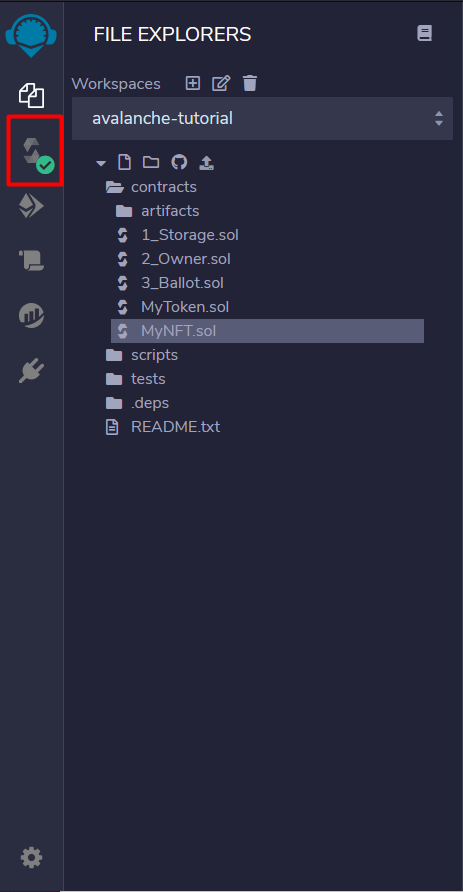

Make sure you have the correct compiler selected from the dropdown and click the "Compile" button.

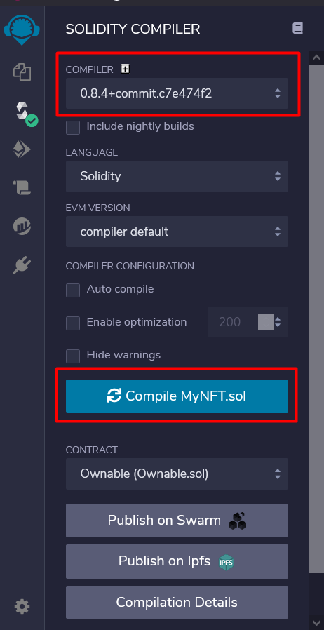

Once compiled we can now deploy the contract to the Avalanche Fuji C-Chain
testnet. *The steps to deploy on the Mainnet are the same.*

Click the deploy button as shown in the image below.

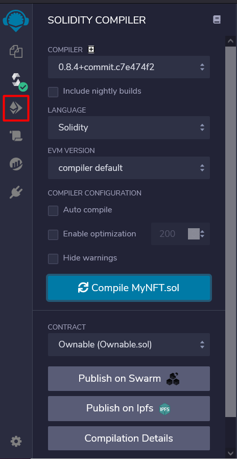

In the deploy section make sure you have "Injected web3" selected in the dropdown.

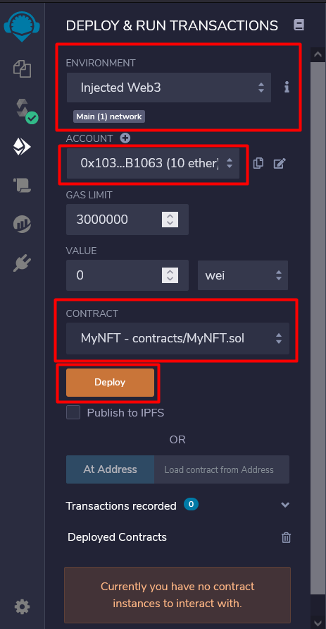

Make sure it shows the correct account that you want to use to deploy the NFT.
Make sure the correct contract is selected to be deployed.

Once ready you can hit the "Deploy" button.

You should get a "Confirm Transaction" prompt, hit the "Confirm" button.

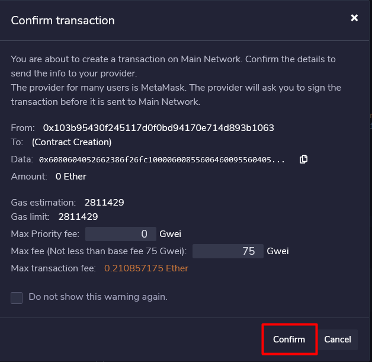

You should get a MetaMask pop-up asking to confirm the transaction.

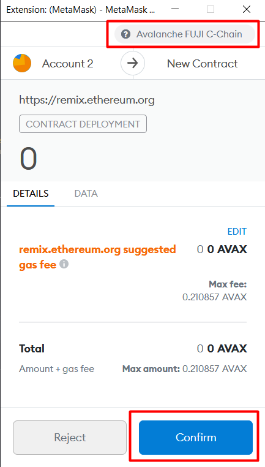

Make sure you are on the correct network and hit the "Confirm" button. You
should be able to see the contract deployment under progress in your MetaMask.

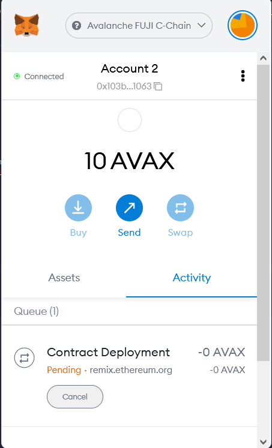

Once the contract is deployed you should be able to see it under the "Deployed Contracts" section.

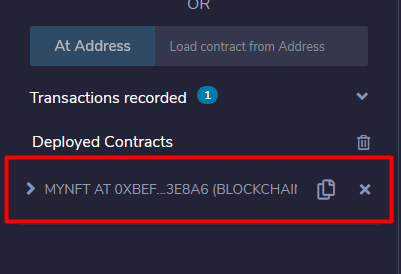

Nice! We now have deployed the contract however we don't own any NFT. To own an NFT we need to mint it.

Expand the contract and see for the "mint" button.

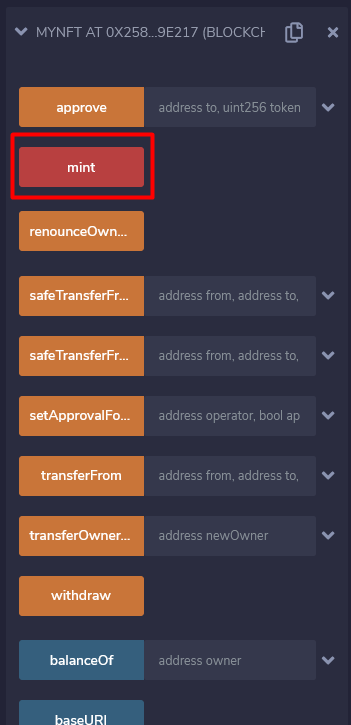

You won't be able to mint unless you pay 0.01 AVAX in order to mint. For that,
you will need to specify the amount to pay. Remix IDE doesn't let you specify
decimals so we need to specify it in finney which is a lower unit than ether. 1
ether = 1000 finney. We need 0.01 ether so 10 finney.

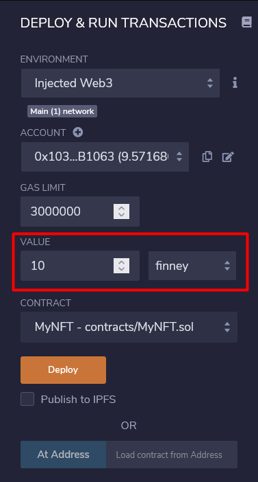

Now try clicking the "mint" button. "Confirm Transaction" dialog might appear
confirm it. Make sure you are on the correct network, the amount is correct, and
hit the "Confirm" button.

Hooray! We have now minted an NFT to ourselves! 🎉

### Check the NFT on the explorer

You can check the NFT on the explorer. My URL is below.

<https://testnet.snowtrace.io/tokens/0x10075f07b799f9ce7a585e95a2711766b1e248a2/instance/0/token-transfers>

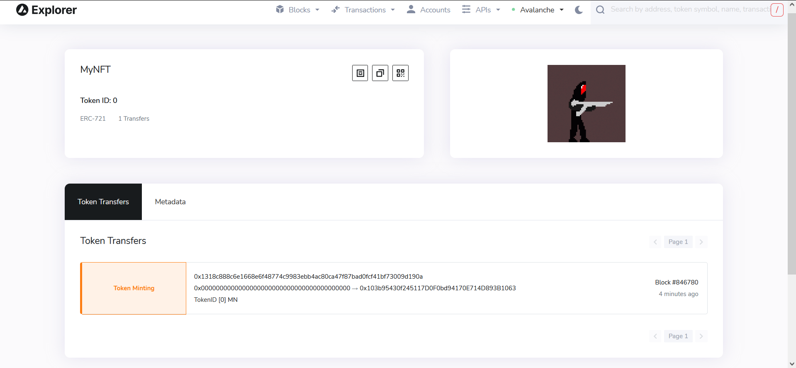

The format is as follows.

*Testnet* - 
`https://testnet.snowtrace.io/tokens/{contract-address}/instance/{tokenId}/token-transfers`

*Mainnet* - `https://snowtrace.io/tokens/{contract-address}/instance/{tokenId}/token-transfers`

### Conclusion

We have successfully minted an ERC721 on the AVAX blockchain. OpenZeppelin is a
doing a pretty great job at providing boilerplate code to get started however
there is a lot more things you can do to an NFT. Make the price go up on every
mint 🤑 or making the NFT artwork dynamic by serving the images from a server
instead of IPFS 😎. You may also use alternate decentralized storage solutions
like Arweave.

I recommend diving more deep and understand every function available to override
(basically editing it your way). You can learn more about it
[here](https://docs.openzeppelin.com/contracts/4.x/erc721) and
[here](https://docs.openzeppelin.com/contracts/4.x/api/token/erc721)!

Happy Minting! 🙂
