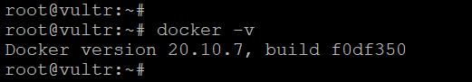
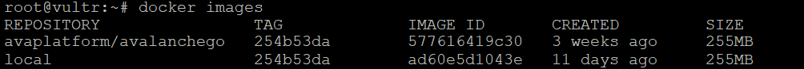
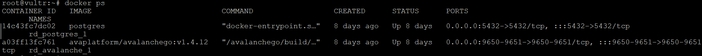
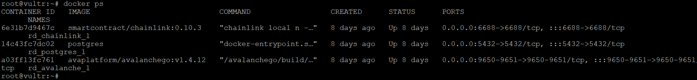
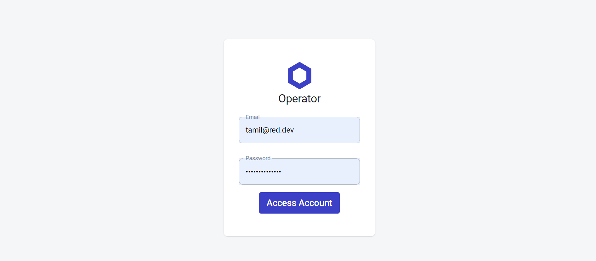
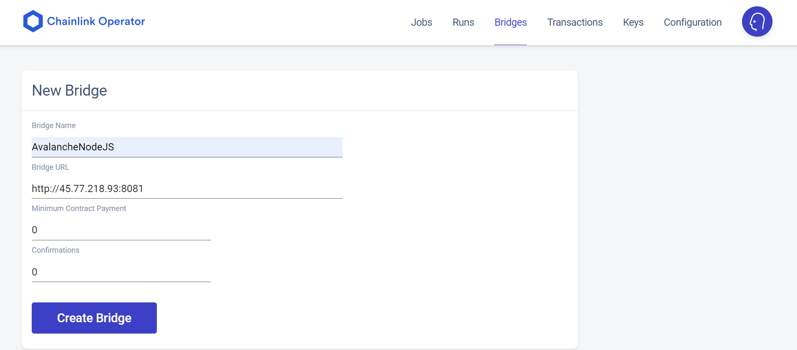
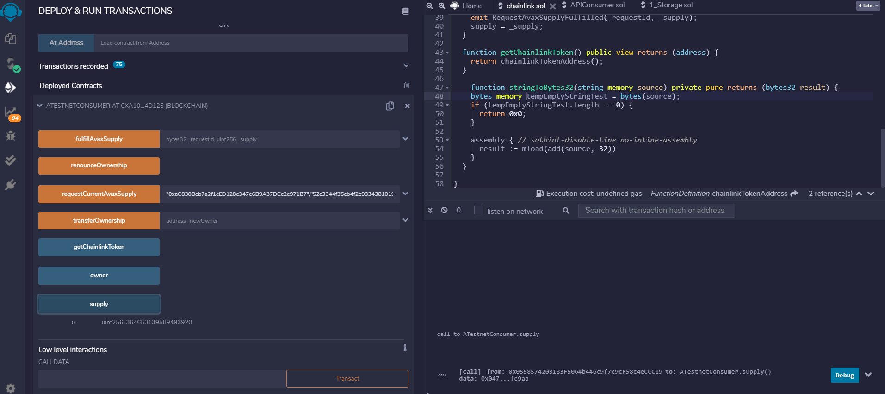

# How to Configure and Use Your Own Chainlink Node And External Adapter In Your Avalanche dapp

:::warning

These tutorials were published as a snapshot of when they were written, 
and may contain out-of-date-information.
For up-to-date information, please reach out to the owners of these 
projects.

:::

## Introduction

This tutorial will show you how to setup a Chainlink node with the Avalanche
Fuji Testnet and create dapp smart contracts to connect to the Chainlink node.

We at [red·dev](https://www.red.dev) needed to do learn how to do this for our
current software project under development,
[RediYeti](https://www.rediyeti.com). In our case, we needed our dapp (on the
C-Chain) to gather information from the Avalanche P-Chain, and because Avalanche
does not allow this natively, we built a Chainlink adapter to do this job. 

You, however, can follow this same methodology to gather any real-world
information that your dapp needs, by following this tutorial and just designing
your Chainlink adapter to gather different information.

In this tutorial, we describe each step of setting up the environment by hand.
However, to make your life easier after you learn how it works, we have included
a set of Ansible scripts to complete this process automatically. (For more
information on the devops tool **Ansible**, see the **Resources** section at the
end of this tutorial.) Ansible creates a development server using a Vultr.com
vps, and you can find the entire project
[here](ansible-chainlink-avalanche-setup/README.md). 

## Audience

To get the most out of this tutorial, you will need to have a basic
understanding of Docker, Chainlink, JavaScript, Node, Solidity, and how to write
dapps. If you do not yet know about these topics, see the
[**Resources**](#resources) section at the end for links to learn more.

## Overview

At the very highest level, here is an overview of the process we will take you
through in this tutorial. First we are going to show you how to install the
necessary software required to run the Chainlink node, and then we will
explain to you how to run the Chainlink node within the Docker container. After
that, with the help of the Chainlink GUI, we can create a simple job which will
be used in a smart contract to gather real-world data.

## Prerequisites

1. Ubuntu 20.04 or later
2. [Docker-CE](https://docs.docker.com/get-docker/)
3. [Go 1.16.6](https://storage.googleapis.com/golang/go1.16.6.linux-amd64.tar.gz)
4. [AvalancheGo v1.4.5](https://github.com/ava-labs/avalanchego.git) or higher
5. [MetaMask wallet](https://metamask.io/) set up for use with Avalanche Fuji Testnet
6. User with _sudo_ access

## Install Docker-CE

The first step is to install Docker-CE. Docker-CE (community edition) is a free
version of Docker that you can use to spin up containers without having to pay
for enterprise-level support.

Open a terminal session and execute the command below:

```bash
curl -sSL https://get.docker.com/ | sh
```

To manage Docker as a non-root user, create a docker group and add your user to it.

```bash
sudo groupadd docker
sudo usermod -aG docker $USER
```

Verify that you've installed Docker by running the command below:

```bash
docker -v
```



The next step is to download and install the Go language (a.k.a. "Golang") which
is required for building AvalancheGo, later in this section.

## Install Go

Download the Go package. We have used version 1.16.6 for this tutorial:

```bash
wget https://storage.googleapis.com/golang/go1.16.6.linux-amd64.tar.gz
```

Extract go1.16.6.linux-amd64.tar.gz to /usr/local:

```bash
tar -C /usr/local -xzf go1.16.6.linux-amd64.tar.gz
```

Add /usr/local/go/bin to the PATH environment variable. You can do this by
adding the following line to your $HOME/.profile or /etc/profile (for a
system-wide installation):

```bash
export PATH=$PATH:/usr/local/go/bin
```

Verify that you've installed Go by running the command below:

```bash
go version
```


## Build the AvalancheGo Image

Clone the AvalancheGo repository:

```bash
git clone https://github.com/ava-labs/avalanchego.git
```

:::info
The repository cloning method used is HTTPS, but SSH can be used too:

`git clone git@github.com:ava-labs/avalanchego.git`

You can find more about SSH and how to use it 
[here](https://docs.github.com/en/authentication/connecting-to-github-with-ssh/about-ssh). 
:::

Build the image into docker:

```bash
cd avalancghego
./scripts/build_image.sh
```

To check the build image run the command below:

```bash
docker images
```



The image should be tagged as `avaplatform/avalanchego:COMMIT`, where `COMMIT`
is the shortened commit of the Avalanche source it was built from. In our case
it is 254b53da.


## Setting Up and Running Chainlink Node

### Dependencies 

1. Docker CE
2. `Smartcontract/chainlink` v0.10.3 
3. AvalancheGo >= 1.4.5
4. PostgreSQL

## Steps to Run Chainlink Node

### 1. Run AvalancheGo

The first step is to run AvalancheGo within docker which will map the TCP ports
9650 and 9651 in the container to the same ports on the Docker host.

Use the command below to run the AvalancheGo image within Docker:

```bash
docker run --name avalanchego-chainlink -d -p 9650:9650 -p 9651:9651 -v /root/.avalanchego:/root/.avalanchego avaplatform/avalanchego:91599fea /avalanchego/build/avalanchego --network-id=fuji --http-host=
```

* --name assign a name to the container
* -d specifies detached mode
* -p specifies the port number
* -v specifies the docker host location to store the container volume data
* `/avalanchego/build/avalanchego --network-id=fuji` is the command to start the
   AvalancheGo under Fuji test network
  
Verify that the AvalancheGo node is started and running:

```bash
docker ps
```

This will list the AvalancheGo container status:


Also, you can check by requesting a CURL command and seeing if it returns JSON data, as it does here:

```bash
curl -X POST --data '{
  "jsonrpc":"2.0",
  "id"     :1,
  "method" :"info.isBootstrapped",
  "params": {
      "chain":"C"
  }
}' -H 'content-type:application/json;' 127.0.0.1:9650/ext/info
```


### 2. Run PostgreSQL

The next step is to run PostgreSQL within a Docker container

Use the command below to run PostgreSQL. The POSTGRES_PASSWORD and POSTGRES_USER
are the environment variables used to set up the PostgreSQL superuser and its
password:

```bash
docker run --name pgchainlink -e POSTGRES_PASSWORD=chainlink -e POSTGRES_USER=chainlink -d -p 5432:5432 -v /root/postgres-data/:/var/lib/postgresql/data postgres
```

* -name assign name to the container
* -e specifies the environment variables used for the container
* -p specifies the port number used for the container
* -v specifies the docker host location to store the container volume data 

To verify that PostgreSQL is running, use the command below:

```bash
docker ps
```

This will list the Postgres container status:



### Run the Chainlink Node

The final step is to run the Chainlink node within the Docker container. Before
we start running it, we need to do some basic setup which is required for
Chainlink node.

1. Create a local directory to store Chainlink data
2. Create a .env file with the environment variables used to access the container.
3. Create a .api file with API email & password which is used to expose the API for GUI Interface
4. Create a .password file which holds the wallet password and is used to unlock
   the keystore file generated by you

Create a directory to store the Chainlink data:

```bash
mkdir ~/.chainlink-avalanche
```

Create a .env file to set the container's environment variables:

```bash
$ echo "ROOT=/chainlink
LOG_LEVEL=debug
ETH_CHAIN_ID=43113
MIN_OUTGOING_CONFIRMATIONS=2
LINK_CONTRACT_ADDRESS=0x0b9d5D9136855f6FEc3c0993feE6E9CE8a297846
CHAINLINK_TLS_PORT=0
SECURE_COOKIES=false
GAS_UPDATER_ENABLED=true
ALLOW_ORIGINS=*
ETH_URL=ws://$CHAINLINK_HOST:9650/ext/bc/C/ws
DATABASE_URL=postgresql://$USERNAME:$PASSWORD@$HOST:5432/chainlink?sslmode=disable" > ~/.chainlink-avalanche/.env
```

Create a .api file to expose credentials for the API and GUI interfaces:

```bash
$ echo "youremailaddress@yourcompany.com
$PASSWORD" > ~/.chainlink-avalanche/.api
```

Create a .password file for wallet password:

```bash
echo $PASSWORD > ~/.chainlink-avalanche/.password
```

---
**NOTE**

Don't forget to replace the $CHAINLINK_HOST, $HOST, $USERNAME and $PASSWORD with actual values.

_**Note:** The password needs to be at least 12 characters and must contain
three lowercase, uppercase, numbers, and symbols._

---

Finally, run the Chainlink node.

Use the command below:

```bash
docker run -d --name chainlink-avalanche-node -p 6688:6688 -v ~/.chainlink-avalanche:/chainlink -it --env-file=/root/.chainlink-avalanche/.env smartcontract/chainlink:0.10.3 local n -p /chainlink/.password -a /chainlink/.api
```

To verify the Chainlink node is running:

```bash
docker ps
```

This will list the Chainlink node container status:



## Setup a Chainlink Job

Before we set up a job in the Chainlink node, we need to create an external
adaptor which will gather the real-world data that interests us and provide this
data to our dapp. For that, we have created a simple API based external adaptor
written with NodeJS. [Click to download simple API external
Adaptor](https://github.com/red-dev-inc/avalanche-chainlink-tutorial/tree/main/chainlink-external-adaptor).
Please follow the README.md file to install and start the adaptor.

## Login to Chainlink GUI

You can now connect to your Chainlink node's UI interface by navigating to
<http://localhost:6688>. If using a VPS, you can create a SSH tunnel to your node
for 6688:localhost:6688 to enable connectivity to the GUI. Typically this is
done like this: 

```bash
ssh -i $KEY $USER@$REMOTE-IP -L 6688:localhost:6688 -N
```

Access <http://localhost:6688> in your favorite browser, and this will return to
the Chainlink login page:



## Create a New Bridge

First, create a new bridge which will point to the external adaptor listening
address, which is in our case `http://<$HOST>:8081`



## Create a New Job

The next step is to create a new job in the Chainlink node. 

### Using Type: "web"

Below is a code snippet for the job specification to test the job within the
Chainlink GUI. This can be done by using the "type": "web" . Please check the
Chainlink official [documentation](https://docs.chain.link/docs/job-apis/) for
more details. Later, in this section we also cover the "type": "runlog" which
will be used to integrate Chainlink with on-chain contracts. 

```json
{
    "name": "Avalanche NodeJS adapter test",
    "initiators": [
        {
            "type": "web"
        }
    ],
    "tasks": [
        {
            "type": "avalanchenodejs",
            "params": {
                "chain": "P",
                "method": "platform.getCurrentSupply",
                "params": {}
            }
        }
    ]
}
```

Now, in the jobs section, the newly created _Avalanche NodeJS adapter test_ will
be listed. Select that and click the Run button to test and see the result.


Then, click on the Runs tab, and select the job id to see the result. It should be in _Completed_ status:


### Using Type: "runlog"

The [RunLog](https://docs.chain.link/docs/initiators/) initiator is the easiest
initiator to use when integrating Chainlink with on-chain contracts.

```json
{
  "name": "Avalanche NodeJS adapter",
  "initiators": [
    {
      "type": "runlog",
      "params": {
        "address": "0xac830beb7a2f1ced128e347e6b9a37dcc2e971b7"
      }
    }
  ],
  "tasks": [
    {
      "type": "avalanchenodejs",
      "params": {
        "chain": "P",
        "method": "platform.getCurrentSupply",
        "params": {
        }
      }
    },
    {
      "type": "jsonparse"
    },
    {
      "type": "ethuint256"
    },
    {
      "type": "ethtx"
    }
  ]
}
```

* jsonparse, ethuint256 & `ethtx` are core adaptors and are executed
  synchronously. For more details, you will find documentation for each
  adapter's usage [here](https://docs.chain.link/docs/core-adapters/).
* runlog - By adding the address parameter, you make the event filter of the
  RunLog initiator more restrictive, only listening for events from that
  address, instead of any address. By adding the requesters parameter, you only
  allow requests to come from an address within the array. Please have a look at
  this [video](https://www.youtube.com/watch?v=ZB3GLtQvgME&38m38s) to learn how
  to get your oracle address.


## Smart Contracts

This section will explain the smart contracts we have written for communicating
with the Chainlink node through oracle address and job id.

We have used the solidity and compiler version 0.4.24 for this tutorial. For
more details please refer to
[link](https://remix-ide.readthedocs.io/en/latest/compile.html) on how to
compile the solidity program.

To deploy the smart contracts go to the Deploy & Run Transactions Tab.

There are 3 type of environments Remix can be plugged to:

* JavaScript VM
* Injected Web3
* Web3 Provider

Both Injected Web3 and Web3 Provider require the use of an external tool.

An external tool for Injected provider is MetaMask. Some external tools used
with Web3 provider are a Truffle Ganache-CLI, Hardhat node, or an Ethereum node
itself.

In this tutorial, we have used the Injected Web3 as environment and loaded the
MetaMask with Avalanche Fuji Testnet. Please have a look at this
[**section**](#deployed-smart-contracts) you can see our Avalanche Fuji
Testnet Address has been chosen in the Account dropdown. For more details
please refer to [link](https://remix-ide.readthedocs.io/en/latest/run.html) on
how to run & deploy the smart contracts.

Below is the code snippet which you can copy and paste into the Remix IDE and
then compile and deploy as suggested above.

```solidity
pragma solidity 0.4.24;

import "https://github.com/smartcontractkit/chainlink/contracts/src/v0.4/ChainlinkClient.sol";
import "https://github.com/smartcontractkit/chainlink/contracts/src/v0.4/vendor/Ownable.sol";

contract ATestnetConsumer is ChainlinkClient, Ownable {
  uint256 constant private ORACLE_PAYMENT = 1 * LINK;
  uint256 public supply;
  
  event RequestAvaxSupplyFulfilled(
    bytes32 indexed requestId,
    uint256 indexed supply
  );
  
  constructor() public Ownable() {
    setChainlinkToken(0x0b9d5D9136855f6FEc3c0993feE6E9CE8a297846);
  }
  
  function requestCurrentAvaxSupply(address _oracle, string _jobId)
    public
    onlyOwner
  {
      Chainlink.Request memory req = buildChainlinkRequest(stringToBytes32(_jobId), this, this.fulfillAvaxSupply.selector);
      req.add("chain", "P");
      req.add("method", "platform.getCurrentSupply");
      req.add("path", "supply");
      sendChainlinkRequestTo(_oracle, req, ORACLE_PAYMENT);
  }
  
  function fulfillAvaxSupply(bytes32 _requestId, uint256 _supply)
    public
    recordChainlinkFulfillment(_requestId)
  {
    emit RequestAvaxSupplyFulfilled(_requestId, _supply);
    supply = _supply;
  }

  function getChainlinkToken() public view returns (address) {
    return chainlinkTokenAddress();
  }

  function stringToBytes32(string memory source) private pure returns (bytes32 result) {
    bytes memory tempEmptyStringTest = bytes(source);
    if (tempEmptyStringTest.length == 0) {
      return 0x0;
    }

    assembly { // solhint-disable-line no-inline-assembly
      result := mload(add(source, 32))
    }
  }

}
```

### Deployed Smart Contracts


Add tokens to the Avalanche Fuji Testnet so that you can transfer some LINKs to
the deployed blockchain address to perform the transactions. Please refer to
[link](https://docs.yearn.finance/resources/guides/how-to-add-a-custom-token-to-metamask)
on how to add custom tokens. 

Use the [Avalanche Faucet](https://linkfaucet.protofire.io/fuji) and send some
LINK tokens to the Fuji Testnet wallet address.

Then transfer LINKS to the deployed blockchain address to perform the transaction.


Now, call the requestCurrentAvaxSupply method on the deployed blockchain with
params `oracle_address` & job id. 

:::info
The oracle address should be _your own oracle address_. Please have a look at
this [video](https://www.youtube.com/watch?v=ZB3GLtQvgME&38m38s) to learn how to
get your own oracle address.
:::

* `oracle_address` - 0xaC830Beb7a2f1cED128e347e6B9A37DCc2e971B7
* job id - 52c3344f35eb4f2e93343810199ab313"


Now, you can check the Runs tab in Chainlink GUI it will show that the job has triggered and completed:


Then, click the supply button on the deployed contract it will return the current AVAX supply value:



## Conclusion

Having completed this tutorial, you are now no longer restricted to using only
the oracles that Chainlink provides; now you can make your own!

You know how to setup a Chainlink node with the Avalanche Fuji Testnet and
create dapp smart contracts to connect to the Chainlink node. You can follow
this methodology to gather any real-world information that your dapp needs just
by following this tutorial and designing your Chainlink adapter to gather
different information.

As a final word, remember that in this tutorial, we describe each step of
setting up the environment by hand, but in order to make your life easier now
that you know how it works, we have included a set of Ansible scripts to
complete this process automatically.

## Resources

Here is a list of resources that can give you a detailed idea of what is mentioned in this tutorial.

1. [Ansible installation and basics](https://docs.ansible.com/ansible/latest/user_guide/intro_getting_started.html)
2. [Docker installation and basics](https://docs.docker.com/get-started)
3. [Learn how to write smart contracts with solidity](https://docs.soliditylang.org)
4. [Learn NodeJS and installation](https://nodejs.dev/learn)
5. [Learn Modern JavaScript](https://javascript.info/intro)
6. [Learn about Chainlink](https://docs.chain.link/docs)
7. [This is a useful documentation from Chainlink to setup and run a local Chainlink node](https://docs.chain.link/docs/running-a-chainlink-node)
8. [Here is a good YouTube video by Chainlink on how to running a local Chainlink node](https://www.youtube.com/watch?v=ZB3GLtQvgME)
9. [Avalanche Testnet LINK Token details](https://docs.chain.link/docs/link-token-contracts)
10. [AvalancheGo setup details](https://github.com/ava-labs/avalanchego)
11. [How to add custom tokens in MetaMask](https://docs.yearn.finance/resources/guides/how-to-add-a-custom-token-to-metamask)
