# Indexing an Avalanche Local Subnet with The Graph

:::warning

These tutorials were published as a snapshot of when they were written,
and may contain out-of-date-information.
For up-to-date information, please reach out to the owners of these
projects.

:::

## Introduction

[Avalanche](https://www.avax.network/) is an open-source platform for launching
decentralized applications and enterprise blockchain deployments in one
interoperable, highly scalable ecosystem. Avalanche is the first decentralized
smart contracts platform built for the scale of global finance, with
near-instant transaction finality. Avalanche is a blockchain that promises to
combine scaling capabilities and quick confirmation times through its Avalanche
Consensus Protocol.

Blockchains have traditionally been referred to as being slow and unscalable.
Avalanche embraces an innovative approach to consensus that solve these problems
without compromising on security.

Avalanche is a high-performance, scalable, customizable, and secure blockchain
platform. It targets three 15 broad use cases:

- Building application-specific blockchains, spanning permissioned (private) and permissionless (public)
  deployments.
- Building and launching highly scalable and decentralized applications (dapps).
- Building arbitrarily complex digital assets with custom rules, covenants, and riders (smart assets).

## Avalanche Features 3 Built-in Blockchains

- Exchange Chain (X-Chain)
- Platform Chain (P-Chain)
- Contract Chain (C-Chain)

The P-chain is for platform management. It handles requests related to the
validator, the Subnet, and the blockchain. The C-chain is for contract
management. It is based on EVM; hence its API is almost identical to other EVM
protocols. It has both RPC and WebSocket endpoints, and it handles requests for
smart contracts. The X-chain is for asset exchange. It is Avalanche’s native
platform; it is used for creating and trading assets like AVAX and NFTs.

These 3 blockchains are secured by the Avalanche Primary Network with is a special kind of Subnet.

The Avalanche Architecture is composed of:

- Subnetworks
- Virtual Machines

## The Graph Protocol

[The Graph](https://thegraph.com/) is an open-sourced indexing protocol for
organising blockchain data and making it easily accessible using
[GraphQL](https://graphql.org/). This software collects, processes and stores
data from various blockchain applications to facilitate efficient information
retrieval. The Graph stored data into various indices called Subgraphs, allowing
applications to query it. These queries are initiated using GraphQL, a language
originally created by facebook. The Graph has the ability to query networks like
Ethereum and IPFS. Anyone can build and publish open subgraphs.

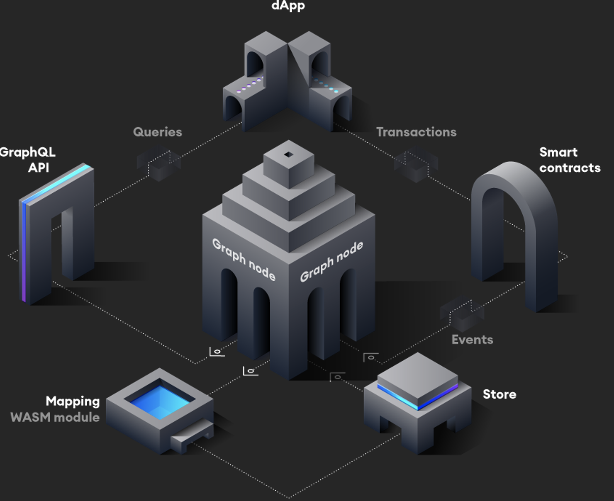

## Prerequisites

1. NodeJS and Yarn

   First, install the LTS (long-term support) version of
   [NodeJS](https://nodejs.org/en). This is `18.x` at the time of writing. NodeJS
   bundles `npm`.

   Next, install the [yarn](https://yarnpkg.com) package manager:

   ```zsh
   npm install -g yarn
   ```

2. Git

To check the current Git version use:

```zsh
git --version
```

This tutorial is created to serve as a guide to help developers setup an
Avalanche Subnet and Index them using GraphQL. We are going to learn how to run
a local network using the
[Avalanche-CLI](https://github.com/ava-labs/avalanche-cli) and deploy a basic
smart contract using [Remix](https://remix.ethereum.org/). Then Lastly we will
be indexing our Subnet using [The Graph](https://thegraph.com/). This guide is
an extension of the [Official Avalanche Documentation](/build/subnet/deploy/local-subnet.md).

Please note that all command line inputs and sample codes are MacOs and Linux
Based. Commands may vary for other operating systems.

In summary, we will be discussing the following:

1. Running an EVM Subnet on the Local Network using the Avalanche-CLI
2. Deploying smart contracts with Remix
3. Indexing our Subnet using The Graph

## Running an EVM Subnet on the Local Network Using the Avalanche-CLI

We will be creating an EVM on our local machine to give us a basic feel on how a
Subnet functions. The [Avalanche-CLI](https://github.com/ava-labs/avalanche-cli)
is a novel tool that allow us to have a local network up in minutes.

### Installation

Open up you MacOs command line utility and run the following command

On your home directory, create a new directory and `cd <newdir>` into the
directory. This is where we will be installing all our project dependencies.

```zsh
curl -sSfL https://raw.githubusercontent.com/ava-labs/avalanche-cli/main/scripts/install.sh | sh -s
```

This command download the latest binary of the
[Avalanche-CLI](https://github.com/ava-labs/avalanche-cli) to the current
directory where it was executed.

`cd` into the `bin` folder and export the path variable

```zsh
cd bin
export PATH=$PWD:PATH
```

This makes the `avalanche` command available globally. For more information
about
[environment-variables](https://apple.stackexchange.com/questions/106778/how-do-i-set-environment-variables-on-os-x)
and
[Avalanche-CLI commands](/tooling/avalanche-cli.md)
visit the respective links.

### Initialising a Default Subnet

We will be using the `avalanche subnet create` command line wizard to get our network running. ASAP.
In the same directory where the binary was installed, run the following command

```zsh
avalanche subnet create <SubnetName>
```

Substitute `<SubnetName>` with any preferred name of your choice but without
spaces. For this tutorial we are going to call our Subnet `<fibrinNet>`.

```zsh
avalanche subnet create fibrinNet
```

Since this command does not provide any arguments, you would need to walk
through the configuration wizard to generate a `genesis file` for your network.

- Choose a Virtual Machine (VM):
  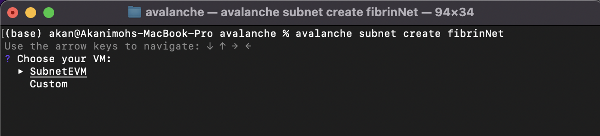
  We are going to be making use of the `SubnetEVM`

- Pick a chain ID 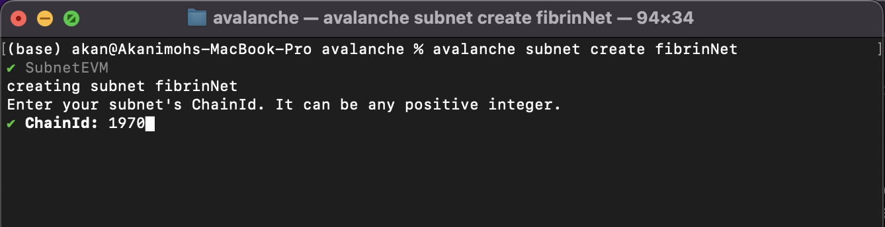 Every EVM based
  blockchain has a special parameter called a `chainID`. ChainIDs are expected
  to be unique values, you can check [chainlist.org](https://chainlist.org/) to
  see if your proposed chain ID is already in use. We will be making use of the
  chain ID `1970` (A pun on JavaScript dates...lol).

- Select a symbol for the native Subnet token
  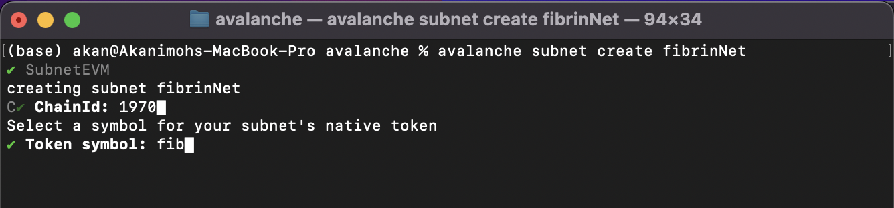

- Set fees: Select the `low disk use / low throughput` option
  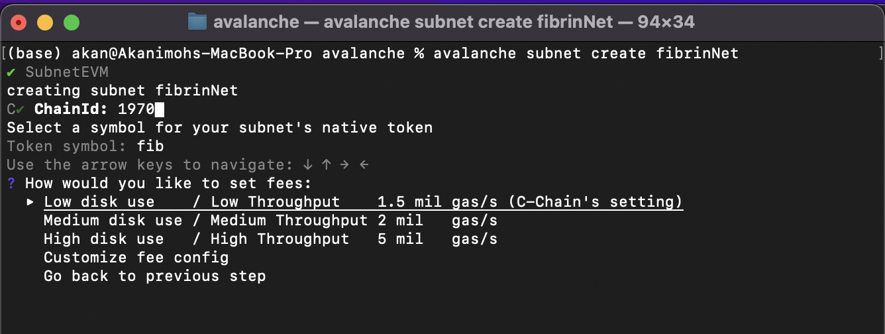

- Airdrop: default to airdrop 1 million tokens to provided address
  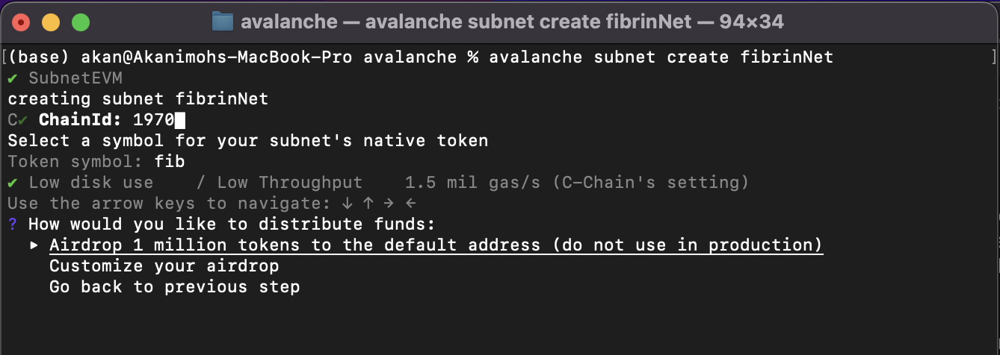

- Add a custom precompile to modify the EVM: For this section, we will not be using a pre-compile script
  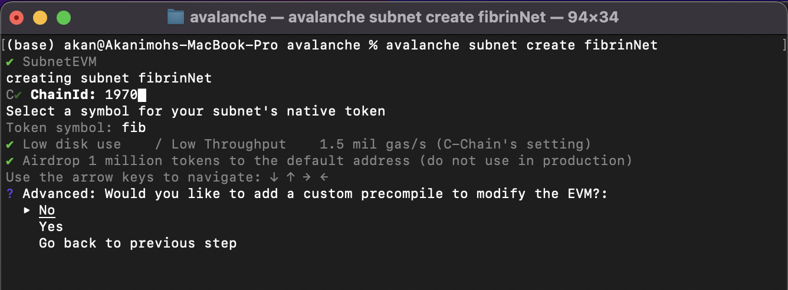

The wizard won't customize every aspect of the Subnet-EVM genesis for you, we
will be doing this in the subsequent sections.

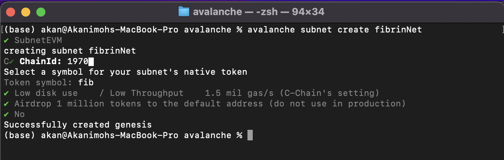

To view the list of all created Subnets, just execute the following command

```zsh
avalanche subnet list
```

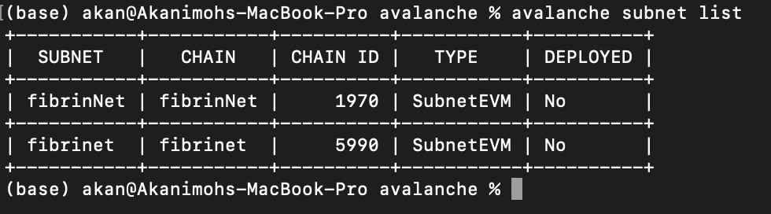

### Deploying the Subnet Locally

To deploy the newly created Subnet locally, run the following command

```zsh
avalanche subnet deploy <SubnetName>
```

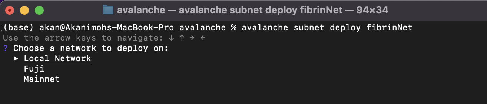

When a Subnet is run locally, it starts a multi-node (5 node) Avalanche Network in the background.

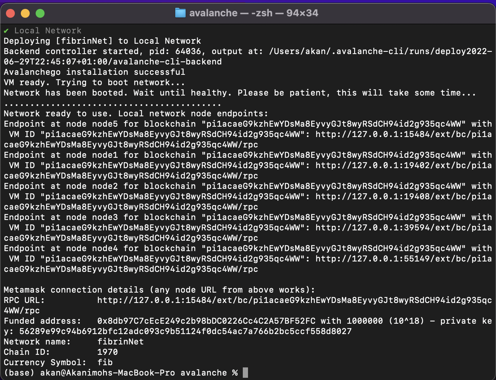

### Configuring MetaMask

To test the functionality of the just created Subnet, go ahead and add the
configuration details to [MetaMask](https://metamask.io/). You can create a new
MetaMask account by importing the private key
`0x56289e99c94b6912bfc12adc093c9b51124f0dc54ac7a766b2bc5ccf558d8027` and start
experiencing with this account.

I have a [GitHub
Tutorial](https://github.com/FibrinLab/Avalanche-Local-Environment-Setup) that
explains how to setup your local development environmet including `MetaMask`.

Lastly don't forget to stop the running local network

```zsh
avalanche network stop <snapshotName>
```

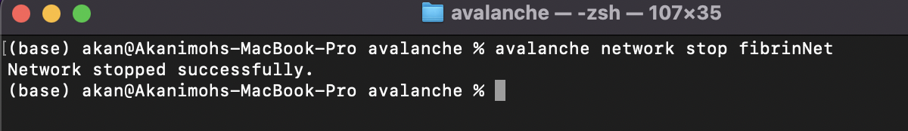

## Deploying Smart Contracts with Remix

1. Setting up Remix

We are going to be making use of an online IDE in compiling and deploying our
smart contract code, a tool called [Remix](https://remix.ethereum.org/).

Navigate to the [Remix](https://remix.ethereum.org/) platform and import the
test contract we will be making use of.

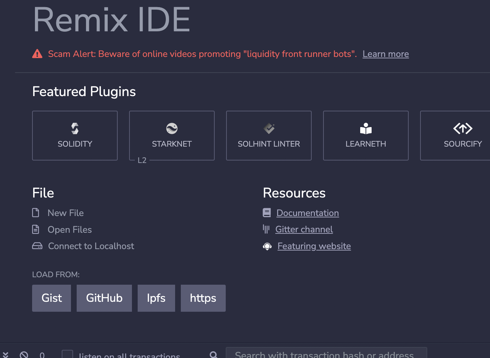

```zsh
https://github.com/FibrinLab/example-subgraph/blob/master/contracts/Gravity.sol
```

:::info

This repo contains the official sample subgraph for the [gravatar](https://en.gravatar.com/) registry.

:::

1. Deployment Steps

Compile and deploy the `Gravity` smart contract using the Local Subnet you just
created. To do this select the `deploy` tab and choose `injected web3` from the
dropdown. `Please note that Remix automatically detects the appropriate
compiler version and makes use of it to compile your contract.

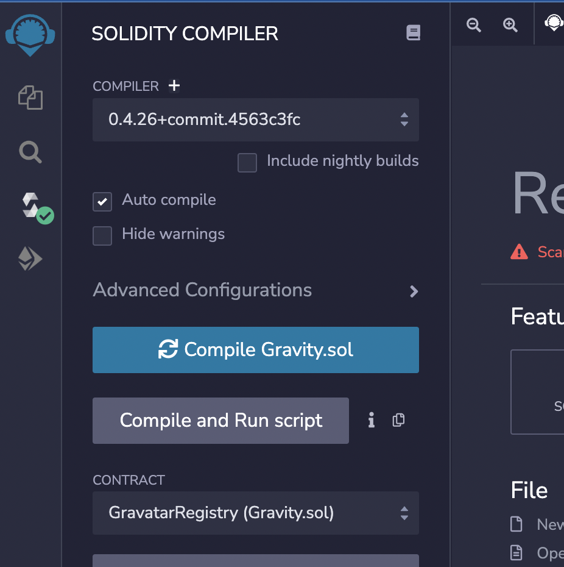

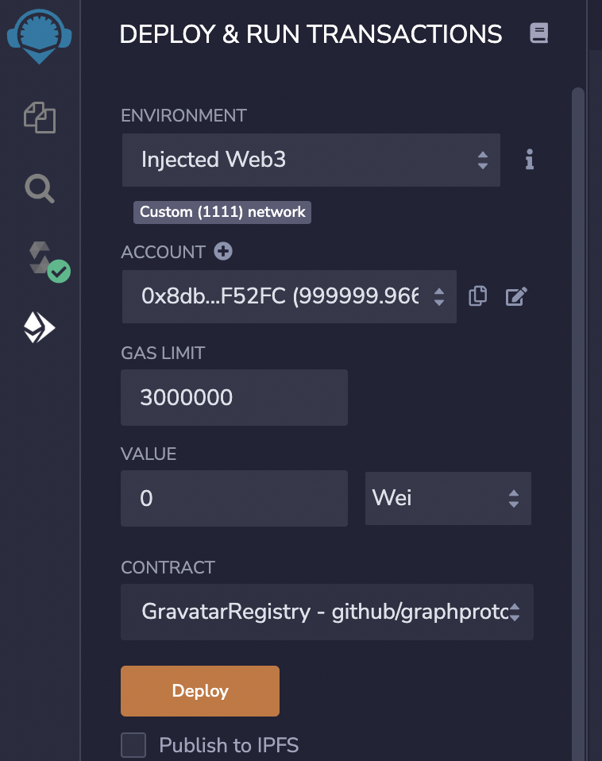

`Always make sure to confirm the Environmet Chain ID is the same as that of your selected MetaMask account`.

With this all set go ahead and deploy your smart contract on your local Subnet
by clicking the `deploy` button. Approve the MetaMask request and pay the
necessary gas fees.

If the deployment is successful, you should see something like this ===>


Please take note of the deployment address as we will be making use of it subsequently.

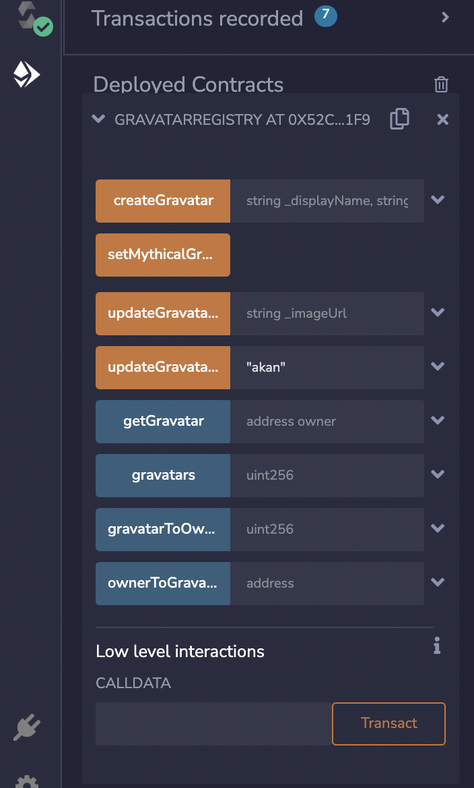

## Indexing Our Subnet Using the Graph

1. Installing Dependencies

   The most efficient way to make use of The Graph in indexing our Subnet is to
   host a local Graph Node. This is pretty straightforward to setup once you got
   requirements up and running. This tutorial is an extension of the
   [Graph-Node](https://github.com/graphprotocol/graph-node) GitHub repository.

   The following components are needed:

   - Interplanetary File System (IPFS) for hosting our files.
     [Installation](https://docs.ipfs.io/install/) instructions.
   - PostgreSQL, a database management tool for keeping out data.
     [Installation](https://www.postgresql.org/download/) instructions.
   - Rust, we will be building and compiling The Graph Node using the cargo package
     manager. [Installation](https://www.rust-lang.org/en-US/install.html)
     instructions.

   If the above installation instructions are followed correctly, you should
   have these tools up and running.

   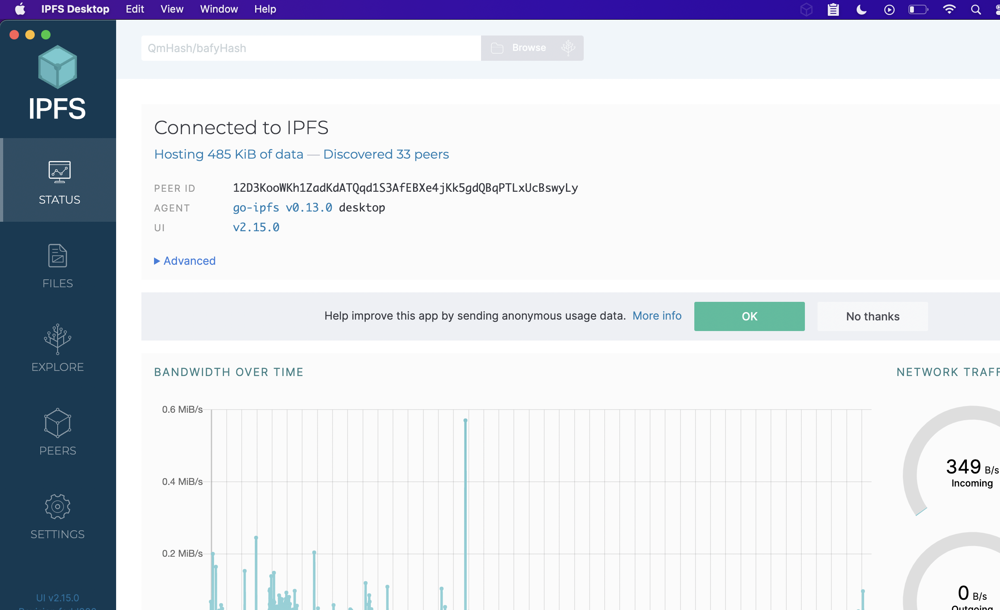

   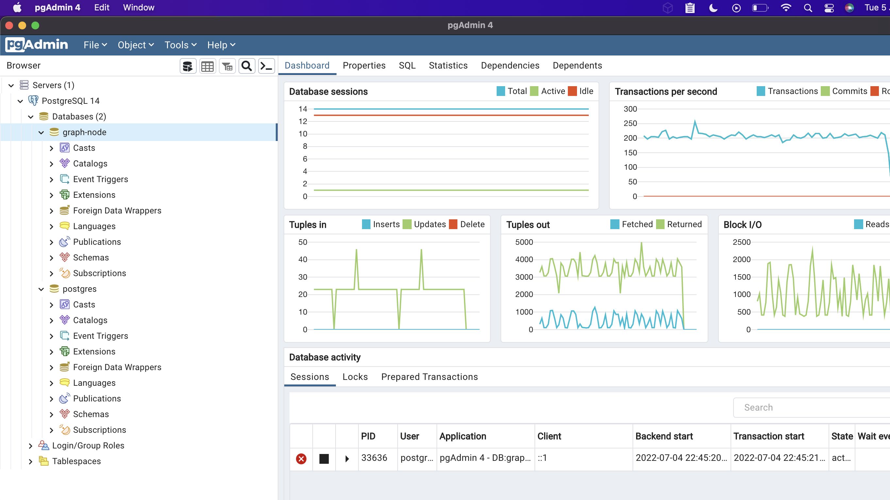

2. Deploying Resources

   After successfully installing IPFS, initialise the daemon by running

   ```zsh
   ipfs init
   ```

   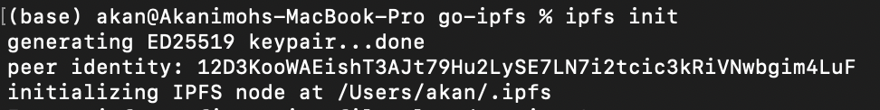

   Next run,

   ```zsh
   ipfs daemon
   ```

   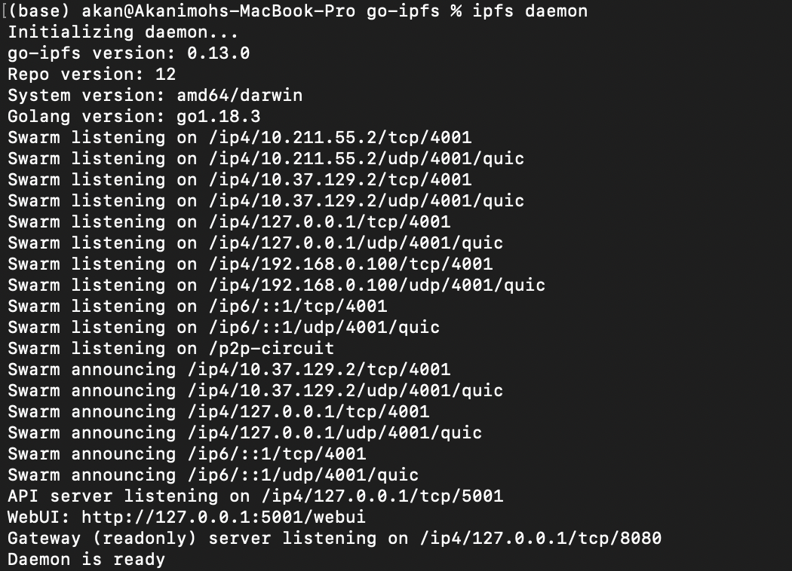.

   Its now time to get our database all set-up.

   Run the following commands:

   ```zsh
   initdb -D .postgres
   ```

   ```zsh
   pg_ctl -D .postgres -l logfile start
   ```

   ```zsh
   createdb graph-node
   ```

3. Configuring up the Graph Node

   Clone and build `The Graph` node folder

   ```zsh
   git clone https://github.com/graphprotocol/graph-node
   ```

   :::info
   The repository cloning method used is HTTPS, but SSH can be used too:

   `git clone git@github.com:graphprotocol/graph-node.git`

   You can find more about SSH and how to use it
   [here](https://docs.github.com/en/authentication/connecting-to-github-with-ssh/about-ssh).
   :::

   Build the folder by running

   ```zsh
   cargo build
   ```

   If you have successfully installed Rust but `the command is not found`, you would
   need to setup some environmental variables. Running this command might help.

   ```zsh
   source $HOME/.cargo/env
   ```

   Once all dependencies are up and running, run the following command to kick start the node.

   ```zsh
   cargo run -p graph-node --release -- \
   --postgres-url postgresql://postgres:*fill-in-posgresql-username: :*fill-in-posgresql-password @localhost:5432/graph-node \
   --ethereum-rpc fuji:http://127.0.0.1:9650/ext/bc/*fill-in-your-blockchain-id/rpc \
   --ipfs 127.0.0.1:5001
   ```

   Before running the above make sure you replace the following:
   *fill-in-posgresql-username ==> Your Database username. `Defaults to [Postgres]
   *fill-in-posgresql-password ==> Your Database password.

   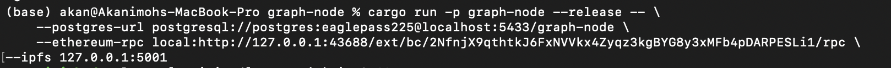

   If everything goes smoothly. You should get this.

   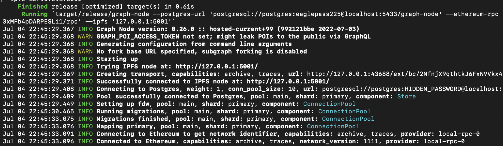

4. Deploying the subgraph

This is where things get interesting. Change directory into the `example-subgraph` folder

Clone the official subgraph repository and install all the dependencies

```zsh
git clone https://github.com/graphprotocol/example-subgraph
```

:::info
The repository cloning method used is HTTPS, but SSH can be used too:

`git clone git@github.com:graphprotocol/example-subgraph.git`

You can find more about SSH and how to use it
[here](https://docs.github.com/en/authentication/connecting-to-github-with-ssh/about-ssh).
:::

Next, generate the ABI typings

```zsh
yarn
yarn codegen
```

Open you the `subgraph.yaml` file and make 2 (two) modifications under `datasources`.

- Switch the network to `local`

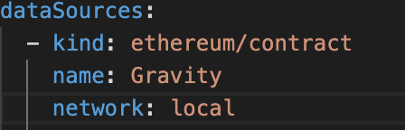

- Input the address of the deployed `Gravity` contract in the `address` field

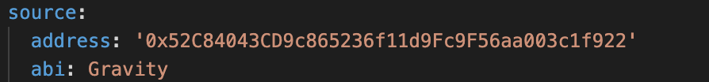

Finally, run the following

```zsh
yarn create-local
yarn deploy-local
```

Congratulations, you have successfully deployed a Sub-Graph on a locally deployed Subnet.

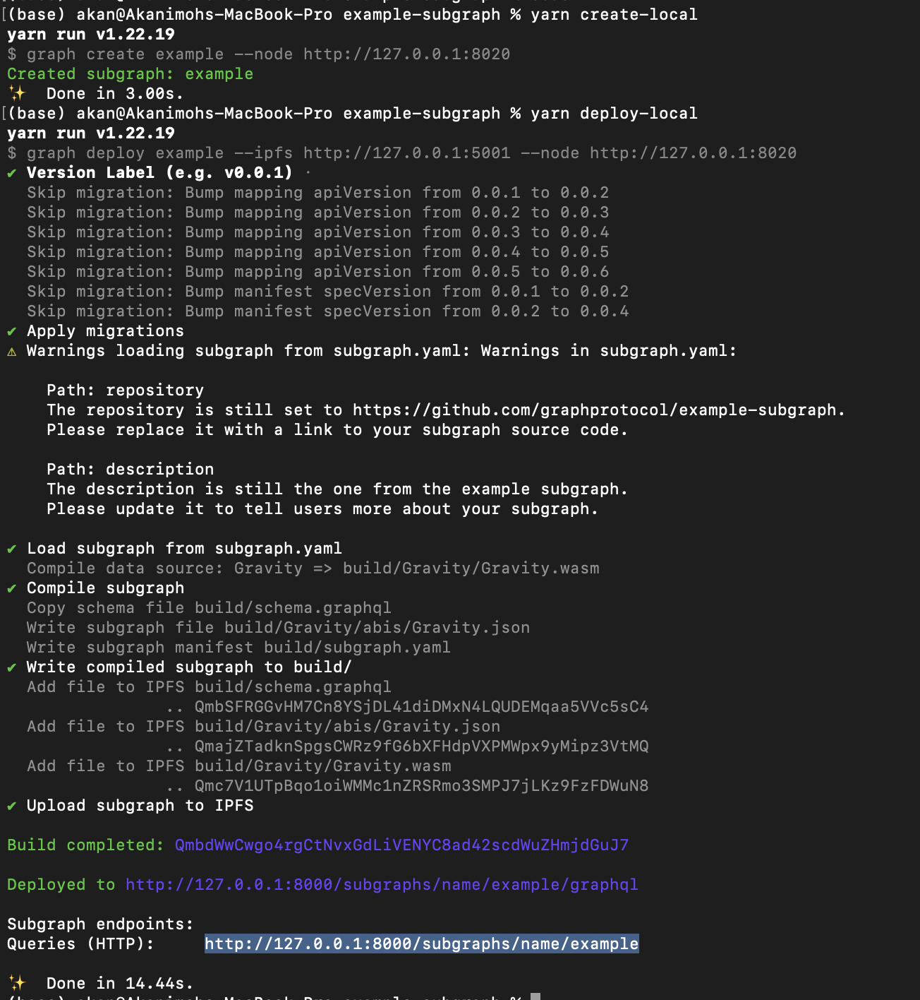

After successful deployment, you graph node would need a few minutes to scan all the nodes.

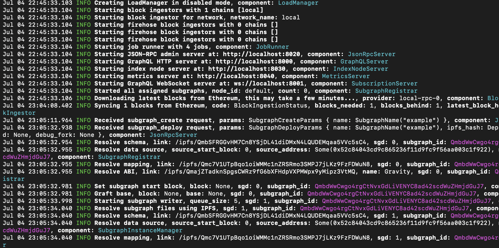

Once its done, open up the provided link in the browser.

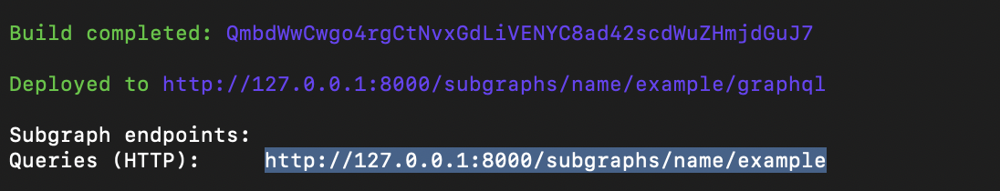.

Open up the link and try running a query by filling this into the query box.

```zsh
query MyQuery {
  gravatars {
    id
    imageUrl
    displayName
  }
}
```

Watch the magic happen.

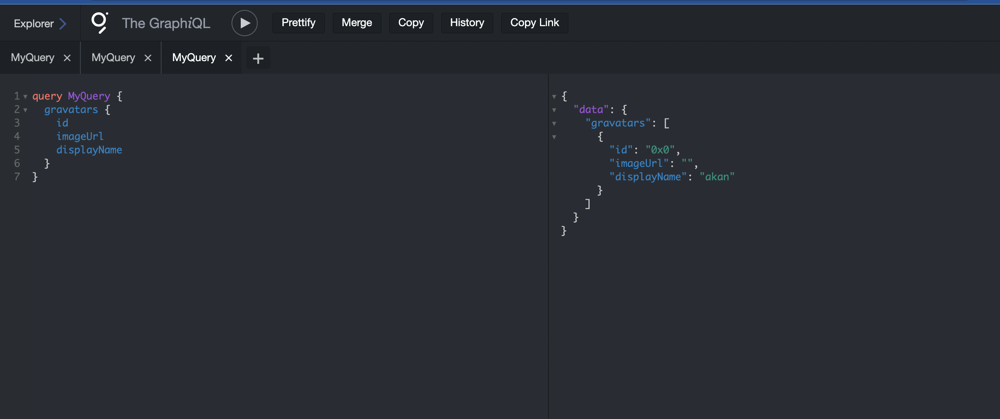.

## Conclusion

In summary, we have deployed a Local Subnet using the Avalanche-cli. We further
went ahead to deploy smart contracts, run a Graph node and Index our nodes using
`The Graph`. How cool is that? lol.

Feel free to fork this repository and build great stuff.

Cheers and Happy Coding.

Akanimoh Osutuk
