# Avalanche - Creating a Genesis File for Your Subnet

:::warning

These tutorials were published as a snapshot of when they were written, 
and may contain out-of-date-information.
For up-to-date information, please reach out to the owners of these 
projects.

:::

## Introduction

Hi there! In this tutorial, we will be learning how to create a custom genesis file for your Subnet.

We will start by deploying a very simple Subnet using [the Subnet
wizard](https://github.com/ava-labs/avalanche-cli). Then we will learn about the
genesis file and how to customize it for our needs.

Next, we will create a simple game!

We will create and deploy a new Subnet using our custom genesis file for the
game. Finally, we will be deploying the Game contract to the Subnet.

The Game contract has a simple function called `play` that accepts `LUCK` tokens
(native currency of our Subnet) and the contract will either lock the tokens or
**mint** 2x the amount of tokens to the player. Yes, it's going to mint native
tokens.

At the end of the tutorial, you will _hopefully_ have a solid understanding of
how to customize the genesis file of your Subnet.

I hope you enjoy this tutorial!

### Prerequisites

#### MetaMask

You need to have [MetaMask](https://metamask.io/) extension installed on your browser.

#### Avalanche-Cli

Create a folder for Avalanche-CLI.

```bash
mkdir -p ~/avalanche
```

Go to that directory and download the Avalanche-CLI.

```bash
cd ~/avalanche
curl -sSfL https://raw.githubusercontent.com/ava-labs/avalanche-cli/main/scripts/install.sh | sh -s

> ava-labs/avalanche-cli info checking GitHub for latest tag
> ava-labs/avalanche-cli info found version: 0.1.3 for linux/amd64
> ava-labs/avalanche-cli info installed ./bin/avalanche
```

Go to the directory where you just downloaded the CLI and add it to your PATH.
So you can run the CLI from anywhere.

```bash
cd ./bin/avalanche
export PATH=$PWD:$PATH
```

We're ready to deploy our first Subnet.

## Creating and Deploying a Simple Subnet

### What Is a Subnet?

> A Subnet, or Subnetwork, is a dynamic subset of Avalanche Primary Network
> validators working together to achieve consensus on the state of one or more
> blockchains. Each blockchain is validated by exactly one Subnet. A Subnet can
> have and validate many blockchains. A validator may be a member of many
> Subnets.
>
> Subnets are independent and don’t share execution thread, storage or
> networking with other Subnets or the Primary Network, effectively allowing the
> network to scale up easily. They share the benefits provided by the Avalanche
> Protocol such as low cost and fast to finality.
>
> A Subnet manages its own membership, and it may require that its constituent
> validators have certain properties. This is very useful, and we explore its
> ramifications in more depth below:

[Here is a great introduction to Subnets by Avalanche](https://docs.avax.network/subnets)

#### Subnets

Subnets is a great technology! It's still advancing and a bit complicated. There
is almost no tooling for Subnets and it's a bit difficult to work with them.

Avalanche has changed that! The Avalanche team has developed an amazing tool to
make this process a breeze. Now you can deploy your own production-ready Subnet
with just a few commands. The tool will guide you through configuring your
Subnet and deploying it!

#### Genesis File

The genesis file is a file that contains the initial configuration of the
Subnet. Avalanche will generate a genesis file for you based on some parameters
you provide. On the other hand, you can also create your own genesis file! This
will allow you to have more control over the configuration of your Subnet.

### Creating a Simple Subnet

For this time, let's take the easy way out and use the CLI to deploy a Subnet to see how things work.

```bash
avalanche subnet create testSubnet
```

This command will run the wizard to create a Subnet.

There are six steps in the wizard:

#### Choose Your VM

Choose SubnetEVM here

#### Chain Id

Chain id is a unique identifier for the network. This value must be unique so
check [chainlist](https://chainlist.org/) to see if the chain id is already in
use.

#### Token Symbol

Token symbol is the symbol of the native token used in the Subnet. For instance,
on the C-Chain, the symbol is `AVAX` and on the Ethereum Mainnet, the symbol is
`ETH`. You can use any symbol you want.

#### Gas Configuration

This step will define the gas configuration of your network. You can choose a
preset fee configuration or create your own. Keep in mind that more transaction
throughput means more disk usage.

We will go with C-Chain default fees.

```bash
> Low disk use    / Low Throughput    1.5 mil gas/s (C-Chain's setting)
```

#### Airdropping Native Tokens

This step will define how you want to distribute the funds in your Subnet. You
can choose the addresses and amounts you want to distribute. Let's go with the
simplest case.

```bash
How would you like to distribute funds?
> Airdrop 1 million tokens to the default address (do not use in production)
```

#### Adding a Custom Precompile to Modify the Evm

```bash
? Advanced: Would you like to add a custom precompile to modify the EVM?:
  ▸ No
    Yes
    Go back to previous step
```

Here you can set up a custom precompile to unlock some useful functions.

##### Native Minting

This precompile allows admins to permit designated contracts to mint the native
token on your Subnet. We will discuss this in more detail in the
[`contractNativeMinterConfig`](#contractnativeminterconfig) section.

###### Configure Contract Deployment Whitelist

This precompile restricts who has the ability to deploy contracts on your
Subnet. We will discuss this in more detail in the
[`contractDeployerAllowListConfig`](#contractdeployerallowlistconfig) section.

###### Configure Transaction Allow List

This precompile restricts who has the ability to make transactions on your Subnet.
We will discuss this in more detail in the [`txAllowListConfig`](#txallowlistconfig) section.

However, we are not gonna do any of these yet. Choose `No` and proceed.

```bash
> Successfully created genesis
```

Congrats! You just created a Subnet! 👏🎉

### Deploying the Subnet

This is the most fun part. We will deploy the Subnet that we just created, and
it's so easy to do, thanks to Avalanche-CLI!

```bash
avalanche subnet deploy testSubnet

> ? Choose a network to deploy on:
  ▸ Local Network
    Fuji
    Mainnet
```

We will deploy the Subnet on a local network so choose `Local Network` here.

This process will install AvalancheGo (if not already installed) and start the
network. This will take a couple of minutes so, this is a good time to refresh
your coffee ☕

After this process is complete, you will see the MetaMask connection details in the terminal.

```bash
MetaMask connection details (any node URL from above works):
RPC URL:          http://127.0.0.1:34249/ext/bc/8MiXurGFiuUfx3JzT4jXHVavgxDaBM4HSWotsGoeQMqRzcWWF/rpc
Funded address:   0x8db97C7cEcE249c2b98bDC0226Cc4C2A57BF52FC with 1000000 (10^18) - private key: 56289e99c94b6912bfc12adc093c9b51124f0dc54ac7a766b2bc5ccf558d8027
Network name:     testSubnet
Chain ID:         1234
Currency Symbol:  TEST
```

You can use this configuration to add a new network to your MetaMask. Then you
can import the account to which the airdrop funds were sent to into your
MetaMask by importing the private key.

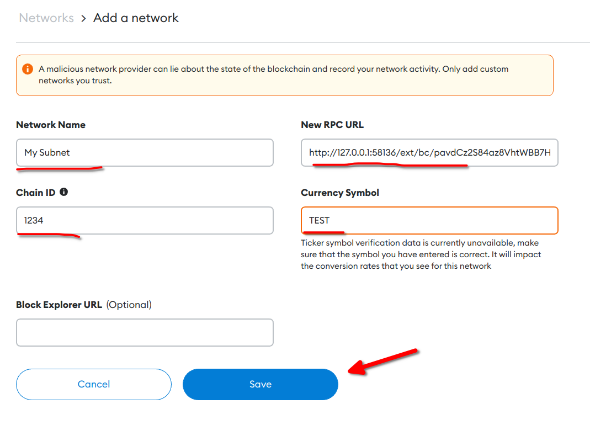

Notice that you will see the same private key if you've chosen `Airdrop 1
million tokens to the default address (do not use in production)` in the
[airdrop step](#airdropping-native-tokens). Thus, the private key is exposed and
anyone can access the account. For that reason, it's not a good idea to use this
in production.

After importing the account on MetaMask, let's change the network to our Subnet.

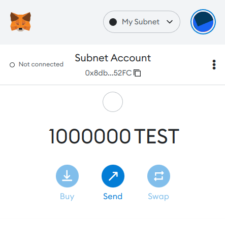

How awesome is that? `TEST` is the native token of our Subnet and it's
airdropped to our address. You can now deploy smart contracts and interact with
the network.

## Understanding the Genesis File

Before starting, I'd like to acknowledge that this section is very similar to
[AVAX docs - Customize a Subnet](/build/subnet/upgrade/customize-a-subnet.md). 
However, I've made some changes to make it more comprehensive and easier to understand.

Subnet wizard is an awesome tool to customize your Subnet and might be a good starting point for you.

We have mentioned the [genesis file](#genesis-file) above. The wizard generates
this file for you but you can also create **your own genesis file!** This will
allow you to customize the network more easily and in depth.

Let's take a look at the genesis file of our Subnet which the wizard created for us.

```bash
## use your Subnet name instead of testSubnet
cat ~/.avalanche-cli/testSubnet_genesis.json
```

To access the genesis file, you can also use:

```bash
avalanche subnet describe testSubnet --genesis
```

Yes, the genesis file is in json format. The output should look like:

```json
{
  "config": {
    "chainId": 1234,
    "homesteadBlock": 0,
    "eip150Block": 0,
    "eip150Hash": "0x2086799aeebeae135c246c65021c82b4e15a2c451340993aacfd2751886514f0",
    "eip155Block": 0,
    "eip158Block": 0,
    "byzantiumBlock": 0,
    "constantinopleBlock": 0,
    "petersburgBlock": 0,
    "istanbulBlock": 0,
    "muirGlacierBlock": 0,
    "SubnetEVMTimestamp": 0,
    "feeConfig": {
      "gasLimit": 8000000,
      "targetBlockRate": 2,
      "minBaseFee": 25000000000,
      "targetGas": 15000000,
      "baseFeeChangeDenominator": 36,
      "minBlockGasCost": 0,
      "maxBlockGasCost": 1000000,
      "blockGasCostStep": 200000
    },
    "contractDeployerAllowListConfig": {
      "blockTimestamp": null,
      "adminAddresses": null
    },
    "contractNativeMinterConfig": {
      "blockTimestamp": null,
      "adminAddresses": null
    },
    "txAllowListConfig": {
      "blockTimestamp": null,
      "adminAddresses": null
    }
  },
  "nonce": "0x0",
  "timestamp": "0x0",
  "extraData": "0x",
  "gasLimit": "0x7a1200",
  "difficulty": "0x0",
  "mixHash": "0x0000000000000000000000000000000000000000000000000000000000000000",
  "coinbase": "0x0000000000000000000000000000000000000000",
  "alloc": {
    "8db97c7cece249c2b98bdc0226cc4c2a57bf52fc": {
      "balance": "0xd3c21bcecceda1000000"
    }
  },
  "airdropHash": "0x0000000000000000000000000000000000000000000000000000000000000000",
  "airdropAmount": null,
  "number": "0x0",
  "gasUsed": "0x0",
  "parentHash": "0x0000000000000000000000000000000000000000000000000000000000000000",
  "baseFeePerGas": null
}
```

Pretty scary, right? But it's not that bad as it seems. The genesis file is a
json file that contains the configuration of the Subnet and the block header of
the genesis block, which is the first block in the network.

Let's dive into the genesis file a little bit more.

### Config

#### `chainId`

The chain ID of the Subnet. We've set this to 1234 [when we created the Subnet](#chain-id).

#### Hardforks

`eip150Block`, `eip150Hash`, `eip155Block`, `eip158Block`, `byzantiumBlock`,
`constantinopleBlock`, `petersburgBlock`, `istanbulBlock`, `muirGlacierBlock`,
`SubnetEVMTimestamp`

These are the blocks where the network has been adopted to the new protocol
release. [Here is the full
list](https://github.com/ethereum/execution-specs#ethereum-protocol-releases).

When there is a new protocol release, to activate that protocol on your Subnet,
you can add the configuration for the new protocol to the genesis file and point
it to a block number in the future as the activation block number.

### Fee Config

#### `gasLimit`

The total amount of gas that can be used in a single block. Keep in mind that
this impacts how much computation happens in one block. This is set to
`8,000,000` in C-Chain. Also, the value represents the maximum amount of gas a
single transaction can use.

#### `targetBlockRate`

The network aims to produce a new block in `targetBlockRate` seconds. This value
is in **seconds**. If the network starts producing faster than this, 
[base fees are increased accordingly](#blockgascoststep). Otherwise, if the network starts
producing slower than this, [base fees are decreased accordingly](#blockgascoststep). 
This value is set to `2` in C-Chain.

#### `minBaseFee`

The minimum base fee that can be used by a transaction. It also shows how much
gas will it cost to do native token transfers. The value is in wei and set to
`25000000000` in C-Chain. It corresponds to 25 nAvax (gwei). You can use
[Snowtrace `unitconverter`](https://snowtrace.io/unitconverter) to convert between
units.

#### `targetGas`

The targeted amount of gas (including block gas cost) to consume within a rolling 10s window.

#### `baseFeeChangeDenominator`

The base fee can change over time. If the parent block used **more** gas than
its target, the base fee should **increase**. Otherwise, if the parent block
used **less** gas than its target, the base fee should **decrease**.

Here are the calculations:

If the parent block used **more** gas than its target:  
 `baseFee = max(1, parentBaseFee * (parentGasUsed - parentGasTarget) / parentGasTarget / baseFeeChangeDenominator)`

If the parent block used **less** gas than its target:  
 `baseFee = max(0, parentBaseFee * (parentGasUsed - parentGasTarget) / parentGasTarget / baseFeeChangeDenominator)`

The `baseFeeChangeDenominator` is set to `36` in C-Chain. This value sets the
base fee to increase or decrease by a factor of `1/36` of the parent block's
base fee.

Setting this value to a larger value means that the base fee will change more
gradually. Setting it to a smaller value will make the base fee change more
rapidly.

For further information, see [eip1559](https://eips.ethereum.org/EIPS/eip-1559)

#### `minBlockGasCost`

Minimum gas cost a block should cover. This value is set to `0` in C-Chain.

#### `maxBlockGasCost`

Maximum gas cost a block should cover. This value is set to `1,000,000` in C-Chain.

> `minBlockGasCost` and `maxBlockGasCost` bounds the gas cost of a block.

#### `blockGasCostStep`

This value determines the block gas change rate depending on the
[`targetBlockRate`](#targetblockrate). If the parent block is produced at the
`targetBlockRate`, the block gas cost will stay the same. If the parent block is
produced at a **slower** rate, the block gas cost will **decrease**. If the
parent block is produced at a **faster** rate, the block gas cost will
**increase**. The amount of change is determined by the following formula:

```js
(blockGasCostStep) * (targetBlockRate - parent block production time)
```

For example, if the `targetBlockRate` is set to 2 seconds, `blockGasCostStep` is
set to `10` and the parent block was produced in 5 seconds. The block gas cost
will decrease by 30: `10 * (2 - 5) = -30`

This value is set to `200000` in C-Chain.

### Validator Fee Recipient

This configuration allows validators to specify a fee recipient.

Use the following configuration to enable validators to receive fees. [You can
find more information from the Avalanche
docs.](/build/subnet/upgrade/customize-a-subnet.md#setting-a-custom-fee-recipient)

```json
{
  "config": {
    "allowFeeRecipients": true
  }
}
```

### Precompiles

You can enable some precompiled contracts in the genesis file. These contracts
provide God mode functionalities and are very useful for some cases. If you'd
not like to use them, you can disable them by setting the config fields to null
or by simply removing them from the genesis file.

#### `contractDeployerAllowListConfig`

This configuration allows you specify which addresses are authorized to deploy
contracts. You can also customize this [in the last step of the Subnet
wizard](#configure-contract-deployment-whitelist). If you'd like to restrict the
contract deployer to a specific list of addresses, you can set the
`contractDeployerAllowListConfig` to a JSON object with the following
properties:

```json
"contractDeployerAllowListConfig": {
  "blockTimestamp": 0,
  "adminAddresses": ["0x8db97C7cEcE249c2b98bDC0226Cc4C2A57BF52FC","0x0000...", "... and more"]
}
```

Admin addresses can deploy new contracts and add new Admin and Deployer
addresses. Precompiled contract is deployed to
`0x0200000000000000000000000000000000000000`. [You can find more information
from the Avalanche
docs.](/build/subnet/upgrade/customize-a-subnet.md#restricting-smart-contract-deployers)

#### `contractNativeMinterConfig`

This configuration lets you use a smart contract to mint native tokens in your
Subnet. This is useful if you want to use your own token minting system.

If you'd like to use a smart contract to mint native tokens, you can set the
`contractNativeMinterConfig` to a JSON object with the following properties:

```json
"contractDeployerAllowListConfig": {
  "blockTimestamp": 0,
  "adminAddresses": ["0x8db97C7cEcE249c2b98bDC0226Cc4C2A57BF52FC","0x0000...", "... and more"]
}
```

Admin addresses can add new Admin and Minter addresses. Precompiled contract is
deployed to `0x0200000000000000000000000000000000000001`. [You can find more
information from the Avalanche
docs.](/build/subnet/upgrade/customize-a-subnet.md#minting-native-coins)

#### `txAllowListConfig`

This configures allows you to specify which addresses are authorized to make
transactions. It's especially useful if you're building a private network. If
you'd like to restrict the transaction sender to a specific list of addresses,
you can set the `txAllowListConfig` to a JSON object with the following
properties:

```json
"txAllowListConfig": {
  "blockTimestamp": 0,
  "adminAddresses": ["0x8db97C7cEcE249c2b98bDC0226Cc4C2A57BF52FC","0x0000...", "... and more"]
}
```

Admin addresses can add new Admin and Allowed addresses. Precompiled contract is
deployed to `0x0200000000000000000000000000000000000002`. [You can find more
information from the Avalanche
docs.](/build/subnet/upgrade/customize-a-subnet.md#restricting-who-can-submit-transactions)

### Genesis Block

This configuration is used to define the genesis block header. You generally
don't need to change these. (except the `gasLimit` field)

#### `nonce`

The result of the mining process iteration is this value. It can be any value in
the genesis block, which is commonly set to `0x0`.

#### `timestamp`

The timestamp of the creation of the genesis block.

#### `extraData`

Optional extra data that can be included in the genesis block. This is commonly set to `0x`.

#### `gasLimit`

The total amount of gas that can be used in a single block. It should be set to
the same value as in [the fee config](#fee-config). The value `0x7a1200` is
hexadecimal and it's equal to `8,000,000`.

#### `difficulty`

The difficulty level applied during the nonce discovering of this block. It is
usually set to `0x0` for the genesis block.

#### `mixHash`

[Quotation from Explanation of genesis file](#resources)

> The combination of nonce and `mixHash` must satisfy a mathematical condition
> described in the Yellowpaper, 4.3.4. Block Header Validity, (44). It allows to
> verify that the Block has really been cryptographically mined, thus, from this
> aspect, is valid.

This isn't so important for the genesis block. You can set it to `0x0000000000000000000000000000000000000000000000000000000000000000`.

#### `coinbase`

This is the address of the miner who mined the genesis block. It is usually set
to `0x0000000000000000000000000000000000000000` for the genesis block.

#### `parentHash`

This is the Keccak 256-bit hash of the entire parent block’s header. It is
usually set to
`0x0000000000000000000000000000000000000000000000000000000000000000` for the
genesis block.

#### `gasUsed`

This is the amount of gas used by the genesis block. It is usually set to `0x0`.

#### `number`

This is the number of the genesis block. It is usually set to `0x0`.

#### `airdropHash` `baseFeePerGas` `airdropAmount`

You can remove or leave these fields as they are. I'd recommend removing them.
I'm not sure what they do.

### Native Token Allocation

We've done this part of the configuration [using the wizard](#airdropping-native-tokens).
It's pretty straightforward. You can set the `alloc` to a JSON object with the following properties:

```json
{
  "address_without_0x": {
    "balance": "balance"
  }
}
```

Two important things to notice here:

- The `address_without_0x` is the address of the account that will receive the
  tokens. Must **NOT** include the `0x` prefix.
- Balance is the amount of tokens that will be allocated **in wei** to the account.

In our genesis file. The balance is set to `0xd3c21bcecceda1000000` which
corresponds to `1000000000000000000000000` in decimal. You can also type in the
balance in decimal. Notice that this number is in wei and it's equal to
1,000,000 AVAX. You can use [Snowtrace
`unitconverter`](https://snowtrace.io/unitconverter) to convert between units.

## Creating a Custom Genesis File

We learned a lot! Now we can create our genesis file!

I'd like to create a Subnet where people can earn native tokens by playing a simple game.

The network doesn't need to be very fast. I'll set the transaction fees high
because the game will mint native tokens to players so we should be burning some
of them to help inflation.

To get started, create a new file named `genesis.json` and fill it with the following content:

```json
{
  "config": {
    "homesteadBlock": 0,
    "eip150Block": 0,
    "eip150Hash": "0x2086799aeebeae135c246c65021c82b4e15a2c451340993aacfd2751886514f0",
    "eip155Block": 0,
    "eip158Block": 0,
    "byzantiumBlock": 0,
    "constantinopleBlock": 0,
    "petersburgBlock": 0,
    "istanbulBlock": 0,
    "muirGlacierBlock": 0,
    "SubnetEVMTimestamp": 0
  },
  "alloc": {},
  "nonce": "0x0",
  "timestamp": "0x0",
  "extraData": "0x00",
  "gasLimit": "change me",
  "difficulty": "0x0",
  "mixHash": "0x0000000000000000000000000000000000000000000000000000000000000000",
  "coinbase": "0x0000000000000000000000000000000000000000",
  "number": "0x0",
  "gasUsed": "0x0",
  "parentHash": "0x0000000000000000000000000000000000000000000000000000000000000000"
}
```

This is a boilerplate genesis file. We are going to fill in the fields that we need.

### Setting the Chain Id

The first thing to do is to pick a unique [chain id](#chainid) for our Subnet.
We can check [chainlist](https://chainlist.org/) to find a chain id that is not
used. I'll go with `321123` because it looks good.

```json
{
  "config": {
    "chainId": 321123
  }
}
```

### Configuring Fees and Gas

I have an old computer so I want my Subnet to be - slow. So, I'll set the
`gasLimit` to `5,000,000`, the `targetBlockRate` to 5 seconds and the
`targetGas` to `10000000`.

Then I'll set the `minBaseFee` to 60 nAvax (gwei) which is `60000000000` wei to
make sure that the transaction fees are high enough to help the network.

I'll set the `baseFeeChangeDenominator` to `50` because I don't want the base
fee to change to be rapidly changing. Then I'll set the `minBlockGasCost` to
`0`, `maxBlockGasCost` to `5000000` and the `blockGasCostStep` to `100000` as I
don't want the block gas cost to change too quickly.

The final configuration looks like:

```json
{
  "config": {
    "feeConfig": {
      "gasLimit": 5000000,
      "targetBlockRate": 5,
      "minBaseFee": 60000000000,
      "targetGas": 10000000,
      "baseFeeChangeDenominator": 50,
      "minBlockGasCost": 0,
      "maxBlockGasCost": 5000000,
      "blockGasCostStep": 10000
    }
  }
}
```

Almost forgot! We should also update the `gasLimit` in the genesis block header.

```json
{
  "config": {
    ...
  },
  "gasLimit": "5000000"
}
```

### Allocating Native Tokens

Let's allocate some native tokens for our address. You should use your own
address here. `0x0000000b9af48743ef1188f3F20c9b8B90F52a5b` is my address.

```json
{
  "alloc": {
    "0000000b9af48743ef1188f3F20c9b8B90F52a5b": {
      "balance": "0x3635C9ADC5DEA00000"
    }
  }
}
```

I'm being generous and allocating only 1000 tokens for myself. 1000 tokens
corresponds to `1000000000000000000000` in wei and that's `0x3635C9ADC5DEA00000`
in hexadecimal. Keep in mind that you can also write this in decimal. I'm going
to use the hexadecimal notation here because it looks better. You can use
[Decimal to Hexadecimal
converter](https://www.rapidtables.com/convert/number/decimal-to-hex.html) to
convert between units.

### Minting Native Tokens

We will use [`contractNativeMinterConfig`](#contractnativeminterconfig) to mint
native tokens in the game.

We will add our address as an Admin so we can add new Minter and Admin addresses in the future.

**Use your own address** instead of `0x0000000b9af48743ef1188f3F20c9b8B90F52a5b`.

```json
{
  "config": {
    "contractNativeMinterConfig": {
      "blockTimestamp": 0,
      "adminAddresses": ["0x0000000b9af48743ef1188f3F20c9b8B90F52a5b"]
    }
  }
}
```

### Restricting Contract Deployers

We will deploy the contracts and players will use those contracts to play the
game. So we don't need other people to deploy the contracts. We can restrict the
smart contract deployers by using
[`contractDeployerAllowListConfig`](#contractdeployerallowlistconfig).

We will add our address as an Admin so we can add new Deployer and Admin addresses in the future.

**Use your own address** instead of `0x0000000b9af48743ef1188f3F20c9b8B90F52a5b`.

```json
{
  "config": {
    "contractDeployerAllowListConfig": {
      "blockTimestamp": 0,
      "adminAddresses": ["0x0000000b9af48743ef1188f3F20c9b8B90F52a5b"]
    }
  }
}
```

Now we're done! The final config looks like:

```json
{
  "config": {
    "chainId": 321123,
    "homesteadBlock": 0,
    "eip150Block": 0,
    "eip150Hash": "0x2086799aeebeae135c246c65021c82b4e15a2c451340993aacfd2751886514f0",
    "eip155Block": 0,
    "eip158Block": 0,
    "byzantiumBlock": 0,
    "constantinopleBlock": 0,
    "petersburgBlock": 0,
    "istanbulBlock": 0,
    "muirGlacierBlock": 0,
    "SubnetEVMTimestamp": 0,
    "feeConfig": {
      "gasLimit": 5000000,
      "targetBlockRate": 5,
      "minBaseFee": 60000000000,
      "targetGas": 10000000,
      "baseFeeChangeDenominator": 50,
      "minBlockGasCost": 0,
      "maxBlockGasCost": 5000000,
      "blockGasCostStep": 10000
    },
    "contractDeployerAllowListConfig": {
      "blockTimestamp": 0,
      "adminAddresses": ["0x0000000b9af48743ef1188f3F20c9b8B90F52a5b"]
    },
    "contractNativeMinterConfig": {
      "blockTimestamp": 0,
      "adminAddresses": ["0x0000000b9af48743ef1188f3F20c9b8B90F52a5b"]
    }
  },
  "alloc": {
    "0000000b9af48743ef1188f3F20c9b8B90F52a5b": {
      "balance": "0x3635C9ADC5DEA00000"
    }
  },
  "nonce": "0x0",
  "timestamp": "0x0",
  "extraData": "0x00",
  "gasLimit": "5000000",
  "difficulty": "0x0",
  "mixHash": "0x0000000000000000000000000000000000000000000000000000000000000000",
  "coinbase": "0x0000000000000000000000000000000000000000",
  "number": "0x0",
  "gasUsed": "0x0",
  "parentHash": "0x0000000000000000000000000000000000000000000000000000000000000000"
}
```

## Creating and Deploying the Subnet Using the Custom Genesis File

We will use `genesis.json` to create a new Subnet. This part is pretty simple.

Let's first delete the old Subnet that we created using the wizard.

```bash
avalanche subnet delete testSubnet

> Deleted Subnet
```

Next, we will create a new Subnet using the genesis file.

```bash
## avalanche subnet create <SubnetName> --genesis <filepath>

avalanche subnet create game --genesis ./genesis.json
## Use SubnetEVM

> Using specified genesis
> ✔ SubnetEVM
> Successfully created genesis
```

Now let's deploy it!

```bash
## avalanche subnet deploy <SubnetName>
avalanche subnet deploy game

## choose local network as deployment target

> MetaMask connection details (any node URL from above works):
> RPC URL:          http://127.0.0.1:27200/ext/bc/HGwbjkQsvrqy2mncMWsA2YnrSWEybVmLcZJwz7nb5gNVvcPoi/rpc
> Funded address:   0x0000000b9af48743ef1188f3F20c9b8B90F52a5b with 1000
> Network name:     game
> Chain ID:         321123
> Currency Symbol:  TEST
```

Awesomeness! Great work!

## Deploying the Game Contract

### MetaMask Configuration

Before going to the next step, make sure you've added the Subnet to MetaMask by
following the same steps in the [`Deploying the Subnet`](#deploying-the-subnet)
section. This time you don't need to import the account as you're already using
your own account. When adding the network, I've set the currency symbol to
`LUCK`.

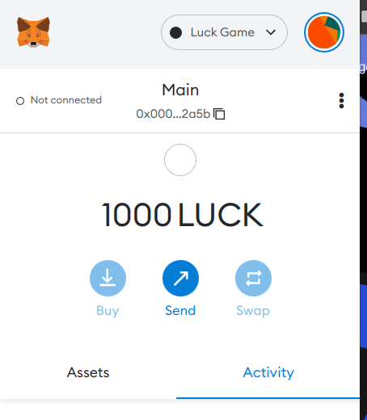

### MetaMask Gas Configuration **! IMPORTANT**

Because we've set the base fee to 60 nAvax, you may need to increase the `Max
priority fee` when confirming the transaction on MetaMask popup. Otherwise the
transaction may fail.

Here is how:

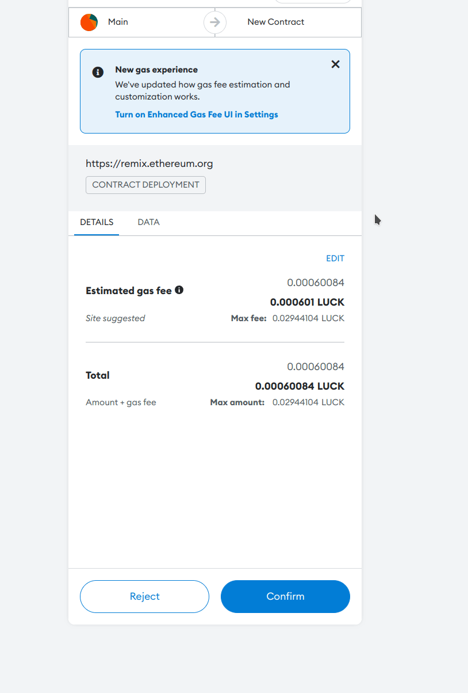

If you're using the _Enhanced Gas Fee UI_ which is an experimental feature in
MetaMask, you can set the gas fee to _Aggressive_ and that should work.

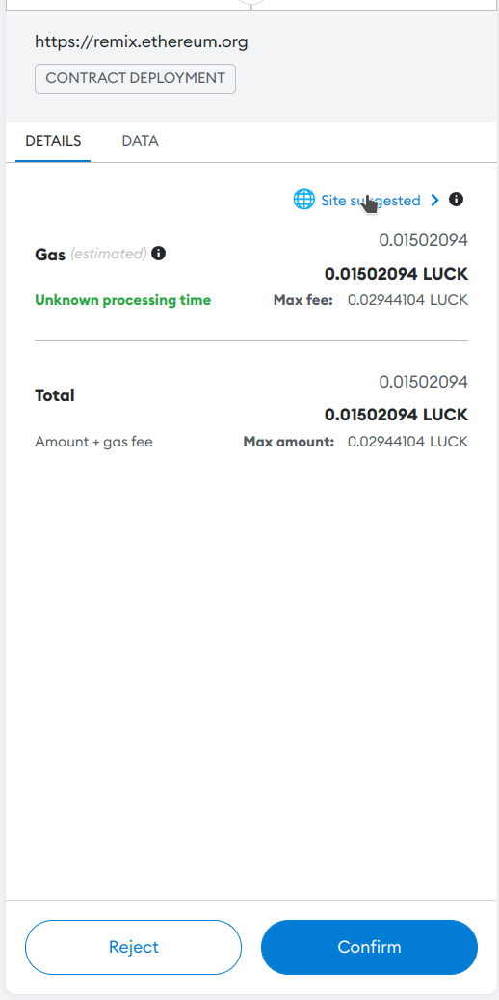

After making a few transactions, MetaMask should start automatically adjusting
the gas fee to the optimal value.

### Deploying the Contract

We will use [remix](https://remix.ethereum.org/) to deploy the game contract on the Subnet.

Go to the website and create a blank workspace.

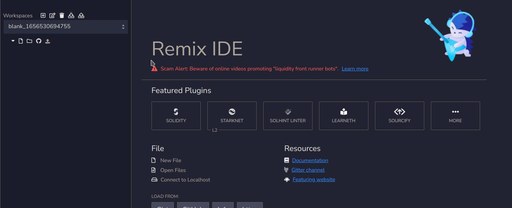

Next, create a folder and under that folder, create two files with the following contents:

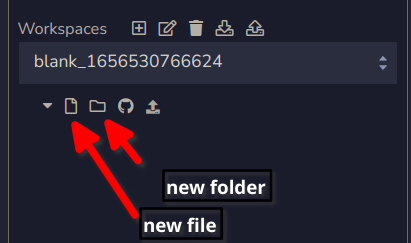

#### NativeMinterInterface.sol

This is the `ContractNativeMinter` interface. We know the contract is deployed at `0x0200000000000000000000000000000000000001`.
[See more about it here.](/build/subnet/upgrade/customize-a-subnet.md#minting-native-coins)

```solidity
// (c) 2022-2023, Ava Labs, Inc. All rights reserved.
// See the file LICENSE for licensing terms.

// SPDX-License-Identifier: MIT

pragma solidity >=0.8.0;

interface NativeMinterInterface {
    // Set [addr] to have the admin role over the minter list
    function setAdmin(address addr) external;

    // Set [addr] to be enabled on the minter list
    function setEnabled(address addr) external;

    // Set [addr] to have no role over the minter list
    function setNone(address addr) external;

    // Read the status of [addr]
    function readAllowList(address addr) external view returns (uint256);

    // Mint [amount] number of native coins and send to [addr]
    function mintNativeCoin(address addr, uint256 amount) external;
}
```

#### Game.sol

A simple contract I made for the sake of this tutorial.

Basically, the player calls the `play` function with sending some `LUCK` tokens.
The function generates a random number and by 50% chance, the player gets 2x the
amount of tokens; otherwise, the tokens are stuck in the contract.

```solidity
pragma solidity ^0.8.7;
import "./NativeMinterInterface.sol";

contract Game {

    // native minter is deployed at 0x0200000000000000000000000000000000000001
    NativeMinterInterface minter = NativeMinterInterface(0x0200000000000000000000000000000000000001);

    function random() internal view returns (uint) {
        // never use this random number generation in a real project
        // it's deterministic and easily hackable.
        return uint(keccak256(abi.encodePacked(block.timestamp)));
    }

    function play() external payable {
        uint256 randomNumber = random();

        if(randomNumber % 2 == 0){
            minter.mintNativeCoin(
                msg.sender,
                msg.value * 2
            );
        }
    }
}
```

When you're done, it should look like this:

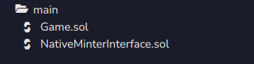

#### Compiling and Deploying

After creating the files, we should compile `Game.sol`.

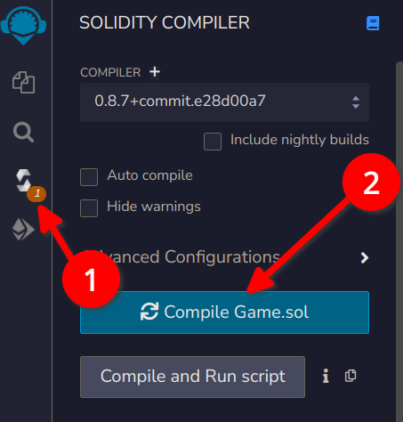

Go to the deploy tab, choose injected web3 as environment - connect your wallet

- then choose Game in the contract dropdown. Then click the deploy button.

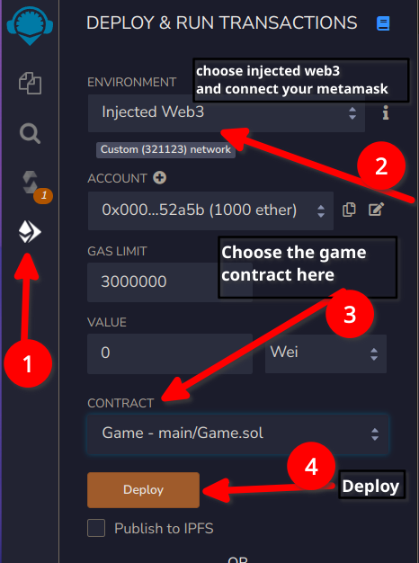

Confirm the transaction with your MetaMask wallet.

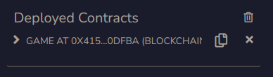

Yay! We deployed a smart contract in our Subnet! That sounds fantastic!

### Setting Game Contract as a Minter

We're admin in [`contractNativeMinterConfig`](#contractnativeminterconfig).
Which means we can add new Minters to the network using `NativeMinterInterface`.

We already created `NativeMinterInterface.sol`

Go to remix and compile `NativeMinterInterface.sol` by following the same steps as `Game.sol`.

Go to the deploy tab in remix, and choose NativeMinterInterface in the contract
dropdown. Then type in the address `0x0200000000000000000000000000000000000001`
to `Load contract from Address` then click `At Address`

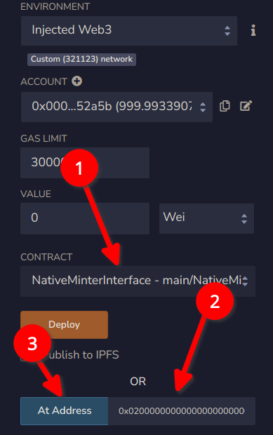

After clicking the button, you should see the `NATIVEMINTERINTERFACE AT 0X02..`
under the `Deployed Contracts` section.

We will call the `setEnabled` function of `NativeMinter` contract with the
address of `Game` contract to set the `Game` contract as a minter.

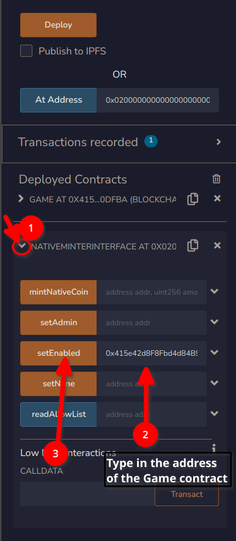

Confirm the transaction with your MetaMask wallet. We can call this function
because we've added our address as an admin in the `contractNativeMinterConfig`
section.

Now the `Game.sol` contract is a minter and can mint native tokens!

### Play the Game

In the deploy tab:

- Set the value to 100 Ether or any other amount you want to play with.
- Find `Game` contract under deployed contracts section in remix.
- Call `play` function.
- Confirm the transaction with your MetaMask wallet.

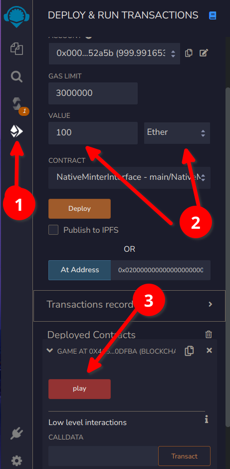

Then check your MetaMask wallet.

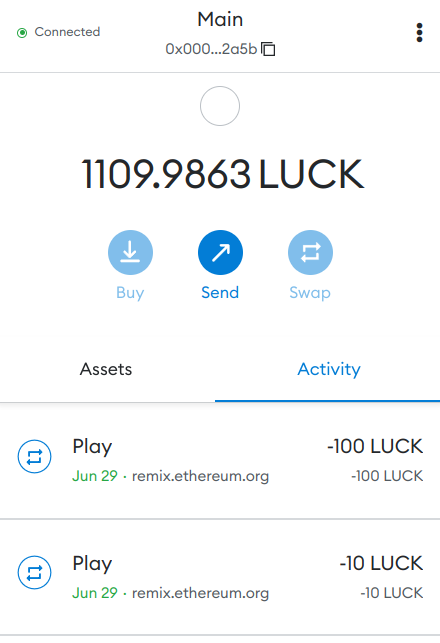

I first played with 10 and then 100 tokens. Seems like it's my lucky day! I
already earned 110 LUCK tokens. As you can see, our smart contract **can mint
native tokens!**

**Let's go all in!**

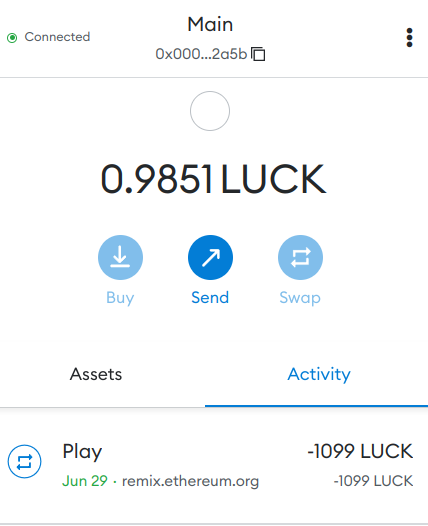

I'm out of **luck**!

As an admin in `NativeMinter` contract, I can mint native tokens as well! Let's
mint ourselves 1000 LUCK tokens.

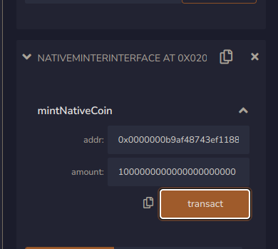

And my luck is back!

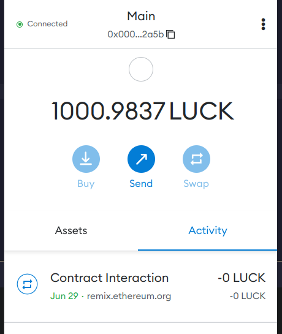

## Conclusion

This is the end of the tutorial. I hope you've enjoyed it as much as I've
enjoyed writing it. Subnets are literally amazing and I'm very excited for the
future of this technology.

You now have the ability to create your own Subnet and customize it to your
needs. Go play with the parameters, try something new, and enjoy!

Please feel free to create an issue if you have any questions!

Thanks for reading :heart:

### Resources

- [AVAX Docs](https://docs.avax.network/subnets)
- [Explanation of genesis file](https://gist.github.com/0mkara/b953cc2585b18ee098cd#file-genesis-md)
