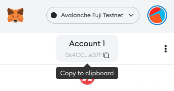

# Set up Your Development Environment for Local Subnet Development

:::warning

These tutorials were published as a snapshot of when they were written,
and may contain out-of-date-information.
For up-to-date information, please reach out to the owners of these
projects.

:::

If you are not familiar with Subnets, virtual machines or similar terminology
you can refer to [Subnet Overview](https://docs.avax.network/subnets).

## Introduction

This tutorial's goal is to deploy and start a basic Subnet in your local
machine. So that you can interact with the Subnet using
[Remix](https://remix.ethereum.org/) and [Hardhat](https://hardhat.org/). In
this tutorial we will be using
[avalanche-cli](https://github.com/ava-labs/avalanche-cli) to create and deploy
the Subnet. If you ever encounter an error, refer to [Troubleshoot Common
Issues](#troubleshoot-common-issues) section.

:::info

avalanche-cli is in beta version. So it might get updated fairly frequently. It
is best to refer to the latest version from its [github
page](https://github.com/ava-labs/avalanche-cli).

:::

If you want to customize your Subnet you can refer to the optional [Customize
the Subnet](#customize-the-subnet) section, while creating your Subnet.

Steps to follow:

1. Install avalanche-cli
2. Create the Subnet
3. Deploy the Subnet
4. Interact with the Subnet

   4.1 Using Remix

   4.2 Using Hardhat

5. Interact with Precompiles (Optional)

## Requirements

- Mac or Linux environment

## Step 1: Install Avalanche-Cli

To build avalanche-cli you have to first install Golang. Follow the instructions here: [https://go.dev/doc/install](https://go.dev/doc/install).

After downloading Golang, to download avalanche-cli's latest version, run:

```bash
curl -sSfL https://raw.githubusercontent.com/ava-labs/avalanche-cli/main/scripts/install.sh | sh -s
```

:::note

This command will download the bin to the `./` (relative to where the command
has run). To download in a custom location refer to [Installing in Custom
Location](#installing-in-custom-location).

:::

To add avalanche to PATH, run:

```bash
cd bin;\
export PATH=$PWD:$PATH
```

:::note

This command will add avalanche-cli to the PATH temporarily, which means that,
when you reopen your terminal you would not be able to run 'avalanche' command.
So, to add it permanently refer to [Add Avalanche Command
Permanently](#add-avalanche-command-permanently) section.

:::

### Installing in Custom Location

To download the binary to a specific directory, run:

```bash
curl -sSfL https://raw.githubusercontent.com/ava-labs/avalanche-cli/main/scripts/install.sh | sh -s -- -b <relative-directory>
```

### Add Avalanche Command Permanently

To add avalanche command to your path:

#### MacOS

1. Open shell config file.
   - If you are using `zsh` shell, open `${HOME}/.zprofile` in a text editor.
   - If you are suing `bash` shell, open `${HOME}/.bash_profile` in a text editor.
2. Add this line, ` export PATH="<path-of-avalanche-bin-directory>:${PATH}"` to the file.
3. Restart the terminal and run `avalanche`.

#### Linux

1. Open shell config file, `${HOME}/.bashrc` in a text editor.
2. Add this line, `export PATH="<path-of-avalanche-bin-directory>:${PATH}"` to the file.
3. Restart the terminal and run `avalanche`.

:::note

If you have run the installation command at `$HOME` directory.
`<path-of-avalanche-bin-directory>` would be `${HOME}/bin`.

:::

## Step 2: Create the Subnet

To create the Subnet, run:

```bash
avalanche subnet create <subnetName>
```

When you run this command you will be walked through the customization of the
Subnet. You can learn more about the configuration details at [Customize the
Subnet](#customize-the-subnet) section.

Example walk through:

- `Choose your VM`: SubnetEVM
- `ChainId`: 676767
- `Token symbol`: SUB
- `How would you like to set the fees`: Low disk use...
- `How would you like to distribute the funds`: Airdrop 1 million tokens to the default address
- `Advanced: Would you like to add a custom precompile to modify the EVM?`: No

You have successfully created the genesis file for your Subnet. You can read more about genesis [here](/build/subnet/upgrade/customize-a-subnet.md#genesis).

To see details about the Subnet, run:

```bash
avalanche subnet describe <subnetName>
```

To see the genesis file directly, run:

```bash
avalanche subnet describe <subnetName> --genesis
```

## Step 3: Deploy the Subnet

To deploy the Subnet locally, run:

```bash
avalanche subnet deploy <subnetName> -l
```

After a successful deployment, an example of what you would see:

```text
Network ready to use. Local network node endpoints:
+-------+------------+-------------------------------------------------------------------------------------+
| NODE  |     VM     |                                         URL                                         |
+-------+------------+-------------------------------------------------------------------------------------+
| node1 | subnetName | http://127.0.0.1:9650/ext/bc/2KY4TYoJwuJWLeSfj4Mae4t4sBCwGrx48QyGWg3zWwP5PhZjHV/rpc |
+-------+------------+-------------------------------------------------------------------------------------+
| node2 | subnetName | http://127.0.0.1:9652/ext/bc/2KY4TYoJwuJWLeSfj4Mae4t4sBCwGrx48QyGWg3zWwP5PhZjHV/rpc |
+-------+------------+-------------------------------------------------------------------------------------+
| node3 | subnetName | http://127.0.0.1:9654/ext/bc/2KY4TYoJwuJWLeSfj4Mae4t4sBCwGrx48QyGWg3zWwP5PhZjHV/rpc |
+-------+------------+-------------------------------------------------------------------------------------+
| node4 | subnetName | http://127.0.0.1:9656/ext/bc/2KY4TYoJwuJWLeSfj4Mae4t4sBCwGrx48QyGWg3zWwP5PhZjHV/rpc |
+-------+------------+-------------------------------------------------------------------------------------+
| node5 | subnetName | http://127.0.0.1:9658/ext/bc/2KY4TYoJwuJWLeSfj4Mae4t4sBCwGrx48QyGWg3zWwP5PhZjHV/rpc |
+-------+------------+-------------------------------------------------------------------------------------+

MetaMask connection details (any node URL from above works):
RPC URL:          http://127.0.0.1:9650/ext/bc/2KY4TYoJwuJWLeSfj4Mae4t4sBCwGrx48QyGWg3zWwP5PhZjHV/rpc
Funded address:   0x8db97C7cEcE249c2b98bDC0226Cc4C2A57BF52FC with 1000000 (10^18) - private key: 56289e99c94b6912bfc12adc093c9b51124f0dc54ac7a766b2bc5ccf558d8027
Network name:     subnetName
Chain ID:         676767
Currency Symbol:  SUB
```

Make sure to save `MetaMask connection details`. You will need the relevant
information (RPC URL, Funded address, etc.) to interact with your Subnet.

Important thing to keep in mind is that, now that you have deployed your Subnet,
it has started running in your local machine. So, after you are done interacting
with your Subnet you can stop it.

To stop running the Subnet, you could run:

```bash
avalanche network stop
```

:::info

When you stop running the Subnet it will save the state of the Subnet and when
it starts again it will continue from that state.

:::

To start running the Subnet, you could run:

```bash
avalanche network start
```

:::info

When you restart the Subnet RPC urls will not change. Therefore, you do not have
to adjust the network in your MetaMask or anywhere else.

:::

## Step 4: Interact with the Subnet

This tutorial will cover interacting with the Subnet through
[Remix](https://remix.ethereum.org/) and [Hardhat](https://hardhat.org/).

### Step 4.1: Using Remix

First, we will be adding our Subnet to [MetaMask](https://metamask.io/). To add
the Subnet, refer to [Deploy a Smart Contract on Your Subnet-EVM Using Remix and MetaMask](/build/subnet/utility/deploy-smart-contract-to-subnet.md#step-1-setting-up-metamask)
you should replace the values with your Subnet values that are printed out after
you have created it. If your balance is zero after you add Subnet to the
MetaMask, refer to [Access Funded Accounts](#access-funded-accounts).

Example Values:

```text
Network Name: <subnetName>
New RPC URL: http://127.0.0.1:9650/ext/bc/2KY4TYoJwuJWLeSfj4Mae4t4sBCwGrx48QyGWg3zWwP5PhZjHV/rpc
ChainID: 676767
Symbol: SUB
```

#### Access Funded Accounts

If you followed the exact steps in this tutorial, you would see that your
balance on MetaMask is zero. That is because we have only airdropped to the
default account which is `0x8db97C7cEcE249c2b98bDC0226Cc4C2A57BF52FC`.
Therefore, your account on MetaMask has zero tokens and cannot send any
transactions. So, to interact with the chain we have to use the address that is
airdropped.

- Steps to import the airdropped account
  1. Open your MetaMask extension
  2. Click on the account image
  3. Click "Import Account"
  4. Select type: Private Key
  5. Enter private key of the default airdrop account, which is `56289e99c94b6912bfc12adc093c9b51124f0dc54ac7a766b2bc5ccf558d8027`
  6. Click "Import"

### Step 4.2: Using Hardhat

To interact with the Subnet using Hardhat, refer to [Using Hardhat with the
Avalanche
C-Chain](https://docs.avax.network/dapps/smart-contracts/using-hardhat-with-the-avalanche-c-chain).
It is very similar to interacting with C-Chain. You only have to change
`hardhat.config.ts` file. Inside that file, find the exported JavaScript object and
inside of it find `networks`. Add a new network which will be your Subnet.

```typescript
subnet: {
  url: "<yourRpcUrl>",
  chainId: <yourChainId>,
  accounts: ["<accounts-private-key>"]
}
```

Example Values:

```typescript
subnet: {
  url: "http://127.0.0.1:9650/ext/bc/2KY4TYoJwuJWLeSfj4Mae4t4sBCwGrx48QyGWg3zWwP5PhZjHV/rpc",
  chainId: 676767,
  accounts: ["56289e99c94b6912bfc12adc093c9b51124f0dc54ac7a766b2bc5ccf558d8027"]
}
```

Example Updated File: [hardhat.config.ts](./hardhat.config.ts.md)

Now you can run any commands ran in the tutorial with `--network subnet` parameter

Example command:

```bash
yarn deploy --network subnet
```

## Step 5: Interact with Precompiles (Optional)

If you have followed the tutorial as it is, you do not need this part. Since, in
this tutorial we did not add any precompiles to the Subnet. Therefore, this step
is optional and helpful only if you are trying to extend your Subnet with
precompiles.

To checkout current precompiles provided by Ava Labs refer to
[this](/build/subnet/upgrade/customize-a-subnet.md#precompiles). There
are 3 precompiles shared by Ava Labs at the time this documentation is written.

- [Contract Deployer Allow List](/build/subnet/upgrade/customize-a-subnet.md#restricting-smart-contract-deployers):
  restricts the addresses who can deploy contracts
- [Transaction Allow List](/build/subnet/upgrade/customize-a-subnet.md#restricting-who-can-submit-transactions):
  restricts the addresses who can send transactions
- [Native Minter](/build/subnet/upgrade/customize-a-subnet.md#minting-native-coins):
  allows given addresses to mint native token

This tutorial will show how to interact with them using Remix.

:::caution

Before trying to interact with any of the precompiles make sure to add them
while [Creating the Subnet](#step-2-create-the-subnet). You can not add them
afterwards.

:::

### General Steps to Interact with Precompiles

1. While creating the Subnet you will be prompted `Advanced: Would you like to
add a custom precompile to modify the EVM?:` answer `Yes` then choose the
   precompile you would like to add. Continue by selecting `Add Admin`, it will
   ask for an address. This address is your account's public address, it allows
   others to interact with your account. To get your account's public address,
   open your MetaMask extension, hover over your account's label (which is
   'Account 1' for the image) and click to copy the address to your clipboard.
   Paste that address to the command line to use your MetaMask account as the
   admin of the precompile. Do not forget that you can always get more details
   by selecting `More info` inside the command line.

   

   :::warning

   If you are adding the `Transaction allow list` precompile, make sure to add
   the airdrop receiver address as admin so that the address with funds could
   send transactions.

   :::

2. Open [remix](https://remix.ethereum.org) and make sure that your MetaMask is
   using your Subnet and the remix's environment is using `Injected Web3`. Then,
   create a solidity file with respective recommended file name and add the
   respective precompile interface, refer to specific precompile to see details.

3. Load precompile to the respective address, refer to specific precompile to see their addresses.
4. Call precompile functions.

#### Interact with Contract Deployer Allow List

Recommended file name: `IContractDeployerAllowList.sol`

Precompile Interface: [Contract Deployer Allow List](./precompiles/AllowList.md)

Precompile address: `0x0200000000000000000000000000000000000000`

There are 2 main roles for Contract Deployer Allow List precompile; `Admin` and `Deployer`.

- `Admin`
  - Can add new admins and deployers
  - Can deploy contracts
- `Deployer`
  - Can deploy contracts

To check the role of an address run `readAllowList` function. It returns 0, 1 or
2, corresponding to the roles `None`, `Deployer`, and `Admin` respectively.

#### Interact with Transaction Allow List

Recommended file name: `ITxAllowList.sol`

Precompile interface: [Transaction Allow List](./precompiles/AllowList.md)

Precompile address: `0x0200000000000000000000000000000000000002`

There are 2 main roles for Transaction Deployer Allow List precompile; `Admin` and `Allowed`.

- `Admin`
  - Can add new admins and alloweds
  - Can send transactions
- `Allowed`
  - Can send transactions

To check the role of an address run `readAllowList` function. It returns 0, 1 or
2, corresponding to the roles `None`, `Allowed`, and `Admin` respectively.

#### Interact with Native Minter

Recommended file name: `INativeMinter.sol`

Precompile interface: [Native Minter](./precompiles//NativeMinter.md)

Precompile address: `0x0200000000000000000000000000000000000001`

There are 2 main roles for NativeMinter precompile; `Admin` and `Minter`.

- `Admin`
  - Can add new admins and minters
  - Can mint native token
- `Minter`
  - Can mint native token

To check the role of an address run `readAllowList` function. It returns 0, 1 or
2, corresponding to the roles `None`, `Minter`, and `Admin` respectively.

## Customize the Subnet

- `VM`: To understand and create your custom VM you can refer to
  [this](https://docs.avax.network/subnets/create-a-virtual-machine-vm).
- `ChainId`: You want your `ChainId` parameter to be unique. To make sure that
  your Subnet is secure against replay attacks. To see registered `ChainIds` you
  can check [chainlist.org](https://chainlist.org/). At the top right of the
  site make sure to turn on the button to include testnets.
- `Gas Parameters`: Ava Labs recommends the low-low option and C-Chain currently
  uses this option. But, if you know what you are doing you are free to
  customize. Note that higher disk usage has some trade offs, it would require
  more processing power and cause it to be more expensive to maintain.
- `Airdrop Address`: You would not like to use the default address in
  production, that is receiving the 1 million tokens. Because, it is a
  compromised wallet, which means that its private key is well known by others.
  If you add a custom address to receive airdrop. Avalanche-cli will ask you to
  give an amount in AVAX, in that case do not enter the value thinking as in
  `ether` but in `gwei` to correctly airdrop the amount you want. As an example,
  to airdrop `1` whole token, as in one ether, you would enter the value
  `1000000000`.
- `Precompiles`: You can learn what precompiles are by referring to
  [this](/build/subnet/upgrade/customize-a-subnet.md#precompiles).

## Troubleshoot Common Issues

### Step 1: Install Avalanche-Cli

- `avalanche`, `avalanche subnet`
  - `"command not found: avalanche"` It means that the directory containing
    `avalanche` command is not added to the PATH environment variable. It could
    be caused by following reasons; - You have added the wrong `bin` directory to your environment variables. - Make sure to find where the `bin` directory is and run `export
PATH=$PWD:$PATH` inside the `bin` directory. - You have added it to the PATH environment variable temporarily and
    restarted your terminal. - You can either add the `bin` directory to the PATH environment variable
    again by running `export PATH=$PWD:$PATH` inside the downloaded `bin`
    directory or you can refer to [Add Avalanche Command
    Permanently](#add-avalanche-command-permanently)

### Step 2: Create the Subnet

- `avalanche subnet create <subnetName>`

  - `"Error: configuration already exists."` It means that you have already
    created a Subnet with the same name. To check if that is the case, you can
    run `avalanche subnet list` which would list the Subnets you have. If you
    have a Subnet with the same name, you can try to create with a different
    name, delete the existing Subnet by running `avalanche subnet delete <subnetName>`
    or overwrite the existing one by running `avalanche subnet create <subnetName> --force`

### Step 3: Deploy the Subnet

- `avalanche subnet deploy <subnetName> -l`

  - `"Subnet <subnetName> has already been deployed"` As it says, it means that
    your Subnet has already been deployed. To check currently running
    blockchains run `avalanche network status`. If it provides network
    information, try to connect to your Subnet using MetaMask to check if
    everything's all right. If it does not provide network information or you are
    having problems with interacting with your Subnet. Run `avalanche network
clean`, this command will stop the local network and delete the state. Then,
    run `avalanche subnet deploy <subnetName> -l` again.

  - `"Error: failed to query network health: ..."`
    You can check logs which are located at `$HOME/.avalanche-cli` or try to run the command once more.

### Step 4: Interact with the Subnet

- Errors are generally covered in the linked tutorials. Be sure to check them out.
- When you try to interact with the Subnet you might try to interact with an
  account that has no balance. Make sure that you have followed [Access Funded
  Accounts](#access-funded-accounts). If you are having a problem interacting
  using Hardhat, make sure that the private key corresponds to an account which
  has balance.

### Step 5: Interact with Precompiles (Optional)

- Common issues are troubleshooted at the official avalanche docs, to check them out refer to [this](/build/subnet/upgrade/customize-a-subnet.md#precompiles).
  - For `Contract Deployer Allow List`, refer to [this](/build/subnet/upgrade/customize-a-subnet.md#restricting-smart-contract-deployers).
  - For `Transaction Allow List`, refer to [this](/build/subnet/upgrade/customize-a-subnet.md#restricting-who-can-submit-transactions).
  - For `Native Minter`, refer to [this](/build/subnet/upgrade/customize-a-subnet.md#minting-native-coins).

## Conclusion

That is it! That is how you could create and deploy your local Subnet from scratch.

In this tutorial, we learned:

- Installing and using avalanche-cli.
- Creating a Subnet and customizing it.
- Deploying the Subnet locally for local development.
- Interacting with locally deployed Subnet using Remix and Hardhat.
- Optionally, we learned how to interact with precompiles.
