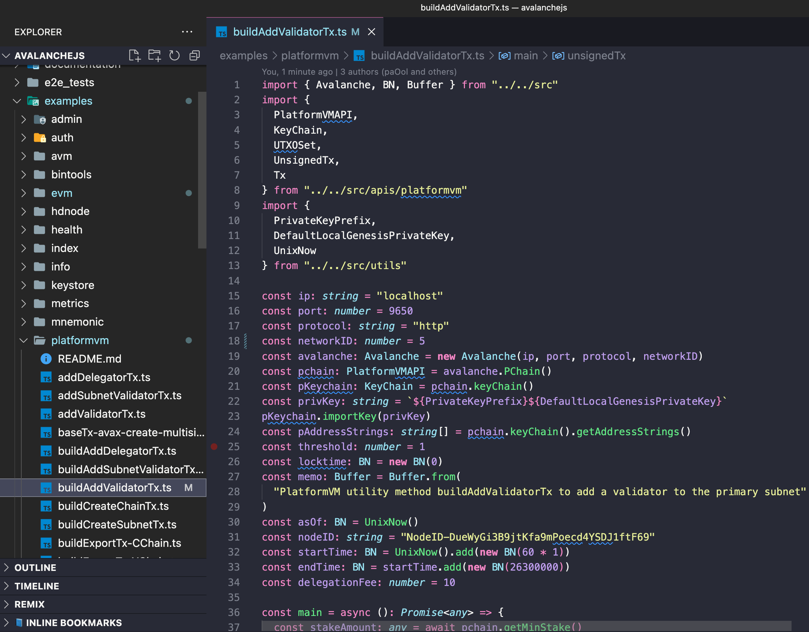

# AJS Add a Node to the Validator Set

## Introduction

The [Primary Network](https://support.avax.network/en/articles/4135650-what-is-the-primary-network) is inherent to the Avalanche platform and validates Avalanche’s [built-in blockchains](../../overview/getting-started/avalanche-platform.md). In this tutorial, we’ll add a node to the Primary Network on Avalanche.

The P-Chain manages metadata on Avalanche. This includes tracking which nodes are in which subnets, which blockchains exist, and which subnets are validating which blockchains. To add a validator, we’ll issue [transactions](http://support.avalabs.org/en/articles/4587384-what-is-a-transaction) to the P-Chain.

:::danger
Note that once you issue the transaction to add a node as a validator, there is no way to change the parameters. **You can’t remove your stake early or change the stake amount, node ID, or reward address.** Please make sure you’re using the correct values in the API calls below. If you’re not sure, browse the [AvalancheGO API](../../apis/avalanchego/apis/README.md) or ask for help on [Discord.](https://chat.avalabs.org/)
:::

## Requirements

You've completed [Run an Avalanche Node](../build/run-avalanche-node-manually.md) and are familiar with [Avalanche's architecture](../../overview/getting-started/avalanche-platform.md).In this tutorial, we use [AvalancheJS](https://github.com/ava-labs/AvalancheJS) and [Avalanche’s Postman collection](https://github.com/ava-labs/avalanche-postman-collection) to help us make API calls.

In order to ensure your node is well-connected, make sure that your node can receive and send TCP traffic on the staking port (`9651` by default) and that you started your node with config flag `--public-ip=[YOUR NODE'S PUBLIC IP HERE]`. Failing to do either of these may jeopardize your staking reward.

## Add a validator with Avalanche Wallet

First, we show you how to add your node as a validator by using [Avalanche Wallet](https://wallet.avax.network).

Get your node’s ID by calling [`info.getNodeID`](../../apis/avalanchego/apis/info.md#infogetnodeid):


```sh
curl -X POST --data '{
    "jsonrpc":"2.0",
    "id"     :1,
    "method" :"info.getNodeID"
}' -H 'content-type:application/json;' 127.0.0.1:9650/ext/info
```

The response has your node’s ID:

```json
{
    "jsonrpc": "2.0",
    "result": {
        "nodeID": "NodeID-5mb46qkSBj81k9g9e4VFjGGSbaaSLFRzD"
    },
    "id": 1
}
```

Open [the wallet](https://wallet.avax.network/), and go the `Earn` tab. Choose `Add Validator`.


Fill out the staking parameters. They are explained in more detail in [this doc](../validate/staking.md). When you’ve filled in all the staking parameters and double-checked them, click `Confirm`. Make sure the staking period is at least 2 weeks, the delegation fee rate is at least 2%, and you’re staking at least 2,000 AVAX.


You should see this success message, and your balance should be updated.


Calling [`platform.getPendingValidators`](../../apis/avalanchego/apis/p-chain.md#platformgetpendingvalidators) verifies that our transaction was accepted.


Go back to the `Earn` tab, and click `Estimated Rewards`.


Once your validator’s start time has passed, you will see the rewards it may earn, as well as its start time, end time, and the percentage of its validation period that has passed.


That’s it!

## Add a validator with AvalancheJS

We can also add a node to the validator set using [AvalancheJS](https://docs.avax.network/apis/avalanchejs/). To add a node the Primary Network, we’ll examine the workflow below

### Getting started

To use AvalancheJS, you can clone the repo:
```zsh
$ git clone https://github.com/ava-labs/avalanchejs.git
```

or add it to an existing project:

```zsh
$ yarn add --dev avalanche
```
For this tutorial we will use a CLI to run the example scripts directly from an AvalancheJS directory.
## Typical Fuji Workflow
### Key Management
By default our scripts import our [Pre-Generated Private Key](https://github.com/ava-labs/avalanchejs/blob/master/examples/avm/buildExportTx-cchain-avax.ts#L30) to our [```pKeychain```](https://github.com/ava-labs/avalanchejs/blob/46ce89f395133702320a77cba4bb9cb818b48fe8/examples/avm/buildExportTx-cchain-avax.ts#L31) to obtain signers.  

```ts
const pchain: PlatformVMAPI = avalanche.PChain()
const pKeychain: KeyChain = pchain.keyChain()
const privKey: string = `${PrivateKeyPrefix}${DefaultLocalGenesisPrivateKey}`
pKeychain.importKey(privKey)
```

You can import the keys you want use with AvalancheJS directly into the AvalancheJS example script by doing the following:

1. Navigate to the [private key value in the script](https://github.com/ava-labs/avalanchejs/blob/46ce89f395133702320a77cba4bb9cb818b48fe8/examples/platformvm/buildAddValidatorTx.ts#L22)

```js
// buildAddValidatorTx.ts
const privKey: string = `${PrivateKeyPrefix}${DefaultLocalGenesisPrivateKey}`;
```

2. To run the script on Fuji, replace the `privKey` value with the imported private key.

```js
// buildAddValidatorTx.ts
const privKey: string = "<YOUR-PRIVATE-KEY-HERE>";
```
### Step 1 - Open AvalancheJS

Open your AvalancheJS directory and select the **```examples/platformvm```** folder to view the source code for the examples scripts. 

We will use our [**```buildAddValidatorTx.ts```**](https://github.com/ava-labs/avalanchejs/blob/master/examples/platformvm/buildAddValidatorTx.ts) script to add a validator.



Let’s go through and examine these variables.

```ts
const ip: string = "localhost"
const port: number = 9650
const protocol: string = "http"
const networkID: number = 5
const avalanche: Avalanche = new Avalanche(ip, port, protocol, networkID)
```
Depending on how you started your node, you might use custom settings for your Avalanche Network.

_Note: See [Advanced Configurations](https://docs.avax.network/nodes/build/set-up-node-with-installer#advanced-node-configuration) to learn more about custom Node configurations_

Below are the following objects in your Avalanche Network:

```js
const ip: string = "localhost"
const port: number = 9650
const protocol: string = "http"
const networkID: number = 5
```

`IP Address`

The node's IP address

If you're using a local node:
```js
const ip: string = "localhost" 
```

Or a custom IP address such as an [elastic IP](../build/setting-up-an-avalanche-node-with-amazon-web-services-aws#assign-an-elastic-ip):
```js
const ip: string = "<YOUR-NODE-IP-ADDRESS-HERE>" 
```

`Port Number`

The port we use to connect to the node.

```js
const port: number = 9650
```

`Protocol`

The protocol we use to connect to the node's IP.

```js
const protocol: string = "http"
```

`Network ID`

Depending on the networkID which is passed in when instantiating Avalanche, the encoded addresses used will have a distinctive Human Readable Part(HRP) per each network.

Fuji:
```js
const networkID: number = 5
  ```

AvalancheJS expects the following format: _5 - X-`fuji`19rknw8l0grnfunjrzwxlxync6zrlu33yxqzg0h_

You can learn more about our encoded addresses [here](../../apis/avalanchejs/manage-x-chain-keys.md#encode-bech32-addresses)

Here we determine the node's staking period and delegation Fee

```ts
const nodeID: string = "NodeID-7Xhw2mDxuDS44j42TCB6U5579esbSt3Lg"
const startTime: BN = UnixNow().add(new BN(60 * 1))
const endTime: BN = startTime.add(new BN(26300000))
const delegationFee: number = 10
```

`nodeID`

This is the node ID of the validator being added. To get your node’s ID, use the example script: [`getNodeID.ts`](https://github.com/ava-labs/avalanchejs/blob/master/examples/info/getNodeID.ts)

_Be sure to apply the [necessary changes](../../quickstart/cross-chain-transfers.md#modify-your-avalanche-network-configuration) to ['getNodeID.ts'](https://github.com/ava-labs/avalanchejs/blob/master/examples/info/getNodeID.ts) to execute the script properly._

```sh
avalanchejs $ ts-node examples/info/getNodeID.ts
```

The response has your node’s ID:

```sh
avalanchejs $ NodeID-7Xhw2mDxuDS44j42TCB6U5579esbSt3Lg
```


`startTime` and `endTime`

When one issues a transaction to join the Primary Network they specify the time they will enter (start validating) and leave (stop validating.) The minimum duration that one can validate the Primary Network is 2 weeks, and the maximum duration is one year. One can re-enter the Primary Network after leaving, it’s just that the maximum _continuous_ duration is one year. `startTime` and `endTime` are the Unix times when your validator will start and stop validating the Primary Network, respectively. `startTime` must be in the future relative to the time the transaction is issued.

`delegationFeeRate`

Avalanche allows for delegation of stake. This parameter is the percent fee this validator charges when others delegate stake to them. For example, if `delegationFeeRate` is `1.2345` and someone delegates to this validator, then when the delegation period is over, 1.2345% of the reward goes to the validator and the rest goes to the delegator.

We define our `stakeAmount` in our main function.
```ts
const main = async (): Promise<any> => {
  const stakeAmount: any = await pchain.getMinStake()
  ...
}
```

`stakeAmount`

In order to validate the Primary Network, one must stake AVAX. This parameter defines the amount of AVAX staked.


### Step 2 - Issue The Transaction

Now let’s issue the transaction. We use `const startTime: BN = UnixNow().add(new BN(60 * 1))` and
`const endTime: BN = startTime.add(new BN(26300000))` to compute the Unix time 1 minute and 304 days in the future to use as the values of `startTime` and `endTime`, respectively.

```ts
  const unsignedTx: UnsignedTx = await pchain.buildAddValidatorTx(
    utxoSet,
    pAddressStrings,
    pAddressStrings,
    pAddressStrings,
    nodeID,
    startTime,
    endTime,
    stakeAmount.minValidatorStake,
    pAddressStrings,
    delegationFee,
    locktime,
    threshold,
    memo,
    asOf
  )
```
### Step 2 - Execute The Add Validator Script
_Note: Be sure to apply the [necessary changes](../../quickstart/cross-chain-transfers.md#modify-your-avalanche-network-configuration) to each example script to ensure proper execution._


Run the command:
```zsh
avlanchejs $ ts-node examples/platformvm/buildAddValidatorTx.ts
```

The response has the transaction ID.

```
avlanchejs $ Success! TXID: A64nRYNXxnaMwdDBAM8AXaQA7GFd3GMfvJkjSLqoMwTVXbFbM
```

We can check the transaction’s status by running the example script: [`getTxStatus.ts`](https://github.com/ava-labs/avalanchejs/blob/master/examples/platformvm/getTxStatus.ts):

```sh
avalanchejs $ ts-node examples/platformvm/getTxStatus.ts
```

```sh
avalanchejs $ { status: 'Committed' }
```
The status should be `Committed`, meaning the transaction was successful. We can call run example script: [`getTxStatus.ts`](https://github.com/ava-labs/avalanchejs/blob/master/examples/platformvm/getTxStatus.ts)and see that the node is now in the pending validator set for the Primary Network:
```sh
avalanchejs $ ts-node examples/platformvm/getPendingValidators.ts    
```

The response should include the node we just added:

```sh
avalanchejs $ { validators: [{
                "nodeID": "NodeID-LMUue2dBBRWdDbPL4Yx47Ps31noeewJji",
                "startTime": "1584021450",
                "endtime": "1584121156",
                "stakeAmount": "2000000000000"
                }], delegators: [] }
```


When the time reaches `1584021450`, this node will start validating the Primary Network. When it reaches `1584121156`, this node will stop validating the Primary Network. The staked AVAX will be returned to the user's `P-chain address`, and the rewards, if any, will be given to `rewardAddress`.

