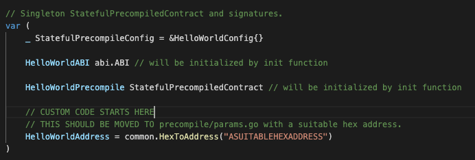
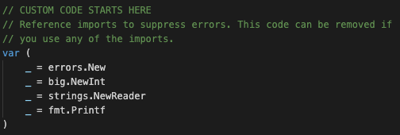

# Stateful Precompile Generation Tutorial

In this tutorial, we are going to walk through how we can generate a stateful precompile from scratch.
Before we start, let's brush up on what a precompile is, what a stateful precompile is, and why this
is extremely useful.

## Background

### Precompiled Contracts

Ethereum uses precompiles to efficiently implement cryptographic primitives within the EVM instead of
re-implementing the same primitives in Solidity. The following precompiles are currently included:
ecrecover, sha256, blake2f, ripemd-160, Bn256Add, Bn256Mul, Bn256Pairing, the identity function, and
modular exponentiation.

We can see these [precompile](https://github.com/ethereum/go-ethereum/blob/master/core/vm/contracts.go#L81)
mappings from address to function here in the Ethereum VM:

```go
// PrecompiledContractsBerlin contains the default set of pre-compiled Ethereum
// contracts used in the Berlin release.
var PrecompiledContractsBerlin = map[common.Address]PrecompiledContract{
	common.BytesToAddress([]byte{1}): &ecrecover{},
	common.BytesToAddress([]byte{2}): &sha256hash{},
	common.BytesToAddress([]byte{3}): &ripemd160hash{},
	common.BytesToAddress([]byte{4}): &dataCopy{},
	common.BytesToAddress([]byte{5}): &bigModExp{eip2565: true},
	common.BytesToAddress([]byte{6}): &bn256AddIstanbul{},
	common.BytesToAddress([]byte{7}): &bn256ScalarMulIstanbul{},
	common.BytesToAddress([]byte{8}): &bn256PairingIstanbul{},
	common.BytesToAddress([]byte{9}): &blake2F{},
}
```

These precompile addresses start from `0x0000000000000000000000000000000000000001` and increment by 1.

A [precompile](https://github.com/ava-labs/subnet-evm/blob/HelloWorldOfficialTutorial/core/vm/contracts.go#L53-L56)
follows this interface:

```go
// PrecompiledContract is the basic interface for native Go contracts. The implementation
// requires a deterministic gas count based on the input size of the Run method of the
// contract.
type PrecompiledContract interface {
	RequiredGas(input []byte) uint64  // RequiredPrice calculates the contract gas use
	Run(input []byte) ([]byte, error) // Run runs the precompiled contract
}
```

Here is an example of the
[sha256 precompile](https://github.com/ava-labs/subnet-evm/blob/HelloWorldOfficialTutorial/core/vm/contracts.go#L238-L252)
function.

```go
type sha256hash struct{}

// RequiredGas returns the gas required to execute the pre-compiled contract.
//
// This method does not require any overflow checking as the input size gas costs
// required for anything significant is so high it's impossible to pay for.
func (c *sha256hash) RequiredGas(input []byte) uint64 {
	return uint64(len(input)+31)/32*params.Sha256PerWordGas + params.Sha256BaseGas
}

func (c *sha256hash) Run(input []byte) ([]byte, error) {
	h := sha256.Sum256(input)
	return h[:], nil
}
```

The CALL opcode (CALL, STATICCALL, DELEGATECALL, and CALLCODE) allows us to invoke this precompile.

The function signature of CALL in the EVM is as follows:

```go
 Call(
 	caller ContractRef,
 	addr common.Address,
 	input []byte,
 	gas uint64,
 	value *big.Int,
)(ret []byte, leftOverGas uint64, err error)
```

Precompiles are a shortcut to execute a function implemented by the EVM itself, rather than an actual
contract. A precompile is associated with a fixed address defined in the EVM. There is no byte code
associated with that address.

When a precompile is called, the EVM checks if the input address is a precompile address and if so it
executes the precompile. Otherwise it loads the smart contract at the input address and runs it on the
the EVM interpreter with the specified input data.

### Stateful Precompiled Contracts

A stateful precompile builds on a precompile in that it adds state access. Stateful precompiles are
not available in the default EVM, and are specific to Avalanche EVMs such as
[Coreth](https://github.com/ava-labs/coreth) and [Subnet-EVM](https://github.com/ava-labs/subnet-evm).

A stateful precompile follows this [interface](https://github.com/ava-labs/subnet-evm/blob/HelloWorldOfficialTutorial/precompile/contract.go#L64-L67):

```go
// StatefulPrecompiledContract is the interface for executing a precompiled contract
type StatefulPrecompiledContract interface {
	// Run executes the precompiled contract.
	Run(accessibleState PrecompileAccessibleState,
	caller common.Address,
	addr  common.Address,
	input []byte,
	suppliedGas uint64,
	readOnly bool)
	(ret []byte, remainingGas uint64, err error)
}
```

A stateful precompile injects state access through the `PrecompileAccessibleState` interface to
provide access to the EVM state including the ability to modify balances and read/write storage.

This way we can provide even more customization of the EVM through Stateful Precompiles than we can
with the original precompile interface!

## Tutorial

### Overview

This is a brief overview of what this tutorial will cover.

- Write a Solidity interface
- Generate the precompile template
- Implement the precompile functions in Golang
- Write and run tests

Stateful precompiles are [alpha software](https://en.wikipedia.org/wiki/Software_release_life_cycle#Alpha).
Build at your own risk.

### Prerequisites

This tutorial assumes familiarity with Golang and JavaScript.

Additionally, users should be deeply familiar with the EVM in order to understand its invariants
since adding a Stateful Precompile modifies the EVM itself.

Here are some recommended resources to learn the ins and outs of the EVM:

- [The Ethereum Virtual Machine](https://github.com/ethereumbook/ethereumbook/blob/develop/13evm.asciidoc)
- [Precompiles in Solidity](https://medium.com/@rbkhmrcr/precompiles-solidity-e5d29bd428c4)
- [Deconstructing a Smart Contract](https://blog.openzeppelin.com/deconstructing-a-solidity-contract-part-i-introduction-832efd2d7737/)
- [Layout of State Variables in Storage](https://docs.soliditylang.org/en/v0.8.10/internals/layout_in_storage.html)
- [Layout in Memory](https://docs.soliditylang.org/en/v0.8.10/internals/layout_in_memory.html)
- [Layout of Call Data](https://docs.soliditylang.org/en/v0.8.10/internals/layout_in_calldata.html)
- [Contract ABI Specification](https://docs.soliditylang.org/en/v0.8.10/abi-spec.html)
- [Precompiles in Solidity](https://medium.com/@rbkhmrcr/precompiles-solidity-e5d29bd428c4)
- [Customizing the EVM with Stateful Precompiles](https://medium.com/avalancheavax/customizing-the-evm-with-stateful-precompiles-f44a34f39efd)

Please install the following before getting started.

First install the latest version of Go. Follow the instructions [here](https://go.dev/doc/install).
You can verify by running `go version`.

Set `$GOPATH` environment variable properly for Go to look for Go Workspaces. Please read
[this](https://go.dev/doc/gopath_code) for details. You can verify by running `echo $GOPATH`.

As a few things will be installed into `$GOPATH/bin`, please make sure that `$GOPATH/bin` is in your
`$PATH`, otherwise, you may get error running the commands below.

Download the following prerequisites into your `$GOPATH`:

- Git Clone the [Subnet-EVM](https://github.com/ava-labs/subnet-evm) repository
- Git Clone [AvalancheGo](https://github.com/ava-labs/avalanchego) repository
- Install [Avalanche Network Runner](https://docs.avax.network/subnets/network-runner)
- Install [solc](https://github.com/ethereum/solc-js#usage-on-the-command-line)
- Install [yarn](https://classic.yarnpkg.com/lang/en/docs/install/#mac-stable)

For easy copy paste, use the below commands:

```shell
cd $GOPATH
mkdir -p src/github.com/ava-labs
cd src/github.com/ava-labs
git clone git@github.com:ava-labs/subnet-evm.git
git clone git@github.com:ava-labs/avalanchego.git
curl -sSfL https://raw.githubusercontent.com/ava-labs/avalanche-network-runner/main/scripts/install.sh | sh -s
npm install -g solc
npm install -g yarn
```

### Official GitHub Tutorial

Please also use the [official GitHub tutorial](https://github.com/ava-labs/hello-world-official-precompile-tutorial/pull/1)
to double check your work as well.

### Step 0: Generating the Precompile

For the tutorial, we will be working in a new branch in Subnet-EVM:

```bash
cd $GOPATH/src/github.com/ava-labs/subnet-evm
git checkout -b hello-world-stateful-precompile
```

We will start off in this directory `./contract-examples/contracts`:

```bash
cd contract-examples/contracts
```

First we must create the Solidity interface that we want our precompile to implement. This will be
the HelloWorld Interface. It will have two simple functions, `sayHello()` and `setGreeting()`. These
two functions will demonstrate the getting and setting respectively of a value stored in the
precompile's state space.

Create a new file called `IHelloWorld.sol` and copy and paste the below code:

```sol
// (c) 2022-2023, Ava Labs, Inc. All rights reserved.
// See the file LICENSE for licensing terms.

// SPDX-License-Identifier: MIT

pragma solidity >=0.8.0;

interface IHelloWorld {
  // sayHello returns the stored greeting string
  function sayHello() external view returns (string calldata result);

  // setGreeting  stores the greeting string
  function setGreeting(string calldata response) external;
}
```

Now we have an interface that our precompile can implement!
Let's create an [ABI](https://docs.soliditylang.org/en/v0.8.13/abi-spec.html#contract-abi-specification)
of our Solidity interface.

In the same `./contract-examples/contracts` directory, let's run

```shell
solcjs --abi IHelloWorld.sol && mv IHelloWorld_sol_IHelloWorld.abi IHelloWorld.abi
```

This generates the ABI code and moves it to `./contract-examples/contracts` as `IHelloWorld.abi`:

```json
[
  {
    "inputs": [],
    "name": "sayHello",
    "outputs": [
      { "internalType": "string", "name": "result", "type": "string" }
    ],
    "stateMutability": "nonpayable",
    "type": "function"
  },
  {
    "inputs": [
      { "internalType": "string", "name": "recipient", "type": "string" }
    ],
    "name": "setGreeting",
    "outputs": [],
    "stateMutability": "nonpayable",
    "type": "function"
  }
]
```

Note: The ABI must have named outputs in order to generate the precompile template.

Now that we have an ABI for the precompile gen tool to interact with, we can run the following
command to generate our HelloWorld precompile!

Let's go back to the root of the Subnet-EVM repository and run the PrecompileGen script:

<!-- markdownlint-disable MD013 -->

```bash
cd $GOPATH/src/github.com/ava-labs/subnet-evm

go run ./cmd/precompilegen/main.go --abi ./contract-examples/contracts/IHelloWorld.abi --type HelloWorld --pkg precompile --out ./precompile/hello_world.go
```

<!-- markdownlint-enable MD013 -->

This generates a precompile template that's mostly complete located at `./precompile/hello_world.go`.
Let's fill out the rest!

The precompile gives us commented instructions on the first 25 lines of the autogenerated file. Let's
look at the 10 steps and follow them step by step:

<!-- markdownlint-disable MD013 -->

```go
/* General guidelines for precompile development:
1- Read the comment and set a suitable contract address in precompile/params.go. E.g:
	HelloWorldAddress = common.HexToAddress("ASUITABLEHEXADDRESS")
2- Set gas costs here
3- It is recommended to only modify code in the highlighted areas marked with "CUSTOM CODE STARTS HERE". Modifying code outside of these areas should be done with caution and with a deep understanding of how these changes may impact the EVM.
Typically, custom codes are required in only those areas.
4- Add your upgradable config in params/precompile_config.go
5- Add your precompile upgrade in params/config.go
6- Add your solidity interface and test contract to contract-examples/contracts
7- Write solidity tests for your precompile in contract-examples/test
8- Create your genesis with your precompile enabled in tests/e2e/genesis/
9- Create e2e test for your solidity test in tests/e2e/solidity/suites.go
10- Run your e2e precompile Solidity tests with 'E2E=true ./scripts/run.sh'
*/
```

<!-- markdownlint-enable MD013 -->

### Step 1: Set Contract Address

In `./precompile/hello_world.go`, please search (`CTRL F`) `CUSTOM CODE STARTS HERE` to find the
first area where we can modify the precompile.

We can see our precompile address is set to some default value. We can cut the address from the var
declaration block and remove it from the precompile.



We can paste it in
[`./precompile/params.go`](https://github.com/ava-labs/subnet-evm/blob/HelloWorldOfficialTutorial/precompile/params.go)
and modify the default value to be the next user available stateful precompile address. For forks of
Subnet-EVM, users should start at `0x0300000000000000000000000000000000000000` to ensure
that their own modifications do not conflict with stateful precompiles that may be added to
Subnet-EVM in the future.

```go
ContractDeployerAllowListAddress = common.HexToAddress("0x0200000000000000000000000000000000000000")
ContractNativeMinterAddress      = common.HexToAddress("0x0200000000000000000000000000000000000001")
TxAllowListAddress               = common.HexToAddress("0x0200000000000000000000000000000000000002")
FeeConfigManagerAddress          = common.HexToAddress("0x0200000000000000000000000000000000000003")
HelloWorldAddress                = common.HexToAddress("0x0300000000000000000000000000000000000000")
// ADD YOUR PRECOMPILE HERE
// {YourPrecompile}Address       = common.HexToAddress("0x03000000000000000000000000000000000000??")
```

We now have to add it to the slice of `UsedAddresses` as well.

```go
UsedAddresses = []common.Address{
		ContractDeployerAllowListAddress,
		ContractNativeMinterAddress,
		TxAllowListAddress,
		FeeConfigManagerAddress,
		HelloWorldAddress,
		// ADD YOUR PRECOMPILE HERE
		// YourPrecompileAddress
	}
```

Now when Subnet-EVM sees the `HelloWorldAddress` as input when executing
[`CALL`](https://github.com/ava-labs/subnet-evm/blob/HelloWorldOfficialTutorial/core/vm/evm.go#L222),
[`STATICCALL`](https://github.com/ava-labs/subnet-evm/blob/HelloWorldOfficialTutorial/core/vm/evm.go#L401),
[`DELEGATECALL`](https://github.com/ava-labs/subnet-evm/blob/HelloWorldOfficialTutorial/core/vm/evm.go#L362),
[`CALLCODE`](https://github.com/ava-labs/subnet-evm/blob/HelloWorldOfficialTutorial/core/vm/evm.go#L311),
it can [run the precompile](https://github.com/ava-labs/subnet-evm/blob/HelloWorldOfficialTutorial/core/vm/evm.go#L271-L272)
if the precompile is enabled.

### Step 2: Set Gas Costs

In [`precompile/params.go`](https://github.com/ava-labs/subnet-evm/blob/HelloWorldOfficialTutorial/precompile/params.go)
we have `writeGasCostPerSlot` and `readGasCostPerSlot`.

`writeGasCostPerSlot` is the cost of one write such as modifying a state storage slot.

`readGasCostPerSlot` is the cost of reading a state storage slot.

This should be in your gas cost estimations based on how many times the precompile function does a
read or a write. For example, if the precompile modifies the state slot of its precompile address
twice then the gas cost for that function would be `40_000`.

```go
// Gas costs for stateful precompiles
const (
	writeGasCostPerSlot = 20_000
	readGasCostPerSlot  = 5_000
)
```

Now going back to `./precompile/hello_world.go`, we can modify our precompile function gas costs.
Please search (`CTRL F`) `SET A GAS COST HERE` to locate the default gas cost code.

We will be getting and setting our greeting with `sayHello()` and `setGreeting()` in one slot
respectively so we can define the gas costs as follows.

```go
	SayHelloGasCost    uint64 = readGasCostPerSlot
	SetGreetingGasGost uint64 = writeGasCostPerSlot
```

### Step 3: Add Custom Code

Search (`CTRL F`) throughout the file with `CUSTOM CODE STARTS HERE` to find the areas in the
precompile that we need to modify. We should start with the reference imports code block.



We can remove all of these reference imports and the associated imports. We only include these in
our template so that the file compiles on generation.

#### Step 3.1: Modify Equal()

Next we see this in `Equal()`. The below code snippet can be copied and pasted to overwrite the
default `Equal()` code.

<!-- markdownlint-disable MD013 -->

```go
// Equal returns true if [s] is a [*HelloWorldConfig] and it has been configured identical to [c].
func (c *HelloWorldConfig) Equal(s StatefulPrecompileConfig) bool {
	// typecast before comparison
	other, ok := (s).(*HelloWorldConfig)
	if !ok {
		return false
	}
	// CUSTOM CODE STARTS HERE
	// modify this boolean accordingly with your custom HelloWorldConfig, to check if [other] and the current [c] are equal
	// if HelloWorldConfig contains only UpgradeableConfig  you can skip modifying it.
	equals := c.UpgradeableConfig.Equal(&other.UpgradeableConfig)
	return equals
}
```

<!-- markdownlint-enable MD013 -->

We can leave this function as is since we check `UpgradeableConfig` for equality which is the only
field that `HelloWorldConfig` struct has.

```go
// HelloWorldConfig implements the StatefulPrecompileConfig
// interface while adding in the HelloWorld specific precompile address.
type HelloWorldConfig struct {
	UpgradeableConfig
}
```

#### Step 3.2: Modify Configure()

The next place we see the `CUSTOM CODE STARTS HERE` is in `Configure()`.
Let's set it up. `Configure()` configures the `state` with the initial configuration at whatever
`blockTimestamp` the precompile is enabled. In the HelloWorld example, we want to set up a default
key-value mapping in the state where the key is `storageKey` and the value is `Hello World!`. The
`StateDB` allows us to store a key-value mapping of 32 byte hashes. The below code snippet can be
copied and pasted to overwrite the default `Configure()` code.

```go
// Configure configures [state] with the initial configuration.
func (c *HelloWorldConfig) Configure(_ ChainConfig, state StateDB, _ BlockContext) {
	// This will be called in the first block where HelloWorld stateful precompile is enabled.
	// 1) If BlockTimestamp is nil, this will not be called
	// 2) If BlockTimestamp is 0, this will be called while setting up the genesis block
	// 3) If BlockTimestamp is 1000, this will be called while processing the first block
	// whose timestamp is >= 1000
	//
	// Set the initial value under [common.BytesToHash([]byte("storageKey")] to "Hello World!"
	res := common.LeftPadBytes([]byte("Hello World!"), common.HashLength)
	state.SetState(HelloWorldAddress, common.BytesToHash([]byte("storageKey")), common.BytesToHash(res))
}
```

#### Step 3.3: Modify Verify()

We also see a `Verify()` function. `Verify()` is called on startup and an error is treated as fatal.
We can leave this as is right now because there is no invalid configuration for the `HelloWorldConfig`.
The below code snippet can be copied and pasted to overwrite the default `Verify()` code.

```go
// Verify tries to verify HelloWorldConfig and returns an error accordingly.
func (c *HelloWorldConfig) Verify() error {
	return nil
}
```

#### Step 3.4: Modify sayHello()

Next place to modify is in our `sayHello()` function. In a previous step we created the `IHelloWorld.sol`
interface with two functions `sayHello()` and `setGreeting()`. We finally get to implement them here.
If any contract calls these functions from the interface, the below function gets executed. This function
is a simple getter function. In `Configure()` we set up a mapping with the key as `storageKey` and
the value as `Hello World!` In this function, we will be returning whatever value is at `storageKey`.
The below code snippet can be copied and pasted to overwrite the default `sayHello` code.

<!-- markdownlint-disable MD013 -->

```go
func sayHello(accessibleState PrecompileAccessibleState, caller common.Address, addr common.Address, input []byte, suppliedGas uint64, readOnly bool) (ret []byte, remainingGas uint64, err error) {
	if remainingGas, err = deductGas(suppliedGas, SayHelloGasCost); err != nil {
		return nil, 0, err
	}
	// Get the current state
	currentState := accessibleState.GetStateDB()
	// Get the value set at recipient
	value := currentState.GetState(HelloWorldAddress, common.BytesToHash([]byte("storageKey")))
	packedOutput, err := PackSayHelloOutput(string(common.TrimLeftZeroes(value.Bytes())))
	if err != nil {
		return nil, remainingGas, err
	}

	// Return the packed output and the remaining gas
	return packedOutput, remainingGas, nil
}
```

<!-- markdownlint-enable MD013 -->

#### Step 3.5: Modify setGreeting()

We can also modify our `setGreeting()` function. This is a simple setter function. It takes in `input`
and we will set that as the value in the state mapping with the key as `storageKey`. The below code
snippet can be copied and pasted to overwrite the default `sayGreeting()` code.

<!-- markdownlint-disable MD013 -->

```go
func setGreeting(accessibleState PrecompileAccessibleState, caller common.Address, addr common.Address, input []byte, suppliedGas uint64, readOnly bool) (ret []byte, remainingGas uint64, err error) {
	if remainingGas, err = deductGas(suppliedGas, SetGreetingGasCost); err != nil {
		return nil, 0, err
	}
	if readOnly {
		return nil, remainingGas, vmerrs.ErrWriteProtection
	}
	// Attempts to unpack [input] into the arguments to the SetGreetingInput.
	// Assumes that [input] does not include selector
	// You can use unpacked [inputStruct] variable in your code
    inputStr, err := UnpackSetGreetingInput(input)
	if err != nil {
		return nil, remainingGas, err
	}

  	// CUSTOM CODE STARTS HERE
  	// Check if the input string is longer than 32 bytes
    if len(inputStr) > 32 {
    	return nil, 0, errors.New("input string is longer than 32 bytes")
    }

  	// setGreeting is the execution function
  	// "SetGreeting(name string)" and sets the storageKey
  	// in the string returned by hello world
  	res := common.LeftPadBytes([]byte(inputStr), common.HashLength)
	accessibleState.GetStateDB().SetState(HelloWorldAddress, common.BytesToHash([]byte("storageKey")), common.BytesToHash(res))

	// This function does not return an output, leave this one as is
	packedOutput := []byte{}

	// Return the packed output and the remaining gas
	return packedOutput, remainingGas, nil
}
```

<!-- markdownlint-enable MD013 -->

### Step 4: Add Upgradable Config

Let's now modify
[`./params/precompile_config.go`](https://github.com/ava-labs/subnet-evm/blob/HelloWorldOfficialTutorial/params/precompile_config.go).
 We can search (`CTRL F`) for `ADD YOUR PRECOMPILE HERE`.

This file helps set up stateful precompiles that can be activated as part of a network upgrade and
related helper functions.

Let's create our precompile key and name it `helloWorldKey`. Precompile keys are used to reference
each of the possible stateful precompile types. The below code snippet can be copied and pasted to
overwrite the default code.

```go
const (
	contractDeployerAllowListKey precompileKey = iota + 1
	contractNativeMinterKey
	txAllowListKey
	feeManagerKey
	helloWorldKey
	// ADD YOUR PRECOMPILE HERE
	// {yourPrecompile}Key
)
```

We should also add our precompile key to our `precompileKeys` slice. We use this slice to iterate
over the keys and activate the precompiles. The below code snippet can be copied and pasted to
overwrite the default code.

<!-- markdownlint-disable MD013 -->

```go
// ADD YOUR PRECOMPILE HERE
var precompileKeys = []precompileKey{contractDeployerAllowListKey, contractNativeMinterKey, txAllowListKey, feeManagerKey, helloWorldKey /* {yourPrecompile}Key */}
```

<!-- markdownlint-enable MD013 -->

We should add our precompile to the `PrecompileUpgrade` struct. The `PrecompileUpgrade` is a helper
struct embedded in `UpgradeConfig` and represents each of the possible stateful precompile types
that can be activated or deactivated as part of a network upgrade. The below code snippet can be
copied and pasted to overwrite the default code.

<!-- markdownlint-disable MD013 -->

```go
type PrecompileUpgrade struct {
	ContractDeployerAllowListConfig *precompile.ContractDeployerAllowListConfig `json:"contractDeployerAllowListConfig,omitempty"` // Config for the contract deployer allow list precompile
	ContractNativeMinterConfig      *precompile.ContractNativeMinterConfig      `json:"contractNativeMinterConfig,omitempty"`      // Config for the native minter precompile
	TxAllowListConfig               *precompile.TxAllowListConfig               `json:"txAllowListConfig,omitempty"`               // Config for the tx allow list precompile
	FeeManagerConfig                *precompile.FeeConfigManagerConfig          `json:"feeManagerConfig,omitempty"`                // Config for the fee manager precompile
	HelloWorldConfig                *precompile.HelloWorldConfig                `json:"helloWorldConfig,omitempty"`                // Config for the hello world precompile
	// ADD YOUR PRECOMPILE HERE
	// {YourPrecompile}Config  *precompile.{YourPrecompile}Config `json:"{yourPrecompile}Config,omitempty"`
}
```

<!-- markdownlint-enable MD013 -->

In the `getByKey` function given a `precompileKey`, it returns the correct mapping of type
`precompile.StatefulPrecompileConfig`. Here, we must set the `helloWorldKey` to map to the
`helloWorldConfig`. The below code snippet can be copied and pasted to overwrite the default code.

```go
func (p *PrecompileUpgrade) getByKey(key precompileKey) (precompile.StatefulPrecompileConfig, bool) {
	switch key {
	case contractDeployerAllowListKey:
		return p.ContractDeployerAllowListConfig, p.ContractDeployerAllowListConfig != nil
	case contractNativeMinterKey:
		return p.ContractNativeMinterConfig, p.ContractNativeMinterConfig != nil
	case txAllowListKey:
		return p.TxAllowListConfig, p.TxAllowListConfig != nil
	case feeManagerKey:
		return p.FeeManagerConfig, p.FeeManagerConfig != nil
	case helloWorldKey:
		return p.HelloWorldConfig, p.HelloWorldConfig != nil
		// ADD YOUR PRECOMPILE HERE
	/*
		case {yourPrecompile}Key:
		return p.{YourPrecompile}Config , p.{YourPrecompile}Config  != nil
	*/
	default:
		panic(fmt.Sprintf("unknown upgrade key: %v", key))
	}
}
```

We should also define `GetHelloWorldConfig`. Given a `blockTimestamp`, we will return the
`*precompile.HelloWorldConfig` if it is enabled. We use this function to check whether precompiles
are enabled in `./params/config.go`. This function is also used to construct a `PrecompileUpgrade`
struct in `GetActivePrecompiles()`. The below code snippet can be copied and pasted to overwrite
the default code.

<!-- markdownlint-disable MD013 -->

```go
// GetHelloWorldConfig returns the latest forked HelloWorldConfig
// specified by [c] or nil if it was never enabled.
func (c *ChainConfig) GetHelloWorldConfig(blockTimestamp *big.Int) *precompile.HelloWorldConfig {
	if val := c.getActivePrecompileConfig(blockTimestamp, helloWorldKey, c.PrecompileUpgrades); val != nil {
		return val.(*precompile.HelloWorldConfig)
	}
	return nil
}
```

<!-- markdownlint-enable MD013 -->

Finally, we can add our precompile in `GetActivePrecompiles()`, which given a `blockTimestamp`
returns a `PrecompileUpgrade` struct. This function is used in the Ethereum API and can give a user
information about what precompiles are enabled at a certain block timestamp. For more information
about our Ethereum API, check out this
[link](https://docs.avax.network/apis/avalanchego/apis/subnet-evm). The below code snippet can be
copied and pasted to overwrite the default code.

<!-- markdownlint-disable MD013 -->

```go
func (c *ChainConfig) GetActivePrecompiles(blockTimestamp *big.Int) PrecompileUpgrade {
	pu := PrecompileUpgrade{}
	if config := c.GetContractDeployerAllowListConfig(blockTimestamp); config != nil && !config.Disable {
		pu.ContractDeployerAllowListConfig = config
	}
	if config := c.GetContractNativeMinterConfig(blockTimestamp); config != nil && !config.Disable {
		pu.ContractNativeMinterConfig = config
	}
	if config := c.GetTxAllowListConfig(blockTimestamp); config != nil && !config.Disable {
		pu.TxAllowListConfig = config
	}
	if config := c.GetFeeConfigManagerConfig(blockTimestamp); config != nil && !config.Disable {
		pu.FeeManagerConfig = config
	}
  	if config := c.GetHelloWorldConfig(blockTimestamp); config != nil && !config.Disable {
		pu.HelloWorldConfig = config
	}
	// ADD YOUR PRECOMPILE HERE
	// if config := c.{YourPrecompile}Config(blockTimestamp); config != nil && !config.Disable {
	// 	pu.{YourPrecompile}Config = config
	// }

	return pu
}
```

<!-- markdownlint-enable MD013 -->

Done! All we had to do was follow the comments.

### Step 5: Add Precompile Upgrade

Let's add our precompile upgrade in `./params/config.go`. We can search (`CTRL F`) for
`ADD YOUR PRECOMPILE HERE`. This file is used to set up blockchain settings.

Let's add the bool to check if our precompile is enabled. We are adding this to the `Rules` struct.
`Rules` gives information about the blockchain, the version, and precompile status to functions that
don't have this information. The below code snippet can be copied and pasted to overwrite the default
code:

```go
  IsContractNativeMinterEnabled      bool
  IsTxAllowListEnabled               bool
  IsFeeConfigManagerEnabled          bool
  IsHelloWorldEnabled                bool
  // ADD YOUR PRECOMPILE HERE
  // Is{YourPrecompile}Enabled       bool
```

We can add `IsHelloWorld()` which checks if we are equal or greater than the fork `blockTimestamp`.
We use this to check out whether the precompile is enabled. We defined `GetHelloWorldConfig()` in
the last step. The below code snippet can be copied and pasted to overwrite the default code:

```go
// IsHelloWorld returns whether [blockTimestamp] is either equal to the HelloWorld
// fork block timestamp or greater.
func (c *ChainConfig) IsHelloWorld(blockTimestamp *big.Int) bool {
	config := c.GetHelloWorldConfig(blockTimestamp)
	return config != nil && !config.Disable
}
```

We can now add it to the `AvalancheRules()` which creates and returns a new instance of `Rules`. The
below code snippet can be copied and pasted to overwrite the default code:

```go
rules.IsContractNativeMinterEnabled = c.IsContractNativeMinter(blockTimestamp)
rules.IsTxAllowListEnabled = c.IsTxAllowList(blockTimestamp)
rules.IsFeeConfigManagerEnabled = c.IsFeeConfigManager(blockTimestamp)
rules.IsHelloWorldEnabled = c.IsHelloWorld(blockTimestamp)
// ADD YOUR PRECOMPILE HERE
// rules.Is{YourPrecompile}Enabled = c.{IsYourPrecompile}(blockTimestamp)
```

Done!

### Step 6: Add Test Contract

Let's add our test contract to `./contract-examples/contracts`. This smart contract lets us interact
with our precompile! We cast the `HelloWorld` precompile address to the `IHelloWorld`interface. In
doing so, `helloWorld` is now a contract of type `IHelloWorld` and when we call any functions on
that contract, we will be redirected to the HelloWorld precompile address. The below code snippet
can be copied and pasted into a new file called `ExampleHelloWorld.sol`:

```sol
//SPDX-License-Identifier: MIT
pragma solidity ^0.8.0;

import "./IHelloWorld.sol";

// ExampleHelloWorld shows how the HelloWorld precompile can be used in a smart contract.
contract ExampleHelloWorld {
  address constant HELLO_WORLD_ADDRESS = 0x0300000000000000000000000000000000000000;
  IHelloWorld helloWorld = IHelloWorld(HELLO_WORLD_ADDRESS);

  function getHello() public view returns (string memory) {
    return helloWorld.sayHello();
  }

  function setGreeting(string calldata greeting) public {
    helloWorld.setGreeting(greeting);
  }
}
```

Please note that this contract is simply a wrapper and is calling the precompile functions.

### Step 7: Building AvalancheGo and Subnet-EVM

Before we start testing, we will need to build the AvalancheGo binary and the custom Subnet-EVM binary.

You should have cloned [AvalancheGo](https://github.com/ava-labs/avalanchego) within your `$GOPATH` in
the [Prerequisites](#prerequisites) section, so you can build AvalancheGo with the following command:

```bash
cd $GOPATH/src/github.com/ava-labs/avalanchego
./scripts/build.sh
```

Once you've built AvalancheGo, you can confirm that it was successful by printing the version:

```bash
./build/avalanchego --version
```

This should print something like the following (if you are running AvalancheGo v1.9.7):

```bash
avalanche/1.9.7 [database=v1.4.5, rpcchainvm=22, commit=3e3e40f2f4658183d999807b724245023a13f5dc]
```

Once we've built AvalancheGo, we can navigate back to the Subnet-EVM repo and build the Subnet-EVM binary:

```bash
cd $GOPATH/src/github.com/ava-labs/subnet-evm
./scripts/build.sh
```

This will build the Subnet-EVM binary and place it in AvalancheGo's `build/plugins` directory by default
at the file path:

`$GOPATH/src/github.com/ava-labs/avalanchego/build/plugins/srEXiWaHuhNyGwPUi444Tu47ZEDwxTWrbQiuD7FmgSAQ6X7Dy`

The `build/plugins` directory will later be used as the `AVALANCHEGO_PLUGIN_PATH`.

### Step 8: Add Precompile Solidity Tests

#### Step 8.1: Add Hardhat Test

We can now write our hardhat test in `./contract-examples/test`. The below code snippet can be
copied and pasted into a new file called `hello_world.ts`:

```js
// (c) 2019-2022, Ava Labs, Inc. All rights reserved.
// See the file LICENSE for licensing terms.

import { expect } from "chai"
import { ethers } from "hardhat"
import { Contract, ContractFactory } from "ethers"

describe("ExampleHelloWorld", function () {
  let helloWorldContract: Contract

  before(async function () {
    // Deploy Hello World Contract
    const ContractF: ContractFactory = await ethers.getContractFactory(
      "ExampleHelloWorld"
    )
    helloWorldContract = await ContractF.deploy()
    await helloWorldContract.deployed()
    const helloWorldContractAddress: string = helloWorldContract.address
    console.log(`Contract deployed to: ${helloWorldContractAddress}`)
  })

  it("should getHello properly", async function () {
    let result = await helloWorldContract.callStatic.getHello()
    expect(result).to.equal("Hello World!")
  })

  it("should setGreeting and getHello", async function () {
    const modifiedGreeting = "What's up"
    let tx = await helloWorldContract.setGreeting(modifiedGreeting)
    await tx.wait()

    expect(await helloWorldContract.callStatic.getHello()).to.be.equal(
      modifiedGreeting
    )
  })
})
```

Let's also make sure to run yarn in `./contract-examples`

```bash
yarn
```

#### Step 8.2: Add Genesis

To run our HardHat test, we will need to create a Subnet that has the Hello World precompile activated,
so we will copy and paste the below genesis file into: `./tests/precompile/genesis/hello_world.json`.

Note: it's important that this has the same name as the HardHat test file we created in Step 8.1.

```json
{
  "config": {
    "chainId": 99999,
    "homesteadBlock": 0,
    "eip150Block": 0,
    "eip150Hash": "0x2086799aeebeae135c246c65021c82b4e15a2c451340993aacfd2751886514f0",
    "eip155Block": 0,
    "eip158Block": 0,
    "byzantiumBlock": 0,
    "constantinopleBlock": 0,
    "petersburgBlock": 0,
    "istanbulBlock": 0,
    "muirGlacierBlock": 0,
    "subnetEVMTimestamp": 0,
    "feeConfig": {
      "gasLimit": 20000000,
      "minBaseFee": 1000000000,
      "targetGas": 100000000,
      "baseFeeChangeDenominator": 48,
      "minBlockGasCost": 0,
      "maxBlockGasCost": 10000000,
      "targetBlockRate": 2,
      "blockGasCostStep": 500000
    },
    "helloWorldConfig": {
      "blockTimestamp": 0
    }
  },
  "alloc": {
    "8db97C7cEcE249c2b98bDC0226Cc4C2A57BF52FC": {
      "balance": "0x52B7D2DCC80CD2E4000000"
    },
    "0x0Fa8EA536Be85F32724D57A37758761B86416123": {
      "balance": "0x52B7D2DCC80CD2E4000000"
    }
  },
  "nonce": "0x0",
  "timestamp": "0x0",
  "extraData": "0x00",
  "gasLimit": "0x1312D00",
  "difficulty": "0x0",
  "mixHash": "0x0000000000000000000000000000000000000000000000000000000000000000",
  "coinbase": "0x0000000000000000000000000000000000000000",
  "number": "0x0",
  "gasUsed": "0x0",
  "parentHash": "0x0000000000000000000000000000000000000000000000000000000000000000"
}
```

Adding this to our genesis enables our HelloWorld precompile.

```json
"helloWorldConfig": {
  "blockTimestamp": 0
},
```

As a reminder, we defined `helloWorldConfig` in
[`./params/precompile_config.go`](https://github.com/ava-labs/subnet-evm/blob/HelloWorldOfficialTutorial/params/precompile_config.go).
By putting this in genesis, we enable our HelloWorld precompile at blockTimestamp 0.

<!-- markdownlint-disable MD013 -->

```go
// PrecompileUpgrade is a helper struct embedded in UpgradeConfig, representing
// each of the possible stateful precompile types that can be activated
// as a network upgrade.
type PrecompileUpgrade struct {
	ContractDeployerAllowListConfig *precompile.ContractDeployerAllowListConfig `json:"contractDeployerAllowListConfig,omitempty"` // Config for the contract deployer allow list precompile
	ContractNativeMinterConfig      *precompile.ContractNativeMinterConfig      `json:"contractNativeMinterConfig,omitempty"`      // Config for the native minter precompile
	TxAllowListConfig               *precompile.TxAllowListConfig               `json:"txAllowListConfig,omitempty"`               // Config for the tx allow list precompile
	FeeManagerConfig                *precompile.FeeConfigManagerConfig          `json:"feeManagerConfig,omitempty"`                // Config for the fee manager precompile
	HelloWorldConfig                *precompile.HelloWorldConfig                `json:"helloWorldConfig,omitempty"`
	// ADD YOUR PRECOMPILE HERE
	// {YourPrecompile}Config  *precompile.{YourPrecompile}Config `json:"{yourPrecompile}Config,omitempty"`
}
```

<!-- markdownlint-enable MD013 -->

#### Step 8.3: Declaring the HardHat E2E Test

Now that we have declared the HardHat test and corresponding `genesis.json` file. The last step to running
the e2e test is to declare the new test in `./tests/precompile/solidity/suites.go`.

At the bottom of the file you will see the following code commented out:

```go
	// TODO: can we refactor this so that it automagically checks to ensure each hardhat test file matches the name of a hardhat genesis file
	// and then runs the hardhat tests for each one without forcing precompile developers to modify this file.
	// ADD YOUR PRECOMPILE HERE
	/*
		ginkgo.It("your precompile", ginkgo.Label("Precompile"), ginkgo.Label("YourPrecompile"), func() {
			ctx, cancel := context.WithTimeout(context.Background(), time.Minute)
			defer cancel()

			// Specify the name shared by the genesis file in ./tests/precompile/genesis/{your_precompile}.json
			// and the test file in ./contract-examples/tests/{your_precompile}.ts
			utils.ExecuteHardHatTestOnNewBlockchain(ctx, "your_precompile")
		})
	*/
```

You should copy and paste the ginkgo `It` node and update from `{your_precompile}` to `hello_world`.
The string passed in to `utils.ExecuteHardHatTestsOnNewBlockchain(ctx, "your_precompile")` will be used
to find both the HardHat test file to execute and the genesis file, which is why you need to use the
same name for both.

After modifying the `It` node, it should look like the following (you can copy and paste this
directly if you prefer):

```go
	ginkgo.It("hello world", ginkgo.Label("Precompile"), ginkgo.Label("HelloWorld"), func() {
		ctx, cancel := context.WithTimeout(context.Background(), time.Minute)
		defer cancel()

		utils.ExecuteHardHatTestOnNewBlockchain(ctx, "hello_world")
	})
```

Now that we've set up the new ginkgo test, we can run the ginkgo test that we want by using the
`GINKGO_LABEL_FILTER`. This enviroment variable is passed as a flag to ginkgo in
`./scripts/run_ginkgo.sh` and restricts what tests will run to only the tests with a matching label.

To run ONLY the HelloWorld precompile test, run the command:

```bash
cd $GOPATH/src/github.com/ava-labs/subnet-evm
GINKGO_LABEL_FILTER=HelloWorld ./scripts/run_ginkgo.sh
```

You will first see the node starting up in the `BeforeSuite` section of the precompile test:

```bash
GINKGO_LABEL_FILTER=HelloWorld ./scripts/run_ginkgo.sh
Using branch: hello-world-tutorial-walkthrough
building precompile.test
# github.com/ava-labs/subnet-evm/tests/precompile.test
ld: warning: could not create compact unwind for _blst_sha256_block_data_order: does not use RBP or RSP based frame

Compiled precompile.test
# github.com/ava-labs/subnet-evm/tests/load.test
ld: warning: could not create compact unwind for _blst_sha256_block_data_order: does not use RBP or RSP based frame

Compiled load.test
Running Suite: subnet-evm precompile ginkgo test suite - /Users/aaronbuchwald/go/src/github.com/ava-labs/subnet-evm
===================================================================================================================
Random Seed: 1674833631

Will run 1 of 7 specs
------------------------------
[BeforeSuite] 
/Users/aaronbuchwald/go/src/github.com/ava-labs/subnet-evm/tests/precompile/precompile_test.go:31
  > Enter [BeforeSuite] TOP-LEVEL - /Users/aaronbuchwald/go/src/github.com/ava-labs/subnet-evm/tests/precompile/precompile_test.go:31 @ 01/27/23 10:33:51.001
INFO [01-27|10:33:51.002] Starting AvalancheGo node                wd=/Users/aaronbuchwald/go/src/github.com/ava-labs/subnet-evm
INFO [01-27|10:33:51.002] Executing                                cmd="./scripts/run.sh "
[streaming output] Using branch: hello-world-tutorial-walkthrough
[streaming output] Creating data directory: /tmp/subnet-evm-start-node/2023-01-27:10:33:51/node1
[streaming output] Executing command: /Users/aaronbuchwald/go/src/github.com/ava-labs/avalanchego/build/avalanchego --data-dir=/tmp/subnet-evm-start-node/2023-01-27:10:33:51/node1 --config-file=/tmp/subnet-evm-start-node/2023-01-27:10:33:51/node1/config.json
[streaming output] [01-27|10:33:56.962] WARN process/process.go:92 UPnP or NAT-PMP router attach failed, you may not be listening publicly. Please confirm the settings in your router
[streaming output] [01-27|10:33:56.965] INFO leveldb/db.go:203 creating leveldb {"config": {"blockCacheCapacity":12582912,"blockSize":0,"compactionExpandLimitFactor":0,"compactionGPOverlapsFactor":0,"compactionL0Trigger":0,"compactionSourceLimitFactor":0,"compactionTableSize":0,"compactionTableSizeMultiplier":0,"compactionTableSizeMultiplierPerLevel":null,"compactionTotalSize":0,"compactionTotalSizeMultiplier":0,"disableSeeksCompaction":true,"openFilesCacheCapacity":1024,"writeBuffer":6291456,"filterBitsPerKey":10,"maxManifestFileSize":9223372036854775807,"metricUpdateFrequency":10000000000}}
[streaming output] [01-27|10:33:57.061] INFO node/node.go:224 initializing networking {"currentNodeIP": "10.56.134.240:9651"}
[streaming output] [01-27|10:33:57.066] INFO server/server.go:309 adding route {"url": "/ext/vm/mgj786NP7uDwBCcq6YwThhaN8FLyybkCa4zBWTQbNgmK6k9A6", "endpoint": "/rpc"}
[streaming output] [01-27|10:33:57.782] INFO <P Chain> platformvm/vm.go:228 initializing last accepted {"blkID": "2cC67R6vPRSX4BCAY3ouAk9JKCCpAxjFxRVUQWfnEQF1BjQhqX"}
[streaming output] INFO [01-27|10:33:57.792] <C Chain> github.com/ava-labs/coreth/core/state/snapshot/wipe.go:133: Deleted state snapshot leftovers kind=accounts wiped=0 elapsed="26.846µs"
[streaming output] [01-27|10:33:57.801] INFO server/server.go:270 adding route {"url": "/ext/bc/2CA6j5zYzasynPsFeNoqWkmTCt3VScMvXUZHbfDJ8k3oGzAPtU", "endpoint": "/ws"}
[streaming output] [01-27|10:33:57.806] INFO <P Chain> snowman/transitive.go:444 consensus starting {"lastAcceptedBlock": "2cC67R6vPRSX4BCAY3ouAk9JKCCpAxjFxRVUQWfnEQF1BjQhqX"}
[streaming output] [01-27|10:34:01.004] WARN health/health.go:85 failing readiness check {"reason": {"bootstrapped":{"error":"not yet run","timestamp":"0001-01-01T00:00:00Z","duration":0}}}
INFO [01-27|10:34:06.003] AvalancheGo node is healthy 
  < Exit [BeforeSuite] TOP-LEVEL - /Users/aaronbuchwald/go/src/github.com/ava-labs/subnet-evm/tests/precompile/precompile_test.go:31 @ 01/27/23 10:34:06.003 (15.002s)
[BeforeSuite] PASSED [15.002 seconds]
```

After the `BeforeSuite` completes successfully, it will skip all but the `HelloWorld` labeled
precompile test:

```bash
S [SKIPPED]
[Precompiles]
/Users/aaronbuchwald/go/src/github.com/ava-labs/subnet-evm/tests/precompile/solidity/suites.go:26
  contract native minter [Precompile, ContractNativeMinter]
  /Users/aaronbuchwald/go/src/github.com/ava-labs/subnet-evm/tests/precompile/solidity/suites.go:29
------------------------------
S [SKIPPED]
[Precompiles]
/Users/aaronbuchwald/go/src/github.com/ava-labs/subnet-evm/tests/precompile/solidity/suites.go:26
  tx allow list [Precompile, TxAllowList]
  /Users/aaronbuchwald/go/src/github.com/ava-labs/subnet-evm/tests/precompile/solidity/suites.go:36
------------------------------
S [SKIPPED]
[Precompiles]
/Users/aaronbuchwald/go/src/github.com/ava-labs/subnet-evm/tests/precompile/solidity/suites.go:26
  contract deployer allow list [Precompile, ContractDeployerAllowList]
  /Users/aaronbuchwald/go/src/github.com/ava-labs/subnet-evm/tests/precompile/solidity/suites.go:43
------------------------------
S [SKIPPED]
[Precompiles]
/Users/aaronbuchwald/go/src/github.com/ava-labs/subnet-evm/tests/precompile/solidity/suites.go:26
  fee manager [Precompile, FeeManager]
  /Users/aaronbuchwald/go/src/github.com/ava-labs/subnet-evm/tests/precompile/solidity/suites.go:50
------------------------------
S [SKIPPED]
[Precompiles]
/Users/aaronbuchwald/go/src/github.com/ava-labs/subnet-evm/tests/precompile/solidity/suites.go:26
  reward manager [Precompile, RewardManager]
  /Users/aaronbuchwald/go/src/github.com/ava-labs/subnet-evm/tests/precompile/solidity/suites.go:57
------------------------------
[Precompiles]
/Users/aaronbuchwald/go/src/github.com/ava-labs/subnet-evm/tests/precompile/solidity/suites.go:26
  hello world [Precompile, HelloWorld]
  /Users/aaronbuchwald/go/src/github.com/ava-labs/subnet-evm/tests/precompile/solidity/suites.go:64
  > Enter [It] hello world - /Users/aaronbuchwald/go/src/github.com/ava-labs/subnet-evm/tests/precompile/solidity/suites.go:64 @ 01/27/23 10:34:06.004
INFO [01-27|10:34:06.004] Executing HardHat tests on a new blockchain test=hello_world
INFO [01-27|10:34:06.028] Reading genesis file                     filePath=./tests/precompile/genesis/hello_world.json wd=/Users/aaronbuchwald/go/src/github.com/ava-labs/subnet-evm
INFO [01-27|10:34:06.029] Creating new subnet 
[streaming output] [01-27|10:34:06.059] INFO <P Chain> proposervm/pre_fork_block.go:223 built block {"blkID": "vByWDipDCUSwfKogQyZSBzHpfAAd3wsaLyzeZ7NkZ7HUefVbs", "innerBlkID": "2HQHayX2WwvNDoTQtVhTf4ZpaHs1Sm448wUh4DZMSDwfH7smKR", "height": 1, "parentTimestamp": "[08-15|00:00:00.000]", "blockTimestamp": "[01-27|10:34:06.000]"}
INFO [01-27|10:34:06.158] Creating new Subnet-EVM blockchain       genesis="&{Config:{ChainID: 99999 Homestead: 0 EIP150: 0 EIP155: 0 EIP158: 0 Byzantium: 0 Constantinople: 0 Petersburg: 0 Istanbul: 0, Muir Glacier: 0, Subnet EVM: 0, FeeConfig: {\"gasLimit\":20000000,\"targetBlockRate\":2,\"minBaseFee\":1000000000,\"targetGas\":100000000,\"baseFeeChangeDenominator\":48,\"minBlockGasCost\":0,\"maxBlockGasCost\":10000000,\"blockGasCostStep\":500000}, AllowFeeRecipients: false, NetworkUpgrades: {\"subnetEVMTimestamp\":0}, PrecompileUpgrade: {\"helloWorldConfig\":{\"blockTimestamp\":0}}, UpgradeConfig: {}, Engine: Dummy Consensus Engine} Nonce:0 Timestamp:0 ExtraData:[0] GasLimit:20000000 Difficulty:+0 Mixhash:0x0000000000000000000000000000000000000000000000000000000000000000 Coinbase:0x0000000000000000000000000000000000000000 Alloc:map[0x0Fa8EA536Be85F32724D57A37758761B86416123:{Code:[] Storage:map[] Balance:+100000000000000000000000000 Nonce:0 PrivateKey:[]} 0x8db97C7cEcE249c2b98bDC0226Cc4C2A57BF52FC:{Code:[] Storage:map[] Balance:+100000000000000000000000000 Nonce:0 PrivateKey:[]}] AirdropHash:0x0000000000000000000000000000000000000000000000000000000000000000 AirdropAmount:<nil> AirdropData:[] Number:0 GasUsed:0 ParentHash:0x0000000000000000000000000000000000000000000000000000000000000000 BaseFee:<nil>}"
[streaming output] [01-27|10:34:07.017] INFO chains/manager.go:300 creating chain {"subnetID": "29uVeLPJB1eQJkzRemU8g8wZDw5uJRqpab5U2mX9euieVwiEbL", "chainID": "R537oVXfcfYtdUCSTHnr1DiBJCEtJEuDfRUehnG1LHBgxusTC", "vmID": "srEXiWaHuhNyGwPUi444Tu47ZEDwxTWrbQiuD7FmgSAQ6X7Dy"}
[streaming output] INFO [01-27|10:34:07.112] <R537oVXfcfYtdUCSTHnr1DiBJCEtJEuDfRUehnG1LHBgxusTC Chain> github.com/ava-labs/subnet-evm/plugin/evm/vm.go:261: Initializing Subnet EVM VM Version=v0.4.9@a657d3bb5ee647d4a01b8f35e9134a1f01ba5f38 Config="{AirdropFile: SnowmanAPIEnabled:false AdminAPIEnabled:false AdminAPIDir: EnabledEthAPIs:[eth eth-filter net web3 internal-eth internal-blockchain internal-transaction] ContinuousProfilerDir: ContinuousProfilerFrequency:15m0s ContinuousProfilerMaxFiles:5 RPCGasCap:50000000 RPCTxFeeCap:100 TrieCleanCache:512 TrieCleanJournal: TrieCleanRejournal:0s TrieDirtyCache:256 TrieDirtyCommitTarget:20 SnapshotCache:256 Preimages:false SnapshotAsync:true SnapshotVerify:false Pruning:true AcceptorQueueLimit:64 CommitInterval:4096 AllowMissingTries:false PopulateMissingTries:<nil> PopulateMissingTriesParallelism:1024 MetricsExpensiveEnabled:true LocalTxsEnabled:false TxPoolJournal:transactions.rlp TxPoolRejournal:1h0m0s TxPoolPriceLimit:1 TxPoolPriceBump:10 TxPoolAccountSlots:16 TxPoolGlobalSlots:5120 TxPoolAccountQueue:64 TxPoolGlobalQueue:1024 APIMaxDuration:0s WSCPURefillRate:0s WSCPUMaxStored:0s MaxBlocksPerRequest:0 AllowUnfinalizedQueries:false AllowUnprotectedTxs:false AllowUnprotectedTxHashes:[0xfefb2da535e927b85fe68eb81cb2e4a5827c905f78381a01ef2322aa9b0aee8e] KeystoreDirectory: KeystoreExternalSigner: KeystoreInsecureUnlockAllowed:false RemoteGossipOnlyEnabled:false RegossipFrequency:1m0s RegossipMaxTxs:16 RegossipTxsPerAddress:1 PriorityRegossipFrequency:1s PriorityRegossipMaxTxs:32 PriorityRegossipTxsPerAddress:16 PriorityRegossipAddresses:[] LogLevel:info LogJSONFormat:false FeeRecipient: OfflinePruning:false OfflinePruningBloomFilterSize:512 OfflinePruningDataDirectory: MaxOutboundActiveRequests:16 MaxOutboundActiveCrossChainRequests:64 InspectDatabase:false StateSyncEnabled:false StateSyncSkipResume:false StateSyncServerTrieCache:64 StateSyncIDs: StateSyncCommitInterval:16384 StateSyncMinBlocks:300000 SkipUpgradeCheck:false SkipSubnetEVMUpgradeCheck:false AcceptedCacheSize:32 TxLookupLimit:0}"
[streaming output] INFO [01-27|10:34:07.122] <R537oVXfcfYtdUCSTHnr1DiBJCEtJEuDfRUehnG1LHBgxusTC Chain> github.com/ava-labs/subnet-evm/core/state/snapshot/snapshot.go:773: Rebuilding state snapshot 
[streaming output] [01-27|10:34:07.131] INFO <R537oVXfcfYtdUCSTHnr1DiBJCEtJEuDfRUehnG1LHBgxusTC Chain> bootstrap/bootstrapper.go:122 starting bootstrapper
[streaming output] [01-27|10:34:07.134] INFO <R537oVXfcfYtdUCSTHnr1DiBJCEtJEuDfRUehnG1LHBgxusTC Chain> snowman/transitive.go:444 consensus starting {"lastAcceptedBlock": "HkbbSAwXRE7CacDWMNdZjURbFCCUwL3TSeXLRVEK8L3SVD9Su"}
INFO [01-27|10:34:09.064] Created subnet successfully              ChainURI=http://127.0.0.1:9650/ext/bc/R537oVXfcfYtdUCSTHnr1DiBJCEtJEuDfRUehnG1LHBgxusTC/rpc
INFO [01-27|10:34:09.064] Sleeping to wait for test ping           rpcURI=http://127.0.0.1:9650/ext/bc/R537oVXfcfYtdUCSTHnr1DiBJCEtJEuDfRUehnG1LHBgxusTC/rpc
INFO [01-27|10:34:09.072] Running hardhat command                  cmd="/usr/local/bin/npx hardhat test ./test/hello_world.ts --network local"
[streaming output] [01-27|10:34:13.311] INFO <R537oVXfcfYtdUCSTHnr1DiBJCEtJEuDfRUehnG1LHBgxusTC Chain> proposervm/pre_fork_block.go:172 built block {"blkID": "2eD6Ntat4wmR1FfQBDqqS8NKbYTdrVyARSpTKr21Fbjr6DHEnx", "height": 1, "parentTimestamp": "[01-01|00:00:00.000]"}
[streaming output] INFO [01-27|10:34:13.410] <R537oVXfcfYtdUCSTHnr1DiBJCEtJEuDfRUehnG1LHBgxusTC Chain> github.com/ava-labs/subnet-evm/internal/ethapi/api.go:1819: Submitted transaction hash=0x22bbad5e1bd0882fa5b2ae3df70923f4803e9dd2454f48af92358f441f94add5 from=0x8db97C7cEcE249c2b98bDC0226Cc4C2A57BF52FC nonce=1 recipient=0x52C84043CD9c865236f11d9Fc9F56aa003c1f922 value=0 type=0 gasFeeCap=1,000,000,000 gasTipCap=1,000,000,000 gasPrice=1,000,000,000
[streaming output] [01-27|10:34:15.425] INFO <R537oVXfcfYtdUCSTHnr1DiBJCEtJEuDfRUehnG1LHBgxusTC Chain> proposervm/pre_fork_block.go:223 built block {"blkID": "2p4JTKpZz98vM4FGtxDM1ch97EJGmK54ozBim5MJkFpWxbMxeH", "innerBlkID": "s6jcHhZCrPiBjxhisZEY9NHPnX1ZZ2WRiy1WP3g64ZuayBiuL", "height": 2, "parentTimestamp": "[01-27|15:34:13.000]", "blockTimestamp": "[01-27|10:34:15.000]"}

Combined output:

Compiling 2 files with 0.8.0
Compilation finished successfully


  ExampleHelloWorld
Contract deployed to: 0x52C84043CD9c865236f11d9Fc9F56aa003c1f922
    ✓ should getHello properly
    ✓ should setGreeting and getHello (4103ms)


  2 passing (4s)


  < Exit [It] hello world - /Users/aaronbuchwald/go/src/github.com/ava-labs/subnet-evm/tests/precompile/solidity/suites.go:64 @ 01/27/23 10:34:17.484 (11.48s)
• [11.480 seconds]
------------------------------
```

Finally, you will see the load test being skipped as well:

```bash
Running Suite: subnet-evm small load simulator test suite - /Users/aaronbuchwald/go/src/github.com/ava-labs/subnet-evm
======================================================================================================================
Random Seed: 1674833658

Will run 0 of 1 specs
S [SKIPPED]
[Load Simulator]
/Users/aaronbuchwald/go/src/github.com/ava-labs/subnet-evm/tests/load/load_test.go:49
  basic subnet load test [load]
  /Users/aaronbuchwald/go/src/github.com/ava-labs/subnet-evm/tests/load/load_test.go:50
------------------------------

Ran 0 of 1 Specs in 0.000 seconds
SUCCESS! -- 0 Passed | 0 Failed | 0 Pending | 1 Skipped
PASS
```

Looks like the tests are passing!

### Step 9: Running a Local Network

We made it! Everything works in our ginkgo tests, and now we want to spin up a local network
with the Hello World precompile activated.


Start the server in a terminal in a new tab using avalanche-network-runner. Please check out
[this link](https://docs.avax.network/subnets/network-runner) for more information on Avalanche
Network Runner, how to download it, and how to use it. The server will be on "listening" mode
waiting for API calls.

We will start the server from the Subnet-EVM directory, so that we can use a relative file path
to the genesis json file:

```bash
cd $GOPATH/src/github.com/ava-labs/subnet-evm
avalanche-network-runner server \
--log-level debug \
--port=":8080" \
--grpc-gateway-port=":8081"
```

Since we already compiled AvalancheGo and Subnet-EVM in a previous step, we should have the
AvalancheGo and Subnet-EVM binaries ready to go.

We can now set the following paths. `AVALANCHEGO_EXEC_PATH` points to the latest AvalancheGo binary
we have just built. `AVALANCHEGO_PLUGIN_PATH` points to the plugins path which should have the
Subnet-EVM binary we have just built:

```bash
export AVALANCHEGO_EXEC_PATH="${GOPATH}/src/github.com/ava-labs/avalanchego/build/avalanchego"
export AVALANCHEGO_PLUGIN_PATH="${GOPATH}/src/github.com/ava-labs/avalanchego/build/plugins"
```

The following command will "issue requests" to the server we just spun up. We can use
avalanche-network-runner to spin up some nodes that run the latest version of Subnet-EVM:

```bash
  avalanche-network-runner control start \
  --log-level debug \
  --endpoint="0.0.0.0:8080" \
  --number-of-nodes=5 \
  --avalanchego-path ${AVALANCHEGO_EXEC_PATH} \
  --plugin-dir ${AVALANCHEGO_PLUGIN_PATH} \
  --blockchain-specs '[{"vm_name": "subnetevm", "genesis": "./tests/precompile/genesis/hello_world.json"}]'
```

We can look at the server terminal tab and see it booting up the local network.
If the network startup is successful then you should see something like this:

```bash
[blockchain RPC for "srEXiWaHuhNyGwPUi444Tu47ZEDwxTWrbQiuD7FmgSAQ6X7Dy"] "http://127.0.0.1:9650/ext/bc/2jDWMrF9yKK8gZfJaaaSfACKeMasiNgHmuZip5mWxUfhKaYoEU"
[blockchain RPC for "srEXiWaHuhNyGwPUi444Tu47ZEDwxTWrbQiuD7FmgSAQ6X7Dy"] "http://127.0.0.1:9652/ext/bc/2jDWMrF9yKK8gZfJaaaSfACKeMasiNgHmuZip5mWxUfhKaYoEU"
[blockchain RPC for "srEXiWaHuhNyGwPUi444Tu47ZEDwxTWrbQiuD7FmgSAQ6X7Dy"] "http://127.0.0.1:9654/ext/bc/2jDWMrF9yKK8gZfJaaaSfACKeMasiNgHmuZip5mWxUfhKaYoEU"
[blockchain RPC for "srEXiWaHuhNyGwPUi444Tu47ZEDwxTWrbQiuD7FmgSAQ6X7Dy"] "http://127.0.0.1:9656/ext/bc/2jDWMrF9yKK8gZfJaaaSfACKeMasiNgHmuZip5mWxUfhKaYoEU"
[blockchain RPC for "srEXiWaHuhNyGwPUi444Tu47ZEDwxTWrbQiuD7FmgSAQ6X7Dy"] "http://127.0.0.1:9658/ext/bc/2jDWMrF9yKK8gZfJaaaSfACKeMasiNgHmuZip5mWxUfhKaYoEU"
```

### Conclusion

We have now created a stateful precompile from scratch with the precompile generation tool. We hope
you had fun and learned a little more about the Subnet-EVM. Now that you have created a simple
stateful precompile, we urge you to create one of your own. If you have an idea for a stateful
precompile that may be useful to the community, feel free to create a fork of
[Subnet-EVM](https://github.com/ava-labs/subnet-evm) and create a pull request.
