# Desplegar una Colección de NFT ERC-721 en Avalanche

Este tutorial te guiará en el despliegue de un contrato inteligente [ERC-721
(NFT)](https://eips.ethereum.org/EIPS/eip-721) básico en la Red Avalanche,
independientemente de tu experiencia previa en desarrollo. Desplegaremos nuestro
NFT en la Testnet Fuji de Avalanche y lo veremos en el Explorador Snowtrace de la Testnet.
Ten en cuenta que estos no son transferibles a la Mainnet. Sin embargo, una vez que te sientas
cómodo lanzando tu proyecto, puedes hacerlo en la Mainnet de Avalanche y listar
en un mercado de NFT.

Se utilizarán las siguientes herramientas durante este tutorial:

- [Pinata](https://www.pinata.cloud/): Para almacenar tus imágenes y metadatos de NFT.
- [Wizard de OpenZeppelin](https://wizard.openzeppelin.com/): para crear el contrato inteligente ERC-721.
- [Remix IDE](https://remix-project.org/): Para editar el código y desplegarlo en Fuji.
- [Avalanche Testnet Faucet](https://faucet.avax.network/): Para financiar el despliegue.
- [Extensión de navegador Core](https://chrome.google.com/webstore/detail/core-crypto-wallet-nft-ex/agoakfejjabomempkjlepdflaleeobhb):
  Para procesar transacciones relacionadas con el financiamiento y despliegue del contrato inteligente.
- [Explorador Snowtrace Testnet](https://testnet.snowtrace.io/): Para ver el contrato inteligente desplegado.

:::caution

DESCARGO DE RESPONSABILIDAD: Este tutorial de contrato inteligente en Solidity es solo para fines de demostración.
Los usuarios deben tomar precauciones adecuadas, manejo de errores y salvaguardias para su uso en producción.
Nadie en Ava Labs es responsable de tu desarrollo y debes asumir la responsabilidad total de asegurar que tu código sea seguro.

:::

## Preparando tus Archivos de NFT

El primer paso para configurar un contrato inteligente de NFT es tener tus archivos de NFT
listos para usar. En este ejemplo, los archivos se cargarán en Pinata, un servicio de pinning que evita
que los archivos sean recolectados por garbage collection en IPFS.

Si no estás familiarizado con el proceso de cargar archivos de imagen y metadatos en
un proveedor de IPFS para uso en colecciones de NFT, por favor revisa [este artículo sobre
preparar archivos de NFT](preparing-nft-files.md). Asegúrate de que tus archivos estén
cargados y tu URI base esté lista para enchufar en tu contrato inteligente.

Una vez que los archivos de imagen y metadatos estén listos, podemos prepararnos para desplegar un contrato inteligente.

## Preparando tu Entorno

### Extensión Core

Necesitarás tener instalada la Extensión Core en el navegador que estés usando
para poder financiar el despliegue del contrato inteligente. Si aún no lo has hecho,
descarga Core y habilita el Modo Testnet.
Para hacer eso, ve a **Configuración** y haz clic en **Avanzado**.

Aquí, activa la función de **Modo Testnet**. Esto hará que Core cambie automáticamente a
Fuji Testnet.

:::info

Si estás usando otras billeteras, como Core o MetaMask, puedes agregar la
Testnet Fuji usando las siguientes especificaciones:

- **Nombre de Red**: Avalanche C-Chain
- **Nueva URL RPC**: [https://api.avax-test.network/ext/bc/C/rpc](https://api.avax-test.network/ext/bc/C/rpc)
- **ChainID**: `43113`
- **Símbolo**: AVAX
- **Explorador**: [`https://testnet.snowtrace.io`](https://testnet.snowtrace.io/)

:::

### Obteniendo Fondos de Testnet

Como estamos desplegando en la Red Fuji, necesitarás obtener AVAX en la red Fuji.
Si visitas el [Avalanche Faucet](https://faucet.avax.network/), puedes solicitar hasta 2 AVAX Fuji al día.
Por favor, ingresa la dirección de la C Chain de la cuenta vinculada a tu billetera Core en el paso anterior.

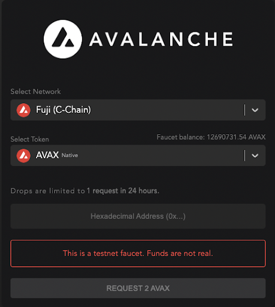

## Creando el Contrato Inteligente

Para crear el contrato inteligente, vamos a usar [Open
Zeppelin](https://docs.openzeppelin.com/). Open Zeppelin es una herramienta clave para
construir contratos inteligentes de forma rápida y sencilla. Aunque solo estamos rascando
la superficie en este tutorial, hay amplia documentación disponible en su sitio web para
que leas cuando quieras construir contratos más complejos.

Open Zeppelin proporciona un [Wizard de Contratos](https://docs.openzeppelin.com/contracts/4.x/wizard) que construirá
contratos ERC. Para evitar cualquier entorno de codificación complejo, usaremos esto para
crear nuestro contrato ERC-721.

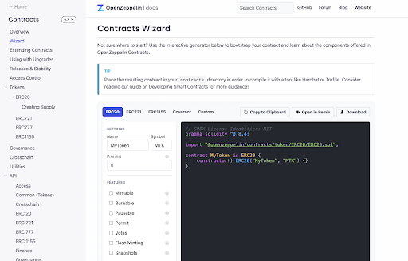

Selecciona `ERC-721` en el Wizard de Contratos para empezar. Esto creará el
contrato en el [lenguaje de programación Solidity](https://docs.soliditylang.org/en/v0.8.15/).

Como puedes ver, el contrato de plantilla está básico. Rellenaremos la
información en el panel izquierdo para auto-popularlo en nuestro contrato. Asegúrate
de cambiar a la pestaña ERC-721 al comenzar para hacer el contrato adecuado.

El Wizard auto-llena un nombre y un símbolo para tu colección de NFT, que modificaremos aquí.
Lo estoy llamando `Fotografía` y dándole el símbolo `FOTO`. Si elegiste tus propios archivos
para usar durante este tutorial, puedes elegir un nombre y un símbolo relevantes para tu colección.

El campo de URI Base que se muestra aquí es la URL de la carpeta de metadatos cargada en
Pinata(por ejemplo, la nuestra es
`https://gateway.pinata.cloud/ipfs/QmYdWxbiwsfsYcW1CYQPgYujAc9FMLPG3fgFcxFskbSsFa`).
Pega eso en el campo de URI Base. Después de que el Wizard agregue nuestras variables a la
plantilla, nuestro contrato debería verse así:

A continuación, querremos marcar las casillas de `Mintable` e `Ids de Incremento Automático`. Esto
llenará una función de mint en nuestra plantilla que manejaría el incremento de los Ids de token en el mint
si tuviéramos más de un NFT en nuestra colección. Aún queremos que asigne automáticamente nuestro 1 NFT,
así que lo marcaremos.

Esto marca automáticamente el botón de `Ownable`, que le da a la función `safeMint` el modificador `onlyOwner`.
Este modificador indica que solo el propietario del contrato inteligente podrá llamar exitosamente a la función.

:::note

Este modificador debe ser eliminado al crear un contrato inteligente para un mint público.
De lo contrario, los usuarios no podrían mintear exitosamente los NFT cuando llamen a la función `safeMint`.
Este tutorial solo maneja la dirección de la billetera del propietario, por lo que se deja allí.

:::

Ahora, nuestro contrato está un poco más poblado:

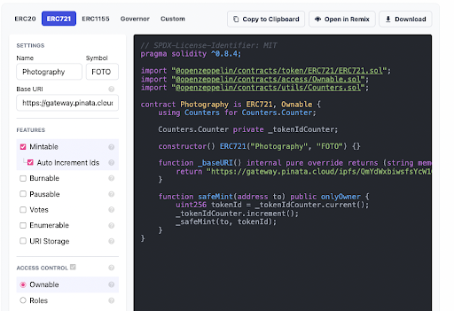

Para este ejemplo simple, no agregaremos ninguna funcionalidad adicional a la función `safeMint`.
Actualmente, mintea un NFT a la dirección especificada en la llamada de la función. No hay costo para mintear
el NFT aparte de la tarifa de gas por la transacción en sí.

Esta función `safeMint` actualmente también funciona como una función de airdrop porque la dirección a la que se mintea
el NFT no necesita ser la del propietario de la función. Esta funcionalidad se vuelve muy útil cuando los propietarios
de colecciones de NFT quieren regalar NFT de forma gratuita fuera de la ventana de minteo normal.

En este punto, nuestro contrato inteligente está listo. En la parte superior, puedes hacer clic en `Abrir en
Remix` para prepararte para desplegar tu contrato inteligente.

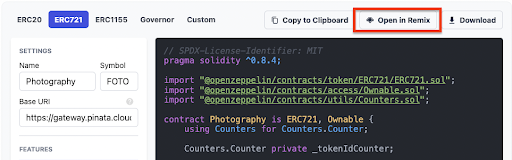

## Desplegando el Contrato Inteligente con Remix

[Remix IDE](https://remix.ethereum.org/) es un compilador de solidity que te permite editar, compilar y desplegar tu contrato inteligente. Esto evitará que necesites descargar otros entornos de programación en esta etapa.

Una vez que hayas importado tu contrato, lo primero que debes hacer es compilarlo. Haz clic en el botón `Compile` en el lado izquierdo. También puedes usar el atajo de teclado `Ctrl / Command + S`.

Una vez completado, obtendrás una marca de verificación verde en la pestaña de la izquierda y verás opciones para Publicar en IPFS o Swarm. Esas no son importantes para nuestro tutorial. A continuación, haz clic en la pestaña inferior del lado izquierdo para pasar a la página de despliegue.

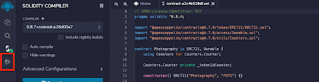

Ahora, necesitamos cambiar el entorno que Remix intentará usar para desplegar el contrato inteligente. Haz clic en el menú desplegable `Environment` y selecciona `Injected web3`.

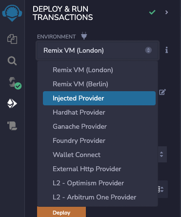

Esto debería pedirte que te conectes con tu cuenta de Core. Una vez conectado, puedes verificar la conexión correcta comprobando que el número de cuenta coincida con tu dirección de Core.

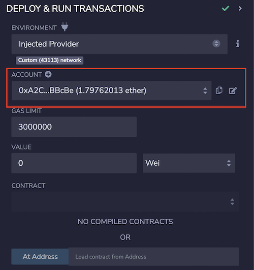

Ahora haz clic en el menú desplegable `Contract` y selecciona el contrato que creaste y compilaste. Debería aparecer con el nombre que le diste en el Asistente de Open Zeppelin.

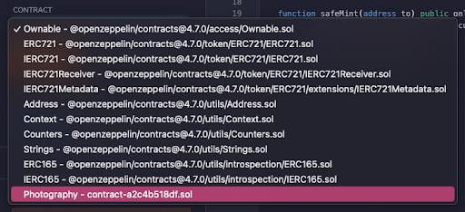

Ahora, haz clic en desplegar. Esto abrirá Core y te pedirá que confirmes la transacción. Haz clic en `Confirm`.

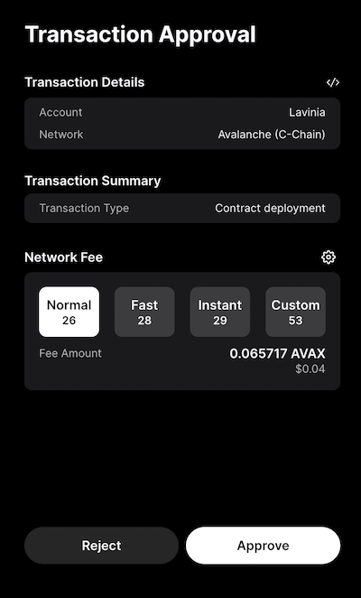

Puede tomar un segundo, pero una vez completado, tu contrato recién desplegado aparecerá debajo del campo `Transactions Recorded`.

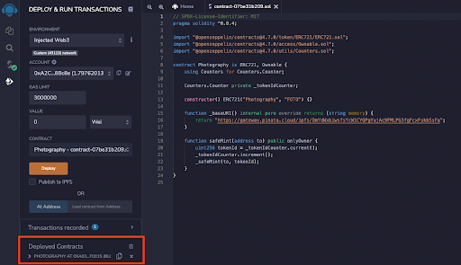

Copia la dirección de tu contrato y abre el [Explorador de la Testnet Snowtrace](https://testnet.snowtrace.io/). Pega la dirección de tu contrato en la barra de búsqueda y haz clic en `Search`.

Ahora verás [la información de tu contrato en Snowtrace](https://testnet.snowtrace.io/address/0xa03e85f4411e37cbaff635975bf38cb2737f0015). La primera transacción que ves debería ser el despliegue del contrato que acabas de hacer en el IDE de Remix.

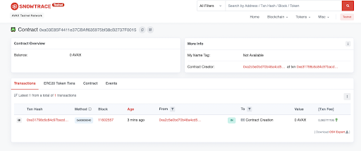

## Creando un NFT

Ahora que has desplegado el contrato, puedes crear el NFT. Vuelve a la pestaña del IDE de Remix y haz clic en tu contrato para expandir su información. Aparecerá una lista de funciones con las que puedes interactuar.

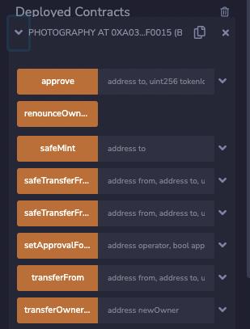

La única función que te interesa es la función `safeMint`. Haz clic en la flecha desplegable de la función para expandir el campo de dirección.

Ahora, copia tu dirección de Core y pégala en este campo de dirección. Esto enviará el NFT a tu dirección cuando se llame a la función de creación. Luego, haz clic en `transact`.

Esto abrirá Core y te pedirá que verifiques la transacción. Haz clic en `Confirm` para crear tu NFT.

Una vez que la transacción se haya confirmado, verás una marca de verificación verde en la terminal en la parte inferior del IDE de Remix.

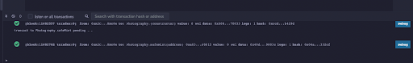

Regresa a la página del explorador de la Testnet Snowtrace para tu contrato y actualízala. Ahora deberías ver una segunda transacción, tu llamada a `safeMint`.

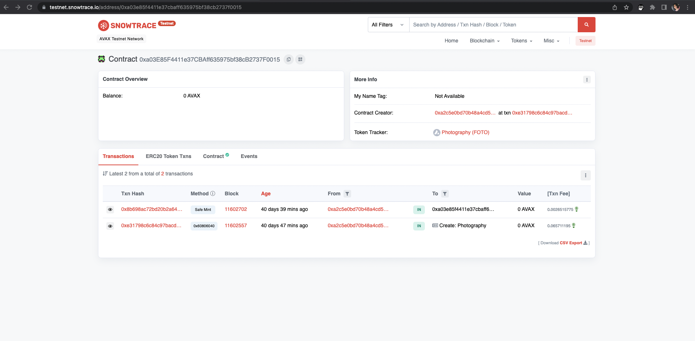

Al hacer clic en el [TX Hash](https://testnet.snowtrace.io/tx/0x8b698ac72bd20b2a640167c5d9bacdcbb3d86fd696eb8cde6f28347f6f99a2c9), ¡verás que tu NFT ha sido creado!

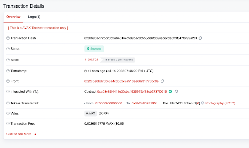

## Mainnet

Todos los pasos anteriores se pueden utilizar en Mainnet, excepto los siguientes cambios:

- Asegúrate de cambiar a la Avalanche C-Chain en Core.
- Asegúrate de tener tokens AVAX en tu cuenta para cubrir los costos de transacción.
- Debes usar la versión de Mainnet de [Snowtrace Explorer](https://snowtrace.io/) para ver las transacciones.
