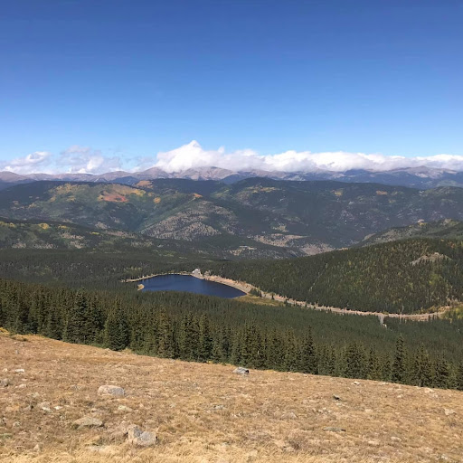
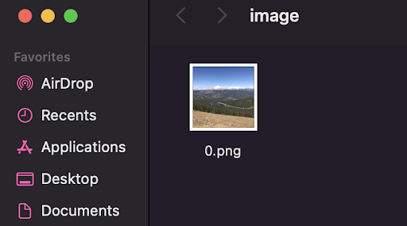
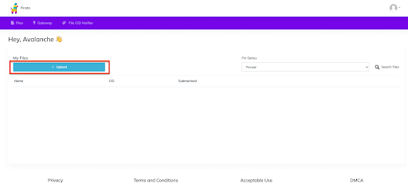
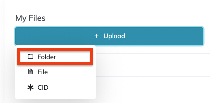
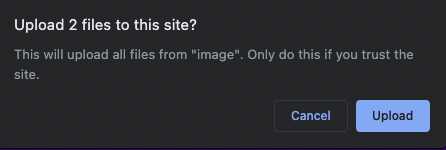
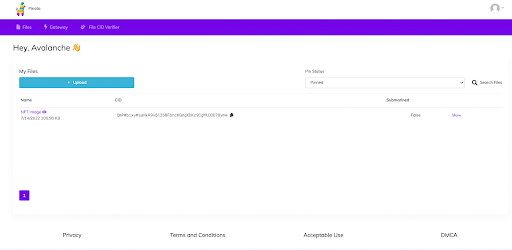
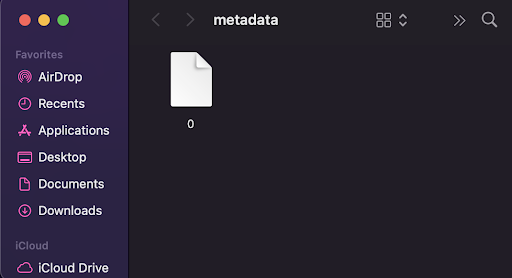
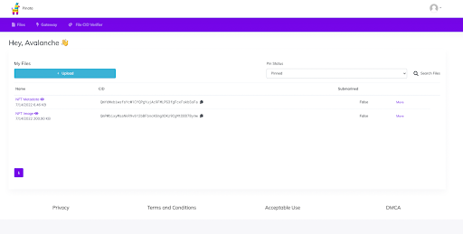

# Preparando archivos NFT para un contrato inteligente ERC721

El primer paso para configurar un contrato inteligente NFT es tener tus archivos NFT listos para usar. En este ejemplo, los archivos se cargarán en [Pinata](https://www.pinata.cloud/), un servicio de anclaje que evita que los archivos sean recolectados por basura en IPFS. Si aún no tienes una cuenta, por favor crea una.

## Preparando las imágenes

Este tutorial creará solo 1 NFT, sin embargo, si estás interesado en crear más, eres más que bienvenido a hacerlo. La imagen que estoy usando está vinculada aquí si quieres usarla.



Coloca tu archivo de imagen en una carpeta en tu computadora. Nombra esta imagen como `0`, para que sea la primera imagen extraída del contrato inteligente. Será el primer (y único) NFT en esta colección, sin embargo, si estás agregando más imágenes, seguirías nombrándolas en orden numérico secuencial. Subirás esta carpeta a Pinata una vez que tus imágenes estén organizadas y nombradas correctamente.

:::info

NOTA: Algunos proyectos comienzan los nombres de archivo con `0` y otros con `1`. Esa elección debe ser consistente con el código del contrato inteligente. Para ser consistentes con [este tutorial ERC-721](/build/dapp/smart-contracts/nfts/deploy-collection.md), nombraremos este archivo como `0`.

:::



Después de iniciar sesión en Pinata, verás tu panel de control. Verás el botón de carga a la izquierda. Haz clic en `Upload` y luego en `Folder`.





Luego seleccionarás la carpeta en la que se encuentra la imagen. Es posible que recibas una ventana emergente de tu navegador confirmando que deseas cargar la carpeta y los archivos en ella. Si es así, confirma haciendo clic en `Upload`.



Luego se te pedirá que nombres la carpeta que has subido. Esto es beneficioso cuando tienes varias series de carpetas cargadas en Pinata y estás tratando de mantenerlas organizadas. Después de darle un nombre, haz clic en `Upload` y espera a que tu archivo se cargue. La cantidad y el tamaño de las imágenes podrían afectar el tiempo de carga, pero si estás comenzando con algo pequeño, solo debería tomar unos segundos.

Una vez que la carga esté completa, verás tu carpeta en tu panel de control.



Si haces clic en el nombre de la carpeta, te redirigirá a la puerta de enlace de Pinata para poder ver tus archivos recién cargados. Si tienes una cuenta de Pinata paga, abrirá la carpeta a través de tu propia puerta de enlace. Tener un plan de pago y una puerta de enlace personal NO es necesario para este tutorial, pero se recomienda tenerlo para tamaños de colección más grandes y alojar varias carpetas.

Si haces clic derecho en la imagen, puedes copiar la URL de la imagen. Esta URL es importante. Cópiala para usarla en el siguiente paso mientras configuramos los metadatos. Para este ejemplo, mi URL es `https://gateway.pinata.cloud/ipfs/QmPWbixyMsaNkR9v612bBFbncKGmgXDKz9CgMtDDD7Bymw/0.png`

## Preparando los metadatos

Ahora que tenemos la imagen cargada y su URL, podemos crear el archivo de metadatos correspondiente.

Dado que este NFT va a ser un ERC-721, sabemos que podemos usar estándares de metadatos que se encuentran a menudo en mercados como [Joepegs.com](https://joepegs.com). El archivo .json a continuación es un ejemplo de cómo debería verse la [estructura de metadatos](https://docs.opensea.io/docs/metadata-standards#metadata-structure).

```json
{
  "name": "",
  "tokenId": 0,
  "image": "",
  "description": "",
  "attributes": []
}
```

Ahora, vamos a llenar los valores en el archivo de metadatos. Puedes elegir cualquier `name` y `description` que desees.

El `tokenId` aquí será `0` para que corresponda a la imagen que acabamos de cargar. Si estás cargando varios archivos, esto debe incrementarse en cada archivo.

El enlace `image` es la URL que guardamos en el último paso de la sección anterior. Pega ese enlace aquí para que el contrato inteligente sepa dónde encontrar el archivo de imagen para tu NFT. Si estás cargando varios archivos, el final de la URL (la imagen específica) debe incrementarse en cada archivo.

El campo `attributes` no es tan importante aquí, pero si estuvieras cargando NFT con varias capas, los atributos serían la información de esas capas específicas. Esto se usa a menudo al calcular la rareza de los NFT para poder clasificarlos por qué tan frecuentemente aparecen sus capas en toda la colección. Se borrará en este tutorial.

A continuación se muestra un ejemplo de cómo llenar los campos en el archivo de metadatos.

```json
{
  "name": "Fotografía Genial",
  "tokenId": 0,
  "image": "https://gateway.pinata.cloud/ipfs/QmPWbixyMsaNkR9v612bBFbncKGmgXDKz9CgMtDDD7Bymw/0.png",
  "description": "Una imagen genial"
}
```

Cuando guardes este archivo, quieres que comparta el mismo nombre que la imagen a la que corresponde. En este caso, es 0.

Una vez que el archivo de metadatos se haya cargado en Pinata, en realidad no se necesitará la extensión de archivo. Buscará el archivo como un directorio y podrá extraer su información desde allí. Para eliminar la extensión de archivo, sigue estos pasos para un entorno [Mac](https://support.apple.com/guide/mac-help/show-or-hide-filename-extensions-on-mac-mchlp2304/mac), o estos para un entorno [Windows](https://www.techwalla.com/articles/how-to-remove-file-extensions).

Ahora que se ha eliminado la extensión de archivo, colócalo en otra carpeta como lo hiciste con el archivo de imagen. Deben ser CARPETAS SEPARADAS.



Ahora repetirás el proceso de carga de la carpeta para agregar los metadatos a Pinata. Sigue los mismos pasos que antes. Una vez completado, tendrás ambas carpetas disponibles en tu panel de control.



Haz clic en la carpeta de metadatos para dirigirte a la puerta de enlace de IPFS y guarda la URL. Esta URL será tu URL base y no necesitará los enlaces directos a los archivos. El contrato inteligente agregará la información de archivo necesaria para cada NFT según sea necesario. Por ejemplo, mi URL es `https://gateway.pinata.cloud/ipfs/QmYdWxbiwsfsYcW1CYQPgYujAc9FMLPG3fgFcxFskbSsFa`.

Ahora que los archivos de imagen y metadatos están listos, podemos prepararnos para implementar un contrato inteligente siguiendo este [tutorial ERC-721](/build/dapp/smart-contracts/nfts/deploy-collection.md).