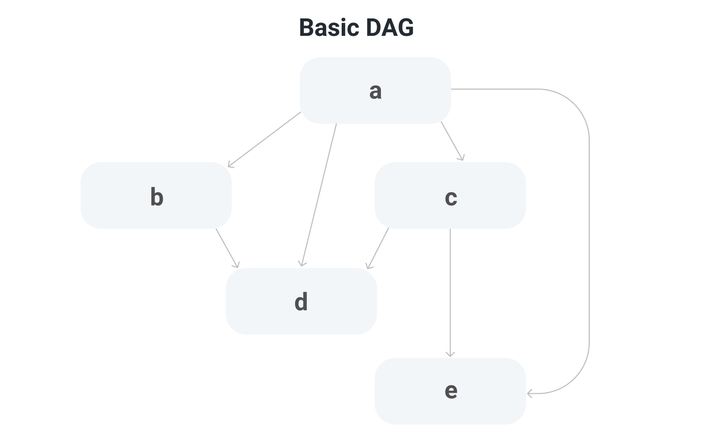
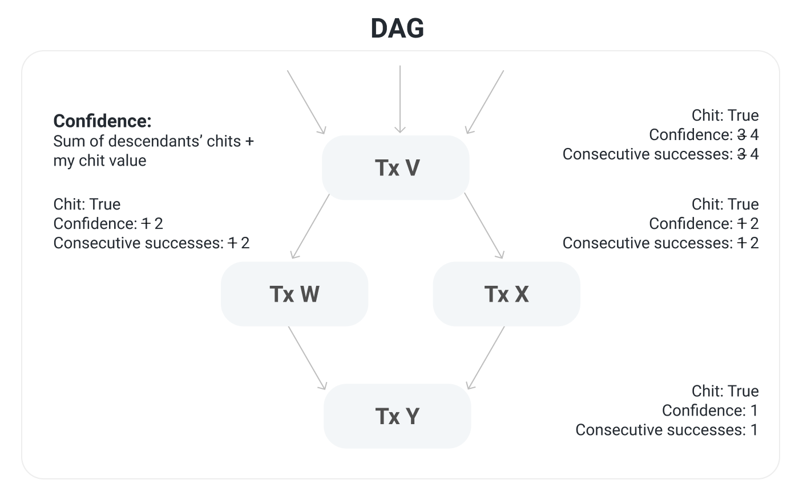
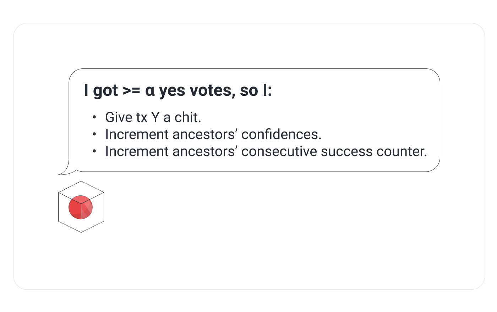
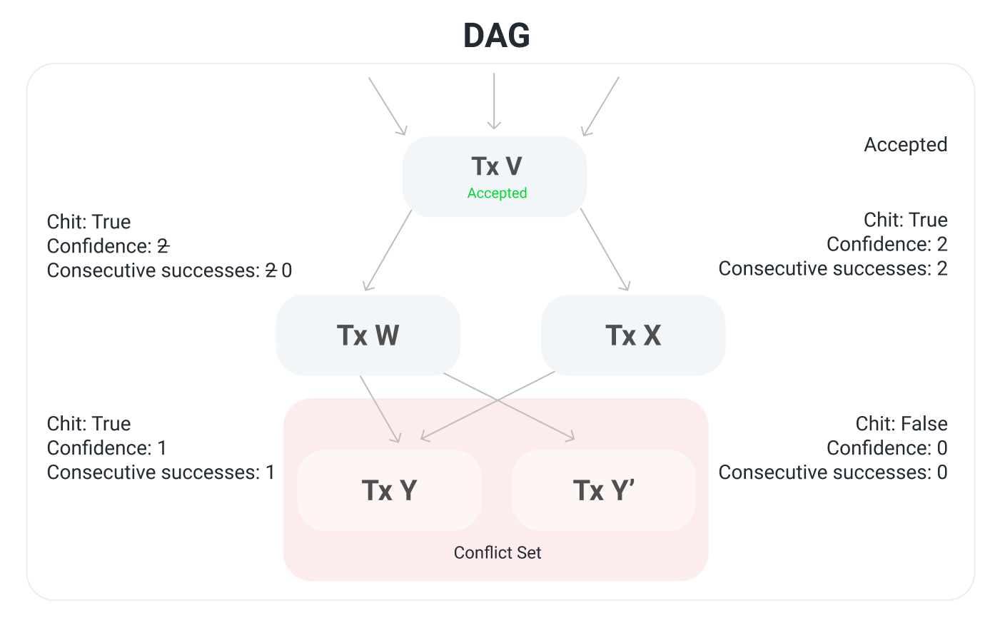
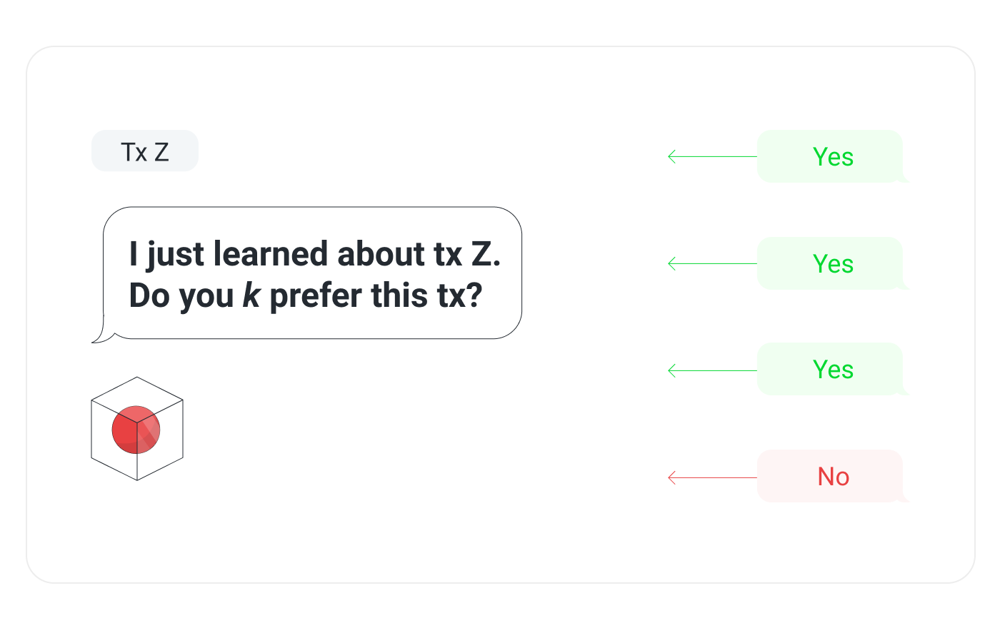

# Consenso de Avalanche

El consenso es la tarea de conseguir que un grupo de computadoras llegue a un acuerdo sobre una decisión. Los ordenadores pueden llegar a un consenso siguiendo un conjunto de medidas llamadas protocolo de consenso. Avalanche es un nuevo protocolo de consenso que es escalable, robusto, y descentralizado. Tiene baja latencia y alta producción. Es eficiente en energía y no requiere hardware especial de computadora. Se realiza bien en condiciones contradictorias y es resiliente a "ataques del 51%". Este documento explica el protocolo de consenso de Avalanche. El blanqueador está [aquí.](https://www.avalabs.org/whitepapers)

## Video



## Intusión

Primero, desarrollemos alguna intuición sobre el protocolo. Imagina una habitación llena de gente tratando de acordar lo que hay que conseguir para el almuerzo. Supongamos que es una opción binaria entre pizza y barbacoa. Algunas personas inicialmente prefieren pizza, mientras que otras inicialmente prefieren barbacoa. Sin embargo, en última instancia, el objetivo de todos es lograr **consenso**.

Todos preguntan a un subconjunto aleatorio de la gente en la habitación cuál es su preferencia para el almuerzo. Si más de la mitad dicen pizza, la persona piensa: "Bien, parece que las cosas se inclinan hacia la pizza. Prefiero la pizza ahora." Es decir, adoptan la _preferencia_ de la mayoría. De manera similar, si la mayoría dice barbacoa, la persona adopta la barbacoa como su preferencia.

Todos repiten este proceso. Cada ronda, cada vez más personas tienen la misma preferencia. Esto se debe a que cuanto más personas prefieren una opción, más probable es que alguien reciba una respuesta mayoritaria y adopte esa opción como su preferencia. Después de suficientes rondas, llegan a un consenso y deciden sobre una opción, que todos prefieren.

## Bola de nieve

La intuición anterior describe el algoritmo de bola de nieve, que es un bloque de construcción del consenso de Avalanche. Revisemos el algoritmo de Bola de nieve.

### Parámetros

* _n_: número de participantes
* _k_ \(tamaño de muestra\): entre 1 y _n_
* α \(tamaño quorum): entre 1 y _k_
* β \(umbral de decisión\): >= 1

### Algoritmo

```text
preference := pizza
consecutiveSuccesses := 0
while not decided:
  ask k random people their preference
  if >= α give the same response:
    preference := response with >= α
    if preference == old preference:
      consecutiveSuccesses++
    else:
      consecutiveSuccesses = 1
  else:
    consecutiveSuccesses = 0
  if consecutiveSuccesses > β:
    decide(preference)
```

### Algoritmo Explicado

Todos tienen una preferencia inicial por pizza o barbacoa. Hasta que alguien haya _decidido_, preguntan a la gente _k_ \(el tamaño de la muestra) y les preguntan lo que prefieren. Si α o más personas dan la misma respuesta, esa respuesta se adopta _como_ nueva preferencia. Si la nueva preferencia es la misma que la antigua preferencia, el contador `sucesivos de éxitos` se incrementa. Si la nueva preferencia es diferente entonces la antigua preferencia, las `consecutiveSucccesses` consecutivas contrarias a `1`. Si no hay respuesta obtiene un quórum \(una mayoría α de la misma respuesta\), entonces el contador `sucesivos de` Success se establece en `0`.

Todos repiten esto hasta que obtengan un quórum para la misma respuesta β veces seguidas. Si una persona decide pizza, entonces cada otra persona que siga el protocolo eventualmente también decidirá sobre pizza.

Los cambios aleatorios en la preferencia, causados por el muestreo aleatorio, causan una preferencia de red por una elección, que engendra más preferencia de red por esa opción hasta que se vuelva irreversible y luego los nodos pueden decidir.

 Para obtener una gran visualización, echa un vistazo a [esta demo](https://tedyin.com/archive/snow-bft-demo/#/snow) del Cofundador de Ava Labs' Ted Yin. 

En nuestro ejemplo, hay una opción binaria entre pizza o barbacoa, pero Snowball puede adaptarse para lograr un consenso sobre decisiones con muchas opciones posibles.

Los umbrales de vida y seguridad son parametrizables. A medida que el tamaño del quórum, α, aumenta, el umbral de seguridad aumenta, y el umbral de la vida disminuye. Esto significa que la red puede tolerar más nodos byzantine \(deliberadamente incorrectos, maliciosos\) y permanecer seguros, lo que significa que todos los nodos eventualmente estarán de acuerdo si algo es aceptado o rechazado. El umbral de la vida es el número de participantes maliciosos que pueden tolerarse antes de que el protocolo no pueda progresar.

Estos valores, que son constantes, son bastante pequeños en la Red Avalanche. El tamaño de la muestra, _k_, es `20`. Así que cuando un nodo pregunta a un grupo de nodos su opinión, solo pregunta `20` nodos de toda la red. El tamaño del quórum, α, es `14`. Así que si `14` o más nodos dan la misma respuesta, esa respuesta se adopta como preferencia del nodo de consulta. El umbral de decisión, β, es `20`. Un nodo decide sobre la elección después de recibir `20` respuestas consecutivas de quórum \(α mayoría\).

La bola de nieve es muy escalable ya que el número de nodos en la red, _n_, aumenta. Independientemente del número de participantes en la red, el número de mensajes de consenso enviados sigue siendo el mismo porque en una consulta determinada, un nodo solo pregunta `20` nodos, incluso si hay miles de nodos en la red.

## DAGs **\(Gráficos****** **Acíclicos** Directos\)

Ahora vamos a introducir una estructura de datos llamada DAG o Gráfica Acíclica Directa. Un DAG da un **pedido parcial** de decisiones. Por ejemplo, echa un vistazo a la DAG en este diagrama:



**a** es antes **de que** b. **b** se encuentre antes de **que** d. **c c****** sea e. Transitivamente, podemos decir que **un** viene antes **e**. Sin embargo, ya que esto es un orden parcial: para algunos elementos, el pedido no está definido. Por ejemplo, tanto **b** como **c** están después de **una** pero no hay noción de si **b** es antes o después de **c**.

Dos conceptos relacionados con DAG adicionales son **antepasados** y **descendientes**. Los antepasados son cualquier nodos en el DAG a los que puedes dibujar una línea hasta ahora. Por ejemplo, los antepasados de **d** son **a**, **b**, y **c**. Los antepasados **de** **e** son **a** y c. Los descendientes son lo opuesto a los antepasados. Los descendientes de **a** son **b**, **c**, **d**, y **e**. El descendiente de **b** es **d**.

Tanto Bitcoin como Ethereum, por ejemplo, tienen una cadena lineal donde cada bloque tiene un padre y un hijo. Avalanche utiliza un DAG para almacenar datos en lugar de una cadena lineal. Cada elemento del DAG puede tener múltiples padres. La relación entre padres e hijos en el DAG no implica una dependencia a nivel de aplicación.

En un protocolo de consenso, el nombre del juego es prevenir la inclusión de **transacciones conflictivas** en el DAG. Los conflictos están definidos por la aplicación. Diferentes aplicaciones tendrán diferentes nociones sobre lo que significa para dos transacciones en conflicto. Por ejemplo, en un sistema de pago P2P, las transacciones que consumen el mismo UTXO [\(Salida de Transacción no gastada\)](https://en.wikipedia.org/wiki/Unspent_transaction_output) podrían conflicto. En Avalanche todas las transacciones pertenecen a un **conjunto** de conflictos que consiste en transacciones conflictivas. Solo una transacción en un conjunto de conflictos puede ser incluida en el DAG. Cada nodo **prefiere** una transacción en un conjunto de conflictos.

## Ejemplo de trabajo

Supongamos que tenemos una red Avalanche que funciona con los siguientes parámetros. El tamaño de la muestra, _k_, es `4`. El tamaño del quorum, α, es `3`. El número de éxito consecutivo, β, es `4`.


Un nodo se entera de una nueva transacción **Y**. Se pregunta la red basada en los parámetros anteriores. Se pregunta _k_ \(`4`\) validadores y pregunta, "¿Prefieres esta transacción?" Se recuperan las respuestas: tres de ellas dicen **que sí** y uno de ellos dice **que no**. El tamaño del quorum, α, es `3` por lo que hay una mayoría α \(quorum\) de respuestas sí. Ahora el nodo actualiza su DAG.



Si un nodo recibe una respuesta de mayoría α para una transacción, entonces usted da a esa transacción un **chit**, que es un booleano que dice: "Cuando pregunté la red sobre esta transacción, una mayoría α dijo que la preferían". En nuestro ejemplo, la transacción Y recibe un chit.

Existe también una noción de **confianza**, que es la suma de la cordura de un vértice más la suma de los tramos de sus descendientes. Por ejemplo, la transacción **V** tiene un chit. También tiene tres descendientes que tienen un chit para que su confianza se incremente de `3` a `4`. De manera similar, las transacciones **W** y **X** ambos tienen un chit y ambos tienen un descendiente con un corcho, por lo que cada uno tiene confianza `2`. Transacción Y tiene confianza `1`.

**Los éxitos consecutivos** son los mismos que en Snowball. Es el número de veces que una transacción, o un descendiente de la transacción, recibió una respuesta exitosa de consulta mayoritaria α. Anteriormente, la transacción V tuvo `3` éxitos consecutivos, en sí misma y sus dos hijos, y ahora tiene `4` éxitos consecutivos con la transacción Y. Del mismo modo para las transacciones W y X.



En este ejemplo el umbral de aceptación, β, es `4`. Transacción V tiene `4` éxito consecutivo así que es **aceptado**. Este nodo está seguro de que todos los demás nodos correctos eventualmente aceptarán esta transacción.


Ahora supongamos que el nodo aprende sobre la transacción **Y'** que entra en conflicto con la transacción Y. Sigue los mismos pasos que antes y submuestras _k_ \(`4`\) validadores y pregunta si prefieren la transacción Y'. En este caso, dos de ellos dicen que prefieren Y' y dos de ellos dicen que no prefieren Y'. Esta vez no hay respuesta de la mayoría α y el DAG se actualiza en consecuencia.



Las transacciones Y y y Y' están en un conjunto de conflictos; solo una de ellas puede finalmente ser aceptada. La transacción Y' no recibe un chit porque no recibió una respuesta de la mayoría α. Tiene confianza `0` porque no tiene un chit y no tiene ningún descendiente con un traje. Tiene `0` éxitos consecutivos porque la consulta anterior no recibió una respuesta de mayoría α. El contador de éxito consecutivo de W va de `2` a `0`. Su confianza sigue siendo `2`.

Cuando se pregunta a un nodo si prefiere una transacción determinada, responde sí si si esa transacción tiene la mayor confianza de cualquier transacción en el conjunto de conflictos de la transacción. En este ejemplo, la transacción Y tiene confianza `1` y la transacción Y' tiene confianza `0` por lo que el nodo prefiere la transacción Y a la transacción Y'.



Ahora el nodo aprende sobre una nueva transacción, **Z**, y hace lo mismo que antes. Pregunta nodos _k_, vuelve a responder a la mayoría α y actualiza el DAG.


Transacción Z recibe un chit. También tiene una confianza de `1` y `1` éxito consecutivo. Los antepasados de procesamiento también se actualizan. Ninguna transacción tiene `4` éxitos consecutivos así que no se aceptan antepasados.

## Vértices

Todo lo discutido hasta este punto es cómo Avalanche es descrito en [el blanqueador Avalanche](https://assets-global.website-files.com/5d80307810123f5ffbb34d6e/6009805681b416f34dcae012_Avalanche%20Consensus%20Whitepaper.pdf). La implementación del protocolo de consenso de Avalanche por Ava Labs \(es decir, en AvalancheGo\) tiene algunas optimizaciones para la latencia y el rendimiento. La optimización más importante es el uso de **vértices**. Un vértice es como un bloque en una cadena de bloqueo lineal. Contiene los hashes de sus padres, y contiene una lista de transacciones. Los vértices permiten que las transacciones sean loteadas y votadas en grupos en lugar de uno por uno. El DAG está compuesto por vértices, y el protocolo funciona muy similar a cómo se describe arriba.

Si un nodo recibe un voto por un vértice, cuenta como voto para todas las transacciones en un vértice, y los votos se aplican transitivamente hacia arriba. Se acepta un vértice cuando todas las transacciones que están en él son aceptadas. Si un vértice contiene una transacción rechazada, entonces se rechaza y todos sus descendientes son rechazados. Si se rechaza un vértice, cualquier transacción válida se vuelve a emitir en un nuevo vértice que no sea el hijo de un vértice rechazado. Nuevos vértices se adjuntan a vértices preferidos.

## Finalidad

El consenso de Avalanche es probablemente seguro hasta un umbral de seguridad. Es decir, la probabilidad de que un nodo correcto acepte una transacción que otro nodo correcto rechaza puede ser hecho arbitrariamente bajo mediante el ajuste de los parámetros del sistema. En el protocolo de consenso de Nakamoto \(como se utiliza en Bitcoin y Ethereum, por ejemplo\), un bloque puede ser incluido en la cadena pero luego ser eliminado y no termina en la cadena canónica. Esto significa esperar una hora para la liquidación de las transacciones. En Avalanche, la aceptación/rechazo son **definitivos e irreversibles** y tardan unos segundos.

## Optimizaciones

No es eficiente que los nodos simplemente pregunten: "¿Prefieres este vértice?" cuando pregunten a los validadores. En la implementación de Ava Labs, durante una consulta un nodo pregunta, "Dado que este vértice existe, ¿qué vértices prefieres?" En lugar de volver a un sí/no binario, el nodo recibe el conjunto de vértex preferido del otro nodo.

Los nodos no solo preguntan al escuchar una nueva transacción. Ellos preguntan repetidamente hasta que no haya vértices virtuosos procesamiento. Un vértice virtuoso es uno que no tiene conflictos.

Los nodos no necesitan esperar hasta que reciban todas las respuestas de la consulta _k_ antes de registrar el resultado de una encuesta. Si ninguna transacción puede obtener una mayoría α entonces no hay necesidad de esperar el resto de las respuestas.

## Validadores

Si fuera libre de convertirse en un validador en la red Avalanche, eso sería problemático porque un actor malicioso podría comenzar muchos, muchos nodos que se cuestionarían con mucha frecuencia. El actor malicioso podría hacer que el nodo actúe mal y causar un fallo de seguridad o de vida. Los validadores, los nodos que se cuestionan como parte del consenso, tienen influencia sobre la red. Tienen que pagar por esa influencia con valor real para evitar este tipo de relleno de votación. Esta idea de utilizar el valor del mundo real para comprar influencia sobre la red se llama Prueba de Stake.

Para convertirse en un validador, un nodo debe **enlazar** \(hoguera\) algo valioso \(**AVAX**\). Cuanto más se une un nodo, más a menudo que el nodo es cuestionado por otros nodos. Cuando un nodo muestra la red, no es uniformemente aleatorio. Más bien, se pondera por la cantidad de la estaca. Los nodos están incentivados a ser validadores porque reciben una recompensa si, mientras validan, son lo suficientemente correctos y responsivos.

Avalanche no tiene desplomes. Si un nodo no se comporta bien mientras validada, como dar respuestas incorrectas o quizás no responder en absoluto, su juego todavía se devuelve en su conjunto, pero sin recompensa. Mientras una porción suficiente de la AVAX unida sea sostenida por nodos correctos, entonces la red es segura, y vive para transacciones virtuosas.

## Grandes ideas

Dos grandes ideas en Avalanche son **submuestreo** y **votación transitiva**. El submuestreo tiene un mensaje bajo overhead. No importa si hay veinte validadores o dos mil validadores; el número de mensajes de consenso que un nodo envía durante una consulta sigue siendo constante.


La votación transitoria, donde el voto por un vértice es un voto por todos sus antepasados, ayuda con el rendimiento de las transacciones. Cada voto es en realidad muchos votos en uno. Por ejemplo, en el diagrama anterior, si un nodo obtiene un voto por el vértice **D**, eso implica un voto por todos sus antepasados; un voto por **D** es también un voto por **A**, **B** y **C**.

## Terminos sueltos

Las transacciones son creadas por usuarios que llaman una API en el nodo completo de [AvalancheGo](https://github.com/ava-labs/avalanchego) o o las crean utilizando una biblioteca como [AvalancheJS](https://github.com/ava-labs/avalanchejs). Se crean vértices cuando los nodos de las transacciones entrantes por lotes juntos o cuando las transacciones aceptadas de un vértice rechazado se reexpiden y se añaden al DAG. Los padres de un vértice son elegidos de la frontera virtuosa, que son los nodos en la punta del DAG sin conflictos. Es importante construir sobre vértices virtuosos porque si construimos sobre vértices no virtuosos habría una mayor posibilidad de que el nodo fuera rechazado lo que significa que hay una mayor posibilidad de que sus antepasados sean rechazados y nosotros haríamos menos progresos.

## Otras observaciones

No se garantiza que las transacciones contradictorias sean vividas. Eso no es realmente un problema porque si quieres que tu transacción sea en vivo, entonces no deberías emitir una transacción en conflicto.

Avalanche también trabaja para cadenas lineales. El protocolo es en gran medida el mismo que antes, pero cada vértice tiene solo un padre. Esto da un pedido total de vértices. Esto es útil para ciertas aplicaciones donde se necesita saber si una transacción vino antes de otra transacción, como con contratos inteligentes. Snowman es el nombre de la implementación de Ava Labs del protocolo de consenso de Avalanche para cadenas lineales.

Si no hay transacciones indecisos, el protocolo de consenso de Avalanche _quiesces_. Es decir, no hace nada si no hay trabajo que hacer. Avalanche es más sostenible que la prueba de trabajo donde los nodos necesitan hacer trabajo constantemente.

Avalanche no tiene líder. Cualquier nodo puede proponer una transacción y cualquier nodo que haya tocado AVAX puede votar sobre cada transacción, lo que hace que la red sea más robusta y descentralizada.

## ¿Por Qué Nos Importa?

Avalanche es un motor de consenso general. No importa qué tipo de aplicación se ponga en la parte superior de ella, el protocolo permite el desacoplamiento de la capa de aplicación de la capa de consenso. Si estás construyendo una Dapp en Avalanche, solo tienes que definir algunas cosas, como cómo se definen los conflictos y qué hay en una transacción. No tienes que preocuparte por cómo llegan los nodos a un acuerdo. El protocolo de consenso es una caja negra que pone algo en él y vuelve como aceptado o rechazado.

Avalanche se puede utilizar para todo tipo de aplicaciones, no solo redes de pago P2P. La Red Primaria de Avalanche tiene una instancia de la Máquina Virtual Ethereum, que es compatible con las actuales Dapps de Ethereum y dev tooling. El protocolo de consenso de Ethereum ha sido sustituido por consenso de Avalanche para permitir una latencia de bloques inferiores y un mayor rendimiento.

Avalanche es muy performante. Puede procesar miles de transacciones por segundo con una o dos segundos de aceptación latencia.

## Resumen

El consenso de Avalanche es un avance radical en los sistemas distribuidos. Representa un salto hacia adelante como los protocolos de consenso clásico y Nakamoto que se presentaron ante él.Ahora que usted tiene una mejor comprensión de cómo funciona, echa un vistazo a otra [documentación](https://docs.avax.network) para construir Dapps e instrumentos financieros cambiantes de juego en Avalanche.

