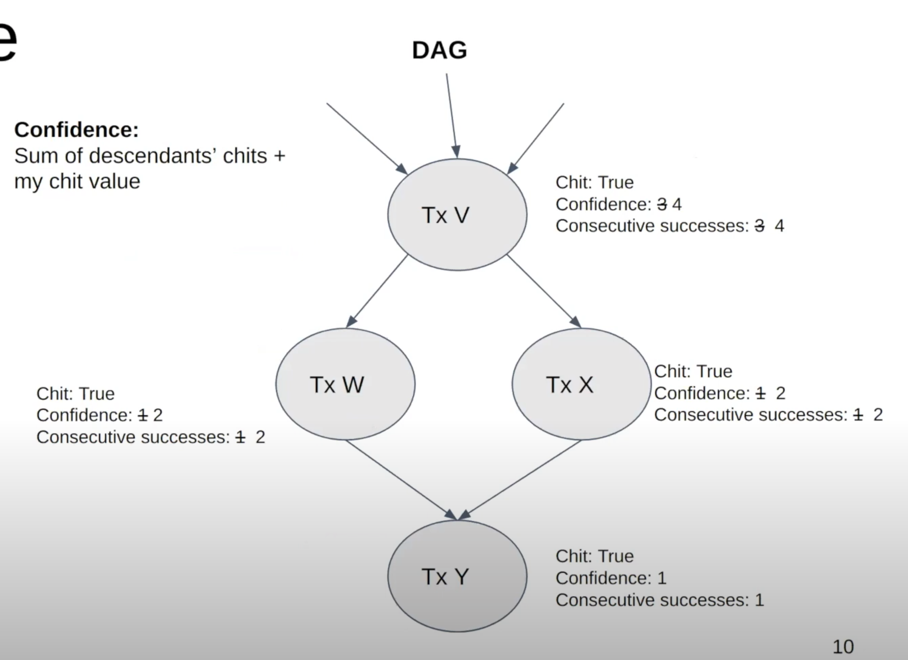

# Avalanche Consensus



## Consensus

Consensus is the process by which a series of independent validators come in to agreement on a decision. It's a rich field of computer science which goes back several decades. There have been 3 major paradigms in consensus, first was classical consensus, next was Nakamoto consensus which was introduced by Bitcoin, and we believe that Avalanche Consensus represents a third paradigm.

Avalanche consensus is scalable, robust and highly decentralized. It has low latency and high throughput as well as being lightweight and green. It also performs well in adversarial conditions such as being resilient to 51% attacks.

Avalanche has two consensus engines on launch&mdash;Avalanche: A DAG-optimized consensus protocol which has high-throughput, is parallelizable, and simple to prune. Snowman: A chain-optimized consensus protocol which has high-throughput, is totally-ordered, and great for smart contracts.

## Intuition

First let's develop an intution around how the protocol works. Imagine that you're in a room full of people and you're trying to decide what to get for lunch. It's a binary decision between pizza and barbecue. Different people may start with alternative preferences, maybe some want pizza and others want barbecue, but the ultimate goal is to get everyone on the same page and to arrive at **consensus**. It's a democratic process with no leader that can affect the decision.

Each person begins asking a random subset of the other people what their preference is and depending on the more popular of the two options, pizza or barbecue, adjusts their own preference. For example, let's say your preference is pizza. You ask a random group their preference and they all say pizza, so your preference remains the same. You do this a second time and most of the people say pizza, so your preference still remains the same. This process is repeated many times and eventually you can be confident that consensus will be reached, around pizza in our example.

## Snowball

With that intuition now let's be more specific. First, let's review the Snowball algorithm.

### Parameters

* _n_: number of participants
* _k_ (sample size): between 1 and _n_
* α (quorum size): between 1 and _k_
* β (decision threshold): >= 1

### Algorithm

```text
preference := pizza
consecutiveSuccesses := 0
while not decided:
  ask k random people their preference
  if >= α give the same response:
    preference := response with >= α
    if preference == old preference:
      consecutiveSuccesses++
    else:
      consecutiveSuccesses = 1
  else:
    consecutiveSuccesses = 0
  if consecutiveSuccesses > β:
    decide(preference) 
```

To start, you have some preference, maybe pizza or barbecue. Everyone else is following the same algorithm, though they may decide slightly before or after you but you arrive at your decision independent of everyone else. Until you've decided, you approach a handful of people, we'll call it _k_ or the sample size, in our example we'll say 10, and you ask them what they prefer. If a sufficient portion, which we call α, or quorum size, of them give the same response then you adopt the preference that got the majority response.

If you already preferred that option then you're going to increment a `consecutiveSuccesses` counter. If the α majority response was different than your previous preference, you preferred barbecue and asked a bunch of people who all responded pizza, then you're going to shift your preference to pizza and set the `consecutiveSucccesses` counter to `1`.

If you're not able to get a quorum, an α majority, of the same response then you set the `consecutiveSuccesses` counter to `0`. You do this over and over with everyone else following the same algorithm. If you keep getting back the same α majority response when you subsample the group then after a certain point you can be confident that everyone else prefers the the same thing. If you decide pizza, then every other "correct" person will also choose pizza and not barbecue.

Random noise in the network, from the random sampling, yields some network preference for one choice, which begets more network preference for that choice until it becomes irreversible and then the nodes can decide.


For a great visualization of the Snowball protocol check out [this demo](https://tedyin.com/archive/snow-bft-demo/#/snow) from Ava Labs CTO Ted Yin.


Snowball is the building block of Avalanche consensus. It generalizes to multi-value (non-binary) decisions. In our previous example we had a binary choice, pizza or barbecue, but we can also decide from multi-value choices of not only 2 things but many things.

The liveness and safety thresholds are parameterizable based on the parameters that you set. As you increase the quorum size, α, the safety threshold increases and the liveness threshold decreases. This means the network can tolerate more byzantine nodes and remain safe, meaning all nodes will eventually agree on if something is accepted or not. The liveness threshold is the amount of malicious participants that can be tolerated and still make progress towards achieving a decision.

These values, which are constants, are actually quite small currently on the Avalanche Network. The sample size, _k_, is `20`. So when you ask a group of nodes their opinion you're only querying `20`. The quorum size, α, is `14`. So if `14` or more nodes give you the same response then you adopt that as your preference. The decision threshold, β, is `20`. You need `20` agreeing consecutive responses in order to decide on something.

Snowball is very scalable as the number of nodes on the network, _n_, increases. Regardless of the number of participants in the network, the number of consensus messages that you need to send remains the same. Because you're only going to query `20` nodes at a time. It doesn't matter if there are `20` nodes or `2000` nodes in the network, you're going to send the same amount of messages.

## DAGs (**D**irected **A**cyclic **G**raphs)

Now let's introduce a data structure called a DAG or Directed Acyclic Graph. A DAG gives a **partial ordering** of decisions. For example check out the DAG in this diagram:


**a** is before **b**. **b** is before **d**. **d** is before **e**. So transitively we can say that **a** comes before **e**. However, since this is a partial ordering, for some items the ordering is not defined. For example both **b** and **c** are after **a** but there is no notion of whether **b** is before or after **c**.

Two additional DAG related concepts are **ancestors** and **decendents**. Ancestors are any nodes in the DAG which you can draw a line up to. For example the ancestors of **d** are **a**, **b**, and **c**. The ancestors of **e** are **a**, **b**, **c**, and **d**. Decendents are opposite of ancestors. The decendents of **a** are **b**, **c**, **d**, and **e**. The decendents of **b** are **d** and **e**.

Avalanche uses a DAG to store data rather than a linear chain. Both Bitcoin and Ethereum, for example, have a linear chain where every block has one parent and once decendent. Avalanche has a DAG with each element potentially having multiple parents. A common source of confusion is the parent-child relationship in the DAG does not imply an application level dependency. For example, if our graph were a P2P payment system, **b** doesn't necessarily spend a UTXO created in **a**.

With Avalanche consensus, the name of the game is to prevent the inclusion of **conflicting transactions** into the DAG. Conflicts are application-defined. Different applications will have different notions about what it means for two transactions to conflict. For example, in a P2P payment system, transactions that consume the same UTXO would conflict. In Avalanche every transaction belongs to a **conflict set** which consists of conflicting transactions. Only one transaction in a conflict set can be included in the DAG. Each node **prefers** one transaction in a conflict set.

## Working Example

Suppose we have an Avalanche network running with the following parameters. The sample size, _k_, is `4`. The quorum size, α majority response, is `14`. The number of consecutive success, β, is `4`.


Here we have a happy little node which finds out about a new transaction **Y**. It queries the network based on the above parameters. It queries _k_, `4` in this example, validators and says "Do you prefer this transaction?" It gets back responses&mdash;three of them say **yes** and one of them says **no**. The quorum size, α, is `3` so we have an α majority of yes responses. Now we're going to update this example DAG.



If you get an α majority response for a transaction then you give that transaction a **chit** which is a boolean that says "when I queried the network about this transaction an α majority said that they preferred it." In our example, we give Transaction Y a chit.

There is also a notion of **confidence**, which is the sum of your chit plus the sum of all your decendent's chits. For example, transaction **V** has a chit. It also has three decendents which have a chit so it's confidence is increased from `3` to `4`. Similary for transactions **W** and **X**. They both have a chit and they both have a decendent with a chit so they each have confidence `2`. Transaction Y has confidence `1`.

**Consecutive successes** is the same as in Snowball. It's the number of times that this transaction, or a decendent of this transaction, received a successful majority query. So previously transaction V had `3` consecutive successes, itself and it's two children, and now it has `4` consecutive successes with transaction Y. Similarly for transactions W and X.


In this example we have the the number of consecutive success, β, set to `4` and now transaction V has `4` consecutive success so it's **accepted**.


Now let's say the node learns about transaction **Y'** which conflicts with transaction Y. We follow the same steps as before and subsample α, or `4`, validators on the network and we ask if they prefer transaction Y'. In this case, two of them say that they prefer Y' and two of them say that they do not prefer Y'. This time we didn't get an α majority response, so we update our DAG accordingly.


Transactions Y and Y' are in a conflict set where only one of them can ultimately get accepted. Transaction Y' doesn't get a chit because it didn't get an α majority response. It has confidence `0` because it doesn't have a chit and it doesn't have any decendents with a chit. It has `0` consecutive successes because the previous query didn't get an α majority response. We also update all the processing ancestor transactions, which in this case is W. It's consecutive successes goes from `2` to `0`. The confidence is still `2`.

Confidence is used when a node is queried. It in turn says that it prefers a transaction if there is no other transaction in it's conflict set with a higher confidence. In our example transaction Y has confidence `1` and transaction Y' has confidence `0` so we prefer transaction Y to transaction Y'.


Now we learn about a new transaction, **Z**, and we do the same thing as before. After querying _k_ nodes we get back an α majority response and we update the DAG.


Transaction Z gets a chit. It also has a confidence of `1` and `1` consecutive success. We also update the processing ancestors. No ancestors have `4` consecutive successes so no ancestors can get accepted yet.

## Vertices and Finality

Everything discussed to this point is how Avalanche is described in [the White Paper](https://assets-global.website-files.com/5d80307810123f5ffbb34d6e/6009805681b416f34dcae012_Avalanche%20Consensus%20Whitepaper.pdf). The implementation which we've done at Ava Labs has some optimizations for latency and throughput. The most important optimization is the idea of **vertices**. It would be a lot of overhead if we had to vote on every single transaction at once so we batch transactions in to vertices. They act just like transactions do in everything we've previously discussed.

If you receive a vote for a vertex then that's a vote for all the transactions in a vertex and votes are applied transitively upward such as incrementing your ancestor's confidence and consecutive successes upon success. A vertex gets accepted when all the transactions which are in it are accepted. If a vertex contains a rejected transaction then that vertex gets rejected and all of it's decendents get rejected as well. We ignore that part of the DAG and refuse to build on it. If a vertex gets rejected but contains valid transactions then those transactions are re-issued into a new vertex which is not the child of a rejected vertex.

Avalanche consensus is probabilistic. Technically you aren't guaranteed safety, but you are to an arbitrarily high probabilistic threshold. If any correct node accepts or rejects a vertex then all correct nodes will eventually accept or reject that vertex. Unlike Nakamoto consensus where your block might be included in the chain but later it gets reorged so you have to wait 60 minutes to feel confident that your transaction has settled, on Avalanche acceptance/rejection are **final and irreversible** and occur in 1&ndash;2 seconds.

## Optimizations

It's not efficient to just ask "do you prefer this?" and everybody responds with a binary yes or no so instead of asking "do you prefer this vertex?", nodes say "I learned about this vertex. So given that vertex exists, which vertices do you prefer?" Instead of getting a binary yes/no back you get back what they think the accepted vertices will end up being. Nodes don't only query upon hearing of a new transaction. They repeatedly query until there are no virtuous vertices processing. A virtuous vertex is one which has no conflicts.

If we continued until there are no processesing vertices at all that wouldn't be good because then you could create conflicting vertices and have the network churn forever trying to reach consensus. Nodes don't need to wait until they get all _k_ query responses before registering the outcome of a poll. If no transaction can get an α majority then you don't need to wait for the rest of the responses.

## Validators

If it were free to become a validator on the Avalanche network it would be problematic because a malicious actor could spin up a billion nodes which would get queried all the time and they could have the nodes do whatever they want and violate the liveness and safety threshold. The validators, the nodes which are being queried as part of consensus, have influence over the network and they have to pay for that influence. We're tying real world value to influence over the network in order to prevent ballot stuffing. This is called Proof-of-stake which is a form of **sybil control**.

To become a validator, a node must **bond** (stake), something very valuable (**AVAX**). The more AVAX which a node bonds then the more often that node is queried by other nodes. When you're sampling the network it's not a uniformly random decision, instead you do weighting based on the amount of staked AVAX. We incentivize nodes by giving them a reward if, while they're validating, they're sufficiently correct and responsive.

Avalanche doesn't have slashing. If a node doesn't behave well while validating, such as giving incorrect responses or perhaps not responding at all, we don't burn their stake or reduce it. We give it back to them but with no reward. This is nice in case your node is down for a reason which is out of your control, such as a network outage. As long as a sufficient portion of the bonded AVAX is held by correct nodes, then the network is live and safe for virtuous transactions. Any correct nodes will agree on what has been accepted and rejected.

## Big Ideas

Avalanche has many Big Ideas. In this context two which are worth exploring are **subsampling** and **transitive voting**. Subsampling has low message overhead. It doesn't matter if there are twenty validators or two thousand validators, the number of consensus messages which a node sends remains constant.


Transitive voting, where a vote for a transaction is a vote for all it's ancestors, really helps with transaction throughput. We're essentially getting a bunch of votes for the cost of one. For example in the above diagram, if you get a vote for vertex **D** that implies a vote for all it's ancestors. So, since we just got a vote for **D**, that also means we got a vote for **A**, **B**, and **C**. Message overhead scales well with transaction throughput.

## Loose Ends

Transactions are created by users which call an API on the [AvalancheGo](https://github.com/ava-labs/avalanchego) full node or create them using a library such as [AvalancheJS](https://github.com/ava-labs/avalanchejs). Vertices are created when nodes batch incoming transactions together or when accepted transactions from a rejected vertex get reissued and added to the DAG. A vertex's parents are chosen from the virtuous frontier, which are the nodes at the tip of the DAG with no conflicts. It's important to build on virtuous vertices because if we built on non-virtuous vertices there would be a higher chance that the node would get rejected which means there's a higher chance it's ancestors get rejected and we would make less progress.

## Other Observations

Conflicting transactions are not guaranteed to be live. That's not really a problem because if you don't want your transaction to not be live then don't issue a conflicting transaction.

Avalanche works for linear chains too. You follow nearly the same rules as before but you restrict to where a vertices only have one parent. This gives you a total ordering of vertices, or blocks. That can be nice for certain applications where you need to know if a transaction came before another transaction, such as with smart-contracts.

If there is no work to be done then nothing is happening. Avalanche is more sustainable than Proof-of-work where you need to constantly be doing work. No leader is needed. Anyone can propose a vertex and anyone that has staked AVAX can vote on vertices which makes the network more robust and decentralized.

## Why Do We Care?

Avalanche is a general consensus engine. It doesn't matter what type of application you're putting on top of it. This protocol allows you to decouple state management, the application layer, from the consensus layer. If you're building a Dapp on Avalanche then you just need to define some type of notion about what conflict is and what a transaction is and you don't need to worry about what's happening underneath. You just have a black box that is the consensus protocol where you put something into it and it comes back as accepted or rejected.

Avalanche can be used for all kinds of applications, not just P2P payment networks. On our primary subnet we have an instance of the EVM which is 100% backward compatible with existing Dapps and dev tooling. We removed Ethereum's consensus mechanism and plugged in Avalanche consensus (technically Snowman consensus which is the linear-chain optimized variant) which enables lower latency, faster blocks etc.

Avalanche has very high performance. You can get thousands of transactions-per-second with one to two second acceptance latency. It's decentralized and can support thousands of validators thanks to subsampling.

## Summary

Avalanche consensus is a radical breakthrough in distributed systems. It represents as large of a leap forward as classical and Nakamoto consensus which came before it. Now that you have a much greater understanding of how it works please check out other [documentation](https://docs.avax.network) for building game-chaing Dapps and financial instruments on Avalanche.